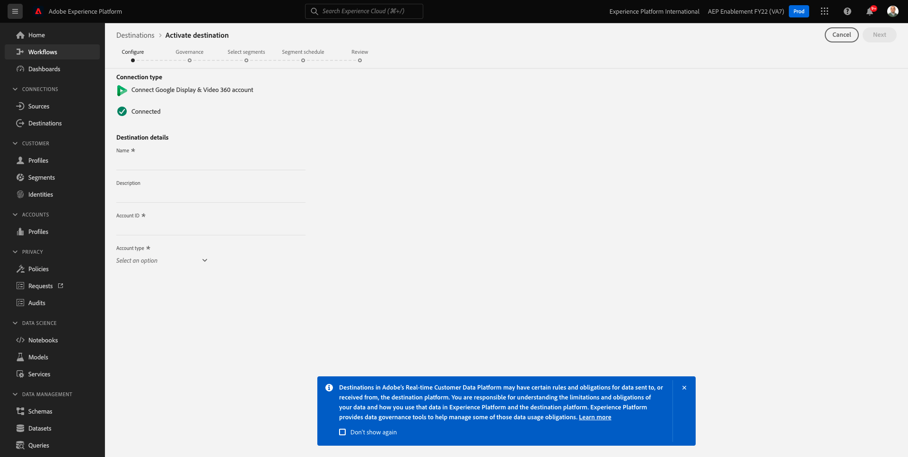
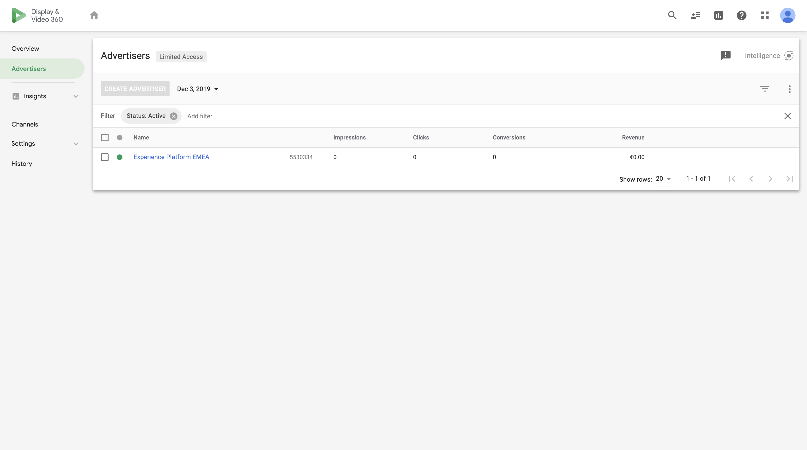

# 2.3.2 Configuración de un destino de Advertising como Google DV360

>[!IMPORTANT]
>
>El siguiente contenido está diseñado para su información - Usted hace **NOT** tiene que configurar un nuevo destino para DV360. El destino ya se ha creado y puede utilizarlo en el siguiente ejercicio.

Ir a [Adobe Experience Platform](https://experience.adobe.com/platform). Después de iniciar sesión, llegará a la página principal de Adobe Experience Platform.

Antes de continuar, debe seleccionar una **zona protegida**. La zona protegida que se va a seleccionar se denomina ``--aepSandboxName--``. Para ello, haga clic en el texto **[!UICONTROL Producción]** en la línea azul de la parte superior de la pantalla. Después de seleccionar la [!UICONTROL zona protegida] adecuada, verá el cambio en la pantalla y ahora se encuentra en la [!UICONTROL zona protegida] dedicada.

En el menú de la izquierda, ve a **Destinos** y luego ve a **Catálogo**. Verá el **Catálogo de destinos**.

En **Destinos**, haz clic en **Google Display &amp; Video 360** y luego haz clic en **+ Configurar**.

Entonces verá esto... Haga clic en **Conectar con destino**.

En la siguiente pantalla, puede configurar el destino en Google DV360.

Escriba un valor en los campos **Nombre** y **Descripción**.

El campo **ID de cuenta** es el **ID de anunciante** de la cuenta DV360. Puede encontrar lo siguiente:

El **tipo de cuenta** debe establecerse en **Anunciante invitado**.

Ahora tienes esto. Haga clic en **Next**.

>[!NOTE]
>
>Google necesita un Adobe de lista de permitidos para que Adobe Experience Platform envíe datos a Google DV360. Póngase en contacto con el administrador de cuentas de Google para habilitar este flujo de datos.

Después de crear el destino, verá esto. Si lo desea, puede seleccionar una política de control de datos. A continuación, haga clic en **Guardar y salir**.

A continuación, verá una lista de destinos disponibles.
En el siguiente ejercicio, conectará el segmento creado en el ejercicio anterior al destino de Google DV360.

Siguiente paso: [2.3.3 Realizar acción: enviar el segmento a DV360](./ex3.md)

[Volver al módulo 2.3](./real-time-cdp-build-a-segment-take-action.md)

[Volver a todos los módulos](../../../overview.md)
