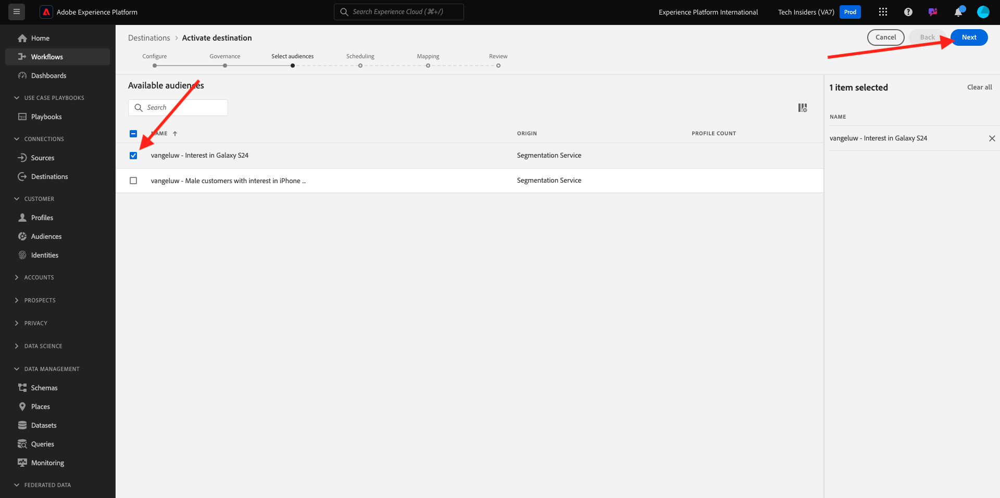

# 2.3.4 Tomar medidas: enviar el segmento a un destino S3

Adobe Experience Platform también tiene la capacidad de compartir audiencias con destinos de marketing por correo electrónico como Salesforce Marketing Cloud, Oracle Eloqua, Oracle Responsys y Adobe Campaign.

Puede utilizar FTP o SFTP como parte de los destinos específicos para cada uno de estos destinos de marketing de correo electrónico, o puede utilizar AWS S3 para intercambiar listas de clientes entre Adobe Experience Platform y estos destinos de marketing de correo electrónico.

En este módulo, configurará un destino de este tipo utilizando un contenedor de AWS S3.

## 2.3.4.1 Creación de su compartimento de S3

Vaya a [https://console.aws.amazon.com](https://console.aws.amazon.com) e inicie sesión con la cuenta de Amazon que creó anteriormente.

Después de iniciar sesión, se le redirigirá a **AWS Management Console**.

En el menú **Buscar servicios**, busque **s3**. Haga clic en el primer resultado de búsqueda: **S3 - Almacenamiento escalable en la nube**.

Luego verá la página principal de **Amazon S3**. Haga clic en **Crear cubo**.

En la pantalla **Crear cubo**, debe configurar dos cosas:

- Nombre: use el nombre `aepmodulertcdp--aepUserLdap--`. Por ejemplo, en este ejercicio el nombre del contenedor es **aepmodulertcdpvangeluw**
- Región: use la región **EU (Frankfurt) eu-central-1**

Mantenga el resto de configuraciones predeterminadas tal cual. Desplácese hacia abajo y haga clic en **Crear cubo**.

A continuación, verá que se está creando su contenedor y se redirigirá a la página principal de Amazon S3.

## 2.3.4.2 Definir permisos para acceder al compartimento de S3

El siguiente paso es configurar el acceso a su S3 bucket.

Para ello, vaya a [https://console.aws.amazon.com/iam/home](https://console.aws.amazon.com/iam/home).

El acceso a los recursos de AWS está controlado por Identity and Access Management (IAM) de Amazon.

Ahora verá esta página.

En el menú de la izquierda, haga clic en **Usuarios**. Luego verá la pantalla **Usuarios**. Haga clic en **Agregar usuarios**.

A continuación, configure el usuario:

- Nombre de usuario: use `s3_--aepUserLdap--_rtcdp` como nombre, de modo que en este ejemplo el nombre es `s3_vangeluw_rtcdp`.
- Tipo de acceso de AWS: seleccione **Clave de acceso: acceso mediante programación**.

Haga clic en **Siguiente: Permisos**.

Entonces verá esta pantalla de permisos. Haga clic en **Adjuntar directivas existentes directamente**.

Escriba el término de búsqueda **s3** para ver todas las directivas de S3 relacionadas. Seleccione la directiva **AmazonS3FullAccess**. Haga clic en **Siguiente: Etiquetas**.

En la pantalla de **Etiquetas**, no es necesario configurar nada. Haga clic en **Siguiente: revisar**.

Revise la configuración. Haga clic en **Crear usuario**.

El usuario se ha creado y está viendo sus credenciales para acceder a su entorno S3. Esta es la única vez que verá sus credenciales, así que por favor anótelas.

Haz clic en **Mostrar** para ver tu clave de acceso secreta:

>[!IMPORTANT]
>
>Almacene sus credenciales en un archivo de texto en su equipo.
>
> - Id. de clave de acceso: ...
> - Clave de acceso secreta: ...
>
> Una vez que hagas clic en **Cerrar**, no volverás a ver tus credenciales.

Haga clic en **Cerrar**.

Ahora ha creado correctamente un contenedor de AWS S3 y ha creado un usuario con permisos para acceder a este contenedor.

## 2.3.4.3 Configuración del destino en Adobe Experience Platform

Ir a [Adobe Experience Platform](https://experience.adobe.com/platform). Después de iniciar sesión, llegará a la página principal de Adobe Experience Platform.

Antes de continuar, debe seleccionar una **zona protegida**. La zona protegida que se va a seleccionar se denomina ``--aepSandboxName--``. Para ello, haga clic en el texto **[!UICONTROL Producción]** en la línea azul de la parte superior de la pantalla. Después de seleccionar la [!UICONTROL zona protegida] adecuada, verá el cambio en la pantalla y ahora se encuentra en la [!UICONTROL zona protegida] dedicada.

En el menú de la izquierda, ve a **Destinos** y luego ve a **Catálogo**. Verá el **Catálogo de destinos**.

Haga clic en **Almacenamiento en la nube** y, a continuación, haga clic en el botón **Configurar** (o en **Activar segmentos**, según su entorno) en la tarjeta **Amazon S3**.

Según el entorno, es posible que tenga que hacer clic en **+ Configurar nuevo destino** para empezar a crear el destino.

Seleccione **Nueva cuenta** como tipo de cuenta. Utilice las credenciales de S3 que se le proporcionaron en el paso anterior:

| Identificador de clave de acceso | Clave de acceso secreta |
|:-----------------------:| :-----------------------:|
| AKIA..... | Cm5Ln..... |

Haga clic en **Conectar con destino**.

A continuación, verá una confirmación visual de que este destino está conectado.

Debe proporcionar un nombre y una carpeta para que Adobe Experience Platform pueda conectarse al compartimento de S3.

Como convención de nombres, utilice la siguiente información:

| Identificador de clave de acceso | Clave de acceso secreta |
|:-----------------------:| :-----------------------:|
| Nombre | `AWS - S3 - --aepUserLdap--` |
| Descripción | `AWS - S3 - --aepUserLdap--` |
| Nombre del cubo | `aepmodulertcdp--aepUserLdap--` |
| Ruta de carpeta | / |

Haga clic en **Next**.

Ahora, de forma opcional, puede adjuntar una política de gobernanza de datos a su nuevo destino. Haga clic en **Next**.

En la lista de segmentos, busque el segmento que creó en el ejercicio 1 y selecciónelo. Haga clic en **Next**.

Entonces verá esto... Si lo desea, puede editar la programación haciendo clic en el icono **lápiz**. **Crear horario**.

Defina el programa que desee. Seleccione **Exportar archivos incrementales** y establezca la frecuencia en **Cada hora** cada **3 horas**. Haga clic en **Crear**.

Entonces, tendrás esto. Haga clic en **Next**.

Ahora puede seleccionar atributos para la exportación a AWS S3. Haga clic en **Agregar nuevo campo** y asegúrese de que el campo `--aepTenantId--.identification.core.ecid` se agrega y marca como **Clave de deduplicación**.

Opcionalmente, puede agregar tantos campos como sea necesario.

Una vez que haya agregado todos los campos, haga clic en **Siguiente**.

Revise la configuración. Haga clic en **Finalizar** para finalizar la configuración.

A continuación, volverá a la pantalla Activación de destino y verá el segmento añadido a este destino.

Si desea agregar más exportaciones de segmentos, puede hacer clic en **Activar segmentos** para reiniciar el proceso y agregar más segmentos.

Paso siguiente: [2.3.5 Realizar acción: enviar el segmento a Adobe Target](./ex5.md)

[Volver al módulo 2.3](./real-time-cdp-build-a-segment-take-action.md)

[Volver a todos los módulos](../../../overview.md)
