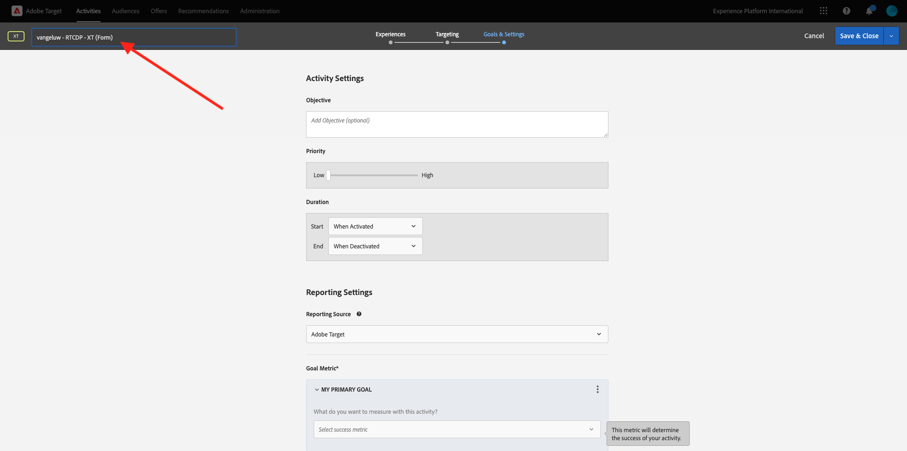

# 2.3.5 Tomar medidas: enviar la audiencia a Adobe Target

Ir a [Adobe Experience Platform](https://experience.adobe.com/platform). Después de iniciar sesión, llegará a la página principal de Adobe Experience Platform.


Antes de continuar, debe seleccionar una **zona protegida**. La zona protegida que se va a seleccionar se denomina ``--aepSandboxName--``. Después de seleccionar la [!UICONTROL zona protegida] adecuada, verá el cambio en la pantalla y ahora se encuentra en la [!UICONTROL zona protegida] dedicada.


## Verifique su flujo de datos

El destino de Adobe Target en Real-Time CDP está conectado a la secuencia de datos que se utiliza para introducir datos en la red perimetral de Adobe. Si desea configurar el destino de Adobe Target, primero debe comprobar si el conjunto de datos ya está habilitado para Adobe Target. Su secuencia de datos se configuró en [Ejercicio 0.2 Crear su secuencia de datos](./../../../modules/gettingstarted/gettingstarted/ex2.md) y se llamó `--aepUserLdap-- - Demo System Datastream`.

En el menú de la izquierda, desplácese hacia abajo y haga clic en **Datastreams**. En Flujos de datos, busque su secuencia de datos denominada `--aepUserLdap-- - Demo System Datastream`. Haga clic en el conjunto de datos para abrirlo.


Verá esto, haga clic en **...** junto a **Adobe Experience Platform** y luego haga clic en **Editar**.


Marque las casillas de verificación de **Segmentación de Edge** y **Destinos de Personalization**. Haga clic en **Guardar**.


A continuación, haga clic en **+ Agregar servicio**.


Seleccione el servicio **Adobe Target**. Haga clic en **Guardar**.


El conjunto de datos está configurado para Adobe Target.


## Configurar el destino de Adobe Target

Adobe Target está disponible como destino en Real-Time CDP. Para configurar tu integración con Adobe Target, ve a **Destinos**, a **Catálogo**.

Haga clic en **Personalization** en el menú **Categorías**. Verá la tarjeta de destino **(v2) Adobe Target**.


Haga clic en **Conectar con destino**.


Entonces verá esto... Debe crear su propio destino de Adobe Target, siga estas directrices:

- Nombre: use el nombre `--aepUserLdap-- - Adobe Target v2  (Web)`.
- ID de secuencia de datos: debe seleccionar la secuencia de datos que configuró en [Ejercicio 0.2 Crear la secuencia de datos](./../../../modules/gettingstarted/gettingstarted/ex2.md). El nombre de su secuencia de datos debe ser: `--aepUserLdap-- - Demo System Datastream`.
- Workspace: esto está relacionado con los espacios de trabajo de Adobe Target. Si no hay ningún área de trabajo específica que necesite usar, seleccione **Workspace predeterminado**.

Haga clic en **Next**.


Ahora, de forma opcional, puede seleccionar una política de control de datos. Haga clic en **Next**.


En la lista de audiencias disponibles, seleccione la audiencia que creó en el ejercicio anterior [Crear una audiencia](./ex1.md), que se llama `--aepUserLdap-- - Interest in Galaxy S24`. A continuación, haga clic en **Siguiente**.


En la pantalla **Mapping**, puede asignar atributos de perfil para que estén disponibles en Adobe Target. Esto le ayuda a añadir una capa adicional de personalización en el sitio web. Haga clic en **Agregar nuevo campo**.


Para el nuevo campo, seleccione el campo **person.name.firstName**. Haga clic en **Guardar**.


Entonces, tendrás esto. Haga clic en **Next**.


Haga clic en **Finalizar**.


La audiencia ahora está activada en Adobe Target.


>[!IMPORTANT]
>
>Cuando haya creado su destino de Adobe Target en Real-Time CDP, el destino puede tardar hasta una hora en estar activo. Este es un tiempo de espera único, debido a la configuración del back-end. Una vez que se haya completado el tiempo de espera de una hora y la configuración del back-end iniciales, las audiencias recién agregadas que se envíen al destino de Adobe Target estarán disponibles para la segmentación en tiempo real.

## Configuración de la actividad basada en formularios de Adobe Target

Ahora que la audiencia de Real-Time CDP está configurada para enviarse a Adobe Target, puede configurar la actividad de segmentación de experiencias en Adobe Target. En este ejercicio configurará una actividad basada en formularios.

Vaya a la página principal de Adobe Experience Cloud en [https://experiencecloud.adobe.com/](https://experiencecloud.adobe.com/). Haga clic en **Destino** para abrirlo.


En la página de inicio de **Adobe Target**, verás todas las actividades existentes. Haga clic en **Crear actividad** y luego haga clic en **Segmentación de experiencias**.


Seleccione **Web**, **Formulario** y **Sin restricciones de propiedad**. Haga clic en **Crear**.


Ahora está en el Compositor de actividades basadas en formularios.


Para el campo **LOCATION 1**, seleccione **target-global-mbox**.


La audiencia predeterminada es **Todos los visitantes**. Haz clic en **3 puntos** junto a **Todos los visitantes** y haz clic en **Cambiar audiencia**.


Ahora está viendo la lista de audiencias disponibles, y la audiencia de Adobe Experience Platform que creó anteriormente y envió a Adobe Target ahora forma parte de esta lista. Seleccione la audiencia que creó anteriormente en Adobe Experience Platform. Haga clic en **Asignar audiencia**.


La audiencia de Adobe Experience Platform ahora forma parte de esta actividad de segmentación de experiencias.


Ahora vamos a cambiar la imagen de héroe en la página principal del sitio web. Haga clic para abrir la lista desplegable junto a **Contenido predeterminado** y haga clic en **Crear oferta de HTML**.


Pegue el siguiente código.

```javascript
<script>document.querySelector("#SpectrumProvider > div.App > div > div.Page.home > main > div.Banner.Banner--alignment-right.Banner--verticalAlignment-middle.main-banner > div.Image > img").src="https://tech-insiders.s3.us-west-2.amazonaws.com/citisignal-new-hero.png"; document.querySelector("#SpectrumProvider > div.App > div > div.Page.home > main > div.Banner.Banner--alignment-right.Banner--verticalAlignment-middle.main-banner > div.Banner__content > div > div > h1").innerHTML="Hi there ";
document.querySelector("#SpectrumProvider > div.App > div > div.Page.home > main > div.Banner.Banner--alignment-right.Banner--verticalAlignment-middle.main-banner > div.Banner__content > div > div > div > div > p").innerHTML="What about 10% off of your next Galaxy S24 smartphone?";
</script>
```


A continuación, debe añadir un token de personalización desde los atributos de perfil de Adobe Experience Platform. Recuerde, cuando activó la audiencia en Adobe Target, también seleccionó el campo **person.name.firstName** para compartirlo con Adobe Target. Para recuperar el campo, seleccione el origen **Adobe Experience Platform**, seleccione su zona protegida (que debe ser `--aepSandboxName--`) y, a continuación, seleccione el atributo **person.name.firstName**.


Antes de hacer clic en el botón **Agregar**, asegúrese de ir a la línea donde ve `... > h1").innerHTML="Hi there ";` y coloque el cursor entre corchetes después de la palabra `there`, de esta manera:

`... > h1").innerHTML="Hi there ";`

A continuación, haga clic en el botón **Add**, que debería agregar el token, el cual actualizará el código de la siguiente manera:

`... > h1").innerHTML="Hi there ${aep.person.name.firstName}";`

Haga clic en **Next**.


A continuación, verá la descripción general de la experiencia con la nueva imagen de la audiencia seleccionada. Haga clic en **Next**.


Haga clic en el título de la actividad en la esquina superior izquierda para cambiarle el nombre, de esta manera: `--aepUserLdap-- - RTCDP - XT (Form)`



En la página **Objetivos y configuración** - , ve a **Métricas de objetivos**. Establezca el objetivo principal en **Participación** - **Tiempo en el sitio**. Haga clic en **Guardar y cerrar**.


Ahora se encuentra en la página **Información general de actividad**. Aún debe activar su actividad. Haga clic en el campo **Inactivo** y seleccione **Activar**.


A continuación, recibirá una confirmación visual de que la actividad está activa.


La actividad ya está activa y se puede probar en el sitio web de demostración.

>[!IMPORTANT]
>
>Cuando haya creado su destino de Adobe Target en Real-Time CDP, el destino puede tardar hasta una hora en estar activo. Este es un tiempo de espera único, debido a la configuración del back-end. Una vez que se haya completado el tiempo de espera de una hora y la configuración del back-end iniciales, las audiencias de Edge recién agregadas que se envíen al destino de Adobe Target estarán disponibles para la segmentación en tiempo real.

Si ahora regresa a su sitio web de demostración y visita la página del producto para Galaxy S24, calificará para la audiencia que creó y verá la actividad de Adobe Target en la página de inicio en tiempo real.


Siguiente Paso: [2.3.6 Destinos SDK](./ex6.md)

[Volver al módulo 2.3](./real-time-cdp-build-a-segment-take-action.md)

[Volver a todos los módulos](../../../overview.md)
