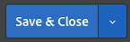

# 2.3.5 Tomar medidas: enviar el segmento a Adobe Target

Ir a [Adobe Experience Platform](https://experience.adobe.com/platform). Después de iniciar sesión, llegará a la página principal de Adobe Experience Platform.


Antes de continuar, debe seleccionar una **zona protegida**. La zona protegida que se va a seleccionar se denomina ``--aepSandboxName--``. Para ello, haga clic en el texto **[!UICONTROL Producción]** en la línea azul de la parte superior de la pantalla. Después de seleccionar la [!UICONTROL zona protegida] adecuada, verá el cambio en la pantalla y ahora se encuentra en la [!UICONTROL zona protegida] dedicada.


## 2.3.5.1 Verificar su secuencia de datos

El destino de Adobe Target en Real-Time CDP está conectado a la secuencia de datos que se utiliza para introducir datos en la red perimetral de Adobe. Si desea configurar el destino de Adobe Target, primero debe comprobar si el conjunto de datos ya está habilitado para Adobe Target. Su secuencia de datos se configuró en [Ejercicio 0.2 Crear su secuencia de datos](./../../../modules/gettingstarted/gettingstarted/ex2.md) y se llamó `--aepUserLdap-- - Demo System Datastream`.

Vaya a [https://experience.adobe.com/#/data-collection/](https://experience.adobe.com/#/data-collection/) y haga clic en **Datastreams** o **Datastreams (Beta)**.


En la esquina superior derecha de la pantalla, seleccione el nombre de la zona protegida, que debe ser `--aepSandboxName--`.


En Flujos de datos, busque su secuencia de datos denominada `--aepUserLdap-- - Demo System Datastream`. Haga clic en el conjunto de datos para abrirlo.


Verá esto, haga clic en **...** junto a **Adobe Experience Platform** y luego haga clic en **Editar**.


Marque las casillas de verificación de **Segmentación de Edge** y **Destinos de Personalization**. Haga clic en **Guardar**.


A continuación, haga clic en **+ Agregar servicio**.


Seleccione el servicio **Adobe Target**. Haga clic en **Guardar**.


El conjunto de datos está configurado para Adobe Target.


## 2.3.5.2 Configuración del destino de Adobe Target

Adobe Target está disponible como destino en Real-Time CDP. Para configurar tu integración con Adobe Target, ve a **Destinos**, a **Catálogo**.


Haga clic en **Personalization** en el menú **Categorías**. Verá la tarjeta de destino **Adobe Target**. Haga clic en **Activar segmentos** (o **Configurar** según su entorno).


Según el entorno, es posible que tenga que hacer clic en **+ Configurar nuevo destino** para empezar a crear el destino.


Entonces verá esto...


En la pantalla **Configurar nuevo destino**, debe configurar dos cosas:

- Nombre: use el nombre `--aepUserLdap-- - Adobe Target (Web)`, que debería tener el siguiente aspecto: **vangeluw - Adobe Target (Web)**.
- ID de secuencia de datos: debe seleccionar la secuencia de datos que configuró en [Ejercicio 0.2 Crear la secuencia de datos](./../../../modules/gettingstarted/gettingstarted/ex2.md). El nombre de su secuencia de datos debe ser: `--aepUserLdap-- - Demo System Datastream`.

Haga clic en **Next**.


En la pantalla siguiente, puede seleccionar una política de gobernanza. No es necesario seleccionar uno, en este caso no es necesario seleccionar uno, así que haga clic en **Crear**.


El destino se habrá creado y se mostrará en la lista. Seleccione su destino y haga clic en **Siguiente** para comenzar a enviar segmentos a su destino.


En la lista de segmentos disponibles, seleccione el segmento que creó en [Ejercicio 6.1 Crear un segmento](./ex1.md), que se llama `--aepUserLdap-- - Interest in PROTEUS FITNESS JACKSHIRT`. A continuación, haga clic en **Siguiente**.


En la página siguiente, haz clic en **Siguiente**.


Haga clic en **Finalizar**.


El segmento ahora está activado para Adobe Target.


>[!IMPORTANT]
>
>Cuando haya creado su destino de Adobe Target en Real-Time CDP, el destino puede tardar hasta una hora en estar activo. Este es un tiempo de espera único, debido a la configuración del back-end. Una vez que se haya completado el tiempo de espera de 1 hora inicial y la configuración del back-end, los segmentos Edge recién añadidos que se envíen al destino de Adobe Target estarán disponibles para la segmentación en tiempo real.

## 2.3.5.3 Configuración de la actividad basada en formularios de Adobe Target

Ahora que el segmento de Real-Time CDP está configurado para enviarse a Adobe Target, puede configurar la actividad de segmentación de experiencias en Adobe Target. En este ejercicio configurará una actividad basada en formularios.

Vaya a la página principal de Adobe Experience Cloud en [https://experiencecloud.adobe.com/](https://experiencecloud.adobe.com/). Haga clic en **Destino** para abrirlo.


En la página de inicio de **Adobe Target**, verás todas las actividades existentes.


Haga clic en **+ Crear actividad** para crear una nueva actividad.


Seleccione **Segmentación de experiencias**.


Seleccione **Formulario** y seleccione **Sin restricciones de propiedad**. Haga clic en **Next**.


Ahora está en el Compositor de actividades basadas en formularios.


Para el campo **LOCATION 1**, seleccione **target-global-mbox**.


La audiencia predeterminada es **Todos los visitantes**. Haz clic en **3 puntos** junto a **Todos los visitantes** y haz clic en **Cambiar audiencia**.


Ahora está viendo la lista de audiencias disponibles y el segmento de Adobe Experience Platform que creó anteriormente y envió a Adobe Target ahora forma parte de esta lista. Seleccione el segmento que creó anteriormente en Adobe Experience Platform. Haga clic en **Asignar audiencia**.


El segmento de Adobe Experience Platform ahora forma parte de esta actividad de segmentación de experiencias.


Ahora vamos a cambiar la imagen de héroe en la página principal del sitio web. Haga clic para abrir la lista desplegable junto a **Contenido predeterminado** y haga clic en **Crear oferta de HTML**.


Pegue el siguiente código. A continuación, haga clic en **Siguiente**.

```javascript
<script>document.querySelector("#home > div > div > div > div > div.banner_img.d-none.d-lg-block > img").src="https://parsefiles.back4app.com/hgJBdVOS2eff03JCn6qXXOxT5jJFzialLAHJixD9/ff92fdc3885972c0090ad5419e0ef4d4_Luma - Product - Proteus - Hero Banner.png"; document.querySelector(".banner_text > *").remove()</script>
```


A continuación, verá la nueva experiencia con la nueva imagen para la audiencia seleccionada.


Haga clic en el título de la actividad en la esquina superior izquierda para cambiarle el nombre.


Para el nombre, utilice:

- `--aepUserLdap-- - RTCDP - XT (Form)`


Haga clic en **Next**.


En la página **Objetivos y configuración** - , ve a **Métricas de objetivos**.


Establezca el objetivo principal en **Participación** - **Tiempo en el sitio**.


Haga clic en **Guardar y cerrar**.



Ahora se encuentra en la página **Información general de actividad**. Aún debe activar su actividad.


Haga clic en el campo **Inactivo** y seleccione **Activar**.


A continuación, recibirá una confirmación visual de que la actividad está activa.


La actividad ya está activa y se puede probar en el sitio web de demostración.

>[!IMPORTANT]
>
>Cuando haya creado su destino de Adobe Target en Real-Time CDP, el destino puede tardar hasta una hora en estar activo. Este es un tiempo de espera único, debido a la configuración del back-end. Una vez que se haya completado el tiempo de espera de 1 hora inicial y la configuración del back-end, los segmentos Edge recién añadidos que se envíen al destino de Adobe Target estarán disponibles para la segmentación en tiempo real.

Si ahora regresa a su sitio web de demostración y visita la página de producto de PROTEUS FITNESS JACKSHIRT, calificará instantáneamente para el segmento que creó y verá la actividad de Adobe Target en la página de inicio en tiempo real.


Paso siguiente: [2.3.6 Audiencias externas](./ex6.md)

[Volver al módulo 2.3](./real-time-cdp-build-a-segment-take-action.md)

[Volver a todos los módulos](../../../overview.md)
