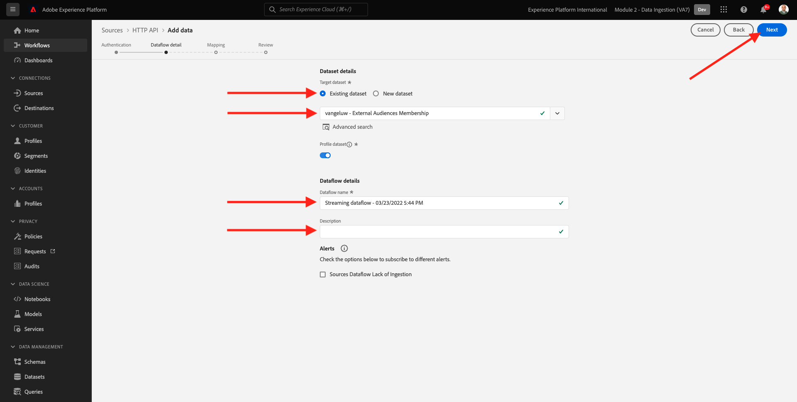
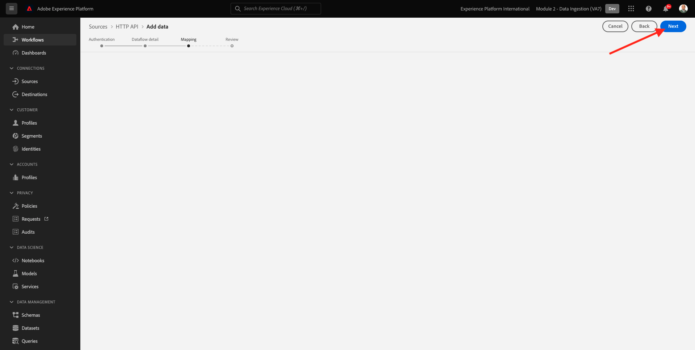
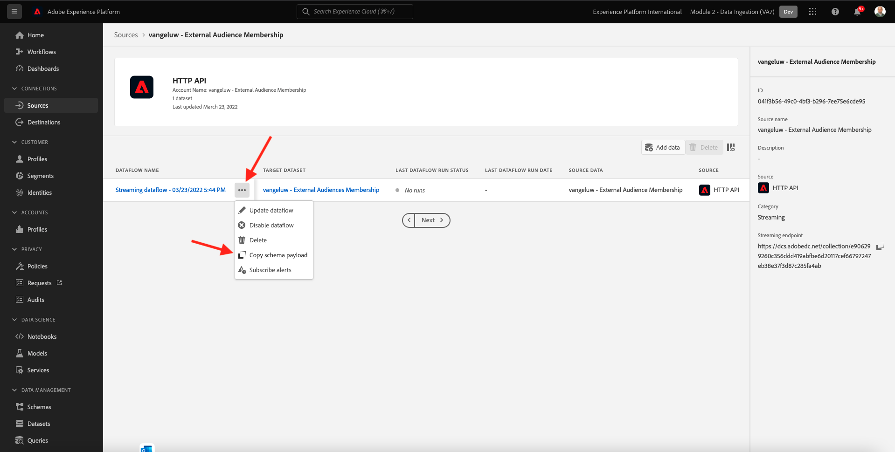
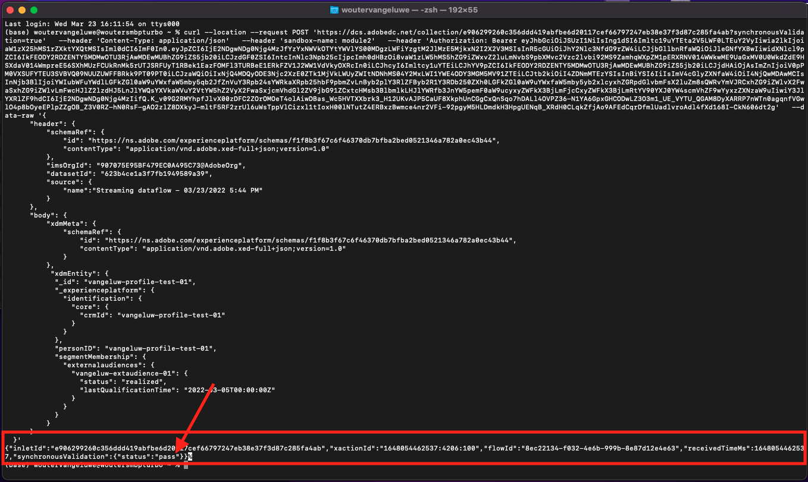
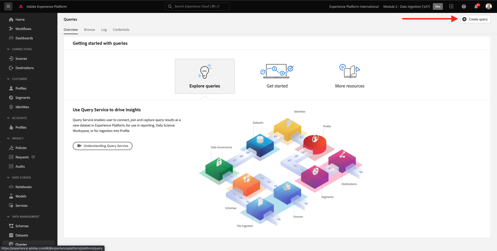

# 2.3.6 Audiencias externas

En muchos casos, es posible que su empresa desee utilizar audiencias existentes de otras aplicaciones para enriquecer el perfil del cliente en Adobe Experience Platform.
Estas audiencias externas pueden haberse definido en función de un modelo de ciencia de datos o mediante plataformas de datos externas.

La función de audiencias externas de Adobe Experience Platform permite centrarse en la ingesta de audiencias externas y su activación sin necesidad de redefinir la definición de audiencia correspondiente en detalle en Adobe Experience Platform.

El proceso general se divide en tres pasos principales:

- Importar los metadatos de audiencia externa: este paso está diseñado para introducir los metadatos de audiencia externa, como el nombre de la audiencia, en Adobe Experience Platform.
- Asigne la pertenencia a audiencias externas al perfil del cliente: este paso está diseñado para enriquecer el perfil del cliente con el atributo de pertenencia a audiencias externas.
- Cree las audiencias en Adobe Experience Platform: este paso está diseñado para crear audiencias procesables basadas en la pertenencia a audiencias externas.

## Metadatos

Ir a [Adobe Experience Platform](https://experience.adobe.com/platform). Después de iniciar sesión, llegará a la página principal de Adobe Experience Platform.


>[!IMPORTANT]
>
>¡La zona protegida que se utilizará para este ejercicio es ``--aepSandboxName--``!

Antes de continuar, debe seleccionar una **zona protegida**. La zona protegida que se va a seleccionar se denomina ``--aepSandboxName--``. Después de seleccionar la [!UICONTROL zona protegida] adecuada, verá el cambio en la pantalla y ahora se encuentra en la [!UICONTROL zona protegida] dedicada.


Aunque los datos de audiencia definen la condición para que un perfil forme parte de una audiencia, los metadatos de audiencia son información sobre la audiencia, como el nombre, la descripción y el estado de la audiencia. Como los metadatos de audiencias externas se almacenarán en Adobe Experience Platform, debe utilizar un área de nombres de identidad para introducir los metadatos en Adobe Experience Platform.

## 2.3.6.1.1 Área de nombres de identidad para audiencias externas

Ya se ha creado un área de nombres de identidad para su uso con **Audiencias externas**.
Para ver la identidad que ya se creó, ve a **Identidades** y busca **Externas**. Haga clic en el elemento Audiencias externas.

Tenga en cuenta:

- El símbolo de identidad **externalaudiences** se utilizará en los pasos siguientes para hacer referencia a la identidad de audiencias externas.
- El tipo **Identificador de no personas** se usa para este área de nombres de identidad, ya que esta área de nombres no está pensada para identificar perfiles de clientes, sino audiencias.


## 2.3.6.1.2 Creación del esquema de metadatos de audiencias externas

Los metadatos de audiencias externas se basan en el **Esquema de definición de audiencia**. Puede encontrar más detalles en el [repositorio XDM Github](https://github.com/adobe/xdm/blob/master/docs/reference/classes/segmentdefinition.schema.md).

En el menú de la izquierda, vaya a Esquemas. Haga clic en **+ Crear esquema** y luego haga clic en **Examinar**.


Para asignar una clase, busque **definición de audiencia**. Seleccione la clase **Audience definition** y haga clic en **Asignar clase**.


Entonces verá esto... Haga clic en **Cancelar**.


Entonces verá esto... Seleccione el campo **_id**. En el menú derecho, desplácese hacia abajo y habilite las casillas de verificación **Identidad** e **Identidad principal**. Seleccione el área de nombres de identidad **Audiencias externas**. Haga clic en **Aplicar**.


A continuación, seleccione el nombre de esquema **Esquema sin título**. Cambie el nombre a `--aepUserLdap-- - External Audiences Metadata`.


Habilite la opción **Perfil** y confirme. Finalmente, haga clic en **Guardar**.


## 2.3.6.1.3 Crear el conjunto de datos de metadatos de Audiencias externas

En **Esquemas**, vaya a **Examinar**. Busque y haga clic en el esquema `--aepUserLdap-- - External Audiences Metadata` que creó en el paso anterior. A continuación, haga clic en **Crear conjunto de datos a partir del esquema**.


Para el campo **Nombre**, escriba `--aepUserLdap-- - External Audience Metadata`. Haga clic en **Crear conjunto de datos**.


Entonces verá esto... No olvide habilitar la opción **Perfil**.


## 2.3.6.1.4 Crear una conexión Source de API HTTP

A continuación, debe configurar el conector Source de la API HTTP que utilizará para introducir los metadatos en el conjunto de datos.

Ir a **orígenes**. En el campo de búsqueda, escriba **HTTP**. Haga clic en **Agregar datos**.


Introduzca la siguiente información:

- **Tipo de cuenta**: seleccione **Nueva cuenta**
- **Nombre de cuenta**: escriba `--aepUserLdap-- - External Audience Metadata`
- Marque la casilla de verificación **Cuadro compatible con XDM**

A continuación, haga clic en **Conectarse al origen**.


Entonces verá esto... Haga clic en **Next**.


Seleccione **Conjunto de datos existente** y en el menú desplegable, busque y seleccione el conjunto de datos `--aepUserLdap-- - External Audience Metadata`.

Compruebe los **detalles del flujo de datos** y haga clic en **Siguiente**.


Entonces verá esto...

El paso **Mapping** del asistente está vacío, ya que introducirá una carga útil compatible con XDM en el conector de Source de la API HTTP, por lo que no se requiere ninguna asignación. Haga clic en **Next**.


En el paso **Revisar** puede, opcionalmente, revisar la conexión y los detalles de asignación. Haga clic en **Finalizar**.


Entonces verá esto...


## 2.3.6.1.5 Ingesta de metadatos de audiencias externas

En la ficha Información general del conector de Source, haga clic en **...** y, a continuación, haga clic en **Copiar carga útil de esquema**.


Abra la aplicación Editor de texto en el equipo y pegue la carga útil que acaba de copiar, que tiene este aspecto. A continuación, debe actualizar el objeto **xdmEntity** en esta carga.


El objeto **xdmEntity** debe reemplazarse con el siguiente código. Copie el siguiente código y péguelo en su archivo de texto reemplazando el objeto **xdmEntity** en el editor de texto.

```
"xdmEntity": {
    "_id": "--aepUserLdap---extaudience-01",
    "description": "--aepUserLdap---extaudience-01 description",
    "segmentIdentity": {
      "_id": "--aepUserLdap---extaudience-01",
      "namespace": {
        "code": "externalaudiences"
      }
    },
    "segmentName": "--aepUserLdap---extaudience-01 name",
    "segmentStatus": "ACTIVE",
    "version": "1.0"
  }
```

Debería ver lo siguiente:


A continuación, abra una nueva ventana de **Terminal**. Copie todo el texto del Editor de texto y péguelo en la ventana de terminal.


A continuación, pulse **Intro**.

A continuación, verá una confirmación de la ingesta de datos en la ventana Terminal:


Actualice la pantalla del conector Source de la API HTTP, donde ahora verá que se están procesando los datos:


## 2.3.6.1.6 Validar la ingesta de metadatos de Audiencias externas

Una vez completado el procesamiento, puede comprobar la disponibilidad de los datos en el conjunto de datos mediante el servicio de consulta.

En el menú derecho, vaya a **Conjuntos de datos** y seleccione el conjunto de datos `--aepUserLdap-- - External Audience Metadata` que creó anteriormente.


En el menú derecho, ve a Consultas y haz clic en **Crear consulta**.


Escriba el siguiente código y, a continuación, presione **MAYÚS + ENTRAR**:

```
select * from --aepUserLdap--_external_audience_metadata
```

En los resultados de la consulta verá los metadatos de la audiencia externa que ha introducido.


## Suscripción a audiencia

Con los metadatos de audiencia externa disponibles, ahora puede ingerir la pertenencia de la audiencia a un perfil de cliente específico.

Ahora debe preparar un conjunto de datos de perfil enriquecido con el esquema de pertenencia a audiencias. Puede encontrar más detalles en el [repositorio XDM Github](https://github.com/adobe/xdm/blob/master/docs/reference/datatypes/segmentmembership.schema.md).

### Creación del esquema de pertenencia a audiencias externas

En el menú derecho, vaya a **Esquemas**. Haga clic en **Crear esquema** y, a continuación, haga clic en **Perfil individual de XDM**.


En la ventana emergente **Agregar grupos de campos**, busque **Perfil principal**. Seleccione el grupo de campos **Profile Core v2**.


A continuación, en la ventana emergente **Agregar grupos de campos**, busque **Pertenencia a segmentos**. Seleccione el grupo de campos **Detalles de pertenencia a segmento**. A continuación, haga clic en **Agregar grupos de campos**.


Entonces verá esto... Vaya al campo `--aepTenantId--.identification.core`. Haga clic en el campo **crmId**. En el menú derecho, desplácese hacia abajo y marque las casillas de verificación **Identidad** e **Identidad principal**. Para el **área de nombres de identidad**, seleccione **Sistema de demostración - CRMID**.

Haga clic en **Aplicar**.


A continuación, seleccione el nombre de esquema **Esquema sin título**. En el campo Nombre para mostrar, escriba `--aepUserLdap-- - External Audiences Membership`.


A continuación, habilite la opción **Perfil** y confirme. Haga clic en **Guardar**.


### Crear el conjunto de datos de pertenencia a audiencias externas

En **Esquemas**, vaya a **Examinar**. Busque y haga clic en el esquema `--aepUserLdap-- - External Audiences Membership` que creó en el paso anterior. A continuación, haga clic en **Crear conjunto de datos a partir del esquema**.


Para el campo **Nombre**, escriba `--aepUserLdap-- - External Audiences Membership`. Haga clic en **Crear conjunto de datos**.


Entonces verá esto... No olvide habilitar la opción **Perfil**.


### Creación de una conexión HTTP API Source


A continuación, debe configurar el conector Source de la API HTTP que utilizará para introducir los metadatos en el conjunto de datos.

Ir a **orígenes**. En el campo de búsqueda, escriba **HTTP**. Haga clic en **Agregar datos**.


Introduzca la siguiente información:

- **Tipo de cuenta**: seleccione **Nueva cuenta**
- **Nombre de cuenta**: escriba `--aepUserLdap-- - External Audience Membership`
- Marque la casilla de verificación **Cuadro compatible con XDM**

A continuación, haga clic en **Conectarse al origen**.


Entonces verá esto... Haga clic en **Next**.


Seleccione **Conjunto de datos existente** y en el menú desplegable, busque y seleccione el conjunto de datos `--aepUserLdap-- - External Audiences Membership`.

Compruebe los **detalles del flujo de datos** y haga clic en **Siguiente**.



Entonces verá esto...

El paso **Mapping** del asistente está vacío, ya que introducirá una carga útil compatible con XDM en el conector de Source de la API HTTP, por lo que no se requiere ninguna asignación. Haga clic en **Next**.



En el paso **Revisar** puede, opcionalmente, revisar la conexión y los detalles de asignación. Haga clic en **Finalizar**.


Entonces verá esto...


### Ingesta de datos de pertenencia a audiencias externas

En la ficha Información general del conector de Source, haga clic en **...** y, a continuación, haga clic en **Copiar carga útil de esquema**.



Abra la aplicación Editor de texto en el equipo y pegue la carga útil que acaba de copiar, que tiene este aspecto. A continuación, debe actualizar el objeto **xdmEntity** en esta carga.


El objeto **xdmEntity** debe reemplazarse con el siguiente código. Copie el siguiente código y péguelo en su archivo de texto reemplazando el objeto **xdmEntity** en el editor de texto.

```
  "xdmEntity": {
    "_id": "--aepUserLdap---profile-test-01",
    "_experienceplatform": {
      "identification": {
        "core": {
          "crmId": "--aepUserLdap---profile-test-01"
        }
      }
    },
    "personID": "--aepUserLdap---profile-test-01",
    "segmentMembership": {
      "externalaudiences": {
        "--aepUserLdap---extaudience-01": {
          "status": "realized",
          "lastQualificationTime": "2022-03-05T00:00:00Z"
        }
      }
    }
  }
```

Debería ver lo siguiente:


A continuación, abra una nueva ventana de **Terminal**. Copie todo el texto del Editor de texto y péguelo en la ventana de terminal.


A continuación, pulse **Intro**.

A continuación, verá una confirmación de la ingesta de datos en la ventana Terminal:



Actualice la pantalla del conector Source de la API HTTP, donde después de un par de minutos verá que se están procesando los datos:


### Validar la ingesta de pertenencia a audiencias externas

Una vez completado el procesamiento, puede comprobar la disponibilidad de los datos en el conjunto de datos mediante el servicio de consulta.

En el menú derecho, vaya a **Conjuntos de datos** y seleccione el conjunto de datos `--aepUserLdap-- - External Audiences Membership ` que creó anteriormente.


En el menú derecho, ve a Consultas y haz clic en **Crear consulta**.



Escriba el siguiente código y, a continuación, presione **MAYÚS + ENTRAR**:

```
select * from --aepUserLdap--_external_audiences_membership
```

En los resultados de la consulta verá los metadatos de la audiencia externa que ha introducido.


## Crear un segmento

Ahora está listo para realizar acciones en las audiencias externas.
En Adobe Experience Platform, la acción se logra creando segmentos, rellenando las audiencias respectivas y compartiendo esas audiencias en los destinos.
Ahora creará un segmento utilizando la audiencia externa que acaba de crear.

En el menú de la izquierda, ve a **Segmentos** y haz clic en **Crear segmento**.


Ir a **Audiencias**. Entonces verá esto... Haga clic en **Audiencias externas**.


Seleccione la audiencia externa que creó anteriormente, que se llama `--aepUserLdap---extaudience-01`. Arrastre y suelte la audiencia en el lienzo.


Asigne un nombre al segmento, use `--aepUserLdap-- - extaudience-01`. Haga clic en **Guardar y cerrar**.


Entonces verá esto... También notará que el perfil para el cual ingirió la pertenencia al segmento ahora se muestra en la lista de **Perfiles de muestra**.


El segmento está listo ahora y se puede enviar a un destino para su activación.

## Visualice su perfil de cliente

Ahora también puede visualizar la calificación de segmentos en su perfil de cliente. Vaya a **Perfiles**, use el área de nombres de identidad **Sistema de demostración - CRMID**, proporcione la identidad `--aepUserLdap---profile-test-01` que usó como parte del ejercicio 6.6.2.4 y haga clic en **Ver**. A continuación, haga clic en **ID de perfil** para abrir el perfil.


Vaya a **abono a segmentos**, donde verá aparecer su audiencia externa.


Paso siguiente: [2.3.7 Destinations SDK](./ex7.md)

[Volver al módulo 2.3](./real-time-cdp-build-a-segment-take-action.md)

[Volver a todos los módulos](../../../overview.md)
