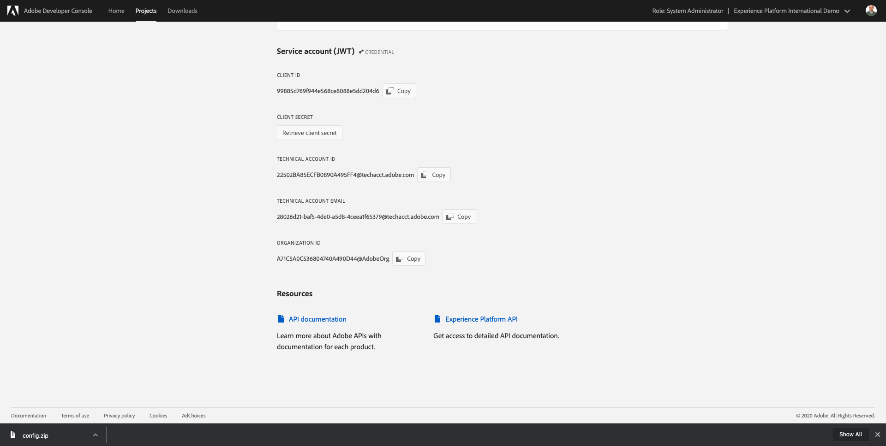

# 2.3.7 SDK de destinos

## 2.3.7.1 Configuración del proyecto de Adobe I/O

>[!IMPORTANT]
>
>Si ha creado el proyecto de Adobe I/O después de diciembre de 2021, puede volver a utilizarlo, omitir este ejercicio y pasar inmediatamente al ejercicio 6.7.2.
>
>Si creó el proyecto de Adobe I/O antes de diciembre de 2021, cree un nuevo proyecto para asegurarse de que es compatible con la API de creación de destinos.

En este ejercicio utilizará Adobe I/O de forma bastante intensiva para consultar las API de Platform. Siga los siguientes pasos para configurar el Adobe I/O.

Ir a [https://developer.adobe.com/console/home](https://developer.adobe.com/console/home)


Asegúrese de seleccionar la instancia de Adobe Experience Platform correcta en la esquina superior derecha de la pantalla. Su instancia es `--envName--`.


Haga clic en **Crear nuevo proyecto**.

 o


Seleccione **+ Agregar al proyecto** y seleccione **API**.


A continuación, verá esto:


Haz clic en el icono **Adobe Experience Platform**.


Haga clic en **API de Experience Platform**.


Haga clic en **Next**.


Ahora puede optar por que Adobe I/O genere el par de claves de seguridad o cargar uno existente.

Elija **Opción 1 - Generar un par de claves**.


Haga clic en **Generar par de claves**.


Verás un spinner por unos 30 segundos.


Verá esto y el par de claves generado se descargará como archivo zip: **config.zip**.

Descomprima el archivo **config.zip** en su escritorio y verá que contiene 2 archivos:


- **certificate_pub.crt** es su certificado de clave pública. Desde el punto de vista de la seguridad, este es el certificado que se utiliza libremente para configurar integraciones con aplicaciones en línea.
- **private.key** es su clave privada. Esto nunca, nunca debe ser compartido con nadie. La clave privada es lo que utiliza para autenticarse en la implementación de la API y se supone que es un secreto. Si comparte la clave privada con cualquier persona, puede acceder a su implementación y utilizar la API para introducir datos maliciosos en Platform y extraer todos los datos que se encuentran en Platform.


Asegúrese de guardar el archivo **config.zip** en una ubicación segura, ya que lo necesitará para los siguientes pasos y para acceder en el futuro a las API de Adobe Experience Platform y de Adobe I/O.

Haga clic en **Next**.


Ahora tiene que seleccionar los **perfiles de producto** para su integración.

Seleccione los perfiles de producto necesarios.

**Para su información**: en su instancia de Adobe Experience Platform, los perfiles de producto tendrán un nombre diferente. Debe seleccionar al menos un perfil de producto con los derechos de acceso adecuados, que se configuran en Adobe Admin Console.


Haga clic en **Guardar API configurada**.


Verás un giro por un par de segundos.


Y a continuación, verá su integración.


Haga clic en el botón **Descargar para Postman** y, a continuación, haga clic en **Cuenta de servicio (JWT)** para descargar un entorno de Postman (espere hasta que se descargue el entorno, puede tardar un par de segundos).


Desplácese hacia abajo hasta que vea **Service Account (JWT)**, que es donde puede encontrar todos los detalles de integración que se utilizan para configurar la integración con Adobe Experience Platform.



Su proyecto de IO tiene actualmente un nombre genérico. Debe asignar un nombre descriptivo a la integración. Haga clic en **Proyecto 1** (o nombre similar) como se indica


Haga clic en **Editar proyecto**.


Introduzca un nombre y una descripción para la integración. Como convención de nombres, utilizaremos `AEP API --aepUserLdap--`. Reemplace ldap por su ldap.
Por ejemplo, si su ldap es vangeluw, el nombre y la descripción de la integración se convierten en vangeluw de la API de AEP.

Escriba `AEP API --aepUserLdap--` como **Título del proyecto**. Haga clic en **Guardar**.


La integración de Adobe I/O ha finalizado.


## 2.3.7.2 Autenticación de Postman en el Adobe I/O

Vaya a [https://www.getpostman.com/](https://www.getpostman.com/).

Haz clic en **Comenzar**.


A continuación, descargue e instale Postman.


Después de la instalación de Postman, inicie la aplicación.

En Postman, hay 2 conceptos: entornos y colecciones.

- El entorno contiene todas las variables de entorno que son más o menos coherentes. En el entorno, encontrará cosas como la organización IMS de nuestro entorno de plataforma, junto con credenciales de seguridad como su clave privada y otras. El archivo de entorno es el que descargó durante la configuración de Adobe I/O del ejercicio anterior. Su nombre es: **service.postman_environment.json**.

- La colección contiene una serie de solicitudes de API que puede utilizar. Utilizaremos 2 colecciones
   - 1 colección para autenticación en Adobe I/0
   - 1 Colección para los ejercicios de este módulo
   - 1 colección para los ejercicios del módulo Real-Time CDP, para la creación de destinos

Descargue el archivo [postman.zip](./../../../assets/postman/postman_profile.zip) en su escritorio local.

En este archivo **postman.zip** encontrará los siguientes archivos:

- `_Adobe I-O - Token.postman_collection.json`
- `_Adobe Experience Platform Enablement.postman_collection.json`
- `Destination_Authoring_API.json`

Descomprima el archivo **postman.zip** y almacene estos 3 archivos en una carpeta del equipo de escritorio, junto con el entorno de Postman descargado del Adobe I/O. Debe tener estos 4 archivos en esa carpeta:


Vuelva a Postman. Haga clic en **Importar**.


Haga clic en **Cargar archivos**.


Vaya a la carpeta del escritorio en la que extrajo los 4 archivos descargados. Seleccione estos 4 archivos al mismo tiempo y haga clic en **Abrir**.


Después de hacer clic en **Abrir**, Postman le mostrará una descripción general del entorno y las colecciones que está a punto de importar. Haga clic en **Importar**.


Ahora tiene todo lo que necesita en Postman para empezar a interactuar con Adobe Experience Platform a través de las API.

Lo primero que debe hacer es asegurarse de que está autenticado correctamente. Para autenticarse, debe solicitar un token de acceso.

Asegúrese de haber seleccionado el entorno adecuado antes de ejecutar cualquier solicitud. Puede comprobar el Entorno seleccionado actualmente comprobando la lista desplegable Entorno en la esquina superior derecha.

El entorno seleccionado debe tener un nombre similar a este:


Haga clic en el icono **ojo** y, a continuación, haga clic en **Editar** para actualizar la clave privada en el archivo de entorno.


Entonces verá esto... Todos los campos están rellenados previamente, excepto el campo **PRIVATE_KEY**.


La clave privada se ha generado al crear el proyecto de Adobe I/O. Se descargó como un archivo zip, llamado **config.zip**. Extraiga ese archivo zip a su escritorio.


Abra la carpeta **config** y abra el archivo **private.key** con el editor de texto que prefiera.


Verá algo similar a esto, copie todo el texto en el portapapeles.


Vuelva a Postman y pegue la clave privada en los campos junto a la variable **PRIVATE_KEY**, para las columnas **VALOR INICIAL** y **VALOR ACTUAL**. Haga clic en **Guardar**.


El entorno y las colecciones de Postman ya están configurados y funcionan. Ahora puede autenticarse desde Postman en el Adobe I/O.

Para ello, debe cargar una biblioteca externa que se encargue del cifrado y el descifrado de la comunicación. Para cargar esta biblioteca, debe ejecutar la solicitud con el nombre **INIT: Load Crypto Library for RS256**. Seleccione esta solicitud en el **_Adobe I/O - Recopilación de tokens** y verá que se muestra en medio de la pantalla.


Haga clic en el botón azul **Enviar**. Después de un par de segundos, debería ver una respuesta en la sección **Body** de Postman:


Con la biblioteca criptográfica ahora cargada, podemos autenticarnos en el Adobe I/O.

En **\_Adobe I/O - Recopilación de tokens**, seleccione la solicitud con el nombre **IMS: JWT Generate + Auth**. Nuevamente, verá los detalles de la solicitud en el centro de la pantalla.


Haga clic en el botón azul **Enviar**. Después de un par de segundos, debería ver una respuesta en la sección **Body** de Postman:


Si la configuración se ha realizado correctamente, debería ver una respuesta similar que contenga la siguiente información:

| Clave | Valor |
|:-------------:| :---------------:| 
| token_type | **portador** |
| access_token | **eyJ4NXUiOiJpbXNfbmEx...QT7mqZkumN1tdsPEioOEl4087Dg** |
| expires_in | **86399973** |

El Adobe I/O le ha proporcionado un token de **bearer**, con un valor específico (este access_token muy largo) y un período de caducidad.

El token que hemos recibido ahora es válido durante 24 horas. Esto significa que, después de 24 horas, si desea utilizar Postman para autenticarse en el Adobe I/O, deberá generar un nuevo token ejecutando esta solicitud de nuevo.

## 2.3.7.3 Definir punto final y formato

Para este ejercicio, necesitará un punto final que configurar para que cuando un segmento se califique, el evento de calificación se pueda transmitir a ese punto final. En este ejercicio, usará un extremo de ejemplo con [https://webhook.site/](https://webhook.site/). Vaya a [https://webhook.site/](https://webhook.site/), donde verá algo similar a esto. Haga clic en **Copiar al portapapeles** para copiar la dirección URL. Deberá especificar esta dirección URL en el siguiente ejercicio. La dirección URL de este ejemplo es `https://webhook.site/e0eb530c-15b4-4a29-8b50-e40877d5490a`.


En cuanto al formato, utilizaremos una plantilla estándar que transmitirá las clasificaciones o desclasificaciones de segmentos junto con metadatos como identificadores de cliente. Las plantillas se pueden personalizar para satisfacer las expectativas de puntos finales específicos, pero en este ejercicio reutilizaremos una plantilla estándar, lo que dará como resultado una carga útil como esta que se transmitirá al punto final.

```json
{
  "profiles": [
    {
      "identities": [
        {
          "type": "ecid",
          "id": "64626768309422151580190219823409897678"
        }
      ],
      "AdobeExperiencePlatformSegments": {
        "add": [
          "f58c723c-f1e5-40dd-8c79-7bb4ab47f041"
        ],
        "remove": []
      }
    }
  ]
}
```

## 2.3.7.4 Crear una configuración de servidor y plantilla

El primer paso para crear su propio destino en Adobe Experience Platform es crear una configuración de servidor y plantilla.

Para ello, vaya a la **API de creación de destinos**, a **plantillas y servidores de destino** y haga clic para abrir el POST de solicitud **Crear una configuración de servidor de destino**. Entonces verá esto... En **Encabezados**, debe actualizar manualmente el valor de la clave **x-sandbox-name** y establecerlo en `--aepSandboxName--`. Seleccione el valor **{{SANDBOX_NAME}}**.


Reemplazar por `--aepSandboxName--`.


A continuación, vaya a **Cuerpo**. seleccione el marcador de posición **{{body}}**.


Ahora necesita reemplazar el marcador de posición **{{body}}** por el siguiente código:

```json
{
    "name": "Custom HTTP Destination",
    "destinationServerType": "URL_BASED",
    "urlBasedDestination": {
        "url": {
            "templatingStrategy": "PEBBLE_V1",
            "value": "yourURL"
        }
    },
    "httpTemplate": {
        "httpMethod": "POST",
        "requestBody": {
            "templatingStrategy": "PEBBLE_V1",
            "value": "{\n    \"profiles\": [\n    \n        {\n            \"identities\": [\n            \n            \n                \n                {\n                    \"type\": \"{{ namespace }}\",\n                    \"id\": \"{{ identity.id }}\"\n                },\n                ,\n            \n            ],\n            \"AdobeExperiencePlatformSegments\": {\n                \"add\": [\n                \n                    \"{{ segment.key }}\",\n                \n                ],\n                \"remove\": [\n                {#- Alternative syntax for filtering segments by status: -#}\n                \n                    \"{{ segment.key }}\",\n                \n                ]\n            }\n        },\n    \n    ]\n}"
        },
        "contentType": "application/json"
    }
}
```

Después de pegar el código anterior, debe actualizar manualmente el campo **urlBasedDestination.url.value** y establecerlo en la dirección URL del webhook que creó en el paso anterior, que era `https://webhook.site/e0eb530c-15b4-4a29-8b50-e40877d5490a` en este ejemplo.


Después de actualizar el campo **urlBasedDestination.url.value**, debería tener este aspecto. Haga clic en **Enviar**.


Después de hacer clic en **Enviar**, se creará la plantilla de servidor y, como parte de la respuesta, verá un campo denominado **instanceId**. Escríbelo, ya que lo necesitará en el siguiente paso. En este ejemplo, **instanceId** es
`eb0f436f-dcf5-4993-a82d-0fcc09a6b36c`.


## 2.3.7.5 Crear la configuración de destino

En Postman, en **API de creación de destino**, vaya a **Configuraciones de destino** y haga clic para abrir el POST de solicitud **Crear una configuración de destino**. Entonces verá esto... En **Encabezados**, debe actualizar manualmente el valor de la clave **x-sandbox-name** y establecerlo en `--aepSandboxName--`. Seleccione el valor **{{SANDBOX_NAME}}**.


Reemplazar por `--aepSandboxName--`.


A continuación, vaya a **Cuerpo**. seleccione el marcador de posición **{{body}}**.


Ahora necesita reemplazar el marcador de posición **{{body}}** por el siguiente código:

```json
{
    "name": "--aepUserLdap-- - Webhook",
    "description": "Exports segment qualifications and identities to a custom webhook via Destination SDK.",
    "status": "TEST",
    "customerAuthenticationConfigurations": [
        {
            "authType": "BEARER"
        }
    ],
    "customerDataFields": [
        {
            "name": "endpointsInstance",
            "type": "string",
            "title": "Select Endpoint",
            "description": "We could manage several instances across the globe for REST endpoints that our customers are provisioned for. Select your endpoint in the dropdown list.",
            "isRequired": true,
            "enum": [
                "US",
                "EU",
                "APAC",
                "NZ"
            ]
        }
    ],
    "uiAttributes": {
        "documentationLink": "https://experienceleague.adobe.com/docs/experience-platform/destinations/home.html?lang=en",
        "category": "streaming",
        "connectionType": "Server-to-server",
        "frequency": "Streaming"
    },
    "identityNamespaces": {
        "ecid": {
            "acceptsAttributes": true,
            "acceptsCustomNamespaces": false
        }
    },
    "segmentMappingConfig": {
        "mapExperiencePlatformSegmentName": true,
        "mapExperiencePlatformSegmentId": true,
        "mapUserInput": false
    },
    "aggregation": {
        "aggregationType": "BEST_EFFORT",
        "bestEffortAggregation": {
            "maxUsersPerRequest": "1000",
            "splitUserById": false
        }
    },
    "schemaConfig": {
        "profileRequired": false,
        "segmentRequired": true,
        "identityRequired": true
    },
    "destinationDelivery": [
        {
            "authenticationRule": "NONE",
            "destinationServerId": "yourTemplateInstanceID"
        }
    ]
}
```


Después de pegar el código anterior, debe actualizar manualmente el campo **destinationDelivery. destinationServerId** y debe establecerlo en **instanceId** de la plantilla de servidor de destino que creó en el paso anterior, que era `eb0f436f-dcf5-4993-a82d-0fcc09a6b36c` en este ejemplo. A continuación, haga clic en **Enviar**.


A continuación, verá esta respuesta.


El destino se creará en Adobe Experience Platform. Vamos allí y vamos a comprobarlo.

Ir a [Adobe Experience Platform](https://experience.adobe.com/platform). Después de iniciar sesión, llegará a la página principal de Adobe Experience Platform.


Antes de continuar, debe seleccionar una **zona protegida**. La zona protegida que se va a seleccionar se denomina ``--aepSandboxName--``. Para ello, haga clic en el texto **[!UICONTROL Producción]** en la línea azul de la parte superior de la pantalla. Después de seleccionar la [!UICONTROL zona protegida] adecuada, verá el cambio en la pantalla y ahora se encuentra en la [!UICONTROL zona protegida] dedicada.


En el menú de la izquierda, ve a **Destinos**, haz clic en **Catálogo** y desplázate hacia abajo hasta la categoría **Transmisión**. Ahora verá su destino disponible allí.


## 2.3.7.6 Vincular el segmento a su destino

En **Destinos** > **Catálogo**, haga clic en **Configurar** en su destino para empezar a agregar segmentos a su nuevo destino.


Escriba un token de portador ficticio, como **1234**. Haga clic en **Conectar con destino**.


Entonces verá esto... Como nombre de destino, use `--aepUserLdap-- - Webhook`. Seleccione un punto final de su elección, en este ejemplo **EU**. Haga clic en **Next**.


Si lo desea, puede seleccionar una política de control de datos. Haga clic en **Next**.


Seleccione el segmento que creó anteriormente, que se llama `--aepUserLdap-- - Interest in PROTEUS FITNESS JACKSHIRT`. Haga clic en **Next**.


Entonces verá esto... Asegúrese de asignar **SOURCE FIELD** `--aepTenantId--.identification.core.ecid` al campo `Identity: ecid`. Haga clic en **Next**.


Haga clic en **Finalizar**.


Su destino ya está activo, las nuevas cualificaciones del segmento se transmitirán ahora a su webhook personalizado.


## 2.3.7.7 Probar la activación del segmento

Vaya a [https://builder.adobedemo.com/projects](https://builder.adobedemo.com/projects). Después de iniciar sesión con su Adobe ID, verá esto. Haga clic en el proyecto del sitio web para abrirlo.


Ahora puede seguir el siguiente flujo para acceder al sitio web. Haga clic en **Integraciones**.


En la página **Integraciones**, debe seleccionar la propiedad de recopilación de datos que se creó en el ejercicio 0.1.


A continuación, verá cómo se abre el sitio web de demostración. Seleccione la URL y cópiela en el portapapeles.


Abra una nueva ventana del explorador de incógnito.


Pegue la dirección URL del sitio web de demostración, que copió en el paso anterior. Luego se le pedirá que inicie sesión con su Adobe ID.


Seleccione el tipo de cuenta y complete el proceso de inicio de sesión.


Luego verá el sitio web cargado en una ventana de incógnito del explorador. Para cada demostración, deberá utilizar una ventana nueva del explorador de incógnito para cargar la URL del sitio web de demostración.


En la página de inicio de **Luma**, ve a **Hombres** y haz clic en el producto **PROTEUS FITNESS JACKSHIRT**.


Ahora ha visitado la página de productos de **PROTEUS FITNESS JACKSHIRT**, lo que significa que ahora calificará para el segmento que creó anteriormente en este ejercicio.


Cuando abra el Visor de perfiles y vaya a **Segmentos**, verá que el segmento cumple los requisitos.


Ahora, vuelva al gancho web abierto en [https://webhook.site/](https://webhook.site/), donde debería ver una nueva solicitud entrante, que se origina desde Adobe Experience Platform y que contiene el evento de calificación de segmentos.


Paso siguiente: [Resumen y beneficios](./summary.md)

[Volver al módulo 2.3](./real-time-cdp-build-a-segment-take-action.md)

[Volver a todos los módulos](../../../overview.md)
