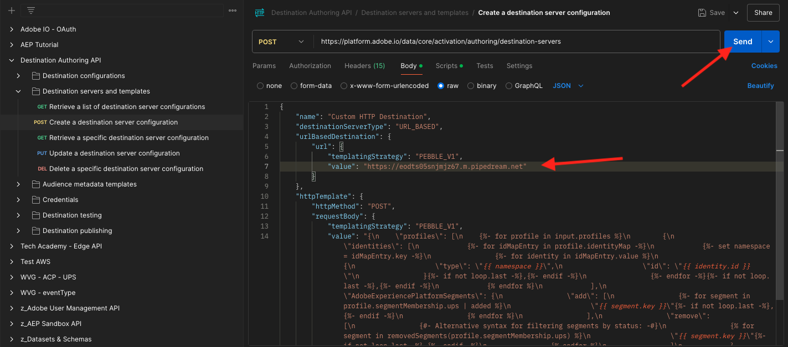
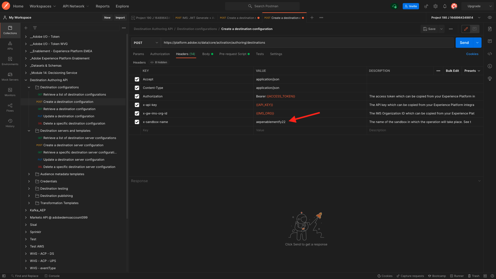

# 2.3.7 SDK de destinos

## Configuración del proyecto de Adobe I/O

En este ejercicio volverá a utilizar Adobe I/O para consultar las API de Adobe Experience Platform. Si aún no ha configurado el proyecto de Adobe I/O, vuelva al [Ejercicio 3 en el Módulo 2.1](../module2.1/ex3.md) y siga las instrucciones que se indican a continuación.

## Autenticación de Postman en el Adobe I/O

En este ejercicio volverá a utilizar Postman para consultar las API de Adobe Experience Platform. Si aún no configuró la aplicación de Postman, vuelva al [Ejercicio 3 del módulo 2.1](../module2.1/ex3.md) y siga las instrucciones que se indican a continuación.

## Definir punto final y formato

Para este ejercicio, necesitará un punto final que configurar para que cuando un segmento se califique, el evento de calificación se pueda transmitir a ese punto final. En este ejercicio, usará un extremo de ejemplo con [https://webhook.site/](https://webhook.site/). Vaya a [https://webhook.site/](https://webhook.site/), donde verá algo similar a esto. Haga clic en **Copiar al portapapeles** para copiar la dirección URL. Deberá especificar esta dirección URL en el siguiente ejercicio. La dirección URL de este ejemplo es `https://webhook.site/e0eb530c-15b4-4a29-8b50-e40877d5490a`.


En cuanto al formato, utilizaremos una plantilla estándar que transmitirá las clasificaciones o desclasificaciones de segmentos junto con metadatos como identificadores de cliente. Las plantillas se pueden personalizar para satisfacer las expectativas de puntos finales específicos, pero en este ejercicio reutilizaremos una plantilla estándar, lo que dará como resultado una carga útil como esta que se transmitirá al punto final.

```json
{
  "profiles": [
    {
      "identities": [
        {
          "type": "ecid",
          "id": "64626768309422151580190219823409897678"
        }
      ],
      "AdobeExperiencePlatformSegments": {
        "add": [
          "f58c723c-f1e5-40dd-8c79-7bb4ab47f041"
        ],
        "remove": []
      }
    }
  ]
}
```

## Creación de una configuración de servidor y plantilla

El primer paso para crear su propio destino en Adobe Experience Platform es crear una configuración de servidor y plantilla.

Para ello, vaya a la **API de creación de destinos**, a **plantillas y servidores de destino** y haga clic para abrir el POST de solicitud **Crear una configuración de servidor de destino**. Entonces verá esto... En **Encabezados**, debe actualizar manualmente el valor de la clave **x-sandbox-name** y establecerlo en `--aepSandboxName--`. Seleccione el valor **{{SANDBOX_NAME}}**.


Reemplazar por `--aepSandboxName--`.


A continuación, vaya a **Cuerpo**. seleccione el marcador de posición **{{body}}**.


Ahora necesita reemplazar el marcador de posición **{{body}}** por el siguiente código:

```json
{
    "name": "Custom HTTP Destination",
    "destinationServerType": "URL_BASED",
    "urlBasedDestination": {
        "url": {
            "templatingStrategy": "PEBBLE_V1",
            "value": "yourURL"
        }
    },
    "httpTemplate": {
        "httpMethod": "POST",
        "requestBody": {
            "templatingStrategy": "PEBBLE_V1",
            "value": "{\n    \"profiles\": [\n    \n        {\n            \"identities\": [\n            \n            \n                \n                {\n                    \"type\": \"{{ namespace }}\",\n                    \"id\": \"{{ identity.id }}\"\n                },\n                ,\n            \n            ],\n            \"AdobeExperiencePlatformSegments\": {\n                \"add\": [\n                \n                    \"{{ segment.key }}\",\n                \n                ],\n                \"remove\": [\n                {#- Alternative syntax for filtering segments by status: -#}\n                \n                    \"{{ segment.key }}\",\n                \n                ]\n            }\n        },\n    \n    ]\n}"
        },
        "contentType": "application/json"
    }
}
```

Después de pegar el código anterior, debe actualizar manualmente el campo **urlBasedDestination.url.value** y establecerlo en la dirección URL del webhook que creó en el paso anterior, que era `https://webhook.site/e0eb530c-15b4-4a29-8b50-e40877d5490a` en este ejemplo.


Después de actualizar el campo **urlBasedDestination.url.value**, debería tener este aspecto. Haga clic en **Enviar**.



Después de hacer clic en **Enviar**, se creará la plantilla de servidor y, como parte de la respuesta, verá un campo denominado **instanceId**. Escríbelo, ya que lo necesitará en el siguiente paso. En este ejemplo, **instanceId** es
`eb0f436f-dcf5-4993-a82d-0fcc09a6b36c`.


## Cree la configuración de destino

En Postman, en **API de creación de destino**, vaya a **Configuraciones de destino** y haga clic para abrir el POST de solicitud **Crear una configuración de destino**. Entonces verá esto... En **Encabezados**, debe actualizar manualmente el valor de la clave **x-sandbox-name** y establecerlo en `--aepSandboxName--`. Seleccione el valor **{{SANDBOX_NAME}}**.


Reemplazar por `--aepSandboxName--`.



A continuación, vaya a **Cuerpo**. seleccione el marcador de posición **{{body}}**.


Ahora necesita reemplazar el marcador de posición **{{body}}** por el siguiente código:

```json
{
    "name": "--aepUserLdap-- - Webhook",
    "description": "Exports segment qualifications and identities to a custom webhook via Destination SDK.",
    "status": "TEST",
    "customerAuthenticationConfigurations": [
        {
            "authType": "BEARER"
        }
    ],
    "customerDataFields": [
        {
            "name": "endpointsInstance",
            "type": "string",
            "title": "Select Endpoint",
            "description": "We could manage several instances across the globe for REST endpoints that our customers are provisioned for. Select your endpoint in the dropdown list.",
            "isRequired": true,
            "enum": [
                "US",
                "EU",
                "APAC",
                "NZ"
            ]
        }
    ],
    "uiAttributes": {
        "documentationLink": "https://experienceleague.adobe.com/docs/experience-platform/destinations/home.html?lang=en",
        "category": "streaming",
        "connectionType": "Server-to-server",
        "frequency": "Streaming"
    },
    "identityNamespaces": {
        "ecid": {
            "acceptsAttributes": true,
            "acceptsCustomNamespaces": false
        }
    },
    "segmentMappingConfig": {
        "mapExperiencePlatformSegmentName": true,
        "mapExperiencePlatformSegmentId": true,
        "mapUserInput": false
    },
    "aggregation": {
        "aggregationType": "BEST_EFFORT",
        "bestEffortAggregation": {
            "maxUsersPerRequest": "1000",
            "splitUserById": false
        }
    },
    "schemaConfig": {
        "profileRequired": false,
        "segmentRequired": true,
        "identityRequired": true
    },
    "destinationDelivery": [
        {
            "authenticationRule": "NONE",
            "destinationServerId": "yourTemplateInstanceID"
        }
    ]
}
```


Después de pegar el código anterior, debe actualizar manualmente el campo **destinationDelivery. destinationServerId** y debe establecerlo en **instanceId** de la plantilla de servidor de destino que creó en el paso anterior, que era `eb0f436f-dcf5-4993-a82d-0fcc09a6b36c` en este ejemplo. A continuación, haga clic en **Enviar**.


A continuación, verá esta respuesta.


El destino se creará en Adobe Experience Platform. Vamos allí y vamos a comprobarlo.

Ir a [Adobe Experience Platform](https://experience.adobe.com/platform). Después de iniciar sesión, llegará a la página principal de Adobe Experience Platform.


Antes de continuar, debe seleccionar una **zona protegida**. La zona protegida que se va a seleccionar se denomina ``--aepSandboxName--``. Para ello, haga clic en el texto **[!UICONTROL Producción]** en la línea azul de la parte superior de la pantalla. Después de seleccionar la [!UICONTROL zona protegida] adecuada, verá el cambio en la pantalla y ahora se encuentra en la [!UICONTROL zona protegida] dedicada.


En el menú de la izquierda, ve a **Destinos**, haz clic en **Catálogo** y desplázate hacia abajo hasta la categoría **Transmisión**. Ahora verá su destino disponible allí.


## Vincule el segmento a su destino

En **Destinos** > **Catálogo**, haga clic en **Configurar** en su destino para empezar a agregar segmentos a su nuevo destino.


Escriba un token de portador ficticio, como **1234**. Haga clic en **Conectar con destino**.


Entonces verá esto... Como nombre de destino, use `--aepUserLdap-- - Webhook`. Seleccione un punto final de su elección, en este ejemplo **EU**. Haga clic en **Next**.


Si lo desea, puede seleccionar una política de control de datos. Haga clic en **Next**.


Seleccione el segmento que creó anteriormente, que se llama `--aepUserLdap-- - Interest in PROTEUS FITNESS JACKSHIRT`. Haga clic en **Next**.


Entonces verá esto... Asegúrese de asignar **SOURCE FIELD** `--aepTenantId--.identification.core.ecid` al campo `Identity: ecid`. Haga clic en **Next**.


Haga clic en **Finalizar**.


Su destino ya está activo, las nuevas cualificaciones del segmento se transmitirán ahora a su webhook personalizado.


## Pruebe la activación del segmento

Vaya a [https://builder.adobedemo.com/projects](https://builder.adobedemo.com/projects). Después de iniciar sesión con su Adobe ID, verá esto. Haga clic en el proyecto del sitio web para abrirlo.


Ahora puede seguir el siguiente flujo para acceder al sitio web. Haga clic en **Integraciones**.


En la página **Integraciones**, debe seleccionar la propiedad de recopilación de datos que se creó en el ejercicio 0.1.


A continuación, verá cómo se abre el sitio web de demostración. Seleccione la URL y cópiela en el portapapeles.


Abra una nueva ventana del explorador de incógnito.


Pegue la dirección URL del sitio web de demostración, que copió en el paso anterior. Luego se le pedirá que inicie sesión con su Adobe ID.


Seleccione el tipo de cuenta y complete el proceso de inicio de sesión.


Luego verá el sitio web cargado en una ventana de incógnito del explorador. Para cada demostración, deberá utilizar una ventana nueva del explorador de incógnito para cargar la URL del sitio web de demostración.


En la página de inicio de **Luma**, ve a **Hombres** y haz clic en el producto **PROTEUS FITNESS JACKSHIRT**.


Ahora ha visitado la página de productos de **PROTEUS FITNESS JACKSHIRT**, lo que significa que ahora calificará para el segmento que creó anteriormente en este ejercicio.


Cuando abra el Visor de perfiles y vaya a **Segmentos**, verá que el segmento cumple los requisitos.


Ahora, vuelva al gancho web abierto en [https://webhook.site/](https://webhook.site/), donde debería ver una nueva solicitud entrante, que se origina desde Adobe Experience Platform y que contiene el evento de calificación de segmentos.


Paso siguiente: [Resumen y beneficios](./summary.md)

[Volver al módulo 2.3](./real-time-cdp-build-a-segment-take-action.md)

[Volver a todos los módulos](../../../overview.md)
