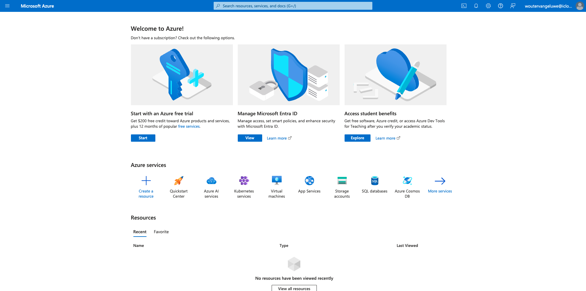

# 2.4.1 Configuración del entorno

## Crear una suscripción de Azure

>[!NOTE]
>
>Si ya tiene una suscripción a Azure, puede omitir este paso. Continúe con el siguiente ejercicio en ese caso.

Vaya a [https://portal.azure.com](https://portal.azure.com) e inicie sesión con su cuenta de Azure. Si no dispone de una, utilice su dirección de correo electrónico personal para crear su cuenta de Azure.


Después de iniciar sesión correctamente, verá la siguiente pantalla:



Haga clic en el menú de la izquierda y seleccione **Todos los recursos**. Si aún no se ha suscrito, aparecerá la pantalla de suscripción de Azure. En ese caso, seleccione **Iniciar con una versión de prueba gratuita de Azure**.


Rellene el formulario de suscripción de Azure, proporcione su teléfono móvil y tarjeta de crédito para la activación (tendrá un nivel gratuito durante 30 días y no se le cobrará, a menos que actualice).

Cuando finalice el proceso de suscripción, ya está listo para comenzar:


## Instalar Visual Code Studio

Utilizará Microsoft Visual Code Studio para administrar su proyecto de Azure. Puede descargarlo a través de [este enlace](https://code.visualstudio.com/download). Siga las instrucciones de instalación de su sistema operativo específico en el mismo sitio web.

## Instalar extensiones de código visual

Instale las funciones de Azure para el código de Visual Studio desde [https://marketplace.visualstudio.com/items?itemName=ms-azuretools.vscode-azurefunctions](https://marketplace.visualstudio.com/items?itemName=ms-azuretools.vscode-azurefunctions). Haga clic en el botón Instalar:


Instale la cuenta de Azure e inicie sesión para el código de Visual Studio desde [https://marketplace.visualstudio.com/items?itemName=ms-vscode.azure-account](https://marketplace.visualstudio.com/items?itemName=ms-vscode.azure-account). Haga clic en el botón Instalar:


## Instalación de node.js

>[!NOTE]
>
>Si ya tiene node.js instalado, puede omitir este paso. Continúe con el siguiente ejercicio en ese caso.

### macOS

Asegúrate de tener [Homebrew](https://brew.sh/) instalado primero. Siga las instrucciones [aquí](https://brew.sh/).


Una vez instalado Homebrew, ejecute este comando:

```javascript
brew install node
```

### Windows

Descargue [Windows Installer](https://nodejs.org/en/#home-downloadhead) directamente desde el sitio web [nodejs.org](https://nodejs.org/en/).

## Verificar la versión de node.js

Para este módulo, debe tener instalado node.js versión 18. Cualquier otra versión de node.js puede causar problemas con este ejercicio.

Antes de continuar, compruebe su versión de node.js ahora.

Ejecute este comando para comprobar la versión de node.js:

```javascript
node -v
```

Si su versión es inferior o superior a 18, debe actualizar o degradar.

### Actualización/degradación de la versión de node.js en macOS

Asegúrese de tener instalado el paquete **n**.

Para instalar el paquete **n**, ejecute este comando:

```javascript
sudo npm install -g n
```

Si su versión es inferior o superior a la versión 12, ejecute este comando para actualizar o degradar:

```javascript
sudo n 18
```

### Actualización/degradación de la versión de node.js en Windows

Desinstale node.js de Windows > Panel de control de Campaign > Agregar o quitar programas.

Instalando la versión requerida desde el sitio web [nodejs.org](https://nodejs.org/en/).

## Instale el paquete NPM: solicitud

Debe instalar el paquete **request** como parte de la instalación de node.js.

Para instalar el paquete **request**, ejecute este comando:

```javascript
npm install request
```

## Instale las herramientas principales de funciones de Azure:

```
brew tap azure/functions
brew install azure-functions-core-tools@4
```

Siguiente paso: [2.4.2 Configuración del entorno de Microsoft Azure EventHub](./ex2.md)

[Volver al módulo 2.4](./segment-activation-microsoft-azure-eventhub.md)

[Volver a todos los módulos](./../../../overview.md)
