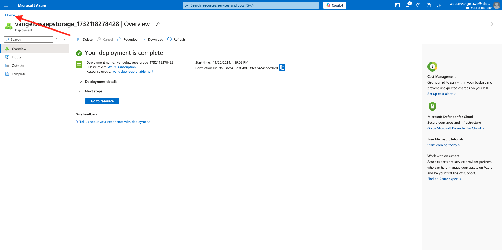

# 2.4.2 Configuración del entorno de Microsoft Azure EventHub

Azure Event Hubs es un servicio de suscripción de publicación con gran capacidad de adaptación que puede introducir millones de eventos por segundo y transmitirlos a varias aplicaciones. Esto le permite procesar y analizar las grandes cantidades de datos producidos por sus dispositivos y aplicaciones conectados.

## ¿Qué es Azure Event Hubs?

Azure Event Hubs es una plataforma de transmisión de datos masivos y un servicio de ingesta de eventos. Puede recibir y procesar millones de eventos por segundo. Los datos enviados a un centro de eventos se pueden transformar y almacenar mediante cualquier proveedor de análisis en tiempo real o adaptador de almacenamiento/agrupamiento.

Event Hubs representa la **puerta principal** de una canalización de eventos, a menudo denominada ingestor de eventos en las arquitecturas de soluciones. Un ingestor de eventos es un componente o servicio que se encuentra entre los editores de eventos (como Adobe Experience Platform RTCDP) y los consumidores de eventos para desvincular la producción de un flujo de evento del consumo de esos eventos. Event Hubs proporciona una plataforma de streaming unificada con búfer de retención de tiempo, lo que desvincula a los productores de eventos de los consumidores de eventos.

## Crear un área de nombres de Event Hubs

Vaya a [https://portal.azure.com/#home](https://portal.azure.com/#home) y seleccione **Crear un recurso**.

En la pantalla de recursos, escriba **Event** en la barra de búsqueda. Busque la tarjeta **Event Hubs**, haga clic en **Crear** y luego en **Event Hubs**.

Si es la primera vez que crea un recurso en Azure, deberá crear un nuevo **grupo de recursos**. Si ya tiene un grupo de recursos, puede seleccionarlo (o crear uno nuevo).

Haga clic en **Crear nuevo** y asigne un nombre al grupo `--aepUserLdap---aep-enablement`. Haga clic en **Aceptar**.

Complete el resto de los campos como se indica:

- Área de nombres: defina su área de nombres, debe ser única, use el siguiente patrón `--aepUserLdap---aep-enablement`
- Ubicación: elija cualquier ubicación
- Nivel de precios: **Básico**
- Unidades de rendimiento: **1**

Haga clic en **Revisar + crear**.

Haga clic en **Crear**.

La implementación del grupo de recursos puede tardar entre 1 y 2 minutos. Si se realiza correctamente, verá la siguiente pantalla:

## Configurar el centro de eventos en Azure

Vaya a [https://portal.azure.com/#home](https://portal.azure.com/#home) y seleccione **Todos los recursos**.

En la lista de recursos, haga clic en el área de nombres de los centros de eventos `--aepUserLdap---aep-enablement`:

En la pantalla de detalles de `--aepUserLdap---aep-enablement`, vaya a **Entidades** y haga clic en **Centros de eventos**:

Haga clic en **+ Centro de eventos**.

Use `--aepUserLdap---aep-enablement-event-hub` como nombre y haga clic en **Revisar + Crear**.

Haga clic en **Crear**.

En **Event Hubs**, debajo de tu área de nombres de centro de eventos, ahora verás tu **centro de eventos** en la lista.

## Configurar su cuenta de almacenamiento de Azure

Para depurar la función de Azure Event Hub en ejercicios posteriores, deberá proporcionar una cuenta de almacenamiento de Azure como parte de la configuración del proyecto de código de Visual Studio. Ahora creará esa cuenta de almacenamiento de Azure.

Vaya a [https://portal.azure.com/#home](https://portal.azure.com/#home) y seleccione **Crear un recurso**.

Escriba **cuenta de almacenamiento** en la búsqueda, busque la tarjeta de **cuenta de almacenamiento** y haga clic en **cuenta de almacenamiento**.

Especifique su **grupo de recursos** (creado al principio de este ejercicio), use `--aepUserLdap--aepstorage` como nombre de cuenta de almacenamiento y seleccione **Almacenamiento redundante localmente (LRS)**; a continuación, haga clic en **Revisar + crear**.

Haga clic en **Crear**.

La creación de nuestra cuenta de almacenamiento tardará un par de segundos:

Cuando finalice, la pantalla mostrará el botón **Ir al recurso**.

Haga clic en **Inicio**.

Su cuenta de almacenamiento ahora está visible en **Recursos recientes**.

Paso siguiente: [2.4.3 Configuración del destino de Azure Event Hub en Adobe Experience Platform](./ex3.md)

[Volver al módulo 2.4](./segment-activation-microsoft-azure-eventhub.md)

[Volver a todos los módulos](./../../../overview.md)
