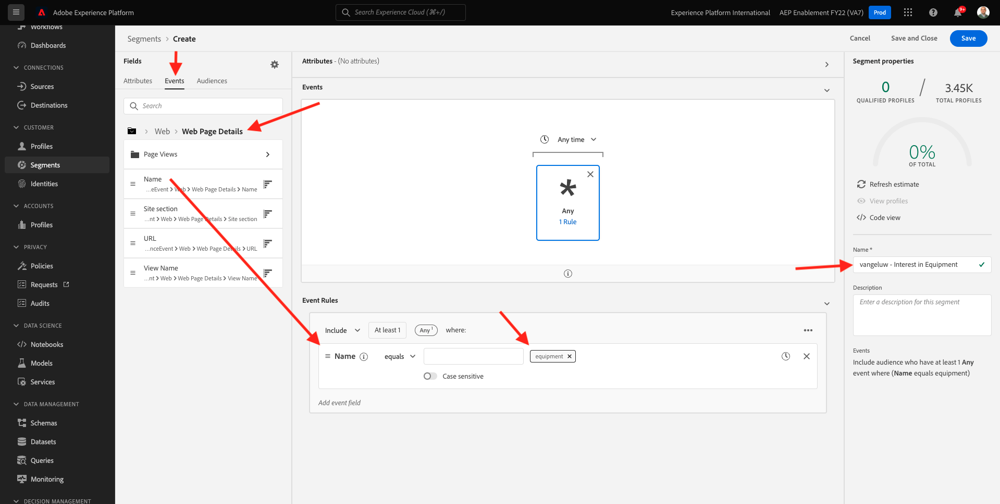

# 2.4.3 Crear un segmento

## 2.4.3.1 Introducción

Va a crear un segmento simple:

- **Interés en el equipo** para el cual calificarán los perfiles de clientes cuando visiten la página de **Equipo** del sitio web de demostración de Luma.

### Es bueno saber

Real-time CDP almacenará en déclencheur una activación en un destino cuando cumpla los requisitos de un segmento que forme parte de la lista de activación de ese destino. En ese caso, la carga útil de calificación de segmentos que se enviará a ese destino contendrá **todos los segmentos a los que pertenece su perfil**.

El objetivo de este módulo es mostrar que la calificación de segmentos de su perfil de cliente se envía a **su destino de centro de eventos** en tiempo real.

### Estado del segmento

Una calificación de segmentos en Adobe Experience Platform siempre tiene una propiedad **status** y puede ser una de las siguientes:

- **realizado**: esto indica una nueva calificación de segmento
- **existente**: esto indica una calificación de segmento existente
- **saliente**: esto indica que el perfil ya no cumple los requisitos para el segmento

## 2.4.3.2 Crear el segmento

La creación de un segmento se explica en detalle en [Módulo 2.3](./../../../modules/rtcdp-b2c/module2.3/real-time-cdp-build-a-segment-take-action.md).

### Crear segmento

Inicie sesión en Adobe Experience Platform desde esta dirección URL: [https://experience.adobe.com/platform](https://experience.adobe.com/platform).

Después de iniciar sesión, llegará a la página principal de Adobe Experience Platform.


Antes de continuar, debe seleccionar una **zona protegida**. La zona protegida que se va a seleccionar se denomina ``--aepSandboxName--``. Después de seleccionar la zona protegida adecuada, verá que la pantalla cambia y ahora está en la zona protegida dedicada.


Vaya a **Segmentos**. Haga clic en el botón **+ Crear segmento**.


Asigne un nombre al segmento `--aepUserLdap-- - Interest in Equipment` y añada el nombre de página al evento de experiencia:

Haga clic en **Eventos** y arrastre y suelte **XDM ExperienceEvent > Web > Detalles de página web > Nombre**. Escriba **equipo** como valor:



Arrastre y suelte **XDM ExperienceEvent > `--aepTenantId--` > demoEnvironment > brandName**. Escriba `--aepUserLdap--` como valor, establezca el parámetro de comparación en **contiene** y haga clic en **Guardar**:


### Definición de PQL

El PQL del segmento tiene este aspecto:

```code
CHAIN(xEvent, timestamp, [C0: WHAT(web.webPageDetails.name.equals("equipment", false) and _experienceplatform.demoEnvironment.brandName.contains("--aepUserLdap--", false))])
```

Siguiente paso: [2.4.4 Activar segmento](./ex4.md)

[Volver al módulo 2.4](./segment-activation-microsoft-azure-eventhub.md)

[Volver a todos los módulos](./../../../overview.md)
