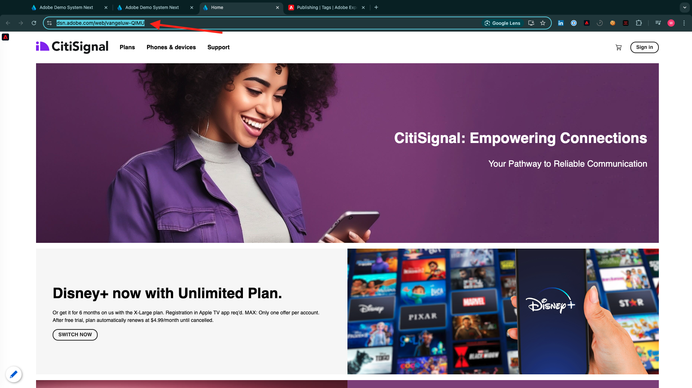

# 2.4.6 Escenario de extremo a extremo

## 2.4.6.1 Iniciar el déclencheur de Azure Event Hub

Para mostrar la carga útil enviada por Adobe Experience Platform Real-time CDP a nuestro Azure Event Hub tras la calificación de segmentos, necesitamos iniciar nuestra función de déclencheur simple de Azure Event Hub. Esta función simplemente &quot;volcará&quot; la carga útil a la consola en Visual Studio Code. Pero recuerde que esta función se puede ampliar de cualquier manera para interactuar con todo tipo de entornos utilizando API y protocolos dedicados.

### Iniciar código de Visual Studio e iniciar proyecto

Asegúrese de que el proyecto de código de Visual Studio esté abierto y en ejecución

Para iniciar, detener o reiniciar la función de Azure en Visual Studio Code, consulte los siguientes ejercicios:

- [Ejercicio 13.5.4: Iniciar el proyecto de Azure](./ex5.md)
- [Ejercicio 13.5.5: Detener Azure Project](./ex5.md)

El **Terminal** de su código de Visual Studio debe mencionar algo similar a esto:

```code
[2022-02-23T05:03:41.429Z] Worker process started and initialized.
[2022-02-23T05:03:41.484Z] Debugger attached.
[2022-02-23T05:03:46.401Z] Host lock lease acquired by instance ID '000000000000000000000000D90C881B'.
```


## 2.4.6.2 Carga del sitio web de Luma

Vaya a [https://builder.adobedemo.com/projects](https://builder.adobedemo.com/projects). Después de iniciar sesión con su Adobe ID, verá esto. Haga clic en el proyecto del sitio web para abrirlo.


Ahora puede seguir el siguiente flujo para acceder al sitio web. Haga clic en **Integraciones**.


En la página **Integraciones**, debe seleccionar la propiedad de recopilación de datos que se creó en el ejercicio 0.1.


A continuación, verá cómo se abre el sitio web de demostración. Seleccione la URL y cópiela en el portapapeles.



Abra una nueva ventana del explorador de incógnito.


Pegue la dirección URL del sitio web de demostración, que copió en el paso anterior. Luego se le pedirá que inicie sesión con su Adobe ID.


Seleccione el tipo de cuenta y complete el proceso de inicio de sesión.


Luego verá el sitio web cargado en una ventana de incógnito del explorador. Para cada demostración, deberá utilizar una ventana nueva del explorador de incógnito para cargar la URL del sitio web de demostración.


## 2.4.6.3 Califique para el segmento de su interés en equipos

Vaya a la página **Equipo** una vez y **no lo vuelva a cargar ni lo actualice**. Esta acción debería calificarlo para el segmento `--aepUserLdap-- - Interest in Equipment`.


Para verificarlo, abra el panel Visor de perfiles. Ahora debería ser miembro de `--aepUserLdap-- - Interest in Equipment`. Si las suscripciones a segmentos aún no se han actualizado en el panel Visor de perfiles, haga clic en el botón Recargar.


Cambie a Visual Studio Code y observe su ficha **TERMINAL**; debería ver una lista de segmentos para su **ECID** específico. Esta carga útil de activación se enviará a su centro de eventos en cuanto cumpla los requisitos para el segmento `--aepUserLdap-- - Interest in Equipment`.

Si examina más de cerca la carga útil del segmento, verá que `--aepUserLdap-- - Interest in Equipment` está en estado **realizado**.

Un estado de segmento de **realizado** significa que nuestro perfil acaba de ingresar al segmento. Aunque el estado **existing** significa que nuestro perfil sigue estando en el segmento.


## 2.4.6.4 Visita la página de Equipos por segunda vez

Realice una actualización completa de la página **Equipo**.


Ahora, vuelva al código de Visual Studio y compruebe la ficha **TERMINAL**. Verá que todavía tenemos su segmento, pero ahora en estado **existente**, lo que significa que nuestro perfil sigue estando en el segmento.


## 2.4.6.5 Visita la página de deportes por tercera vez

Si vuelve a visitar la página **Deportes** por tercera vez, no se realizará ninguna activación, ya que no hay ningún cambio de estado desde el punto de vista de un segmento.

Las activaciones de segmentos solo se producen cuando cambia el estado del segmento:


Paso siguiente: [Resumen y beneficios](./summary.md)

[Volver al módulo 2.4](./segment-activation-microsoft-azure-eventhub.md)

[Volver a todos los módulos](./../../../overview.md)
