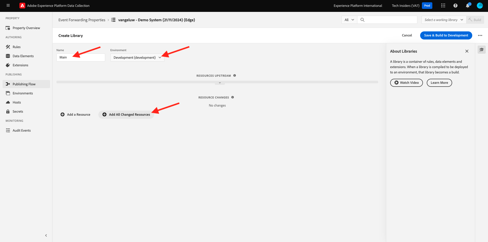

# 2.5.1 Crear una propiedad de reenvío de eventos de recopilación de datos de Adobe Experience Platform

>[!NOTE]
>
>La extensión móvil de Adobe Experience Platform Edge se encuentra actualmente en BETA. El uso de esta extensión es solo por invitación. Póngase en contacto con el administrador de éxito del cliente de su Adobe para obtener más información y obtener acceso a los materiales de este tutorial.

## 2.5.1.1 ¿Qué es una propiedad de reenvío de eventos de recopilación de datos de Adobe Experience Platform?

Normalmente, cuando los datos se recopilan mediante la recopilación de datos de Adobe Experience Platform, se recopilan en **Client Side**. **Client Side** es un entorno como un sitio web o una aplicación móvil. En los módulos 0 y 1, se analizó en detalle la configuración de una propiedad de cliente de recopilación de datos de Adobe Experience Platform e implementó esa propiedad de cliente de recopilación de datos de Adobe Experience Platform en su sitio web y aplicación móvil, de modo que los datos se pudieran recopilar allí cuando un cliente interactuara con el sitio web y la aplicación móvil.

Cuando la propiedad Adobe Experience Platform Data Collection Client recopila esos datos de interacción, el sitio web o la aplicación móvil envían una solicitud al Edge de Adobe. Edge es el entorno de recopilación de datos de Adobe y el punto de entrada para los datos del flujo de navegación en el ecosistema de Adobe. Desde Edge, los datos recopilados se envían a aplicaciones como Adobe Experience Platform, Adobe Analytics, Adobe Audience Manager o Adobe Target.

Con la adición de una propiedad de reenvío de eventos de recopilación de datos de Adobe Experience Platform, ahora es posible configurar una propiedad de recopilación de datos de Adobe Experience Platform que escuche datos entrantes en Edge. Cuando la propiedad de reenvío de eventos de recopilación de datos de Adobe Experience Platform que se ejecuta en Edge ve datos entrantes, tiene la capacidad de utilizarlos y reenviarlos a otro lugar. Ese otro lugar ahora también puede ser un webhook externo que no sea de Adobe, lo que permite enviar esos datos a, por ejemplo, su repositorio de datos preferido, una aplicación de toma de decisiones o cualquier otra aplicación que tenga la capacidad de abrir un webhook.

La configuración de una propiedad de reenvío de eventos de recopilación de datos de Adobe Experience Platform le resulta familiar a una propiedad de cliente, con la capacidad de configurar elementos de datos y reglas como en el pasado con las propiedades de cliente de recopilación de datos de Adobe Experience Platform. Sin embargo, la forma en que se accederá y se utilizarán los datos será ligeramente diferente, según el caso de uso.

Empecemos por crear la propiedad de reenvío de eventos de recopilación de datos de Adobe Experience Platform.

## 2.5.1.2 Crear una propiedad de reenvío de eventos de recopilación de datos de Adobe Experience Platform

Vaya a [https://experience.adobe.com/#/data-collection/](https://experience.adobe.com/#/data-collection/). En el menú de la izquierda, haga clic en **Reenvío de eventos**. A continuación, verá una descripción general de todas las propiedades disponibles del reenvío de eventos de recopilación de datos de Adobe Experience Platform. Haga clic en el botón **Nueva propiedad**.

Ahora debe escribir un nombre para la propiedad de reenvío de eventos de recopilación de datos de Adobe Experience Platform. Como convención de nombres, use `--aepUserLdap-- - Demo System (DD/MM/YYYY) (Edge)`. Por ejemplo, en este ejemplo, el nombre es **vangeluw - Demo System (22/02/2022) (Edge)**. Haga clic en **Guardar**.

A continuación, volverá a la lista de propiedades de reenvío de eventos de recopilación de datos de Adobe Experience Platform. Haga clic en para abrir la propiedad que acaba de crear.

## 2.5.1.2 Configuración de la extensión del conector de Adobe Cloud

En el menú de la izquierda, ve a **Extensiones**. Verá que la extensión **Core** ya está configurada.

Ir a **Catálogo**. Verá la extensión **Conector de Adobe Cloud**. Haga clic en **Instalar** para instalarlo.

A continuación, se añade la extensión. No hay ninguna configuración que hacer en este paso. Se le enviará de vuelta a la descripción general de las extensiones instaladas.

## 2.5.1.3 Implementar la propiedad de reenvío de eventos de recopilación de datos de Adobe Experience Platform

En el menú de la izquierda, vaya a **Flujo de publicación**. Haga clic en **Agregar biblioteca**.

Escriba el nombre **Main**, seleccione el entorno **Desarrollo (Development)** y haga clic en **+ Agregar todos los recursos modificados**.

Entonces verá esto... Haga clic en **Guardar y crear para desarrollo**.

A continuación, se creará la biblioteca, lo que puede tardar entre 1 y 2 minutos.

Finalmente, la biblioteca se creará y estará lista.

Paso siguiente: [2.5.2 Actualice su secuencia de datos para que los datos estén disponibles para la propiedad de reenvío de eventos de recopilación de datos](./ex2.md)

[Volver al módulo 2.5](./aep-data-collection-ssf.md)

[Volver a todos los módulos](./../../../overview.md)
