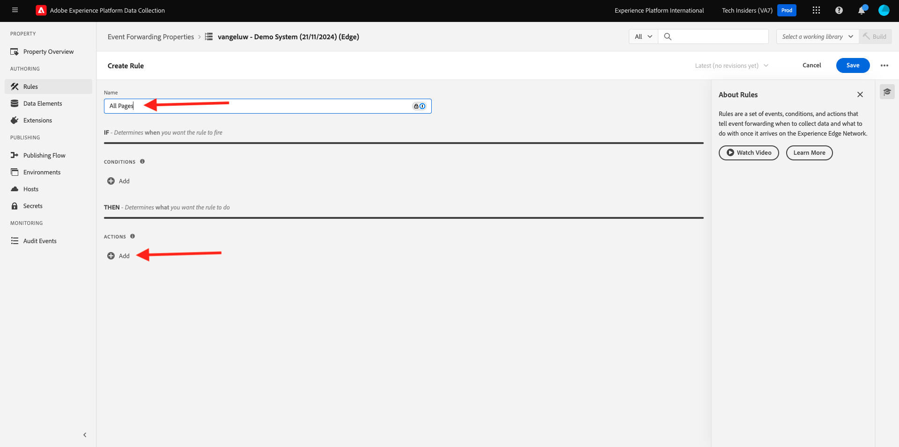
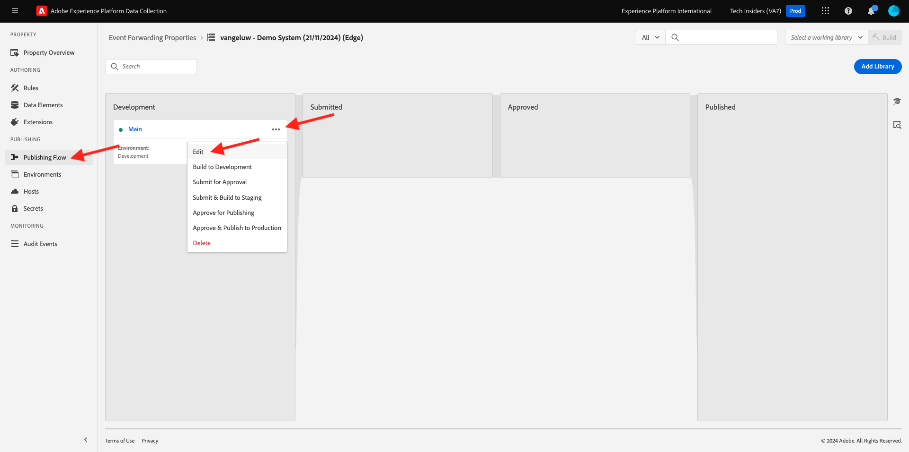

# 2.5.3 Crear y configurar un webhook personalizado

## 2.5.3.1 Crear su webhook personalizado

Vaya a [https://webhook.site/](https://webhook.site/). Verá algo como esto:

Verá su dirección URL única, que tiene el siguiente aspecto: `https://webhook.site/585126a1-41fc-4721-864b-d4aa8c268a1d`.

Este sitio web ha creado este webhook para usted, y usted podrá configurarlo en su **[!DNL Event Forwarding property]** para comenzar a probar el reenvío de eventos.

## 2.5.3.2 Actualizar la propiedad de reenvío de eventos: Crear un elemento de datos

Vaya a [https://experience.adobe.com/#/data-collection/](https://experience.adobe.com/#/data-collection/) y luego a **Reenvío de eventos**. Busque la propiedad Reenvío de eventos y haga clic en ella para abrirla.

En el menú de la izquierda, vaya a **Elementos de datos**. Haga clic en **Crear nuevo elemento de datos**.

A continuación, verá un nuevo elemento de datos para configurar.

Realice la siguiente selección:

- Como **Nombre**, introduzca **Evento XDM**.
- Como la **extensión**, seleccione **Principal**.
- Como **Tipo de elemento de datos**, seleccione **Ruta**.
- Como **ruta**, escriba **arc.event.xdm**. Al introducir esta ruta, filtrará la sección **XDM** de la carga útil de evento que el sitio web o la aplicación móvil envían a Adobe Edge.

Ahora vas a tener esto. Haga clic en **Guardar**.

>[!NOTE]
>
>En la ruta anterior, se hace referencia a **arc**. **arc** significa Contexto de recursos de Adobe y **arc** siempre representa el objeto más alto disponible en el contexto del lado del servidor. Se pueden agregar enriquecimientos y transformaciones a ese objeto **arc** mediante las funciones del servidor de recopilación de datos de Adobe Experience Platform.
>
>En la ruta anterior, se hace referencia a **event**. **event** significa un evento único y el servidor de recopilación de datos de Adobe Experience Platform siempre evaluará cada evento de forma individual. A veces, es posible que vea una referencia a **events** en la carga útil enviada por el lado del cliente del SDK web, pero en el servidor de recopilación de datos de Adobe Experience Platform, cada evento se evalúa individualmente.

## 2.5.3.3 Actualizar la propiedad de Adobe Experience Platform Data Collection Server: Crear una regla

En el menú de la izquierda, ve a **Reglas**. Haga clic en **Crear nueva regla**.

A continuación, verá una nueva regla para configurar. Escriba **Nombre**: **Todas las páginas**. Para este ejercicio, no es necesario configurar una condición. En su lugar, configurará una acción. Haga clic en el botón **+ Agregar** en **Acciones**.

Entonces verá esto... Realice la siguiente selección:

- Seleccione la **extensión**: **Conector de nube de Adobe**.
- Seleccione el **Tipo de acción**: **Realizar llamada de recuperación**.

Esto debería proporcionarle este **Nombre**: **Conector de nube de Adobe - Realizar llamada de búsqueda**. Ahora debería ver esto:

A continuación, configure lo siguiente:

- Cambiar el método de solicitud de GET a **POST**
- Escriba la dirección URL del webhook personalizado que creó en uno de los pasos anteriores del sitio web [https://webhook.site/](https://webhook.site/), que tiene el siguiente aspecto: `https://webhook.site/585126a1-41fc-4721-864b-d4aa8c268a1d`

Ahora debería tener esto. A continuación, vaya a **Cuerpo**.

Entonces verá esto... Haga clic en el icono de elemento de datos como se indica a continuación.

En la ventana emergente, seleccione el elemento de datos **Evento XDM** que creó en el paso anterior. Haga clic en **Seleccionar**.

Entonces verá esto... Haga clic en **Conservar cambios**.

Entonces verá esto... Haga clic en **Guardar**.

Ahora ha configurado la primera regla en una propiedad de reenvío de eventos. Vaya a **Flujo de publicación** para publicar los cambios.
Abra la biblioteca de desarrollo **Main** haciendo clic en **Editar** como se indica.

Haga clic en el botón **Agregar todos los recursos modificados**, tras lo cual verá que la regla y el elemento de datos aparecen en esta biblioteca. A continuación, haga clic en **Guardar y generar para desarrollo**. Los cambios se están implementando.

Después de un par de minutos, verá que la implementación está completa y lista para probarse.

## 2.5.3.4 Prueba de la configuración

Vaya a [https://builder.adobedemo.com/projects](https://builder.adobedemo.com/projects). Después de iniciar sesión con su Adobe ID, verá esto. Haga clic en el proyecto del sitio web para abrirlo.

Ahora puede seguir el siguiente flujo para acceder al sitio web. Haga clic en **Integraciones**.

En la página **Integraciones**, debe seleccionar la propiedad de recopilación de datos que se creó en el ejercicio 0.1.

A continuación, verá cómo se abre el sitio web de demostración. Seleccione la URL y cópiela en el portapapeles.

Abra una nueva ventana del explorador de incógnito.

Pegue la dirección URL del sitio web de demostración, que copió en el paso anterior. Luego se le pedirá que inicie sesión con su Adobe ID.

Seleccione el tipo de cuenta y complete el proceso de inicio de sesión.

Luego verá el sitio web cargado en una ventana de incógnito del explorador. Para cada demostración, deberá utilizar una ventana nueva del explorador de incógnito para cargar la URL del sitio web de demostración.

Cuando abra la Vista de desarrollador del explorador, puede inspeccionar las Solicitudes de red como se indica a continuación. Cuando use el filtro **interaction**, verá las solicitudes de red que envía el cliente de recopilación de datos de Adobe Experience Platform a Adobe Edge.

Si selecciona la carga útil sin procesar, vaya a [https://jsonformatter.org/json-pretty-print](https://jsonformatter.org/json-pretty-print) y pegue la carga útil. Haga clic en **Hacer bonito**. Verá la carga útil JSON, el objeto **events** y el objeto **xdm**. En uno de los pasos anteriores, al definir el elemento de datos, utilizó la referencia **arc.event.xdm**, que le permitirá analizar el objeto **xdm** de esta carga.

Cambie la vista al sitio web [https://webhook.site/](https://webhook.site/) que utilizó en uno de los pasos anteriores. Ahora debería tener una vista similar a esta, con las solicitudes de red mostradas en el menú de la izquierda. Está viendo la carga útil **xdm** que se filtró fuera de la solicitud de red que se mostró arriba.

Desplácese un poco hacia abajo en la carga útil para encontrar el nombre de la página, que en este caso es **vangeluw-OCUC** (que es el nombre del proyecto de su sitio web de demostración).

Si ahora navega por el sitio web, verá solicitudes de red adicionales disponibles en este webhook personalizado en tiempo real.

Ya ha configurado el reenvío del lado del servidor de las cargas útiles del SDK web/XDM a un webhook personalizado externo. En los próximos ejercicios, configurará un enfoque similar y enviará los mismos datos a los entornos de Google y AWS.

Siguiente paso: [2.5.4 Crear y configurar una función de nube de Google](./ex4.md)

[Volver al módulo 2.5](./aep-data-collection-ssf.md)

[Volver a todos los módulos](./../../../overview.md)
