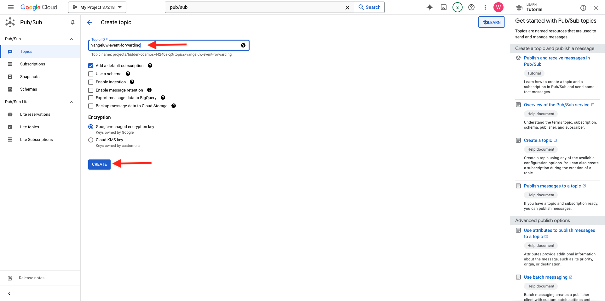

# 2.5.4 Crear y configurar una función de nube de Google

## 2.5.4.1 Crear la función de nube de Google

Vaya a [https://console.cloud.google.com/](https://console.cloud.google.com/). Vaya a **Funciones de nube**.


Entonces verá esto... Haga clic en **CREAR FUNCIÓN**.


Entonces verá esto...



Realice las siguientes opciones:

- **Nombre de función**: `--aepUserLdap---event-forwarding`
- **Región**: seleccione cualquier región
- **Tipo de Déclencheur**: seleccione **HTTP**
- **Autenticación**: seleccione **Permitir invocaciones no autenticadas**

Ahora debería tener esto. Haga clic en **GUARDAR**.


Haga clic en **SIGUIENTE**.


A continuación, verá esto:


Realice las siguientes opciones:

- **Runtime**: seleccione **Node.js 16** (o más reciente)
- **Punto de entrada**: escriba **helloAEP**

Haga clic en **HABILITAR API** para habilitar la **API de Cloud Build**. A continuación, verá una nueva ventana. En esa nueva ventana, vuelve a hacer clic en **HABILITAR**.


Entonces verá esto... Haga clic en **Habilitar**.


Una vez que la **API de Cloud Build** se haya habilitado, verá esto.


Vuelva a su **función de nube**.
En el Editor en línea de funciones de nube, asegúrese de que tiene el siguiente código:

```javascript
/**
 * Responds to any HTTP request.
 *
 * @param {!express:Request} req HTTP request context.
 * @param {!express:Response} res HTTP response context.
 */
exports.helloAEP = (req, res) => {
  let message = req.query.message || req.body.message || 'Hello World!';
  res.status(200).send(message);
};
```

A continuación, haga clic en **IMPLEMENTAR**.


Entonces verá esto... Se está creando su función de nube. Esto puede tardar un par de minutos.


Una vez que la función se haya creado y ejecutado, verá esto. Haga clic en el nombre de la función para abrirla.


Entonces verá esto... Ir a **DÉCLENCHEUR**. Verá la **URL de Déclencheur** que es lo que usará para definir el punto de conexión en Launch Server Side.


Copie la dirección URL de Déclencheur, con este aspecto: **https://europe-west1-dazzling-pillar-273812.cloudfunctions.net/vangeluw-event-forwarding**.

En los siguientes pasos, configurará Adobe Experience Platform Data Collection Server para que transmita información específica acerca de **Vistas de página** a su función de Google Cloud. En lugar de reenviar la carga útil completa tal cual, solo enviará elementos como **ECID**, **timestamp** y **Page Name** a su función de Google Cloud.

Este es un ejemplo de carga útil que debe analizar para filtrar las variables mencionadas anteriormente:

```json
{
  "events": [
    {
      "xdm": {
        "eventType": "web.webpagedetails.pageViews",
        "web": {
          "webPageDetails": {
            "URL": "https://builder.adobedemo.com/run/vangeluw-OCUC",
            "name": "vangeluw-OCUC",
            "viewName": "vangeluw-OCUC",
            "pageViews": {
              "value": 1
            }
          },
          "webReferrer": {
            "URL": "https://builder.adobedemo.com/run/vangeluw-OCUC/equipment"
          }
        },
        "device": {
          "screenHeight": 1080,
          "screenWidth": 1920,
          "screenOrientation": "landscape"
        },
        "environment": {
          "type": "browser",
          "browserDetails": {
            "viewportWidth": 1920,
            "viewportHeight": 451
          }
        },
        "placeContext": {
          "localTime": "2022-02-23T06:51:07.140+01:00",
          "localTimezoneOffset": -60
        },
        "timestamp": "2022-02-23T05:51:07.140Z",
        "implementationDetails": {
          "name": "https://ns.adobe.com/experience/alloy/reactor",
          "version": "2.8.0+2.9.0",
          "environment": "browser"
        },
        "_experienceplatform": {
          "identification": {
            "core": {
              "ecid": "08346969856929444850590365495949561249"
            }
          },
          "demoEnvironment": {
            "brandName": "vangeluw-OCUC"
          },
          "interactionDetails": {
            "core": {
              "channel": "web"
            }
          }
        }
      },
      "query": {
        "personalization": {
          "schemas": [
            "https://ns.adobe.com/personalization/html-content-item",
            "https://ns.adobe.com/personalization/json-content-item",
            "https://ns.adobe.com/personalization/redirect-item",
            "https://ns.adobe.com/personalization/dom-action"
          ],
          "decisionScopes": [
            "eyJ4ZG06YWN0aXZpdHlJZCI6Inhjb3JlOm9mZmVyLWFjdGl2aXR5OjE0YzA1MjM4MmUxYjY1MDUiLCJ4ZG06cGxhY2VtZW50SWQiOiJ4Y29yZTpvZmZlci1wbGFjZW1lbnQ6MTRiZjA5ZGM0MTkwZWJiYSJ9",
            "__view__"
          ]
        }
      }
    }
  ],
  "query": {
    "identity": {
      "fetch": [
        "ECID"
      ]
    }
  },
  "meta": {
    "state": {
      "domain": "adobedemo.com",
      "cookiesEnabled": true,
      "entries": [
        {
          "key": "kndctr_907075E95BF479EC0A495C73_AdobeOrg_identity",
          "value": "CiYwODM0Njk2OTg1NjkyOTQ0NDg1MDU5MDM2NTQ5NTk0OTU2MTI0OVIPCPn66KfyLxgBKgRJUkwx8AH5-uin8i8="
        },
        {
          "key": "kndctr_907075E95BF479EC0A495C73_AdobeOrg_consent_check",
          "value": "1"
        },
        {
          "key": "kndctr_907075E95BF479EC0A495C73_AdobeOrg_consent",
          "value": "general=in"
        }
      ]
    }
  }
}
```

Estos son los campos que contienen la información que debe analizarse:

- ECID: **events.xdm._experienceplatform.identification.core.ecid**
- marca de tiempo: **marca de tiempo**
- Nombre de página: **events.xdm.web.webPageDetails.name**

Ahora vamos al servidor de recopilación de datos de Adobe Experience Platform para configurar los elementos de datos y hacerlo posible.

## 2.5.4.2 Actualice la propiedad de reenvío de eventos: elementos de datos

Vaya a [https://experience.adobe.com/#/data-collection/](https://experience.adobe.com/#/data-collection/) y luego a **Reenvío de eventos**. Busque la propiedad Reenvío de eventos y haga clic en ella para abrirla.


En el menú de la izquierda, vaya a **Elementos de datos**. Haga clic en **Agregar elemento de datos**.


A continuación, verá un nuevo elemento de datos para configurar.


Realice la siguiente selección:

- Como **Nombre**, escriba **customerECID**.
- Como la **extensión**, seleccione **Principal**.
- Como **Tipo de elemento de datos**, seleccione **Ruta**.
- Como **ruta**, escriba `arc.event.xdm.--aepTenantId--.identification.core.ecid`. Al ingresar esta ruta, estará filtrando el campo **ecid** de la carga útil de evento que el sitio web o la aplicación móvil envía a Adobe Edge.

>[!NOTE]
>
>En las rutas de acceso anteriores y posteriores, se hace referencia a **arc**. **arc** significa Contexto de recursos de Adobe y **arc** siempre representa el objeto más alto disponible en el contexto del lado del servidor. Se pueden agregar enriquecimientos y transformaciones a ese objeto **arc** mediante las funciones del servidor de recopilación de datos de Adobe Experience Platform.
>
>En las rutas de acceso anteriores y posteriores, se hace referencia a **event**. **event** significa un evento único y el servidor de recopilación de datos de Adobe Experience Platform siempre evaluará cada evento de forma individual. A veces, es posible que vea una referencia a **events** en la carga útil enviada por el lado del cliente del SDK web, pero en el servidor de recopilación de datos de Adobe Experience Platform, cada evento se evalúa individualmente.

Ahora vas a tener esto. Haga clic en **Guardar**.


Haga clic en **Agregar elemento de datos**.


A continuación, verá un nuevo elemento de datos para configurar.


Realice la siguiente selección:

- Como **Nombre**, escriba **eventTimestamp**.
- Como la **extensión**, seleccione **Principal**.
- Como **Tipo de elemento de datos**, seleccione **Ruta**.
- Como **ruta**, escriba **arc.event.xdm.timestamp**. Al introducir esta ruta, se filtrará el campo **timestamp** de la carga útil de evento que el sitio web o la aplicación móvil envía a Adobe Edge.

Ahora vas a tener esto. Haga clic en **Guardar**.


Haga clic en **Agregar elemento de datos**.


A continuación, verá un nuevo elemento de datos para configurar.


Realice la siguiente selección:

- Como **Nombre**, escriba **nombreDePágina**.
- Como la **extensión**, seleccione **Principal**.
- Como **Tipo de elemento de datos**, seleccione **Ruta**.
- Como **ruta**, escriba **arc.event.xdm.web.webPageDetails.name**. Al escribir esta ruta, se filtrará el campo **name** de la carga útil de evento que el sitio web o la aplicación móvil envía a Adobe Edge.

Ahora vas a tener esto. Haga clic en **Guardar**.


Ahora se han creado estos elementos de datos:


## 2.5.4.3 Actualizar la propiedad de reenvío de eventos: Actualizar una regla

En el menú de la izquierda, ve a **Reglas**. En el ejercicio anterior creó la regla **Todas las páginas**. Haga clic en esa regla para abrirla.


Entonces vas a hacer esto. Haga clic en el icono **+** debajo de **Acciones** para agregar una acción nueva.


Entonces verá esto...


Realice la siguiente selección:

- Seleccione la **extensión**: **Conector de nube de Adobe**.
- Seleccione el **Tipo de acción**: **Realizar llamada de recuperación**.

Esto debería proporcionarle este **Nombre**: **Conector de nube de Adobe - Realizar llamada de búsqueda**. Ahora debería ver esto:


A continuación, configure lo siguiente:

- Cambiar el protocolo de solicitud de GET a **POST**
- Escriba la dirección URL de la función de Google Cloud que creó en uno de los pasos anteriores, que tiene este aspecto: **https://europe-west1-dazzling-pillar-273812.cloudfunctions.net/vangeluw-event-forwarding**

Ahora debería tener esto. A continuación, vaya a **Cuerpo**.


Entonces verá esto... Haga clic en el botón de opción de **JSON**.


Configure **Body** de la siguiente manera:

| CLAVE | VALOR |
|--- |--- |
| customerECID | {{customerECID}} |
| pageName | {{pageName}} |
| eventTimestamp | {{eventTimestamp}} |

Entonces verá esto... Haga clic en **Conservar cambios**.


Entonces verá esto... Haga clic en **Guardar**.


Ahora ha actualizado la regla existente en una propiedad de Adobe Experience Platform Data Collection Server. Vaya a **Flujo de publicación** para publicar los cambios. Abra la biblioteca de desarrollo **Main** haciendo clic en **Editar** como se indica.


Haga clic en el botón **Agregar todos los recursos modificados**, tras lo cual verá que la regla y el elemento de datos aparecen en esta biblioteca. A continuación, haga clic en **Guardar y generar para desarrollo**. Los cambios se están implementando.


Después de un par de minutos, verá que la implementación está completa y lista para probarse.


## 2.5.3.4 Prueba de la configuración

Vaya a [https://builder.adobedemo.com/projects](https://builder.adobedemo.com/projects). Después de iniciar sesión con su Adobe ID, verá esto. Haga clic en el proyecto del sitio web para abrirlo.


Ahora puede seguir el siguiente flujo para acceder al sitio web. Haga clic en **Integraciones**.


En la página **Integraciones**, debe seleccionar la propiedad de recopilación de datos que se creó en el ejercicio 0.1.


A continuación, verá cómo se abre el sitio web de demostración. Seleccione la URL y cópiela en el portapapeles.


Abra una nueva ventana del explorador de incógnito.


Pegue la dirección URL del sitio web de demostración, que copió en el paso anterior. Luego se le pedirá que inicie sesión con su Adobe ID.


Seleccione el tipo de cuenta y complete el proceso de inicio de sesión.


Luego verá el sitio web cargado en una ventana de incógnito del explorador. Para cada demostración, deberá utilizar una ventana nueva del explorador de incógnito para cargar la URL del sitio web de demostración.


Cuando abra la Vista de desarrollador del explorador, puede inspeccionar las Solicitudes de red como se indica a continuación. Cuando use el filtro **interaction**, verá las solicitudes de red que envía el cliente de recopilación de datos de Adobe Experience Platform a Adobe Edge.


Cambie la vista a la función de nube de Google y vaya a **LOGS**. Ahora debería tener una vista similar a esta, en la que se muestran varias entradas de registro. Cada vez que vea **Inicio de la ejecución de funciones**, significa que el tráfico entrante se recibió en la función de nube de Google.


Actualicemos un poco su función para que funcione con los datos entrantes y muestre la información recibida del servidor de recopilación de datos de Adobe Experience Platform. Vaya a **SOURCE** y haga clic en **EDITAR**.


En la pantalla siguiente, haz clic en **NEXT**.


Actualice el código de esta manera:

```javascript
/**
 * Responds to any HTTP request.
 *
 * @param {!express:Request} req HTTP request context.
 * @param {!express:Response} res HTTP response context.
 */
exports.helloAEP = (req, res) => {
  console.log('>>>>> Function has started. The following information was received from Event Forwarding:');
  console.log(req.body);

  let message = req.query.message || req.body.message || 'Hello World!';
  res.status(200).send(message);
};
```

Entonces, tendrás esto. Haga clic en **IMPLEMENTAR**.


Después de un par de minutos, la función se volverá a implementar. Haga clic en el nombre de la función para abrirla.


En tu sitio web de demostración, ve a un producto, como por ejemplo **DEIRDRE RELAXED-FIT CAPRI**.


Cambie la vista a la función de nube de Google y vaya a **LOGS**. Ahora debería tener una vista similar a esta, en la que se muestran varias entradas de registro.

Para cada vista de página del sitio web de demostración, ahora debería ver una nueva ventana emergente de entrada de registro en los registros de la función de Google Cloud, que muestra la información recibida.


Ahora ha enviado correctamente los datos recopilados por la recopilación de datos de Adobe Experience Platform, en tiempo real, a un punto final de función de nube de Google. A partir de ahí, esos datos se pueden utilizar en cualquier aplicación de Google Cloud Platform, como BigQuery para almacenamiento y creación de informes o para casos de uso de aprendizaje automático.

Paso siguiente: [2.5.5 Reenviar eventos hacia el ecosistema de AWS](./ex5.md)

[Volver al módulo 2.5](./aep-data-collection-ssf.md)

[Volver a todos los módulos](./../../../overview.md)
