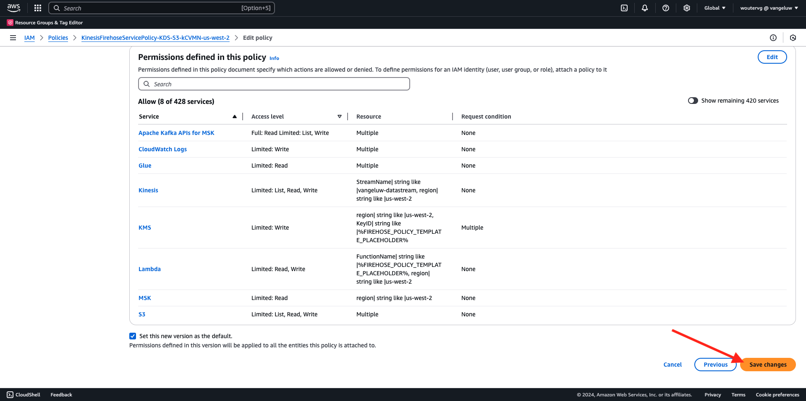

# 2.5.5 Avanzar eventos hacia el ecosistema de AWS

>[!IMPORTANT]
>
>La finalización de este ejercicio es opcional y conlleva un coste utilizar AWS Kinesis. Aunque AWS proporciona una cuenta de nivel gratuita que le permite probar y configurar muchos servicios sin coste, AWS Kinesis no forma parte de esa cuenta de nivel gratuito. Por lo tanto, para implementar y probar este ejercicio, se tendrá en cuenta un coste para utilizar AWS Kinesis.

## Es bueno saber

Adobe Experience Platform admite varios servicios de Amazon como destino.
Kinesis y S3 son [destinos de exportación de perfiles](https://experienceleague.adobe.com/docs/experience-platform/destinations/destination-types.html?lang=en) y se pueden usar como parte de Real-Time CDP de Adobe Experience Platform.
Puede incorporar fácilmente eventos de segmentos de alto valor y atributos de perfil asociados a sus sistemas de elección.

En esta nota, aprenderá a configurar su propio flujo de Kinesis de Amazon para transmitir datos de evento procedentes del ecosistema de Edge de Adobe Experience Platform a un destino de almacenamiento en la nube, como Amazon S3. Esto resulta útil en caso de que desee recopilar eventos de experiencia de propiedades web y móviles e insertarlos en el conjunto de datos para su análisis e informes operativos. Por lo general, los conjuntos de datos consumen datos por lotes con grandes importaciones diarias de archivos, y no exponen puntos finales http públicos que podrían utilizarse junto con el reenvío de eventos.

El soporte de los casos de uso anteriores implica que los datos transmitidos deben almacenarse en búfer o colocarse en cola antes de escribirse en un archivo. Se debe tener cuidado de no abrir el archivo para tener acceso de escritura en varios procesos. Delegar esta tarea en un sistema específico es ideal para escalar bien y, al mismo tiempo, garantizar un gran nivel de servicio. Aquí es donde Kinesis acude en rescate.

Amazon Kinesis Data Streams se centra en la ingesta y el almacenamiento de flujos de datos. Kinesis Data Firefox se centra en ofrecer flujos de datos a destinos seleccionados, como bloques de S3.

Como parte de este ejercicio, usted...

- Realizar una configuración básica de un flujo de datos de Kinesis
- Cree un flujo de entrega de Firefox y utilice el compartimento S3 como destino
- Configure la puerta de enlace de la API de Amazon como extremo de la API REST para recibir los datos de evento
- Reenviar datos de evento sin procesar del Edge de Adobe al flujo de Kinesis

## 2.5.5.1 Configuración del contenedor de AWS S3

Vaya a [https://console.aws.amazon.com](https://console.aws.amazon.com) e inicie sesión con la cuenta de Amazon que creó anteriormente.


Después de iniciar sesión, se le redirigirá a **AWS Management Console**.


En el menú **Buscar servicios**, busque **s3**. Haga clic en el primer resultado de búsqueda: **S3 - Almacenamiento escalable en la nube**.


Luego verá la página principal de **Amazon S3**. Haga clic en **Crear cubo**.


En la pantalla **Crear cubo**, debe configurar dos cosas:

- Nombre: use el nombre `eventforwarding---aepUserLdap--`. Por ejemplo, en este ejercicio el nombre del contenedor es **aepmodulertcdpvangeluw**
- Región: use la región **EU (Frankfurt) eu-central-1**


Mantenga el resto de configuraciones predeterminadas tal cual. Desplácese hacia abajo y haga clic en **Crear cubo**.


A continuación, verá que se está creando su contenedor y se redirigirá a la página principal de Amazon S3.


## 2.5.5.2 Configuración del flujo de datos de AWS Kinesis

En el menú **Buscar servicios**, busque **kinesis**. Haga clic en el primer resultado de búsqueda: **Kinesis - Trabajar con datos de flujo en tiempo real**.


Seleccione **Transmisiones de datos de Kinesis**. Haga clic en **Crear flujo de datos**.


Para el **nombre de secuencia de datos**, use `--aepUserLdap---datastream`.


No es necesario cambiar ninguna de las otras opciones de configuración. Desplácese hacia abajo y haga clic en **Crear flujo de datos**.


Entonces verá esto... Una vez que el flujo de datos se haya creado correctamente, puede pasar al siguiente ejercicio.


## 2.5.5.3 Configuración del flujo de entrega de AWS Firefox

En el menú **Buscar servicios**, busque **kinesis**. Haga clic en **Kinesis Data Firehouse**.


Haga clic en **Crear flujo de entrega**.


Para **Source**, seleccione **Amazon Kinesis Data Streams**. Para **Destino**, seleccione **Amazon S3**. Haga clic en **Examinar** para seleccionar el flujo de datos.


Seleccione el flujo de datos. Haga clic en **Elegir**.


Entonces verá esto... Recuerde el **nombre de flujo de entrega**, ya que lo necesitará más adelante.


Desplácese hacia abajo hasta que vea **Configuración de destino**. Haga clic en **Examinar** para seleccionar el espacio de S3.


Seleccione su compartimento de S3 y haga clic en **Elegir**.


Entonces verás algo como esto. Actualice la siguiente configuración:

- Partición dinámica: establecer en **Enabled**
- Desagregación de varios registros: establecer en **Deshabilitado**
- Nuevo delimitador de línea: establecer en **Habilitado**
- Análisis en línea para JSON: establecido en **Enabled**


Desplácese un poco hacia abajo y verá esto. Actualice la siguiente configuración:

- Claves de partición dinámica
   - Nombre de clave: **dynamicPartitioningKey**
   - Expresión JQ: **.dynamicPartitioningKey**
- Prefijo del contenedor S3: añada el siguiente código:

```bash
!{partitionKeyFromQuery:dynamicPartitioningKey}/!{timestamp:yyyy}/!{timestamp:MM}/!{timestamp:dd}/!{timestamp:HH}/}
```

- Prefijo de salida de error de contenedor S3: establecido en **error**


Finalmente, desplácese un poco más hacia abajo y haga clic en **Crear flujo de entrega**


Después de un par de minutos, su flujo de entrega no se creará y **Activo**.


## 2.5.5.4 Configuración de la función de AWS IAM

En el menú **Buscar servicios**, busque **iam**. Haga clic en **puerta de enlace de API**.


Haga clic en **Roles**.


Busque su rol **KinesisFirehouse**. Haga clic en él para abrirlo.


Haga clic en el nombre de la directiva de permisos para abrirla.


En la nueva pantalla que se abre, haga clic en **Editar directiva**.


En **Kinesis** - **Acciones**, asegúrese de que los permisos de **Escritura** para **PutRecord** estén habilitados. Haga clic en **Revisar directiva**.


Haga clic en **Guardar cambios**.



Entonces volverás a estar aquí. Haga clic en **Roles**.


Busque su rol **KinesisFirehouse**. Haga clic en él para abrirlo.


Vaya a **Relaciones de confianza** y haga clic en **Editar directiva de confianza**.


Sobrescriba la directiva de confianza actual pegando este código para reemplazar el código existente:

```json
{
	"Version": "2012-10-17",
	"Statement": [
		{
			"Effect": "Allow",
			"Principal": {
				"Service": [
                    "firehose.amazonaws.com",
                    "kinesis.amazonaws.com",
                    "apigateway.amazonaws.com"
                ]
			},
			"Action": "sts:AssumeRole"
		}
	]
}
```

Haga clic en **Actualizar directiva**


Entonces verá esto... Deberá especificar **ARN** para este rol en el siguiente paso.


## 2.5.5.5 Configuración de la puerta de enlace de la API de AWS

Amazon API Gateway es un servicio de AWS para crear, publicar, mantener, supervisar y proteger las API de REST, HTTP y WebSocket a cualquier escala. Los desarrolladores de API pueden crear API que accedan a AWS u otros servicios web, así como datos almacenados en AWS Cloud.

Ahora expondrá el flujo de datos de Kinesis a Internet a través de un punto de conexión HTTPS que luego pueden consumir directamente los servicios de Adobe, como el reenvío de eventos.

En el menú **Buscar servicios**, busque **puerta de enlace de API**. Haga clic en **puerta de enlace de API**.


Entonces verás algo como esto. Haga clic en **Crear API**.


Haga clic en **Generar** en la tarjeta **API REST**.


Entonces verá esto... Complete la configuración de esta manera:

- Elija el protocolo: seleccione **REST**
- Crear nueva API: seleccionar **Nueva API**
- Configuración:
   - Nombre de API: usar `--aepUserLdap---eventforwarding`
   - Tipo de extremo: seleccionar **Regional**

Haga clic en **Crear API**.


Entonces verá esto... Haga clic en **Acciones** y, a continuación, haga clic en **Crear recurso**.


Entonces verá esto... Establezca **Nombre del recurso** en **stream**. Haga clic en **Crear recurso**.


Entonces verá esto... Haga clic en **Acciones** y, a continuación, haga clic en **Crear método**.


En el menú desplegable, seleccione **POST** y haga clic en el botón **v**.


Entonces verá esto... Complete la configuración de esta manera:

- Tipo de integración: **Servicio AWS**
- Región de AWS: seleccione la región que usa el flujo de datos de Kinesis, en este caso: **us-west-2**
- Servicio AWS: seleccione **Kinesis**
- Subdominio de AWS: dejar vacío
- Método HTTP: seleccione **POST**
- Tipo de acción: seleccionar **Usar nombre de acción**
- Acción: ingresar **PutRecord**
- Rol de ejecución: pegue el **ARN** del rol de ejecución que usa su Kinesis Data Firefox, tal como se le indicó en el ejercicio anterior
- Administración de contenido: seleccionar **Pasar**
- Usar tiempo de espera predeterminado: activar la casilla de verificación

Haga clic en **Guardar**.


Entonces verá esto... Haga clic en **Solicitud de integración**.


Haga clic en **encabezados HTTP**.


Desplácese un poco hacia abajo y haga clic en **Agregar encabezado**.


Establezca **Name** en **Content-Type**, establezca **Asignado desde** a `'application/x-amz-json-1.1'`. Haga clic en el icono **v** para guardar los cambios.


Entonces verá esto... Para **solicitar el paso del cuerpo**, seleccione **Cuando no haya plantillas definidas (recomendado)**. A continuación, haga clic en **Agregar plantilla de asignación**.


En **Content-Type**, escriba **application/json**. Haga clic en el icono **v** para guardar los cambios.


Desplácese hacia abajo para buscar una ventana del editor de código. Pegue el siguiente código allí:

```json
{
  "StreamName": "$input.path('StreamName')",
  "Data": "$util.base64Encode($input.json('$.Data'))",
  "PartitionKey": "$input.path('$.PartitionKey')"
}
```

Haga clic en **Guardar**.


A continuación, desplácese hacia arriba y haga clic en **&lt;- Method Execution** para volver.


Haga clic en **PRUEBA**.


Desplácese hacia abajo y pegue este código en **Solicitar cuerpo**. Haga clic en **Prueba**.

```json
{
  "Data": {
    "message": "Hello World",
    "dynamicPartitioningKey": "v2"
  },
  "PartitionKey": "1",
  "StreamName": "--aepUserLdap---datastream"
}
```


A continuación, verá un resultado similar:


Entonces verá esto... Haga clic en **Acciones** y, a continuación, haga clic en **Implementar API**.


Para **Fase de implementación**, seleccione **Nueva fase**. Como **nombre de escenario**, escriba **prod**. Haga clic en **Implementar**.


Entonces verá esto... Haga clic en **Guardar cambios**. Información: la dirección URL de la imagen es la dirección URL que se utiliza para enviar datos a (en este ejemplo: https://vv1i5vwg2k.execute-api.us-west-2.amazonaws.com/prod).


Puede probar la configuración utilizando la siguiente solicitud cURL, solo tiene que reemplazar la siguiente URL por la suya, `https://vv1i5vwg2k.execute-api.us-west-2.amazonaws.com/prod` en este ejemplo y agregar `/stream` al final de la dirección URL.

```json
curl --location --request POST 'https://vv1i5vwg2k.execute-api.us-west-2.amazonaws.com/prod/stream' \
--header 'Content-Type: application/json' \
--data-raw '{
    "Data": {
        "userid": "--aepUserLdap--@adobe.com",
        "firstName":"--aepUserLdap--",
        "offerName":"10% off on outdoor gears",
        "offerCode": "10OFF-SPRING",
        "dynamicPartitioningKey": "campaign"
    },
    "PartitionKey": "1",
    "StreamName": "--aepUserLdap---datastream"
}'
```

Pegue el código actualizado anterior en una ventana de terminal y pulse Intro. A continuación, verá esta respuesta, similar a la respuesta que pudo ver al realizar pruebas anteriormente.


## 2.5.5.6 Actualizar la propiedad de reenvío de eventos

Ahora puede activarlo en el flujo de datos de Kinesis de AWS a través de la puerta de enlace de la API de AWS, de modo que ahora puede enviar los eventos de experiencia sin procesar al ecosistema de AWS. Con Conexiones Real-Time CDP y Reenvío de eventos, ahora puede habilitar fácilmente el reenvío de eventos a su punto final de puerta de enlace de API de AWS recién creado.

### 2.5.5.6.1 Actualizar la propiedad de reenvío de eventos: Crear un elemento de datos

Vaya a [https://experience.adobe.com/#/data-collection/](https://experience.adobe.com/#/data-collection/) y luego a **Reenvío de eventos**. Busque la propiedad Reenvío de eventos y haga clic en ella para abrirla.


En el menú de la izquierda, vaya a **Elementos de datos**. Haga clic en **Agregar elemento de datos**.


A continuación, verá un nuevo elemento de datos para configurar.


Realice la siguiente selección:

- Como **Nombre**, escriba **awsDataObject**.
- Como la **extensión**, seleccione **Principal**.
- Como **Tipo de elemento de datos**, seleccione **Código personalizado**.

Ahora vas a tener esto. Haga clic en **&lt;/> Abrir editor**.


En el Editor, pegue el siguiente código en la línea 3. Haga clic en **Guardar**.

```javascript
const newObj = {...arc.event.xdm, dynamicPartitioningKey: "event_forwarding"}
return JSON.stringify(newObj);
```


>[!NOTE]
>
>En la ruta anterior, se hace referencia a **arc**. **arc** significa Contexto de recursos de Adobe y **arc** siempre representa el objeto más alto disponible en el contexto del lado del servidor. Se pueden agregar enriquecimientos y transformaciones a ese objeto **arc** mediante las funciones del servidor de recopilación de datos de Adobe Experience Platform.
>
>En la ruta anterior, se hace referencia a **event**. **event** significa un evento único y el servidor de recopilación de datos de Adobe Experience Platform siempre evaluará cada evento de forma individual. A veces, es posible que vea una referencia a **events** en la carga útil enviada por el lado del cliente del SDK web, pero en el reenvío de eventos de recopilación de datos de Adobe Experience Platform, cada evento se evalúa individualmente.

Entonces volverás a estar aquí. Haga clic en **Guardar** o en **Guardar en biblioteca**.


### 2.5.5.6.2 Actualizar la propiedad de Adobe Experience Platform Data Collection Server: Actualizar la regla

En el menú de la izquierda, ve a **Reglas**. Haga clic para abrir la regla **Todas las páginas** que creó en uno de los ejercicios anteriores.


Entonces verá esto... Haga clic en el icono **+** para agregar una acción nueva.


Entonces verá esto... Realice la siguiente selección:

- Seleccione la **extensión**: **Conector de nube de Adobe**.
- Seleccione el **Tipo de acción**: **Realizar llamada de recuperación**.

Esto debería proporcionarle este **Nombre**: **Conector de nube de Adobe - Realizar llamada de búsqueda**. Ahora debería ver esto:


A continuación, configure lo siguiente:

- Cambiar el método de solicitud de GET a **POST**
- Escriba la dirección URL del extremo de puerta de enlace de API de AWS que creó en uno de los pasos anteriores, con el siguiente aspecto: `https://vv1i5vwg2k.execute-api.us-west-2.amazonaws.com/prod/stream`

Ahora debería tener esto. A continuación, vaya a **Encabezados**.


Bajo los encabezados, agregue un nuevo encabezado con la clave **Content-Type** y el valor **application/json**. A continuación, vaya a **Cuerpo**.


Entonces verá esto... Pegue el siguiente código en el campo **Cuerpo (sin procesar)**. Haga clic en **Conservar cambios**.

```json
{
    "Data":{{awsDataObject}},
    "PartitionKey": "1",
    "StreamName": "--aepUserLdap---datastream"
}
```


Entonces verás que estás de vuelta aquí. Haga clic en **Guardar** o en **Guardar en biblioteca**.


Ahora ha configurado la primera regla en una propiedad de reenvío de eventos. Vaya a **Flujo de publicación** para publicar los cambios.
Abra la biblioteca de desarrollo haciendo clic en **Principal**.


Haga clic en el botón **Agregar todos los recursos modificados**, tras lo cual verá que los cambios de reglas y elementos de datos aparecen en esta biblioteca. A continuación, haga clic en **Guardar y generar para desarrollo**. Los cambios se están implementando.


Después de un par de minutos, verá que la implementación está completa y lista para probarse.


## 2.5.5.7 Prueba de la configuración

Vaya a [https://builder.adobedemo.com/projects](https://builder.adobedemo.com/projects). Después de iniciar sesión con su Adobe ID, verá esto. Haga clic en el proyecto del sitio web para abrirlo.


Ahora puede seguir el siguiente flujo para acceder al sitio web. Haga clic en **Integraciones**.


En la página **Integraciones**, debe seleccionar la propiedad de recopilación de datos que se creó en el ejercicio 0.1.


A continuación, verá cómo se abre el sitio web de demostración. Seleccione la URL y cópiela en el portapapeles.


Abra una nueva ventana del explorador de incógnito.


Pegue la dirección URL del sitio web de demostración, que copió en el paso anterior. Luego se le pedirá que inicie sesión con su Adobe ID.


Seleccione el tipo de cuenta y complete el proceso de inicio de sesión.


Luego verá el sitio web cargado en una ventana de incógnito del explorador. Para cada demostración, deberá utilizar una ventana nueva del explorador de incógnito para cargar la URL del sitio web de demostración.


Cuando abra la Vista de desarrollador del explorador, puede inspeccionar las Solicitudes de red como se indica a continuación. Cuando use el filtro **interaction**, verá las solicitudes de red que envía el cliente de recopilación de datos de Adobe Experience Platform a Adobe Edge.


Si selecciona la carga útil sin procesar, vaya a [https://jsonformatter.org/json-pretty-print](https://jsonformatter.org/json-pretty-print) y pegue la carga útil. Haga clic en **Hacer bonito**. Verá la carga útil JSON, el objeto **events** y el objeto **xdm**. En uno de los pasos anteriores, al definir el elemento de datos, utilizó la referencia **arc.event.xdm**, que le permitirá analizar el objeto **xdm** de esta carga.


Cambia tu vista a **AWS**. Al abrir el flujo de datos y entrar en la ficha **Supervisión**, ahora verá tráfico entrante.


Cuando abra el flujo de entrega y vaya a la pestaña **Supervisión**, también verá tráfico entrante.


Por último, cuando eche un vistazo al compartimento de S3, verá que se están creando archivos como consecuencia de la ingesta de datos.


Al descargar un archivo de este tipo y abrirlo con un editor de texto, verá que contiene la carga útil XDM de los eventos reenviados.


Paso siguiente: [Resumen y beneficios](./summary.md)

[Volver al módulo 2.5](./aep-data-collection-ssf.md)

[Volver a todos los módulos](./../../../overview.md)
