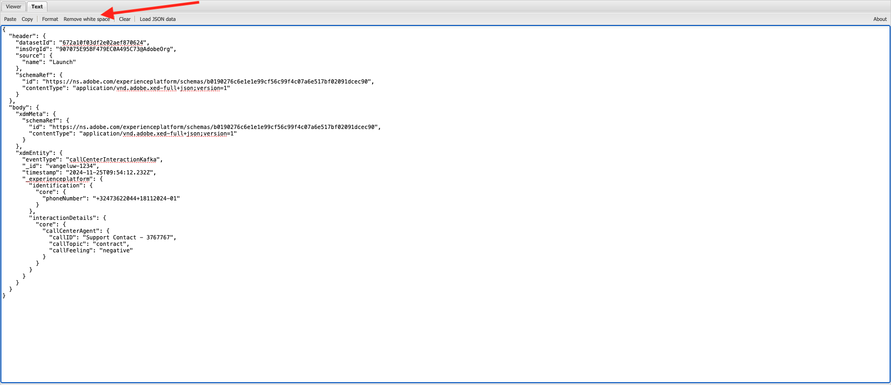
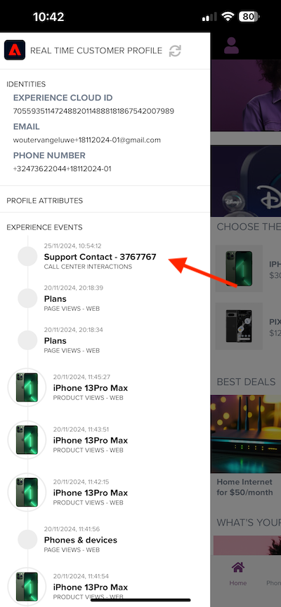

# 2.6.4 Instalar y configurar Kafka Connect y el conector del receptor de Adobe Experience Platform

## 2.6.4.1 Descargar el conector del receptor de Adobe Experience Platform

Vaya a [https://github.com/adobe/experience-platform-streaming-connect/releases](https://github.com/adobe/experience-platform-streaming-connect/releases) y descargue la última versión oficial del conector del receptor de Adobe Experience Platform.


Coloque el archivo de descarga **streaming-connect-sink-0.0.14-java-11.jar** en el escritorio.


## 2.6.4.2 Configuración de Kafka Connect

Vaya a la carpeta del escritorio **Kafka_AEP** y luego a la carpeta `kafka_2.13-3.1.0/config`.
En esa carpeta, abra el archivo **connect-distributed.properties** con cualquier Editor de texto.


En el Editor de texto, vaya a las líneas 34 y 35 y asegúrese de establecer los campos `key.converter.schemas.enable` y `value.converter.schemas.enable` en `false`

```json
key.converter.schemas.enable=false
value.converter.schemas.enable=false
```

Guarde los cambios en este archivo.


A continuación, vuelva a la carpeta `kafka_2.13-3.1.0`, cree manualmente una nueva carpeta y asígnele el nombre `connectors`.


Haga clic con el botón derecho en la carpeta y haga clic en **Nuevo terminal en la carpeta**.


Entonces verá esto... Escriba el comando `pwd` para recuperar la ruta de acceso completa de esa carpeta. Seleccione la ruta completa y cópiela en el portapapeles.


Vuelva al Editor de texto, al archivo **connect-distributed.properties** y desplácese hacia abajo hasta la última línea (línea 86 de la captura de pantalla). Debe quitar los comentarios de la línea que comienza por `# plugin.path=` y pegar la ruta de acceso completa en la carpeta denominada `connectors`. El resultado debería ser similar al siguiente:

`plugin.path=/Users/woutervangeluwe/Desktop/Kafka_AEP/kafka_2.13-3.1.0/connectors`

Guarde los cambios en el archivo **connect-distributed.properties** y cierre el Editor de texto.


A continuación, copie la última versión oficial del conector del receptor de Adobe Experience Platform que descargó en la carpeta `connectors`. El archivo que descargó anteriormente se llama **streaming-connect-sink-0.0.14-java-11.jar**, simplemente puede moverlo a la carpeta `connectors`.


A continuación, abre una nueva ventana de terminal al nivel de la carpeta **kafka_2.13-3.1.0**. Haga clic con el botón secundario en esa carpeta y haga clic en **Nuevo terminal en la carpeta**.

En la ventana Terminal, pegue este comando: `bin/connect-distributed.sh config/connect-distributed.properties` y haga clic en **Entrar**. Este comando inicia Kafka Connect y carga la biblioteca del conector del receptor de Adobe Experience Platform.


Después de un par de segundos, verá algo así:


## 2.6.4.3 Crear el conector del receptor de Adobe Experience Platform mediante Postman

Ahora puede interactuar con Kafka Connect mediante Postman. Para ello, descargue [esta colección de Postman](./../../../assets/postman/postman_kafka.zip) y descomprima la colección en el equipo local del equipo de escritorio. Luego tendrá un archivo que se llama `Kafka_AEP.postman_collection.json`.


Debe importar este archivo en Postman. Para ello, abra Postman, haga clic en **Importar**, arrastre y suelte el archivo `Kafka_AEP.postman_collection.json` en la ventana emergente y haga clic en **Importar**.


A continuación, encontrará esta colección en el menú izquierdo de Postman. GET Haga clic en la primera solicitud, **Conectores Kafka Connect disponibles** para abrirla.


Entonces verá esto... Haga clic en el botón azul **Enviar**, después del cual debería ver una respuesta vacía `[]`. La respuesta vacía se debe al hecho de que no hay conectores de Kafka Connect definidos actualmente.


Para crear un conector, haga clic en para abrir la segunda solicitud de la colección Kafka, **POST Crear conector de receptor de AEP**. Entonces verá esto... En la línea 11, donde dice **&quot;aep.endpoint&quot;: &quot;&quot;**, debe pegar en la URL de extremo de flujo de API HTTP que recibió al final del ejercicio [15.3](./ex3.md). La dirección URL del extremo de flujo HTTP API tiene el siguiente aspecto: `https://dcs.adobedc.net/collection/d282bbfc8a540321341576275a8d052e9dc4ea80625dd9a5fe5b02397cfd80dc`.


Después de pegarlo, el cuerpo de la solicitud debe tener este aspecto. Haga clic en el botón azul **Enviar** para crear el conector. Obtendrá una respuesta inmediata de la creación del conector.


GET Haga clic en la primera solicitud, **Conectores Kafka Connect disponibles** para abrirlo de nuevo y haga clic de nuevo en el botón azul **Enviar**. ahora verá que se ha creado un conector de Kafka Connect.


GET A continuación, abra la tercera solicitud de la colección Kafka, **Comprobar el estado del conector Kafka Connect**. Haga clic en el botón azul **Enviar** y obtendrá una respuesta como la que se muestra a continuación, que indica que el conector se está ejecutando.


## 2.6.4.4 Producir un evento de experiencia

Abra una nueva ventana de **Terminal** haciendo clic con el botón derecho en la carpeta **kafka_2.13-3.1.0** y luego en **Nuevo terminal en la carpeta**.


Introduzca el siguiente comando:

`bin/kafka-console-producer.sh --broker-list 127.0.0.1:9092 --topic aep`


Entonces verá esto... Cada nueva línea seguida de presionar el botón Entrar dará como resultado que se envíe un nuevo mensaje al tema **aep**.


Ahora puede enviar un mensaje, que hará que Adobe Experience Platform Sink Connector lo consuma y que se incorporará a Adobe Experience Platform en tiempo real.

Hagamos una pequeña demostración para probar esto.

Vaya a [https://builder.adobedemo.com/projects](https://builder.adobedemo.com/projects). Después de iniciar sesión con su Adobe ID, verá esto. Haga clic en el proyecto del sitio web para abrirlo.


En la página **Screens**, haga clic en **Ejecutar**.


A continuación, verá cómo se abre el sitio web de demostración. Seleccione la URL y cópiela en el portapapeles.


Abra una nueva ventana del explorador de incógnito.


Pegue la dirección URL del sitio web de demostración, que copió en el paso anterior. Luego se le pedirá que inicie sesión con su Adobe ID.


Seleccione el tipo de cuenta y complete el proceso de inicio de sesión.


Luego verá el sitio web cargado en una ventana de incógnito del explorador. Para cada demostración, deberá utilizar una ventana nueva del explorador de incógnito para cargar la URL del sitio web de demostración.


Haga clic en el Adobe del logotipo situado en la esquina superior izquierda de la pantalla para abrir el Visor de perfiles.


Eche un vistazo al panel Visor de perfiles y al Perfil del cliente en tiempo real con el **ID de Experience Cloud** como identificador principal de este cliente actualmente desconocido.


Vaya a la página Registrar/Iniciar sesión. Haga clic en **CREAR UNA CUENTA**.


Complete sus detalles y haga clic en **Registrarse** después de lo cual se le redirigirá a la página anterior.


Abra el panel Visualizador de perfiles y vaya a Perfil del cliente en tiempo real. En el panel Visor de perfiles, debería ver todos los datos personales que se muestran, como los identificadores de correo electrónico y teléfono que acaba de agregar.


Es posible que vea algunos eventos de experiencia basados en actividades anteriores.


Cambiemos eso y enviemos un evento de experiencia Callcenter de Kafka a Adobe Experience Platform.

Tome la siguiente carga útil de evento de experiencia de ejemplo y cópiela en un editor de texto.

```json
{
  "header": {
    "datasetId": "61fe23fd242870194a6d779c",
    "imsOrgId": "--aepImsOrgID--",
    "source": {
      "name": "Launch"
    },
    "schemaRef": {
      "id": "https://ns.adobe.com/experienceplatform/schemas/b0190276c6e1e1e99cf56c99f4c07a6e517bf02091dcec90",
      "contentType": "application/vnd.adobe.xed-full+json;version=1"
    }
  },
  "body": {
    "xdmMeta": {
      "schemaRef": {
        "id": "https://ns.adobe.com/experienceplatform/schemas/b0190276c6e1e1e99cf56c99f4c07a6e517bf02091dcec90",
        "contentType": "application/vnd.adobe.xed-full+json;version=1"
      }
    },
    "xdmEntity": {
      "eventType": "callCenterInteractionKafka",
      "_id": "",
      "timestamp": "2022-02-23T09:54:12.232Z",
      "_experienceplatform": {
        "identification": {
          "core": {
            "phoneNumber": ""
          }
        },
        "interactionDetails": {
          "core": {
            "callCenterAgent": {
              "callID": "Support Contact - 3767767",
              "callTopic": "contract",
              "callFeeling": "negative"
            }
          }
        }
      }
    }
  }
}
```

Entonces verá esto... Debe actualizar manualmente dos campos:

- **_id**: configúrelo en un id aleatorio, algo así como `--aepUserLdap--1234`
- **marca de tiempo**: actualice la marca de tiempo a la fecha y hora actuales
- **phoneNumber**: escribe el número de teléfono de la cuenta que se acaba de crear en el sitio web de demostración. Puede encontrarlo en el panel Visor de perfiles, en **Identidades**.

También debe comprobar y actualizar estos campos:
- **datasetId**: debe copiar el ID del conjunto de datos para el conjunto de datos Sistema de demostración - Conjunto de datos de evento para el centro de llamadas (Global v1.1)
- **imsOrgID**: su ID de organización de IMS es `--aepImsOrgId--`

>[!NOTE]
>
>El campo **_id** debe ser único para cada ingesta de datos. Si genera varios eventos, asegúrese de actualizar el campo **_id** cada vez a un nuevo valor único.


Entonces debería tener algo así:


A continuación, copie el evento de experiencia completo en el portapapeles. El espacio en blanco de su carga útil JSON debe eliminarse y utilizaremos una herramienta en línea para hacerlo. Vaya a [http://jsonviewer.stack.hu/](http://jsonviewer.stack.hu/) para hacerlo.


Pegue el evento de experiencia en el editor y haga clic en **Eliminar espacio en blanco**.



A continuación, seleccione todo el texto de salida y cópielo en el portapapeles.


Vuelva a la ventana de terminal.


Pegue la nueva carga útil sin espacios en blanco en la ventana Terminal y haga clic en **Introducir**.


A continuación, vuelva al sitio web de demostración y actualice la página. Ahora debería ver un evento de experiencia en su perfil, en **Otros eventos**, igual que el de abajo:



>[!NOTE]
>
>Si desea que las interacciones del centro de llamadas aparezcan en el panel Visor de perfiles, debe agregar la etiqueta y el filtro siguientes en su proyecto de [https://builder.adobedemo.com/projects](https://builder.adobedemo.com/projects), en la pestaña **Visor de perfiles**.


Ha terminado este ejercicio.

Paso siguiente: [Resumen y beneficios](./summary.md)

[Volver al módulo 2.6](./aep-apache-kafka.md)

[Volver a todos los módulos](../../../overview.md)
