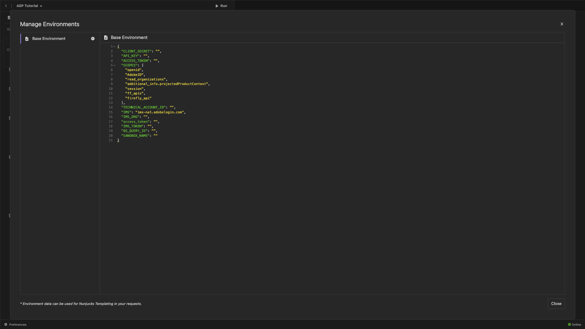

# PostBuster

>[!IMPORTANT]
>
>Las siguientes instrucciones están destinadas únicamente a empleados de Adobe.

## Instalar PostBuster

Vaya a [https://adobe.service-now.com/esc?id=adb_esc_kb_article&amp;sysparm_article=KB0020542](https://adobe.service-now.com/esc?id=adb_esc_kb_article&amp;sysparm_article=KB0020542).

Haga clic para descargar la última versión de **PostBuster**.


Descargue la versión correcta para su sistema operativo.


Una vez que la descarga haya finalizado y se haya instalado, abra PostBuster. Entonces debería ver esto. Haga clic en **Importar**.


Descargue [postbuster.json.zip](./assets/postman/postbuster.json.zip) y extráigalo en su escritorio.


Haga clic en **Elegir un archivo**.


Seleccione el archivo **postbuster.json**. Haga clic en **Abrir**.


Entonces debería ver esto. Haga clic en **Analizar**.


Haga clic en **Importar**.


Entonces debería ver esto. Haga clic en para abrir la colección importada.


Ahora verá su colección. Aún debe configurar un entorno para mantener algunas variables de entorno.


Haga clic en **Entorno base** y luego haga clic en el icono **editar**.


Entonces debería ver esto.



Copie el siguiente marcador de posición de entorno y péguelo en el **Entorno base**.

```json
{
	"CLIENT_SECRET": "",
	"API_KEY": "",
	"ACCESS_TOKEN": "",
	"SCOPES": [
		"openid",
		"AdobeID",
		"ff_apis",
		"firefly_api"
	],
	"TECHNICAL_ACCOUNT_ID": "",
	"IMS": "ims-na1.adobelogin.com",
	"IMS_ORG": "",
	"access_token": "",
	"IMS_TOKEN": "",
	"AZURE_STORAGE_URL": "",
	"AZURE_STORAGE_CONTAINER": "",
	"AZURE_STORAGE_SAS_READ": "",
	"AZURE_STORAGE_SAS_WRITE": ""
}
```

Entonces deberías tener esto.


Después de pasar por el módulo **Servicios de Firefly**, su entorno debería tener este aspecto. No es necesario que haga esto ahora, ya que se abordará en una fase posterior.


>[!NOTE]
>
>{width="50px" align="left"}
>
>Si tiene preguntas, desea compartir comentarios generales o tiene sugerencias sobre contenido futuro, póngase en contacto directamente con Tech Insiders, enviando un correo electrónico a **techinsiders@adobe.com**.

[Volver a todos los módulos](./overview.md)
