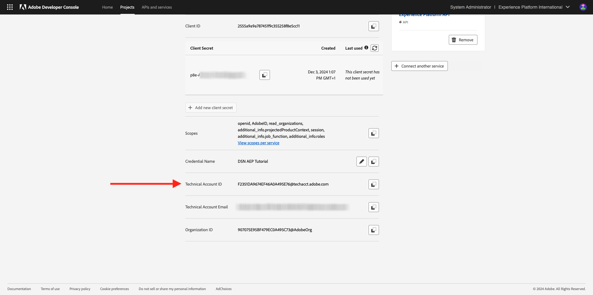
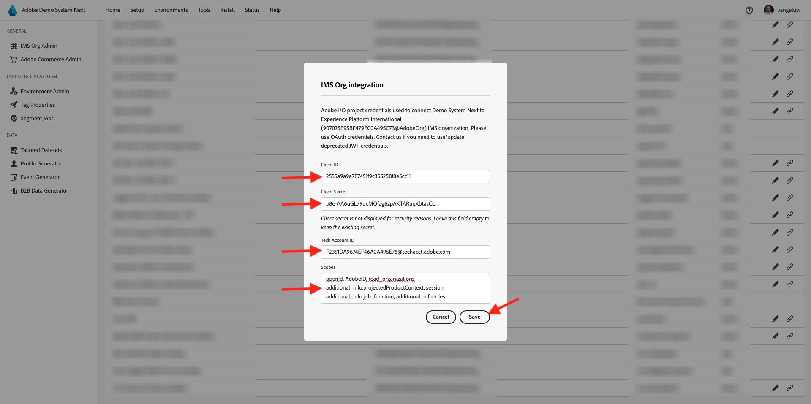
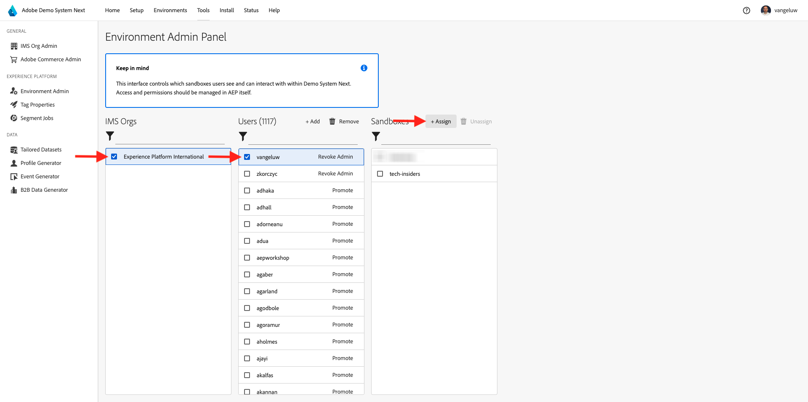
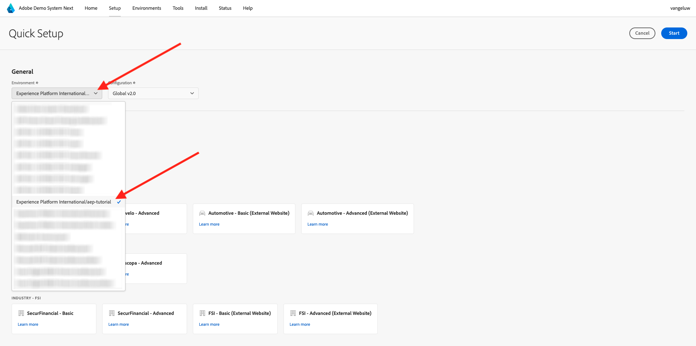

# Configuración

>[!IMPORTANT]
>
>Esta página está destinada únicamente a funciones de administrador del sistema. Necesita derechos de acceso de administrador del sistema para la instancia específica para poder seguir los pasos siguientes. Si no es administrador del sistema en su organización de Adobe Experience Cloud, póngase en contacto con el administrador del sistema y solicite su aprobación y ayuda antes de continuar con cualquiera de los pasos siguientes.

## Información general

Para utilizar todos estos tutoriales de forma práctica, es necesario aprovisionar las siguientes aplicaciones de Adobe Experience Cloud en su organización de IMS:

- Adobe de CDP en tiempo real
- Recopilación de datos de Adobe Experience Platform
- Adobe Journey Optimizer
- Customer Journey Analytics
- Data Distiller
- Composición de público federado

Si no se proporciona un servicio de aplicación específico para su organización de IMS, no podrá realizar ese ejercicio específico de forma práctica.

## Crear zona protegida

Para consultar el tutorial en su propia instancia de AEP, es aconsejable configurar primero una nueva zona protegida de desarrollo. Para crear una nueva zona protegida, ve a [https://experience.adobe.com/platform](https://experience.adobe.com/platform), ve a Zonas protegidas y, a continuación, ve a **Examinar**. Haga clic en **Crear zona protegida**.

Cree su zona protegida de esta manera:

- Tipo: **Desarrollo**
- Nombre: **aep-tutorial**
- Título: **Tutorial de AEP**

Haga clic en **Crear**.

Se creará ahora su zona protegida. Después de un par de minutos verás esto.

## Permisos de configuración

Vaya a **Permisos** y luego a **Roles**.

Haga clic para abrir el **Rol** específico que utilizarán los alumnos que pasarán por este tutorial. Haga clic en **Crear rol**.

Asigne un nombre a su función, como **Tutorial de AEP**, haga clic en **Confirmar**.

En el menú desplegable **Zonas protegidas**, seleccione la zona protegida que acaba de crear y asegúrese de quitar cualquier otra (también quite **Producto**).

Añada los distintos recursos y establezca los permisos. Asegúrese de no agregar permisos para **Administración de espacio aislado**.

Añada más recursos como se indica y establezca permisos.

Añada más recursos como se indica y establezca permisos. Haga clic en **Guardar**. A continuación, haga clic en **Cerrar**.

## Adobe I/O de configuración

Ir a
[https://developer.adobe.com/console/integrations](https://developer.adobe.com/console/integrations). Asegúrese de que está en la instancia correcta. Haga clic en **Crear nuevo proyecto**.

Haga clic en **+ Agregar al proyecto** y, a continuación, haga clic en **API**.

Haga clic en **Adobe Experience Platform** y, a continuación, habilite la **API de Experience Platform**. Haga clic en **Next**.

Para el **nombre de credencial**, use **Tutorial de DSN AEP**. Haga clic en **Next**.

Seleccione uno de los perfiles de producto disponibles. Este perfil de producto no determina los permisos para este proyecto de Adobe I/O. Esto se hará en el siguiente paso. Haga clic en **Guardar API configurada**.

Haga clic en **+ Agregar al proyecto** y, a continuación, haga clic de nuevo en **API**.

Haga clic en **Adobe Experience Platform** y, a continuación, habilite la **API de Experience Platform Launch**. Haga clic en **Next**.

Haga clic en **Next**.

Seleccione un perfil de producto que permita crear y administrar propiedades de recopilación de datos. Haga clic en **Guardar API configurada**.

Entonces verá esto... Haga clic en el nombre actual de **Proyecto XXX**.

Haga clic en **Editar proyecto**.

Escriba un nuevo **Título del proyecto**, como **Tutorial de DSN AEP**. Haga clic en **Guardar**.

El proyecto de Adobe I/O ya está listo.

## Vincular proyecto de Adobe I/O a función

Vaya a **Permisos**, a **Roles** y, a continuación, haga clic en el nuevo rol que creó anteriormente.

Ir a **credenciales de API**. Haga clic en **+ Agregar credenciales de API**.

A continuación, verá la credencial de Adobe I/O que creó en el paso anterior. Selecciónelo y haga clic en **Guardar**.

El proyecto de Adobe I/O ahora está configurado con los permisos necesarios para acceder a las API de Adobe Experience Platform.

>[!IMPORTANT]
>
>Debe esperar un mínimo de 10 minutos antes de continuar con los siguientes pasos en Sistema de demostración Siguiente.

## Configure su entorno en Demo System Siguiente

Vaya a [https://dsn.adobe.com/tools/org-admin](https://dsn.adobe.com/tools/org-admin). Haga clic en **+ Agregar organización**.

Rellene los campos obligatorios:

- ID de organización IMS
- Nombre
- ID de inquilino (no incluir **guion bajo**)
- Región

El administrador del sistema debe poder ayudarle con los valores de estos campos.

Haga clic en **Guardar**.

Su entorno ahora formará parte de la lista. Búscalo en la lista y haz clic en el icono **link**.

Ahora debe introducir los valores que ha creado como parte de las credenciales de su proyecto de Adobe I/O. Puedes encontrar **ID de cliente**, **Secreto de cliente** y **Ámbitos** aquí:

**Id. de cuenta técnica**:

Copie y pegue estos aquí; haga clic en **Guardar**.

El entorno DSN ahora está configurado correctamente.

## Configure su acceso al entorno DSN

Vaya a [https://dsn.adobe.com/tools/environment-admin](https://dsn.adobe.com/tools/environment-admin). Seleccione la organización de IMS que acaba de crear, seleccione su usuario y, a continuación, haga clic en **+ Asignar** en **Zonas protegidas**.

Escriba el **Nombre de espacio aislado** que definió en el primer paso anterior. Debería tener un aspecto similar al siguiente:

- Nombre: **aep-tutorial**

Haga clic en **Confirmar**.

La zona protegida ya está disponible para el usuario seleccionado.

## Configuración rápida de DSN

Vaya a [https://dsn.adobe.com/quick-setup](https://dsn.adobe.com/quick-setup). Abra el menú desplegable **Entorno** y seleccione su organización/zona protegida de IMS.

Para **Configuración**, seleccione **Global v2.0**.

Desplácese hacia abajo hasta **Industria - Telco** y seleccione **Señal Citi - Avanzada**.

Desplácese hacia arriba y haga clic en **Iniciar**.

Escriba un **Título** y haga clic en **Iniciar**.

>[!NOTE]
>
>Puede obtener errores en caso de que no se haya creado ninguna política de combinación predeterminada en la zona protegida. En ese caso, espere un poco más para que la política de combinación se cree automáticamente o vaya manualmente a Adobe Experience Platform, a Perfiles > Políticas de combinación y cree una nueva política de combinación predeterminada.

A continuación, verá el progreso de la instalación en curso, que tardará un par de minutos.

Una vez que todo esté completado correctamente, la instancia de AEP se ha configurado correctamente y está lista para que los alumnos realicen el tutorial.

>[!NOTE]
>
>El paso Importación de datos no se utiliza en el tutorial, por lo que si ese paso falla, no se preocupe y continúe.

Vaya a [https://experience.adobe.com/platform](https://experience.adobe.com/platform), para **Conjuntos de datos**. Ahora debería ver una lista similar de conjuntos de datos, todos creados por la Configuración rápida de DSN.

>[!NOTE]
>
>Gracias por dedicar su tiempo a aprender todo lo que necesita saber sobre Adobe Experience Platform y sus aplicaciones. Si tiene preguntas, desea compartir comentarios generales o tiene sugerencias sobre contenido futuro, póngase en contacto directamente con Tech Insiders, enviando un correo electrónico a **techinsiders@adobe.com**.

[Volver a todos los módulos](./overview.md)