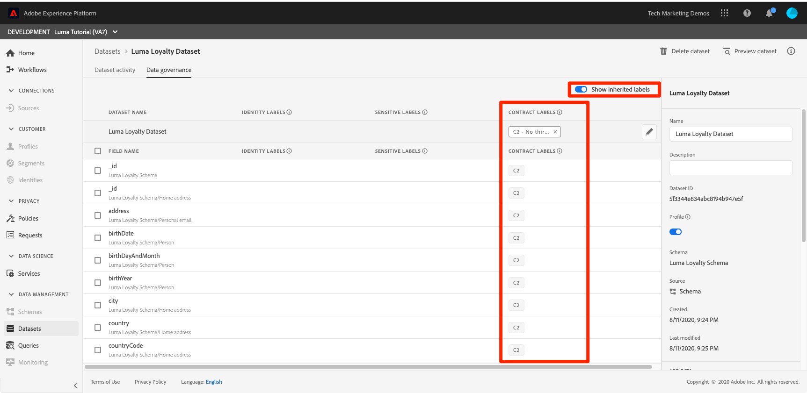

# Aplicar el marco de control de datos

<!--15min-->

En esta lección, aplicará el marco de control de datos a los datos que haya introducido en el entorno limitado.

La administración de datos de Adobe Experience Platform le permite administrar los datos de los clientes y garantizar el cumplimiento de las regulaciones, restricciones y políticas aplicables al uso de los datos. Desempeña un papel clave dentro del Experience Platform en varios niveles, incluido el control del uso de los datos.

Antes de comenzar los ejercicios, vea estos breves vídeos sobre el control de datos:
>[!VIDEO](https://video.tv.adobe.com/v/36653?quality=12&learn=on)

>[!VIDEO](https://video.tv.adobe.com/v/29708?quality=12&learn=on)

<!--
## Permissions required

In the [Configure Permissions](configure-permissions.md) lesson, you set up all the access controls required to complete this lesson, specifically:

* Permission items **[!UICONTROL Data Governance]** > **[!UICONTROL Manage Usage Labels]**, **[!UICONTROL Manage Data Usage Policies]** and **[!UICONTROL View Data Usage Policies]**
* Permission items **[!UICONTROL Data Management]** > **[!UICONTROL View Datasets]** and **[!UICONTROL Manage Datasets]**
* Permission item **[!UICONTROL Sandboxes]** > `Luma Tutorial`
* User-role access to the `Luma Tutorial Platform` Product Profile
-->

## Escenario empresarial

Luma promete a los miembros de su programa de fidelidad que los datos de fidelidad no se compartirán con terceros. Implementaremos este escenario en el resto de la lección.

## Aplicar etiquetas de control de datos

El primer paso en el proceso de control de datos es aplicar etiquetas de control a los datos. Antes de hacerlo, echemos un vistazo a las etiquetas disponibles:

1. En la interfaz de usuario de Platform, seleccione **[!UICONTROL Políticas]** en la navegación izquierda
1. Vaya a la **[!UICONTROL Etiquetas]** para ver todas las etiquetas de la cuenta.

Existen muchas etiquetas listas para usar, además de que puede crear las suyas a través del [!UICONTROL Crear etiqueta] botón. Existen tres tipos principales: [!UICONTROL Etiquetas de contrato], [!UICONTROL Etiquetas de identidad]y [!UICONTROL Etiquetas confidenciales] que se corresponden con motivos comunes por los que los datos podrían estar restringidos. Cada una de las etiquetas tiene un [!UICONTROL Nombre reconocible] y [!UICONTROL Nombre] que es solo una abreviatura del tipo y un número. Por ejemplo, la variable [!DNL C1] es para &quot;Sin exportación de terceros&quot;, que es lo que necesitamos para nuestra política de lealtad.

Ahora es el momento de etiquetar los datos cuyo uso queremos restringir:

1. En la interfaz de usuario de Platform, seleccione **[!UICONTROL Conjuntos de datos]** en la navegación izquierda
1. Abra el `Luma Loyalty Dataset`
1. Vaya a la **[!UICONTROL Administración de datos]** ficha
1. Puede aplicar etiquetas a campos individuales o a todo el conjunto de datos. Aplicaremos la etiqueta a todo el conjunto de datos. Haga clic en el icono de lápiz. Si no ve el icono, intente ampliar el navegador o desplácese hacia la derecha por el panel central.
   
1. En el modal, expanda el **[!UICONTROL Etiquetas de contrato]** y marque **[!UICONTROL C2]** label
1. Seleccione el **[!UICONTROL Guardar cambios]** botón
   
1. Volver al principal [!UICONTROL Administración de datos] con la función **[!UICONTROL Mostrar etiquetas heredadas]** si lo activa, puede ver cómo se ha aplicado la etiqueta a todos los campos del conjunto de datos.
   

<!--adding extra, unnecessary fields from field groups makes it harder to see which fields really need labels-->
<!--Are there any best practices for applying governance labels-->

## Crear políticas de control de datos

Ahora que nuestros datos están etiquetados, podemos crear una política.

1. En la interfaz de usuario de Platform, seleccione **[!UICONTROL Políticas]** en la navegación izquierda
1. En la pestaña Examinar, ya hay una directiva predeterminada llamada &quot;restricción de exportación de terceros&quot; que asocia la etiqueta C2 con la acción de marketing [!UICONTROL Exportar a terceros]—exactamente lo que necesitamos!
1. Seleccione la directiva y, a continuación, actívela mediante el **[!UICONTROL Estado de la política]** alternar
   

Puede crear sus propias directivas seleccionando la **[!UICONTROL Crear directiva]** botón. Esto abre un asistente que le permite combinar varias etiquetas y restricciones de acciones de marketing.

## Aplicar políticas de gobernanza

La aplicación de las políticas de gobernanza es obviamente un componente clave del marco. La aplicación se realiza de forma descendente cuando los datos se activan y se envían fuera de Platform, especialmente con Real-time Customer Data Platform, del que es posible que tenga o no licencia. De cualquier manera, está fuera del ámbito de este tutorial. Pero para que no se queden ahorcados, pueden aprender más sobre cómo se aplican las políticas en este video, que he puesto en cola hasta la parte relevante. También muestra lo que sucede cuando se infringe una política.

>[!VIDEO](https://video.tv.adobe.com/v/33631/?t=151&quality=12&learn=on)

## Recursos adicionales

* [Documentación de control de datos](https://experienceleague.adobe.com/docs/experience-platform/data-governance/home.html?lang=es)
* [Referencia de la API del servicio de conjunto de datos](https://www.adobe.io/experience-platform-apis/references/dataset-service/)
* [Referencia de la API del servicio de políticas de gobernanza](https://www.adobe.io/experience-platform-apis/references/policy-service/)

Ahora pasemos a [servicio de consultas](run-queries.md).
