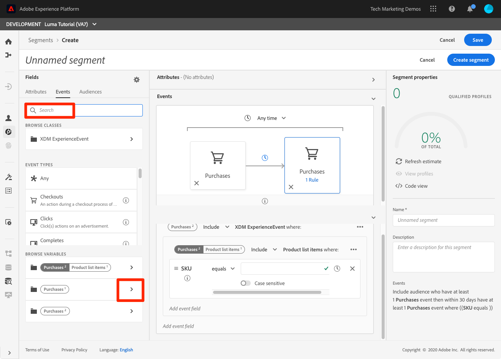

# Generación de segmentos

<!-- 30 min-->
En esta lección, generaremos algunos segmentos basados en los datos de perfil que ingerimos en las lecciones anteriores.

Una vez que tenga Perfiles de clientes en tiempo real, puede crear segmentos de individuos que compartan características similares y que puedan responder de manera similar a las estrategias de marketing. Los componentes básicos de estos segmentos son los campos XDM que ha creado anteriormente.

**Los arquitectos de datos** deberán crear segmentos fuera de este tutorial y ayudar a sus colegas con esta tarea.

Antes de comenzar los ejercicios, vea este breve vídeo para obtener más información sobre la creación de segmentos:
>[!VIDEO](https://video.tv.adobe.com/v/27254?learn=on&enablevpops)

## Permisos necesarios

En la lección [Configurar permisos](configure-permissions.md), ha configurado todos los controles de acceso necesarios para completar esta lección, en concreto:

* Elementos de permiso **[!UICONTROL Administración de perfiles]** > **[!UICONTROL Administrar segmentos]**, **[!UICONTROL Ver segmentos]** y **[!UICONTROL Exportar segmento de audiencia]**
* Elementos de permiso **[!UICONTROL Administración de perfiles]** > **[!UICONTROL Ver perfiles]** y **[!UICONTROL Administrar perfiles]**
* Elemento de permiso **[!UICONTROL Zonas protegidas]** > `Luma Tutorial`
* Acceso de función de usuario al perfil de producto `Luma Tutorial Platform`
* Acceso con función de desarrollador al perfil de producto `Luma Tutorial Platform` (para API)

## Crear un segmento básico

Vamos a crear un segmento simple para los clientes del programa de fidelidad con un estado oro o platino

1. En la interfaz de usuario de Platform, vaya a **[!UICONTROL Segmentos]** en el panel de navegación izquierdo
1. Seleccione el botón **[!UICONTROL Crear segmento]**
1. A la izquierda del generador de esquemas hay tres pestañas para Atributos (Datos de registro), Eventos (Datos de series temporales) y Audiencias
1. Seleccione el icono de engranaje para anotar cómo el generador de segmentos muestra solo los campos con datos de forma predeterminada y le permite cambiar la política de combinación
1. En la pestaña Atributos, vaya a la carpeta **XDM Individual Profile > Loyalty** (también puede buscar &quot;lealtad&quot;)
1. Arrastre y suelte `Tier` del menú de campos de atributos al lienzo del generador de segmentos
1. Seleccionar `Tier` es igual a `Gold` o `Platinum`
1. Seleccione **[!UICONTROL Actualizar estimación]** para ver cuántos perfiles cumplen los requisitos para su segmento
1. Como **[!UICONTROL Nombre]**, escriba `Luma customers with level Gold or Above`
1. Seleccionar **[!UICONTROL Guardar]**
   

<!--## Build a sequential segment-->

## Creación de un segmento dinámico

En este ejercicio, crearemos un segmento para los clientes que hayan comprado el mismo producto dos veces en un plazo de 30 días. Los segmentos dinámicos le permiten escalar la segmentación utilizando campos como variables.

1. Vaya a **[!UICONTROL Segmentos]** en el panel de navegación izquierdo
1. Seleccione el botón **[!UICONTROL Crear segmento]**
1. Seleccione la ficha **[!UICONTROL Eventos]**
1. Filtrar la lista a `purchases`
1. Arrastre el tipo de evento **[!UICONTROL Compras]** al lienzo _dos veces diferentes_
1. Seleccione el icono de reloj entre los dos eventos **[!UICONTROL Purchases]** y elija &quot;en un plazo de 30 días&quot;
1. Confirme que su definición de segmento en este momento dice **&quot;Incluir audiencia que tenga al menos 1 evento de Compras y luego dentro de 30 días tenga al menos 1 evento de Compras&quot;**
   
1. Ahora cambie el filtro de eventos a `sku`
1. Arrastre el campo SKU al segundo evento de compra
   
1. Ahora, borre el filtro de eventos
1. Debería ver que en la sección **[!UICONTROL Examinar variables]** hay carpetas para los dos eventos de compra. Haga clic para explorar **[!UICONTROL Compras 1]**\
   
1. Desglose en la carpeta **[!UICONTROL Elementos de lista de productos]**, seleccione el campo **[!UICONTROL SKU]** y arrástrelo a la derecha del operando **[!UICONTROL es igual a]**. Cuando esté pasando el ratón por encima del área, suéltela en la sección &quot;Agregar para comparar operandos&quot;
1. Asigne un nombre al segmento `Bought same product within 30 days`
1. Confirme que su definición de audiencia es **&quot;Incluir audiencia que tenga al menos 1 evento de Compras y luego dentro de los 30 días tenga al menos 1 evento de Compras donde ((SKU equivale a Compras1 SKU))&quot;**
1. Seleccione el botón **[!UICONTROL Guardar]**

   

## Creación de un segmento de varias entidades

¿Recuerda cómo creamos la relación entre `Luma Offline Purchase Events Schema` y `Luma Product Catalog Schema` en lecciones anteriores? Lo hicimos para poder usar la relación en nuestro esquema usando segmentación de varias entidades.

Con la función avanzada de segmentación de varias entidades, puede crear segmentos utilizando varias clases XDM para ampliar los esquemas. Como resultado, el generador de segmentos puede acceder a campos adicionales como si fueran nativos del almacén de datos de perfil

Creará el siguiente segmento aplicando la relación que creó entre su `Luma Product Catalog Schema` y su `Luma Offline Purchase Events Schema`.

1. Vaya a **[!UICONTROL Segmentos]** en el panel de navegación izquierdo
1. Seleccione el botón **[!UICONTROL Crear segmento]**
1. Seleccione la ficha **[!UICONTROL Eventos]**
1. Filtrar la lista a `purchases`
1. Arrastre el tipo de evento **[!UICONTROL Purchases]** al lienzo
1. Seleccione el menú desplegable de reloj situado encima del evento y elija **[!UICONTROL en los últimos 30 días]**
1. Filtre la lista **[!UICONTROL Eventos]** a `category` y, a continuación, arrastre el campo **[!UICONTROL Categoría de producto]** a **[!UICONTROL Compras]**
1. Cambie el operador a **[!UICONTROL comienza con]** y escriba `men` en el cuadro de texto
1. Como **[!UICONTROL Nombre]**, escriba `Purchased a Men's product in the last 30 days`
1. Confirmar la definición de audiencia `(Include audience who have at least 1 Purchases event where ((Product Category starts with men)) ) and occurs in last 30 day(s)`
1. Seleccione el botón **[!UICONTROL Guardar]**

   

## Segmentación por lotes y streaming

Haga clic en **[!UICONTROL Segmentos]** en el panel de navegación izquierdo. Analicemos nuestros tres segmentos:

* Dos de nuestros segmentos son segmentos por lotes y uno es un segmento de flujo continuo.
* Platform usa la segmentación por secuencias siempre que es posible y califica al cliente para un segmento en cuanto cumple los criterios. Cuando las definiciones de segmentos son demasiado complejas para la transmisión, se convierten automáticamente en lote. En este caso, los dos segmentos tomaron por defecto el lote porque la ventana retrospectiva de los eventos de compra fue mayor de siete días. Para obtener una lista completa y actual de las limitaciones de transmisión, consulte [la documentación](https://experienceleague.adobe.com/docs/experience-platform/segmentation/ui/streaming-segmentation.html?lang=es).
* Los trabajos por lotes se ejecutan en una programación diaria, que se puede desactivar.

## Recursos adicionales

* [Documentación del servicio de segmentación](https://experienceleague.adobe.com/docs/experience-platform/segmentation/home.html?lang=es)
* [Referencia de API del servicio de segmentación](https://www.adobe.io/experience-platform-apis/references/segmentation/)

La segmentación ofrece más ventajas, especialmente con la activación de segmentos. Estos temas se tratarán en otro tutorial.

¡Lo has hecho a través de todos los ejercicios! Continúe con la [conclusión](conclusion.md).
