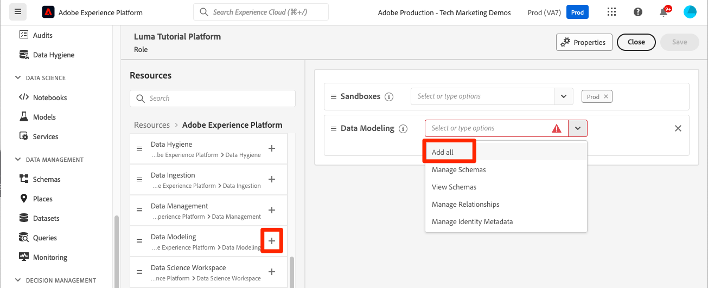
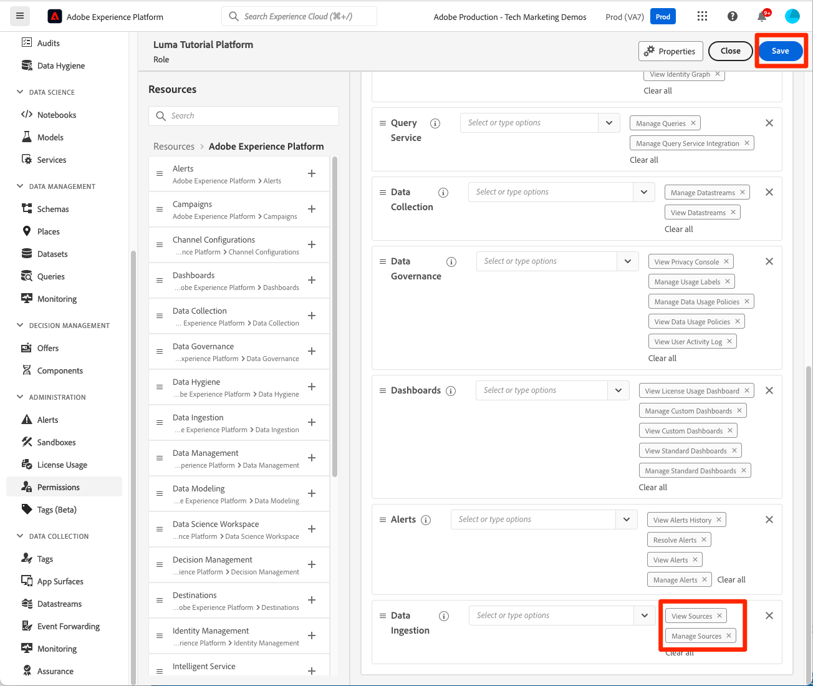

# Configure los permisos

<!--30min-->

En esta lección, debe configurar los permisos de usuario de Adobe Experience Platform mediante [!DNL Adobe's Admin Console] y el [!UICONTROL Permisos] en la interfaz de Platform.

El control de acceso es una función clave de privacidad en Experience Platform y se recomienda limitar los permisos al mínimo requerido para que las personas realicen sus funciones laborales. Consulte la [Documentación de control de acceso](https://experienceleague.adobe.com/docs/experience-platform/access-control/home.html?lang=es) para obtener más información.

Los arquitectos y los ingenieros de datos son usuarios avanzados de Adobe Experience Platform y necesitará muchos permisos para completar este tutorial y, posteriormente, su trabajo diario. Los arquitectos de datos probablemente participen en la administración de *otros usuarios de Platform* en su empresa, como especialistas en marketing, analistas y científicos de datos. A medida que complete esta lección, piense en cómo puede utilizar estas funciones para administrar otros usuarios de su compañía.

**Arquitectos de datos** a menudo, configure permisos para otros usuarios fuera de este tutorial.

>[!IMPORTANT]
>
>Un administrador del sistema de productos de Adobe Experience Cloud debe completar algunos de los pasos de esta lección, que se indican en los encabezados de sección. Si no es administrador del sistema, póngase en contacto con uno de sus empleados de la empresa y pídale que realice estas tareas. También hay una tarea que deben completar durante el [Configuración de Developer Console y Postman](set-up-developer-console-and-postman.md) lección.

## Acerca del Admin Console

El [!DNL Admin Console] es la interfaz utilizada para administrar el acceso de los usuarios a todos los productos de Adobe Experience Cloud. Para acceder a Platform, se debe añadir un usuario o un usuario en el Admin Console y, a continuación, todos sus elementos de permisos granulares se administran en la pantalla Permisos de Adobe Experience Platform.

Este es un breve resumen de las funciones que existen para Platform:

* **Usuarios** Los usuarios de un perfil de producto pueden completar tareas en la interfaz de usuario de Platform según los permisos asignados en el perfil de producto.
* **Desarrolladores** Puede crear credenciales y proyectos de API en la consola de Adobe Developer para empezar a utilizar la API de Experience Platform
* **Administradores de productos** Puede añadir usuarios y desarrolladores al producto Adobe Experience Platform en Adobe Admin Console, así como administrar el acceso granular de usuarios en la pantalla Permisos de la interfaz de Platform.
* **Administradores del sistema** Puede agregar administradores de productos y administrar esencialmente cualquier permiso para todos los productos de Adobe Experience Cloud.

## Añadir un usuario y un desarrollador a `AEP-Default-All-Users` perfil de producto (requiere un administrador del sistema o un administrador de productos)

En este ejercicio, usted, un administrador del sistema o un administrador de productos le añadirán como usuario y desarrollador al producto Adobe Experience Platform de Adobe Admin Console.

>[!NOTE]
>
>Si es administrador del sistema y ayuda a un compañero a seguir este tutorial, considere la posibilidad de añadir a su compañero como *Administrador de productos* para Adobe Experience Platform. Como administrador de productos, podría completar estos pasos por su cuenta y administrar a otros usuarios de Experience Platform en el futuro.

Para añadir al participante del tutorial como [!UICONTROL Usuario] y [!UICONTROL Desarrollador]:

1. Inicie sesión en [Adobe Admin Console](https://adminconsole.adobe.com)
1. Seleccionar **[!UICONTROL Productos]** en la barra de navegación superior
1. Seleccionar **Adobe Experience Platform**
   
1. Es posible que ya tenga varios perfiles en la instancia de Experience Platform. Seleccione el `AEP-Default-All-Users` perfil
   

1. Vaya a la **[!UICONTROL Usuarios]** pestaña
1. Seleccione el **[!UICONTROL Añadir usuario]** botón
   
1. Complete el flujo de trabajo para añadir al participante del tutorial como usuario al perfil del producto

1. Vaya a la **[!UICONTROL Desarrolladores]** pestaña
1. Seleccione el **[!UICONTROL Agregar desarrollador]** botón
   
1. Complete el flujo de trabajo para añadir al participante del tutorial como desarrollador al perfil del producto

## Agregar una función en Adobe Experience Platform (requiere un administrador del sistema o un administrador de productos)

Los permisos granulares para el Experience Platform se administran en la pantalla Permisos de la interfaz de Platform. Solo los administradores de sistemas y productos tienen acceso a esta pantalla, por lo que si no tiene privilegios de administrador, necesitará la asistencia de alguien que sí lo tenga.

Los permisos se administran en Funciones. Cree una función para el tutorial:

1. Iniciar sesión en [Adobe Experience Platform](https://platform.adobe.com)
1. Seleccionar **[!UICONTROL Permisos]** en la navegación de la izquierda, que le llevará a la [!UICONTROL Funciones] pantalla
1. Seleccionar **[!UICONTROL Crear función]**

   
1. Asigne un nombre a la función `Luma Tutorial Platform` (añada el nombre del participante del tutorial al final, si varias personas de su compañía están siguiendo este tutorial) y seleccione **[!UICONTROL Confirmar]**

   

1. Agregue todos los elementos de permiso para los siguientes recursos mediante  **[!UICONTROL +]** y **[!UICONTROL Añadir todo]**:

   1. Modelado de datos
   1. Administración de datos
   1. Administración de perfiles
   1. Administración de identidades
   1. Administración de zona protegida
   1. Servicio de consultas
   1. Recopilación de datos
   1. Control de datos
   1. Tableros
   1. Alertas

      

1. En Ingesta de datos, agregue los elementos de permiso Administrar fuentes y Ver fuentes.

1. Después de agregar todos los elementos de permiso, asegúrese de seleccionar el botón Guardar
   

Realizará algunas pequeñas actualizaciones en este rol después de la [Creación de una zona protegida](create-a-sandbox.md) y [Configuración de Developer Console y Postman](set-up-developer-console-and-postman.md) lecciones.

## Crear un perfil de producto de recopilación de datos (requiere un administrador del sistema o de productos)

En este ejercicio, usted o un administrador del sistema de su empresa crearán un perfil de producto para la recopilación de datos (anteriormente conocido como Adobe Experience Platform Launch) y lo añadirán como administrador de perfil de producto.

>[!NOTE]
>
>Si es administrador del sistema y ayuda a un compañero con este tutorial, considere la posibilidad de añadirlo como *Administrador de productos* para la recopilación de datos. Como administrador de productos, podrá completar estos pasos por su cuenta y administrar a otros usuarios de la recopilación de datos en el futuro.

Para crear el perfil de producto:

1. En el [!DNL Adobe Admin Console] vaya al producto Recopilación de datos de Adobe Experience Platform
1. Añada un nuevo perfil denominado `Luma Tutorial Data Collection` (añada el nombre del participante del tutorial al final, si varias personas de su compañía toman este tutorial).
1. Desactive la **[!UICONTROL Propiedades]** > **[!UICONTROL Inclusión automática]** configuración
1. No asignar propiedades ni permisos en este momento
1. Añadir el participante del tutorial como administrador de este perfil

Después de completar estos pasos, debería ver que las variables `Luma Tutorial Data Collection` el perfil se configura con un administrador.

## Configuración del perfil de producto de recopilación de datos

Ahora que es administrador de la `Luma Tutorial Data Collection` perfil de producto puede configurar los permisos y las funciones que necesitará para completar el tutorial.

### Adición de permisos

Ahora agregará los elementos de permiso individuales al perfil:

1. En el [Adobe Admin Console](https://adminconsole.adobe.com), vaya a **[!UICONTROL Productos]** > **[!UICONTROL Recopilación de datos]**
1. Abra el `Luma Tutorial Data Collection` perfil
1. Vaya a la **[!UICONTROL Permisos]** pestaña
1. Abrir **[!UICONTROL Plataformas]**
1. Asegúrese de que todas las plataformas disponibles estén seleccionadas (puede ver diferentes opciones según la licencia)
1. **[!UICONTROL Guardar]** cualquier cambio
   
1. Abrir **[!UICONTROL Propiedades]**
1. Asegúrese de que la **[!UICONTROL Inclusión automática]** la opción está desactivada para que no tenga acceso a ninguna propiedad (se agregará una más adelante)
1. **[!UICONTROL Guardar]** cualquier cambio
   
1. Abrir **[!UICONTROL Derechos de propiedad]**
1. Seleccionar **[!UICONTROL Añadir todo]** para agregar todos los permisos de propiedad
1. **[!UICONTROL Guardar]**
   
1. Abrir **[!UICONTROL Derechos de compañía]**
1. Añadir **[!UICONTROL Administrar propiedades]**
1. Seleccione **[!UICONTROL Guardar]**
   

### Añádase como usuario

Ahora añádase como usuario al perfil de recopilación de datos:

1. Vaya a la **[!UICONTROL Usuarios]** pestaña
1. Seleccione el **[!UICONTROL Añadir usuario]** botón
   
1. Complete el flujo de trabajo para añadirse como usuario al perfil del producto

No es necesario que se incorpore como desarrollador para la recopilación de datos.

Ahora tiene casi todos los permisos necesarios para completar el tutorial. Solo habrá dos ajustes más que harás dentro de la [!DNL Adobe Admin Console], incluido uno después de usted [crear una zona protegida](create-a-sandbox.md)!
