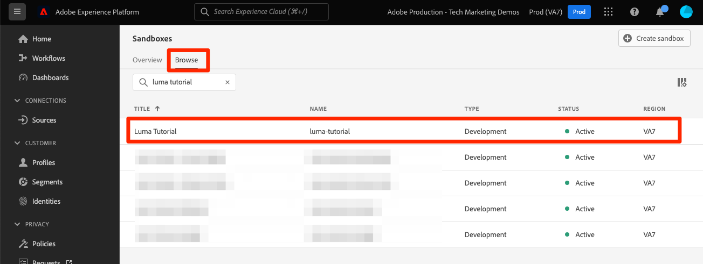

# Creación de un simulador de pruebas

<!--25min-->

En esta lección, debe crear un entorno limitado de desarrollo que utilizará para el resto del tutorial.

Los entornos limitados proporcionan entornos aislados en los que puede probar la funcionalidad sin mezclar recursos y datos con el entorno de producción. Para obtener más información, consulte la [documentación de entornos limitados](https://experienceleague.adobe.com/docs/experience-platform/sandbox/home.html?lang=es).

**Arquitectos de datos** y **Ingenieros de datos** deberá crear entornos limitados fuera de este tutorial.

Antes de comenzar los ejercicios, vea este breve vídeo para obtener más información sobre los entornos limitados:
>[!VIDEO](https://video.tv.adobe.com/v/29838/?quality=12&learn=on)

## Permisos necesarios

En el [Configuración de permisos](configure-permissions.md) , configure todos los controles de acceso necesarios para completar esta lección.

<!--
* Permission items **[!UICONTROL Sandbox Administration]** > **[!UICONTROL View Sandboxes]** and **[!UICONTROL Manage Sandboxes]**
* Permission item **[!UICONTROL Sandboxes]** > **[!UICONTROL Prod]**
* User-role access to the `Luma Tutorial Platform` product profile
* Admin-level access to the `Luma Tutorial Platform` product profile
-->

## Crear un Simulador para pruebas

Vamos a crear un simulador de pruebas:

1. Inicie sesión en el [Adobe Experience Platform](https://experience.adobe.com/platform) interfaz
1. Vaya a **[!UICONTROL Sandboxes]** en la navegación izquierda
1. Select **[!UICONTROL Crear entorno limitado]** en la parte superior derecha
   

1. Select **[!UICONTROL Desarrollo]** como el **[!UICONTROL Tipo]**
1. Asigne un nombre al simulador de pruebas `luma-tutorial` (considere añadir su nombre al final)
1. Título del tutorial `Luma Tutorial` (considere añadir su nombre al final)
1. Seleccione el botón **[!UICONTROL Crear]**
   
   >[!NOTE]
   >
   >Aunque puede utilizar valores arbitrarios para el nombre y el título del simulador de pruebas, se recomienda atenerse a los valores sugeridos, ya que nos referiremos a estas etiquetas a lo largo del tutorial. Si hay varias personas en su organización completando este tutorial, considere la posibilidad de agregar su nombre al final del título y el nombre del entorno limitado, por ejemplo luma-tutorial-ignatiusjreilly.

Los entornos limitados tardan aproximadamente 30 segundos en crearse, durante los cuales un[!UICONTROL Creación]Aparece el estado &quot;. Cuando el simulador de pruebas está completamente creado, se muestra como &quot;[!UICONTROL Activo]&quot;:

Espere hasta que el simulador de pruebas sea &quot;[!UICONTROL Activo]&quot; antes de continuar con el siguiente ejercicio.

## Agregar el nuevo simulador para pruebas al perfil del producto

Una vez que el simulador para pruebas está activo, debe incluirlo en el perfil del producto para utilizarlo. Para añadirlo a su perfil de producto:

1. En una pestaña de navegador independiente, inicie sesión en la [Admin Console](https://adminconsole.adobe.com)
1. Vaya a **[!UICONTROL Productos > Adobe Experience Platform]**
1. Abra el `Luma Tutorial Platform` perfil

   

1. Vaya a la **[!UICONTROL Permisos]** ficha

1. En el [!UICONTROL Sandboxes] fila, seleccionar **[!UICONTROL Editar]**

   

1. _Eliminar_ el **[!UICONTROL Prod]** entorno limitado que asignó al perfil originalmente
1. Seleccione el **[!UICONTROL +]** para agregar el nuevo `Luma Tutorial` simulador de pruebas a la columna derecha
1. Select **[!UICONTROL Guardar]** para guardar los permisos actualizados

   

1. Vuelva a la pestaña del explorador con el Experience Platform .
1. Vuelva a cargar la página (o presione Mayús y vuelva a cargarla) y, ahora, debería estar en el `Luma Tutorial` entorno limitado o debería aparecer en el menú desplegable del entorno limitado
1. Cambie a la `Luma Tutorial` sandbox si aún no está en él

   

Bueno, ha creado el simulador de pruebas y está listo para [Configuración de Developer Console y Postman](set-up-developer-console-and-postman.md)!
