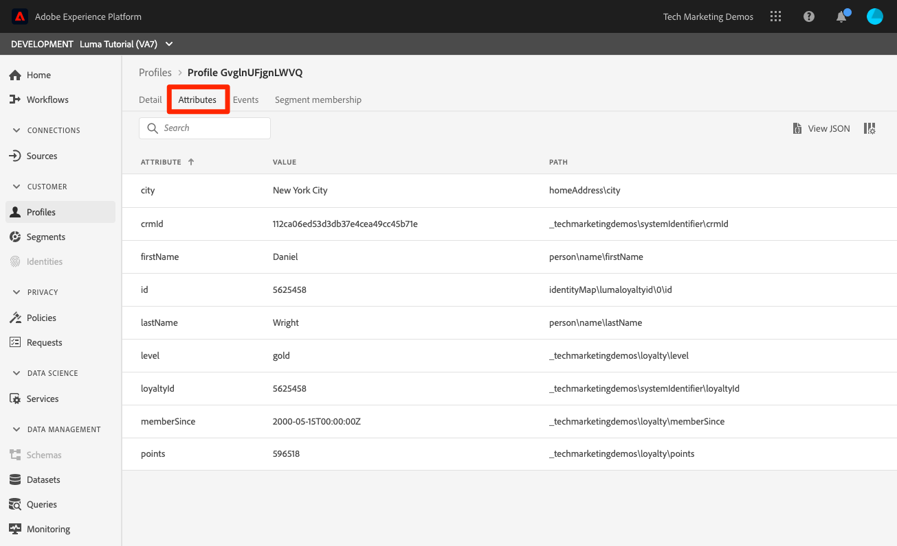

# Crear políticas de combinación

<!--20 min-->

En esta lección, debe crear políticas de combinación para priorizar cómo se fusionan varias fuentes de datos en perfiles.

Adobe Experience Platform le permite reunir datos de varias fuentes y combinarlos para ver una vista completa de cada cliente individual. Al unir estos datos, las políticas de combinación determinan cómo se prioriza a los datos y qué datos se combinan para crear esa vista unificada.

Seguiremos la interfaz de usuario de esta lección, pero también existen opciones de API para crear políticas de combinación.

**Arquitectos de datos** necesitará crear políticas de combinación fuera de este tutorial.

Antes de comenzar los ejercicios, vea este breve vídeo para obtener más información sobre las políticas de combinación:
>[!VIDEO](https://video.tv.adobe.com/v/330433?quality=12&learn=on)

## Permisos necesarios

En el [Configuración de permisos](configure-permissions.md) , configure todos los controles de acceso necesarios para completar esta lección.

<!--* Permission items **[!UICONTROL Profile Management]** > **[!UICONTROL View Merge Policies]** and **[!UICONTROL Manage Merge Policies]**
* Permission item **[!UICONTROL Profile Management]** > **[!UICONTROL View Profiles]** and **[!UICONTROL Manage Profiles]**
* Permission item **[!UICONTROL Sandboxes]** > `Luma Tutorial`
* User-role access to the `Luma Tutorial Platform` product profile
-->

## Acerca de las políticas de combinación y el esquema de unión

Como puede recordar, en la lección sobre ingesta por lotes, hemos cargado dos registros con información ligeramente diferente para el mismo cliente. En el [!DNL Loyalty] , el nombre del cliente era `Daniel` y vivió en `New York City`, pero en los datos CRM el nombre del cliente era `Danny` y vivió en `Portland`. Los datos del cliente cambian con el tiempo. Tal vez se mudó de `Portland` a `New York City`. Otras cosas también cambian, como números de teléfono y direcciones de correo electrónico. Las políticas de combinación le ayudan a decidir cómo manejar estos tipos de conflictos cuando dos fuentes de datos proporcionan información diferente para el mismo usuario.

Entonces, ¿por qué lo hizo? `Danny` ¿ganar como nombre? Echemos un vistazo:

1. En la interfaz de usuario de Platform, seleccione **[!UICONTROL Perfiles]** en la navegación izquierda
1. Vaya a la **[!UICONTROL Combinar políticas]** ficha
1. La directiva de combinación predeterminada es la marca de tiempo solicitada. Debido a que ha cargado los datos de CRM después de los datos de Lealtad, `Danny` se obtiene como el nombre en el perfil:

Cuando se habilitan varios esquemas para el perfil, una [!UICONTROL Esquema de unión] se crea automáticamente para todos los perfiles habilitados, el esquema de registros que comparte una clase base. Puede ver la [!UICONTROL Esquemas de la Unión] accediendo a la **[!UICONTROL Esquema de unión]** pestaña .

Tenga en cuenta que no hay un esquema de unión para la clase ExperienceEvent. Aunque los datos de ExperienceEvent siguen apareciendo en el perfil, ya que se basan en series temporales, cada evento incluye una marca de tiempo y el ID, y los conflictos no suponen un problema.

¿Y si no le gusta esa directiva de combinación predeterminada? ¿Qué sucede si Luma decide que su sistema CRM es la fuente de la verdad cuando hay un conflicto? Para ello, crearemos una política de fusión.

## Crear una política de combinación en la interfaz de usuario

1. En la pantalla Combinar directivas , seleccione la opción **[!UICONTROL Crear directiva de combinación]** en la parte superior derecha
1. Como **[!UICONTROL Nombre]**, introduzca `Loyalty Prioritized`
1. Como **[!UICONTROL Esquema]**, seleccione **[!UICONTROL Perfil XDM]** (tenga en cuenta que la clase personalizada (ya que es datos de registro) también está disponible para directivas de combinación.
1. Para **[!UICONTROL Configuración De Id]**, seleccione **[!UICONTROL Gráfico privado]**
1. Para **[!UICONTROL Combinación de atributos]**, seleccione **[!UICONTROL Prioridad del conjunto de datos]**
1. Arrastrar y soltar `Luma Loyalty Dataset` y `Luma CRM Dataset` a **[!UICONTROL Conjunto de datos]** panel.
1. Asegúrese de `Luma Loyalty Dataset` está encima arrastrándolo y soltándolo encima de la `Luma CRM Dataset`
1. Seleccione el botón **[!UICONTROL Guardar]**
<!--do i need to explain Private Graph? Is that GA?-->

## Validar la directiva de combinación

Veamos si la política de fusión está haciendo lo que esperaríamos:

1. Vaya a la **[!UICONTROL Examinar]** ficha
1. Cambie el **[!UICONTROL Combinar directiva]** a su `Loyalty Prioritized` directiva
1. Como **[!UICONTROL Área de nombres de identidad]**, use su `Luma CRM Id`
1. Como **[!UICONTROL Valor de identidad]** use `112ca06ed53d3db37e4cea49cc45b71e`
1. Seleccione el **[!UICONTROL Mostrar perfil]** botón
1. `Daniel` ¡ha vuelto!

## Crear una directiva de combinación con conjuntos de datos limitados

Al crear políticas de combinación utilizando la prioridad del conjunto de datos, solo se incluyen en el perfil los conjuntos de datos de la misma clase base que se incluye a la derecha. Vamos a configurar otra política de fusión

1. En la pantalla Combinar directivas , seleccione la opción **[!UICONTROL Crear directiva de combinación]** en la parte superior derecha
1. Como **[!UICONTROL Nombre]**, introduzca  `Loyalty Only`
1. Como **[!UICONTROL Esquema]**, seleccione **[!UICONTROL Perfil XDM]**
1. Para **[!UICONTROL Configuración De Id]**, seleccione **[!UICONTROL Ninguna]**
1. Para **[!UICONTROL Combinación de atributos]**, seleccione **[!UICONTROL Prioridad del conjunto de datos]**
1. Arrastre y suelte solo la variable `Luma Loyalty Dataset` a **[!UICONTROL Conjunto de datos seleccionado]** panel.
1. Seleccione el botón **[!UICONTROL Guardar]**

## Validar la directiva de combinación

Ahora veamos lo que hace esta política de combinación:

1. Vaya a la **[!UICONTROL Examinar]** ficha
1. Cambie el **[!UICONTROL Combinar directiva]** a su `Loyalty Only` directiva
1. Como **[!UICONTROL Área de nombres de identidad]**, use su `Luma CRM Id`
1. Como **[!UICONTROL Valor de identidad]** use `112ca06ed53d3db37e4cea49cc45b71e`
1. Seleccione el **[!UICONTROL Mostrar perfil]** botón
1. Confirme que no se encuentran perfiles:
   

El ID de CRM es un campo de identidad `Luma Loyalty Dataset`, pero solo se pueden utilizar identidades principales para buscar perfiles. Entonces, busquemos el perfil usando la identidad principal, `Luma Loyalty Id`&quot;

1. Cambie el **[!UICONTROL Área de nombres de identidad]** a `Luma Loyalty Id`
1. Como **[!UICONTROL Valor de identidad]** use `5625458`
1. Seleccione el **[!UICONTROL Mostrar perfil]** botón
1. Seleccione el id de perfil para abrir el perfil
1. Vaya a la **[!UICONTROL Atributos]** ficha
1. Tenga en cuenta que otros detalles de perfil del conjunto de datos de CRM, como el número de teléfono móvil y la dirección de correo electrónico, no están disponibles porque solo
   
1. Vaya a la **[!UICONTROL Eventos]** ficha
1. Los datos de ExperienceEvent están disponibles a pesar de no incluirlos explícitamente en los conjuntos de datos de políticas de combinación:
   

## Más información sobre las políticas de combinación

En la búsqueda de perfiles, cambie la política de combinación utilizada hasta `Default Timebased` y seleccione **[!UICONTROL Mostrar perfil]** botón. ¡Danny ha vuelto!

¿Qué está pasando aquí? Bueno, la combinación de perfiles no es una única cosa. Los perfiles de clientes en tiempo real se ensamblan sobre la marcha, según varios factores, incluida la política de combinación que se utiliza. Puede crear varias directivas de combinación para usarlas en distintos contextos, según la vista del cliente que desee.

Un caso de uso clave de las políticas de combinación es el de control de datos. Por ejemplo, supongamos que se consumen datos de terceros en Platform que no se pueden usar para casos de uso de personalización, pero _can_ para casos de uso publicitario. Puede crear una directiva de combinación que excluya este conjunto de datos de terceros y usar esta directiva de combinación para generar segmentos para los casos de uso de publicidad.

## Recursos adicionales

* [Documentación de políticas de combinación](https://experienceleague.adobe.com/docs/experience-platform/profile/merge-policies/overview.html)
* [Referencia de la API de políticas de combinación (parte de la API de perfil de cliente en tiempo real)](https://www.adobe.io/experience-platform-apis/references/profile/#tag/Merge-policies)

Ahora pasemos al [marco de gestión de datos](apply-data-governance-framework.md).
