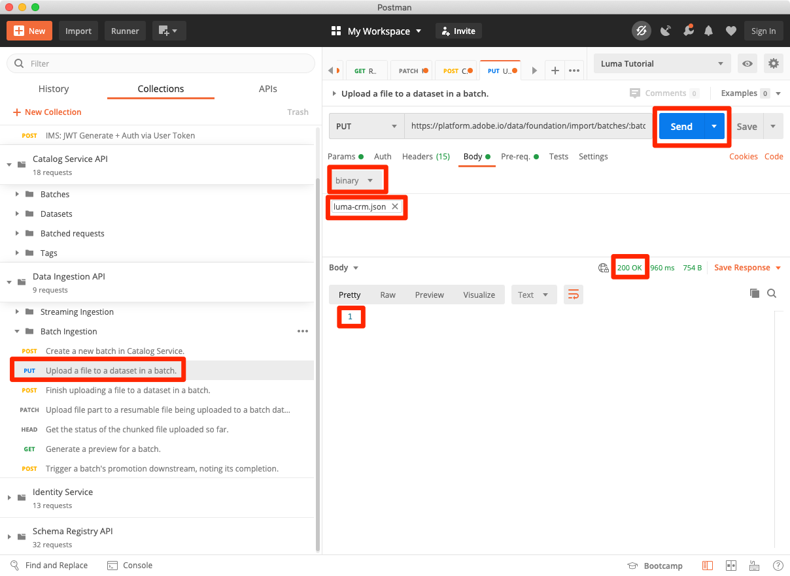
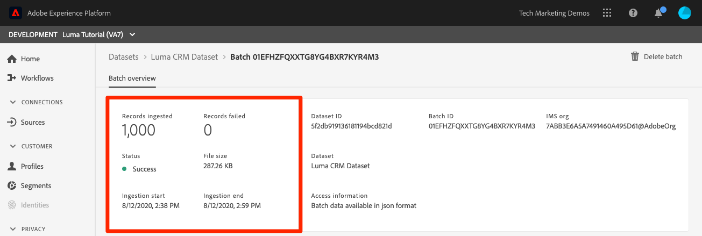
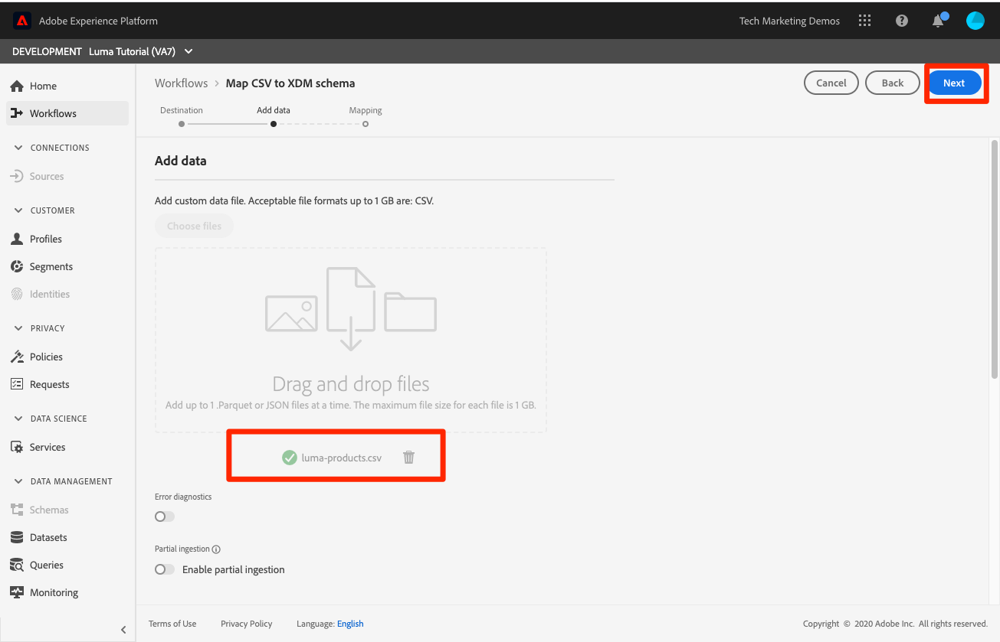

# Ingesta de datos de lote

<!-- 1hr-->
En esta lección, debe ingerir datos de lote en Experience Platform mediante varios métodos.

El consumo de datos por lotes le permite ingerir una gran cantidad de datos en Adobe Experience Platform a la vez. Puede introducir datos por lotes en una carga única en la interfaz de Platform o utilizando la API. También puede configurar cargas por lotes programadas regularmente desde servicios de terceros, como los servicios de almacenamiento en la nube, mediante conectores de origen.

**Ingenieros de datos** tendrá que introducir datos por lotes fuera de este tutorial.

Antes de comenzar los ejercicios, vea este breve vídeo para obtener más información sobre la ingesta de datos:
>[!VIDEO](https://video.tv.adobe.com/v/27106?quality=12&learn=on)


## Permisos necesarios

En el [Configuración de permisos](configure-permissions.md) , configure todos los controles de acceso necesarios para completar esta lección.

<!--
* Permission item **[!UICONTROL Data Management]** > **[!UICONTROL View Datasets]**, **[!UICONTROL Manage Datasets]** and **[!UICONTROL Data Monitoring]**
* Permission items **[!UICONTROL Data Ingestion]** > **[!UICONTROL View Sources]** and **[!UICONTROL Manage Sources]**
* Permission item **[!UICONTROL Profile Management]** > **[!UICONTROL View Profiles]**
* Permission item **[!UICONTROL Sandboxes]** > `Luma Tutorial`
* User-role access to the `Luma Tutorial Platform` product profile
* Developer-role access to the `Luma Tutorial Platform` product profile (for API)
-->

Para el ejercicio de fuentes, necesitará acceder a un servidor (S)FTP o a una solución de almacenamiento en la nube. Hay una solución alternativa si no tiene una.

## Ingesta de datos en lotes con la interfaz de usuario de Platform

Los datos se pueden cargar directamente en un conjunto de datos en la pantalla de conjuntos de datos en los formatos JSON y parquet. Esta es una buena manera de probar la ingesta de algunos datos después de crear una

### Descargar y preparar los datos

En primer lugar, obtenga los datos de ejemplo y personalícelos para su inquilino:

>[!NOTE]
>
>Los datos contenidos en [luma-data.zip](assets/luma-data.zip) es ficticio y debe utilizarse únicamente con fines de demostración.

1. Descargar [luma-data.zip](assets/luma-data.zip) a su **Tutoriales de Luma Assets** carpeta.
1. Descomprima el archivo, creando una carpeta llamada `luma-data` que contiene los cuatro archivos de datos que usaremos en esta lección
1. Apertura `luma-loyalty.json` en un editor de texto y reemplace todas las instancias de `_techmarketingdemos` con su propio id de inquilino de guión bajo, como se ve en sus propios esquemas:
   

1. Guardar el archivo actualizado

### Ingesta de datos

1. En la interfaz de usuario de Platform, seleccione **[!UICONTROL Conjuntos de datos]** en la navegación izquierda
1. Abra su `Luma Loyalty Dataset`
1. Desplácese hacia abajo hasta que vea la variable **[!UICONTROL Agregar datos]** sección de la columna derecha
1. Cargue el `luma-loyalty.json` archivo.
1. Una vez cargado el archivo, aparecerá una fila para el lote
1. Si vuelve a cargar la página después de unos minutos, debería ver que el lote se ha cargado correctamente con 1000 registros y 1000 fragmentos de perfil.

   
   <!--do i need to explain error diagnostics and partial ingestion-->

>[!NOTE]
>
>Hay algunas opciones, **[!UICONTROL Diagnóstico de errores]** y **[!UICONTROL Ingesta parcial]**, que verá en varias pantallas de esta lección. Estas opciones no se tratan en el tutorial. Información rápida:
>
>* Al habilitar los diagnósticos de error, se generan datos sobre la ingesta de los datos, que puede revisar mediante la API de acceso a datos. Obtenga más información en [la documentación](https://experienceleague.adobe.com/docs/experience-platform/data-access/home.html).
>* La ingesta parcial permite introducir datos que contengan errores, hasta un umbral determinado que se puede especificar. Obtenga más información en [la documentación](https://experienceleague.adobe.com/docs/experience-platform/ingestion/batch/partial.html)


### Validación de los datos

Existen varias formas de confirmar que los datos se incorporaron correctamente.

#### Validar en la interfaz de usuario de Platform

Para confirmar que los datos se incorporaron al conjunto de datos:

1. En la misma página en la que haya introducido los datos, seleccione la opción **[!UICONTROL Vista previa del conjunto de datos]** en la parte superior derecha
1. Seleccione el **Vista previa** y debería poder ver algunos de los datos introducidos.

   


Para confirmar que los datos llegaron a Perfil (puede que los datos tarden unos minutos en llegar):

1. Vaya a **[!UICONTROL Perfiles]** en la navegación izquierda
1. Seleccione el icono junto a la **[!UICONTROL Seleccionar área de nombres de identidad]** para abrir el modal
1. Seleccione su `Luma Loyalty Id` namespace
1. A continuación, introduzca una de las `loyaltyId` valores de su conjunto de datos,  `5625458`
1. Select **[!UICONTROL Ver]**

   

#### Validación con eventos de ingesta de datos

Si se ha suscrito a eventos de ingesta de datos en la lección anterior, compruebe la URL de su sitio web weblock.site único. Debería ver tres solicitudes en el siguiente orden, con algún tiempo entre ellas, con lo siguiente `eventCode` valores:

1. `ing_load_success`—el lote ingestado
1. `ig_load_success`: el lote se incorporó en el gráfico de identidad.
1. `ps_load_success`: el lote se incorporó al servicio de perfil.


Consulte la [documentación](https://experienceleague.adobe.com/docs/experience-platform/ingestion/quality/subscribe-events.html#available-status-notification-events) para obtener más información sobre las notificaciones.

## Ingesta de datos en lotes con la API de Platform

Ahora vamos a cargar datos mediante la API.

>[!NOTE]
>
>Los arquitectos de datos pueden cargar los datos CRM a través del método de interfaz de usuario.

### Descargar y preparar los datos

1. Ya debería haber descargado y descomprimido [luma-data.zip](assets/luma-data.zip) en el `Luma Tutorial Assets` carpeta.
2. Apertura `luma-crm.json` en un editor de texto y reemplace todas las instancias de `_techmarketingdemos` con su propio id de inquilino de subrayado, tal como se ve en sus esquemas
3. Guardar el archivo actualizado

### Obtención del id del conjunto de datos

Primero vamos a obtener el id del id del conjunto de datos del conjunto de datos en el que queremos introducir datos:

1. Abrir [!DNL Postman]
1. Si no ha realizado una solicitud en las últimas 24 horas, es probable que los tokens de autorización hayan caducado. Abra la solicitud **[!DNL Adobe I/O Access Token Generation > Local Signing (Non-production use-only) > IMS: JWT Generate + Auth via User Token]** y seleccione **Enviar** para solicitar nuevos tokens de acceso y JWT, como hizo en la [!DNL Postman] lección.
1. Abra las variables de entorno y asegúrese de que el valor de **CONTAINER_ID** permanece `tenant`
1. Abra la solicitud **[!DNL Catalog Service API > Datasets > Retrieve a list of datasets.]** y seleccione **Enviar**
1. Debería obtener un `200 OK` response
1. Copie el id de la variable `Luma CRM Dataset` del cuerpo de respuesta
   

### Crear el lote

Ahora podemos crear un lote en el conjunto de datos:

1. Descargar [API de inserción de datos.postman_collection.json](https://raw.githubusercontent.com/adobe/experience-platform-postman-samples/master/apis/experience-platform/Data%20Ingestion%20API.postman_collection.json) a su `Luma Tutorial Assets` carpeta
1. Importar la colección en [!DNL Postman]
1. Seleccione la solicitud **[!DNL Data Ingestion API > Batch Ingestion > Create a new batch in Catalog Service.]**
1. Pegue lo siguiente como **Cuerpo** de la solicitud, ***reemplazar el valor de datasetId por el suyo propio***:

   ```json
   {
       "datasetId":"REPLACE_WITH_YOUR_OWN_DATASETID",
       "inputFormat": {
           "format": "json"
       }
   }
   ```

1. Seleccione el **Enviar** botón
1. Debe obtener una respuesta de 201 Created que contenga el id del nuevo lote.
1. Copie el `id` del nuevo lote
   

### Ingesta de datos

Ahora podemos cargar los datos en el lote:

1. Seleccione la solicitud **[!DNL Data Ingestion API > Batch Ingestion > Upload a file to a dataset in a batch.]**
1. En el **Parámetros** , introduzca su id de conjunto de datos y su id de lote en sus respectivos campos
1. En el **Parámetros** , introduzca `luma-crm.json` como el **filePath**
1. En el **Cuerpo** , seleccione **binario** option
1. Seleccione el `luma-crm.json` desde su `Luma Tutorial Assets` carpeta
1. Select **Enviar** y debe obtener una respuesta 200 OK con &quot;1&quot; en el cuerpo de respuesta

   

En este punto, si observa el lote en la interfaz de usuario de Platform, verá que está en un &quot;[!UICONTROL Carga]&quot; estado:


Como la API por lotes se utiliza a menudo para cargar varios archivos, debe indicar a Platform cuándo se completa un lote, lo que haremos en el siguiente paso.

### Completar el lote

Para completar el lote:

1. Seleccione la solicitud **[!DNL Data Ingestion API > Batch Ingestion > Finish uploading a file to a dataset in a batch.]**
1. En el **Parámetros** , introduzca `COMPLETE` como el **acción**
1. En el **Parámetros** , introduzca su id. de lote. No se preocupe por el id del conjunto de datos o filePath, si están presentes.
1. Asegúrese de que la dirección URL del POST sea `https://platform.adobe.io/data/foundation/import/batches/:batchId?action=COMPLETE` y que no hay referencias innecesarias al `datasetId` o `filePath`
1. Select **Enviar** y debe obtener una respuesta 200 OK con &quot;1&quot; en el cuerpo de respuesta

   

### Validación de los datos

#### Validar en la interfaz de usuario de Platform

Valide que los datos han llegado a la interfaz de usuario de Platform como lo hizo para el conjunto de datos de lealtad.

En primer lugar, confirme que el lote muestra que se han introducido 1000 registros:



A continuación, confirme el lote mediante el conjunto de datos de Vista previa :


Por último, confirme que se ha creado uno de sus perfiles consultando uno de los perfiles de `Luma CRM Id` namespace, por ejemplo `112ca06ed53d3db37e4cea49cc45b71e`


Hay una cosa interesante que acaba de suceder que quiero señalar. Abra lo siguiente `Danny Wright` perfil. El perfil tiene un `Lumacrmid` y `Lumaloyaltyid`. Recuerde `Luma Loyalty Schema` contenía dos campos de identidad, Luma Loyalty Id y CRM Id. Ahora que hemos cargado ambos conjuntos de datos, se han fusionado en un solo perfil. Los datos de fidelidad tenían `Daniel` como nombre y &quot;Nueva York&quot; como dirección principal, mientras que los datos CRM tenían `Danny` como nombre y `Portland` como la dirección principal del cliente con el mismo ID de fidelidad. Volveremos a la razón por la que se muestra el nombre `Danny` en la lección sobre políticas de combinación.

¡Felicidades, acabas de fusionar perfiles!


#### Validación con eventos de ingesta de datos

Si se ha suscrito a eventos de ingesta de datos en la lección anterior, compruebe la URL de su sitio web weblock.site único. Debería ver que entran tres solicitudes, al igual que con los datos de lealtad:


Consulte la [documentación](https://experienceleague.adobe.com/docs/experience-platform/ingestion/quality/subscribe-events.html#available-status-notification-events) para obtener más información sobre las notificaciones.

## Ingesta de datos con flujos de trabajo

Veamos otra forma de cargar datos. La función de flujos de trabajo permite introducir datos CSV que aún no están modelados en XDM.

### Descargar y preparar los datos

1. Ya debería haber descargado y descomprimido [luma-data.zip](assets/luma-data.zip) en el `Luma Tutorial Assets` carpeta.
1. Confirme que ha`luma-products.csv`

### Creación de un flujo de trabajo

Ahora vamos a configurar el flujo de trabajo:

1. Vaya a **[!UICONTROL Flujos de trabajo]** en la navegación izquierda
1. Select **[!UICONTROL Asignación de CSV al esquema XDM]** y seleccione **[!UICONTROL Launch]** botón
   
1. Seleccione su `Luma Product Catalog Dataset` y seleccione **[!UICONTROL Siguiente]** botón
   
1. Agregue la variable `luma-products.csv` archivo descargado y seleccione la variable **[!UICONTROL Siguiente]** botón
   
1. Ahora se encuentra en la interfaz del asignador, en la que puede asignar un campo de los datos de origen (uno de los nombres de columna de la `luma-products.csv` ) a campos XDM en el esquema de destino. En nuestro ejemplo, los nombres de columna están lo suficientemente cerca de los nombres de campo de esquema como para que el asignador pueda detectar automáticamente la asignación correcta. Si el asignador no pudo detectar automáticamente el campo correcto, seleccione el icono a la derecha del campo de destino para seleccionar el campo XDM correcto. Además, si no desea introducir una de las columnas del CSV, puede eliminar la fila del asignador. Siéntase libre de jugar y cambiar los encabezados de columna en el `luma-products.csv` para familiarizarse con el funcionamiento del asignador.
1. Seleccione el **[!UICONTROL Finalizar]** botón
   

### Validación de los datos

Cuando el lote se haya cargado, compruebe la carga previsualizando el conjunto de datos.

Dado que la variable `Luma Product SKU` es un espacio de nombres que no es de personas, no veremos ningún perfil para el SKU del producto.

Debería ver las tres visitas a su weblink.

## Ingesta de datos con orígenes

Bueno, hiciste las cosas de la manera difícil. Ahora vamos a pasar a la tierra prometida de _automatizado_ ingesta por lotes Cuando digo: &quot;¡ENTRE!&quot; usted dice: &quot;¡OLVIDEN!&quot; &quot;¡CONFIGÚRELO!&quot; &quot;¡OLVIDEN!&quot; &quot;¡CONFIGÚRELO!&quot; &quot;¡OLVIDEN!&quot; Es una broma, ¡nunca harías algo así! Ok, de vuelta al trabajo. Ya casi terminas.

Vaya a **[!UICONTROL Fuentes]** en el panel de navegación izquierdo para abrir el catálogo de fuentes. Aquí podrá ver varias integraciones integradas con proveedores de almacenamiento y datos líderes en la industria.


Bien, ingrese datos usando un conector de origen.

Este ejercicio será de elección propia. Voy a mostrar el flujo de trabajo mediante el conector de fuente de FTP. Puede utilizar un conector de origen de almacenamiento en la nube diferente que utilice en su empresa o cargar el archivo json mediante la interfaz de usuario del conjunto de datos como hicimos con los datos de lealtad.

Muchos de los orígenes tienen un flujo de trabajo de configuración similar, en el que:

1. Introduzca los detalles de autenticación
1. Seleccione los datos que desee ingerir
1. Seleccione el conjunto de datos de Platform en el que desea introducirlo
1. Asignación de campos al esquema XDM
1. Elija la frecuencia con la que desea recuperar los datos de esa ubicación

>[!NOTE]
>
>Los datos de compra sin conexión que vamos a utilizar en este ejercicio contienen datos de fecha y hora. Los datos de fecha y hora deben estar en [Cadenas con formato ISO 8061](https://www.iso.org/iso-8601-date-and-time-format.html) (&quot;2018-07-10T15&quot;:05:59.000-08:00&quot;) o Tiempo Unix formateados en milisegundos (1531263959000) y se convierten en el momento de la ingesta al tipo XDM de destino. Para obtener más información sobre la conversión de datos y otras restricciones, consulte [la documentación de la API de ingesta de lotes](https://experienceleague.adobe.com/docs/experience-platform/ingestion/batch/api-overview.html#types).

### Descargue, prepare y cargue los datos a su proveedor de almacenamiento en la nube preferido

1. Ya debería haber descargado y descomprimido [luma-data.zip](assets/luma-data.zip) en el `Luma Tutorial Assets` carpeta.
1. Apertura `luma-offline-purchases.json` en un editor de texto y reemplace todas las instancias de `_techmarketingdemos` con su propio id de inquilino de subrayado, tal como se ve en sus esquemas
1. Actualice todas las marcas de tiempo para que los eventos se produzcan en el último mes (por ejemplo, busque `"timestamp":"2022-06` y reemplace el año y el mes)
1. Elija su proveedor de almacenamiento en la nube preferido, asegurándose de que esté disponible en la [!UICONTROL Fuentes] catálogo
1. Cargar `luma-offline-purchases.json` a una ubicación en su proveedor de almacenamiento en la nube preferido

### Ingeste los datos en la ubicación de almacenamiento en la nube que prefiera

1. En la interfaz de usuario de Platform, filtre el [!UICONTROL Fuentes] catalogar como **[!UICONTROL Almacenamiento en la nube]**
1. Tenga en cuenta que hay vínculos prácticos a la documentación en la sección `...`
1. En la casilla de su proveedor de almacenamiento en la nube preferido, seleccione la opción **[!UICONTROL Configurar]** botón
   
1. **[!UICONTROL Autenticación]** es el primer paso. Escriba el nombre de la cuenta, por ejemplo `Luma's FTP Account` y los detalles de autenticación. Este paso debería ser bastante similar para todas las fuentes de almacenamiento en la nube, aunque los campos pueden variar ligeramente. Una vez especificados los detalles de autenticación de una cuenta, puede reutilizarlos para otras conexiones de origen que podrían estar enviando datos diferentes en diferentes programaciones de otros archivos de la misma cuenta
1. Seleccione el **[!UICONTROL Botón Conectar a origen]**
1. Cuando Platform se haya conectado correctamente al origen, seleccione la opción **[!UICONTROL Siguiente]** botón
   

1. En el **[!UICONTROL Seleccionar datos]** paso, la interfaz de usuario utilizará sus credenciales para abrir la carpeta en su solución de almacenamiento en la nube
1. Seleccione los archivos que desee ingerir, por ejemplo `luma-offline-purchases.json`
1. Como **[!UICONTROL Formato de datos]**, seleccione `XDM JSON`
1. A continuación, puede obtener una vista previa de la estructura json y los datos de ejemplo en el archivo
1. Seleccione el **[!UICONTROL Siguiente]** botón
   

1. En el **[!UICONTROL Asignación]** , seleccione el `Luma Offline Purchase Events Dataset` y seleccione **[!UICONTROL Siguiente]** botón. Tenga en cuenta en el mensaje que como los datos que estamos incorporando son un archivo JSON, no hay ningún paso de asignación donde asignemos el campo de origen al campo de destino. Los datos JSON ya deben estar en XDM. Si estuviera incorporando un CSV, vería la interfaz de usuario de asignación completa en este paso:
   
1. En el **[!UICONTROL Programación]** , elija la frecuencia con la que desea volver a introducir los datos del origen. Dedique un momento a ver las opciones. Vamos a hacer una ingesta única, así que deje el **[!UICONTROL Frecuencia]** en **[!UICONTROL Una vez]** y seleccione **[!UICONTROL Siguiente]** botón:
   
1. En el **[!UICONTROL Detalles de flujo de datos]** , puede elegir un nombre para el flujo de datos, introducir una descripción opcional, activar los diagnósticos de error y la ingesta parcial. Deje la configuración tal como está y seleccione la **[!UICONTROL Siguiente]** botón:
   
1. En el **[!UICONTROL Consulte]** , puede revisar todas las configuraciones juntas y editarlas o seleccionar la **[!UICONTROL Finalizar]** botón
1. Después de guardar, aterrizará en una pantalla como esta:
   

### Validación de los datos

Cuando el lote se haya cargado, compruebe la carga previsualizando el conjunto de datos.

Debería ver las tres visitas a su weblink.

Buscar el perfil con valor `5625458` en el `loyaltyId` espacio de nombres de nuevo para ver si hay algún evento de compra en su perfil. Debería ver una compra. Para profundizar en los detalles de la compra, seleccione **[!UICONTROL Ver JSON]**:


## Herramientas de ETL

El Adobe se asocia con varios proveedores de ETL para admitir la incorporación de datos en el Experience Platform. Debido a la variedad de proveedores externos, ETL no se cubre en este tutorial, aunque puede revisar algunos de estos recursos:

* [Desarrollo de integraciones de ETL para Adobe Experience Platform](https://experienceleague.adobe.com/docs/experience-platform/etl/home.html)
* [Página del conector Adobe Experience Platform de Informatica en Adobe Exchange](https://exchange.adobe.com/experiencecloud.details.101570.informatica-adobe-experience-cloud-connector.html)
* [Documentación informativa del conector Adobe Experience Platform ](https://docs.informatica.com/integration-cloud/cloud-data-integration-connectors/current-version/adobe-experience-platform-connector/preface.html)
* [[!DNL Snaplogic] Adobe Experience Platform Snap Pack](https://www.snaplogic.com/resources/videos/august-2020-aep)

## Recursos adicionales

* [Documentación de ingesta por lotes](https://experienceleague.adobe.com/docs/experience-platform/ingestion/batch/overview.html)
* [Referencia de la API de ingesta de lotes](https://www.adobe.io/experience-platform-apis/references/data-ingestion/#tag/Batch-Ingestion)

Ahora vamos a [transmitir datos mediante el SDK web](ingest-streaming-data.md)
