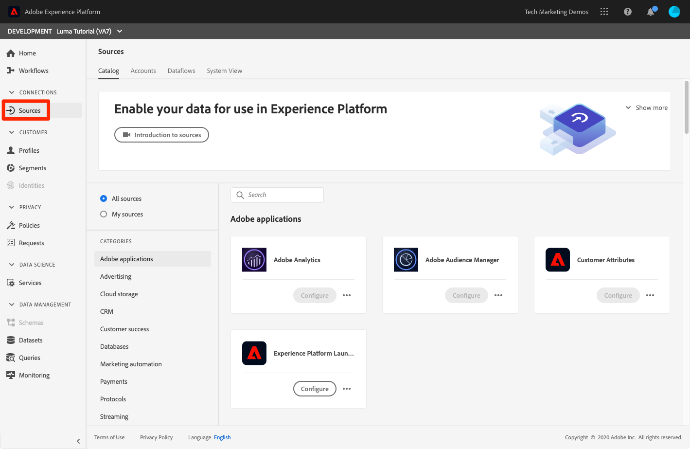

# Ingesta de datos por lotes

<!-- 1hr-->
En esta lección, debe introducir datos por lotes en Experience Platform mediante varios métodos.

La ingesta de datos por lotes le permite introducir una gran cantidad de datos en Adobe Experience Platform a la vez. Puede introducir datos por lotes de una sola vez y cargarlos en la interfaz de Platform o mediante la API. También puede configurar cargas por lotes programadas regularmente desde servicios de terceros, como servicios de almacenamiento en la nube, mediante conectores de origen.

**Ingenieros de datos** deberá introducir datos por lotes fuera de este tutorial.

Antes de comenzar los ejercicios, vea este breve vídeo para obtener más información sobre la ingesta de datos:
>[!VIDEO](https://video.tv.adobe.com/v/27106?quality=12&learn=on)


## Permisos necesarios

En el [Configuración de permisos](configure-permissions.md) Esta lección, ha configurado todos los controles de acceso necesarios para completar esta lección.

<!--
* Permission item **[!UICONTROL Data Management]** > **[!UICONTROL View Datasets]**, **[!UICONTROL Manage Datasets]** and **[!UICONTROL Data Monitoring]**
* Permission items **[!UICONTROL Data Ingestion]** > **[!UICONTROL View Sources]** and **[!UICONTROL Manage Sources]**
* Permission item **[!UICONTROL Profile Management]** > **[!UICONTROL View Profiles]**
* Permission item **[!UICONTROL Sandboxes]** > `Luma Tutorial`
* User-role access to the `Luma Tutorial Platform` product profile
* Developer-role access to the `Luma Tutorial Platform` product profile (for API)
-->

Necesitará acceso a un servidor (S)FTP o a una solución de almacenamiento en la nube para el ejercicio Fuentes. Si no dispone de una solución alternativa.

## Ingesta de datos por lotes con la interfaz de usuario de Platform

Los datos se pueden cargar directamente en un conjunto de datos en la pantalla de conjuntos de datos en los formatos JSON y parquet. Esta es una buena manera de probar la ingesta de algunos de los datos después de crear una

### Descargue y prepare los datos

En primer lugar, obtenga los datos de ejemplo y personalícelos para su inquilino:

>[!NOTE]
>
>Datos incluidos en la [luma-data.zip](assets/luma-data.zip) es ficticio y solo debe utilizarse con fines de demostración.

1. Descargar [luma-data.zip](assets/luma-data.zip) a su **Recursos de tutorial de Luma** carpeta.
1. Descomprima el archivo y cree una carpeta llamada `luma-data` que contiene los cuatro archivos de datos que utilizaremos en esta lección
1. Abrir `luma-loyalty.json` en un editor de texto y reemplace todas las instancias de `_techmarketingdemos` con su propio id de inquilino de guion bajo, como se ve en sus propios esquemas:
   

1. Guarde el archivo actualizado

### Ingesta de datos

1. En la interfaz de usuario de Platform, seleccione **[!UICONTROL Conjuntos de datos]** en el panel de navegación izquierdo
1. Abra su `Luma Loyalty Dataset`
1. Desplácese hacia abajo hasta que vea el **[!UICONTROL Añadir datos]** en la columna derecha
1. Cargue el `luma-loyalty.json` archivo.
1. Una vez cargado el archivo, aparecerá una fila para el lote
1. Si vuelve a cargar la página después de unos minutos, verá que el lote se ha cargado correctamente con 1000 registros y 1000 fragmentos de perfil.

   
   <!--do i need to explain error diagnostics and partial ingestion-->

>[!NOTE]
>
>Hay algunas opciones, **[!UICONTROL Diagnósticos de error]** y **[!UICONTROL Ingesta parcial]**, que verá en varias pantallas de esta lección. Estas opciones no se tratan en el tutorial. Información rápida:
>
>* Al habilitar los diagnósticos de error, se generan datos sobre la ingesta de sus datos, que puede revisar mediante la API de acceso a datos. Obtenga más información al respecto en [la documentación](https://experienceleague.adobe.com/docs/experience-platform/data-access/home.html).
>* La ingesta parcial permite introducir datos que contienen errores, hasta un determinado umbral que puede especificar. Obtenga más información al respecto en [la documentación](https://experienceleague.adobe.com/docs/experience-platform/ingestion/batch/partial.html)

### Validación de los datos

Existen varias formas de confirmar que los datos se han introducido correctamente.

#### Validación en la interfaz de usuario de Platform

Para confirmar que los datos se han introducido en el conjunto de datos:

1. En la misma página donde ha introducido los datos, seleccione la opción **[!UICONTROL Previsualizar conjunto de datos]** botón en la parte superior derecha
1. Seleccione el **Previsualizar** y debería poder ver algunos de los datos introducidos.

   


Para confirmar que los datos han aterrizado en el perfil (los datos pueden tardar unos minutos en aterrizar):

1. Ir a **[!UICONTROL Perfiles]** en el panel de navegación izquierdo
1. Seleccione el icono situado junto al **[!UICONTROL Seleccionar área de nombres de identidad]** campo para abrir el modal
1. Seleccione su `Luma Loyalty Id` namespace
1. A continuación, introduzca uno de los `loyaltyId` valores del conjunto de datos,  `5625458`
1. Seleccionar **[!UICONTROL Ver]**
   

#### Validación con eventos de ingesta de datos

Si se ha suscrito a los eventos de ingesta de datos de la lección anterior, compruebe la dirección URL única de webhook.site. Debería ver tres solicitudes que aparecen en el siguiente orden, con algún tiempo entre ellas, con lo siguiente `eventCode` valores:

1. `ing_load_success`: el lote tal como se ha introducido.
1. `ig_load_success`: el lote se ha introducido en el gráfico de identidad
1. `ps_load_success`: el lote se ha introducido en el servicio de perfil


Consulte la [documentación](https://experienceleague.adobe.com/docs/experience-platform/ingestion/quality/subscribe-events.html#available-status-notification-events) para obtener más información sobre las notificaciones.

## Ingesta de datos por lotes con la API de Platform

Ahora vamos a cargar datos mediante la API.

>[!NOTE]
>
>Los arquitectos de datos pueden cargar los datos de CRM mediante el método de interfaz de usuario.

### Descargue y prepare los datos

1. Ya debería haber descargado y descomprimido [luma-data.zip](assets/luma-data.zip) en su `Luma Tutorial Assets` carpeta.
2. Abrir `luma-crm.json` en un editor de texto y reemplace todas las instancias de `_techmarketingdemos` con su propio id de inquilino de guion bajo, tal como se ve en los esquemas
3. Guarde el archivo actualizado

### Obtención del ID del conjunto de datos

Primero vamos a obtener el ID del conjunto de datos en el que queremos introducir los datos:

1. Abrir [!DNL Postman]
1. Si no tiene un token de acceso, abra la solicitud **[!DNL OAuth: Request Access Token]** y seleccione **Enviar** para solicitar un nuevo token de acceso, como hizo en el [!DNL Postman] lección.
1. Abra las variables de entorno y compruebe el valor de **CONTAINER_ID** sigue siendo `tenant`
1. Abrir la solicitud **[!DNL Catalog Service API > Datasets > Retrieve a list of datasets.]** y seleccione **Enviar**
1. Usted debe conseguir una `200 OK` respuesta
1. Copie el ID del `Luma CRM Dataset` del cuerpo de respuesta
   

### Crear el lote

Ahora podemos crear un lote en el conjunto de datos:

1. Descargar [Ingesta de datos API.postman_collection.json](https://raw.githubusercontent.com/adobe/experience-platform-postman-samples/master/apis/experience-platform/Data%20Ingestion%20API.postman_collection.json) a su `Luma Tutorial Assets` carpeta
1. Importe la colección en [!DNL Postman]
1. Seleccione la solicitud **[!DNL Data Ingestion API > Batch Ingestion > Create a new batch in Catalog Service.]**
1. Pegue lo siguiente como **Cuerpo** de la solicitud, ***reemplazar el valor datasetId por el suyo propio***:

   ```json
   {
       "datasetId":"REPLACE_WITH_YOUR_OWN_DATASETID",
       "inputFormat": {
           "format": "json"
       }
   }
   ```

1. Seleccione el **Enviar** botón
1. Debe obtener una respuesta 201 Created que contenga el ID del nuevo lote.
1. Copie el `id` del nuevo lote
   

### Ingesta de datos

Ahora podemos cargar los datos en el lote:

1. Seleccione la solicitud **[!DNL Data Ingestion API > Batch Ingestion > Upload a file to a dataset in a batch.]**
1. En el **Parámetros** pestaña, introduzca su id del conjunto de datos y el id de lote en sus campos respectivos
1. En el **Parámetros** pestaña, introduzca `luma-crm.json` como el **filePath**
1. En el **Cuerpo** , seleccione la pestaña **binario** opción
1. Seleccione el descargado `luma-crm.json` de su `Luma Tutorial Assets` carpeta
1. Seleccionar **Enviar** y debería obtener una respuesta 200 OK con &quot;1&quot; en el cuerpo de la respuesta

   

En este punto, si observa el lote en la interfaz de usuario de Platform, verá que está en un &quot;[!UICONTROL Cargando]&quot; estado:


Dado que la API por lotes se utiliza a menudo para cargar varios archivos, debe informar a Platform cuando se complete un lote, lo que haremos en el siguiente paso.

### Completar el lote

Para completar el lote:

1. Seleccione la solicitud **[!DNL Data Ingestion API > Batch Ingestion > Finish uploading a file to a dataset in a batch.]**
1. En el **Parámetros** pestaña, introduzca `COMPLETE` como el **acción**
1. En el **Parámetros** pestaña, introduzca su id de lote. No se preocupe por el ID del conjunto de datos o la ruta de archivo, si están presentes.
1. Asegúrese de que la dirección URL del POST sea `https://platform.adobe.io/data/foundation/import/batches/:batchId?action=COMPLETE` y que no hay ninguna referencia innecesaria a la `datasetId` o `filePath`
1. Seleccionar **Enviar** y debería obtener una respuesta 200 OK con &quot;1&quot; en el cuerpo de la respuesta

   

### Validación de los datos

#### Validación en la interfaz de usuario de Platform

Valide que los datos hayan aterrizado en la interfaz de usuario de Platform como lo hizo para el conjunto de datos de Fidelidad.

En primer lugar, confirme que el lote muestra que se han introducido 1000 registros:


A continuación, confirme el lote mediante Vista previa del conjunto de datos:


Finalmente, confirme que uno de los perfiles se ha creado buscando uno en el `Luma CRM Id` namespace, por ejemplo `112ca06ed53d3db37e4cea49cc45b71e`


Hay una cosa interesante que acaba de pasar que quiero señalar. Abra eso `Danny Wright` perfil. El perfil tiene un `Lumacrmid` y una `Lumaloyaltyid`. Recuerde la `Luma Loyalty Schema` contenía dos campos de identidad, ID de fidelidad de Luma e ID de CRM. Ahora que hemos cargado ambos conjuntos de datos, se han combinado en un solo perfil. Los datos de fidelización tenían `Daniel` como el nombre y &quot;Nueva York&quot; como la dirección de inicio, mientras que los datos de CRM tenían `Danny` como nombre y `Portland` como la dirección del cliente con el mismo ID de fidelidad. Volveremos a la pregunta de por qué aparece el nombre `Danny` en la lección sobre políticas de combinación.

¡Enhorabuena, acaba de combinar perfiles!


#### Validación con eventos de ingesta de datos

Si se ha suscrito a los eventos de ingesta de datos de la lección anterior, compruebe la dirección URL única de webhook.site. Debería ver tres solicitudes, igual que con los datos de fidelidad:


Consulte la [documentación](https://experienceleague.adobe.com/docs/experience-platform/ingestion/quality/subscribe-events.html#available-status-notification-events) para obtener más información sobre las notificaciones.

## Ingesta de datos con flujos de trabajo

Veamos otra forma de cargar los datos. La función de flujos de trabajo permite introducir datos CSV que aún no están modelados en XDM.

### Descargue y prepare los datos

1. Ya debería haber descargado y descomprimido [luma-data.zip](assets/luma-data.zip) en su `Luma Tutorial Assets` carpeta.
1. Confirme que dispone de`luma-products.csv`

### Creación de un flujo de trabajo

Ahora vamos a configurar el flujo de trabajo:

1. Ir a **[!UICONTROL Flujos de trabajo]** en el panel de navegación izquierdo
1. Seleccionar **[!UICONTROL Asignar CSV a esquema XDM]** y seleccione la **[!UICONTROL Launch]** botón
   
1. Seleccione su `Luma Product Catalog Dataset` y seleccione la **[!UICONTROL Siguiente]** botón
   
1. Añada el `luma-products.csv` archivo que ha descargado y seleccione el **[!UICONTROL Siguiente]** botón
   
1. Ahora se encuentra en la interfaz del asignador, en la que puede asignar un campo desde los datos de origen (uno de los nombres de columna en la variable `luma-products.csv` ) a los campos XDM en el esquema de destino. En nuestro ejemplo, los nombres de columna están lo suficientemente cerca de los nombres de campo de esquema que el asignador puede detectar automáticamente la asignación correcta. Si el asignador no pudiera detectar automáticamente el campo derecho, seleccionaría el icono a la derecha del campo de destino para seleccionar el campo XDM correcto. Además, si no desea introducir una de las columnas del CSV, puede eliminar la fila del asignador. No dude en jugar y cambiar los encabezados de columna en la `luma-products.csv` para familiarizarse con el funcionamiento del asignador.
1. Seleccione el **[!UICONTROL Finalizar]** botón
   

### Validación de los datos

Cuando se haya cargado el lote, compruebe la carga previsualizando el conjunto de datos.

Dado que la variable `Luma Product SKU` es un área de nombres que no es de personas, no veremos ningún perfil para los sku de productos.

Debería ver las tres visitas a su webhook.

## Ingesta de datos con orígenes

Bien, hiciste las cosas de la manera difícil. Ahora vamos a mudarnos a la tierra prometida de _automatizado_ ingesta por lotes. Cuando digo: &quot;¡PONLO!&quot; tú dices: &quot;¡OLVÍDALO!&quot; &quot;¡PONLO!&quot; &quot;¡OLVÍDALO!&quot; &quot;¡PONLO!&quot; &quot;¡OLVÍDALO!&quot; Solo bromeaba, ¡nunca harías algo así! Ok, de vuelta al trabajo. Ya casi has terminado.

Ir a **[!UICONTROL Fuentes]** en el panel de navegación izquierdo para abrir el catálogo de fuentes. Aquí verá varias integraciones listas para usar con los proveedores de datos y almacenamiento líderes en el sector.



Bien, vamos a ingerir datos usando un conector de origen.

Este ejercicio será elegir-su-propio-estilo de aventura. Voy a mostrar el flujo de trabajo mediante el conector de origen FTP. Puede utilizar un conector de origen de Cloud Storage diferente que utilice en su empresa o cargar el archivo json mediante la interfaz de usuario del conjunto de datos, como hicimos con los datos de fidelidad.

Muchos de los orígenes tienen un flujo de trabajo de configuración similar, en el que:

1. Introduzca los detalles de autenticación
1. Seleccione los datos que desea introducir
1. Seleccione el conjunto de datos de Platform en el que desea introducirlo
1. Asignar los campos al esquema XDM
1. Elija la frecuencia con la que desea volver a ingerir datos desde esa ubicación

>[!NOTE]
>
>Los datos de compra sin conexión que utilizaremos en este ejercicio contienen datos de fecha y hora. Los datos de fecha y hora deben estar [Cadenas con formato ISO 8061](https://www.iso.org/iso-8601-date-and-time-format.html) (&quot;2018-07-10T15:05:59.000-08:00&quot;) o Tiempo de Unix en milisegundos (1531263959000) y se convierten en el momento de la ingesta al tipo XDM de destino. Para obtener más información sobre la conversión de datos y otras restricciones, consulte [la documentación de la API de ingesta por lotes](https://experienceleague.adobe.com/docs/experience-platform/ingestion/batch/api-overview.html#types).

### Descargue, prepare y cargue los datos a su proveedor de almacenamiento en la nube preferido

1. Ya debería haber descargado y descomprimido [luma-data.zip](assets/luma-data.zip) en su `Luma Tutorial Assets` carpeta.
1. Abrir `luma-offline-purchases.json` en un editor de texto y reemplace todas las instancias de `_techmarketingdemos` con su propio id de inquilino de guion bajo, tal como se ve en los esquemas
1. Actualice todas las marcas de tiempo para que los eventos se produzcan en el último mes (por ejemplo, busque `"timestamp":"2022-06` y reemplace el año y el mes)
1. Elija su proveedor de almacenamiento en la nube preferido, asegurándose de que esté disponible en la [!UICONTROL Fuentes] catalogar
1. Cargar `luma-offline-purchases.json` a una ubicación de su proveedor de almacenamiento en la nube preferido

### Ingeste los datos en su ubicación de almacenamiento en la nube preferida

1. En la interfaz de usuario de Platform, filtre [!UICONTROL Fuentes] catalogar a **[!UICONTROL Almacenamiento en la nube]**
1. Tenga en cuenta que hay vínculos prácticos a la documentación en la sección `...`
1. En el cuadro de su proveedor de almacenamiento en la nube preferido, seleccione el **[!UICONTROL Configurar]** botón
   
1. **[!UICONTROL Autenticación]** es el primer paso. Escriba el nombre de su cuenta, por ejemplo `Luma's FTP Account` y sus datos de autenticación. Este paso debería ser bastante similar para todas las fuentes de almacenamiento en la nube, aunque los campos pueden variar ligeramente. Una vez que haya especificado los detalles de autenticación de una cuenta, puede reutilizarlos para otras conexiones de origen que podrían estar enviando datos diferentes en programaciones diferentes de otros archivos de la misma cuenta
1. Seleccione el **[!UICONTROL Botón Conectar con el origen]**
1. Cuando Platform se haya conectado correctamente al origen, seleccione la opción **[!UICONTROL Siguiente]** botón
   

1. En el **[!UICONTROL Seleccionar datos]** paso, la interfaz de usuario utilizará sus credenciales para abrir la carpeta en su solución de almacenamiento en la nube
1. Seleccione los archivos que desee introducir, por ejemplo `luma-offline-purchases.json`
1. Como el **[!UICONTROL Formato de datos]**, seleccione `XDM JSON`
1. A continuación, puede obtener una vista previa de la estructura json y de los datos de ejemplo en el archivo
1. Seleccione el **[!UICONTROL Siguiente]** botón
   

1. En el **[!UICONTROL Asignación]** paso, seleccione su `Luma Offline Purchase Events Dataset` y seleccione la **[!UICONTROL Siguiente]** botón. Tenga en cuenta en el mensaje que, como los datos que estamos ingiriendo son un archivo JSON, no hay ningún paso de asignación en el que asignemos el campo de origen al campo de destino. Los datos JSON ya deben estar en XDM. Si estuviera introduciendo un CSV, vería la interfaz de usuario de asignación completa en este paso:
   
1. En el **[!UICONTROL Programación]** , elija la frecuencia con la que desea volver a introducir los datos desde el origen. Dedique un momento a ver las opciones. Solo vamos a hacer una ingesta única, así que deje el **[!UICONTROL Frecuencia]** el **[!UICONTROL Una]** y seleccione la **[!UICONTROL Siguiente]** botón:
   
1. En el **[!UICONTROL Detalles del flujo de datos]** paso a paso, puede elegir un nombre para el flujo de datos, introducir una descripción opcional, activar los diagnósticos de error y la ingesta parcial. Deje la configuración tal cual y seleccione **[!UICONTROL Siguiente]** botón:
   
1. En el **[!UICONTROL Revisar]** paso, puede revisar todos los ajustes a la vez y editarlos o seleccionar el **[!UICONTROL Finalizar]** botón
1. Después de guardar, aterrizará en una pantalla como esta:
   

### Validación de los datos

Cuando se haya cargado el lote, compruebe la carga previsualizando el conjunto de datos.

Debería ver las tres visitas a su webhook.

Búsqueda del perfil con valor `5625458` en el `loyaltyId` de nuevo el área de nombres para ver si hay algún evento de compra en su perfil. Debería ver una compra. Puede profundizar en los detalles de la compra seleccionando **[!UICONTROL Ver JSON]**:


## Herramientas de ETL

Adobe se asocia con varios proveedores de ETL para admitir la ingesta de datos en Experience Platform. Debido a la variedad de proveedores externos, ETL no se trata en este tutorial, aunque puede revisar algunos de estos recursos:

* [Desarrollo de integraciones de ETL para Adobe Experience Platform](https://experienceleague.adobe.com/docs/experience-platform/etl/home.html)
* [Página del conector de Informatica Adobe Experience Platform en Adobe Exchange](https://exchange.adobe.com/experiencecloud.details.101570.informatica-adobe-experience-cloud-connector.html)
* [Documentación informativa del conector de Adobe Experience Platform](https://docs.informatica.com/integration-cloud/cloud-data-integration-connectors/current-version/adobe-experience-platform-connector/preface.html)
* [[!DNL Snaplogic] Adobe Experience Platform Snap Pack](https://www.snaplogic.com/resources/videos/august-2020-aep)

## Recursos adicionales

* [Documentación de ingesta por lotes](https://experienceleague.adobe.com/docs/experience-platform/ingestion/batch/overview.html)
* [Referencia de API de ingesta por lotes](https://www.adobe.io/experience-platform-apis/references/data-ingestion/#tag/Batch-Ingestion)

Ahora vamos a... [transmitir datos mediante el SDK web](ingest-streaming-data.md)
