# Ingesta de datos de flujo

<!--1hr-->

En esta lección, debe transmitir los datos mediante el SDK web de Adobe Experience Platform.

Hay dos tareas principales que debemos completar en la interfaz de recopilación de datos:

* Debemos implementar el SDK web en el sitio web de Luma para enviar datos sobre la actividad del visitante desde el sitio web a la red de Adobe Edge. Haremos una implementación sencilla mediante etiquetas (anteriormente Launch)

* Debemos configurar una secuencia de datos, que indique a la red de Edge dónde reenviar los datos. Lo configuraremos para enviar los datos a nuestro `Luma Web Events` en nuestra zona protegida de Platform.

**Ingenieros de datos** deberá ingerir datos de flujo continuo fuera de este tutorial. Al implementar los SDK web o móvil de Adobe Experience Platform, normalmente un desarrollador web o móvil participa en la creación de la capa de datos y en la configuración de las propiedades de etiquetas.

Antes de comenzar los ejercicios, vea estos dos vídeos cortos para obtener más información acerca de la ingesta de datos de flujo continuo y el SDK web:
>[!VIDEO](https://video.tv.adobe.com/v/28425?quality=12&learn=on)

>[!VIDEO](https://video.tv.adobe.com/v/34141?quality=12&learn=on)

>[!NOTE]
>
>Aunque este tutorial se centra en la ingesta de transmisión desde sitios web con SDK web, también puede transmitir datos mediante el [Adobe Mobile SDK](https://developer.adobe.com/client-sdks/documentation/), [Apache Kafka Connect](https://github.com/adobe/experience-platform-streaming-connect)y otros mecanismos.

## Permisos necesarios

En el [Configuración de permisos](configure-permissions.md) Esta lección, ha configurado todos los controles de acceso necesarios para completar esta lección.

<!--
* Permission items **[!UICONTROL Launch]** > **[!UICONTROL Property Rights]** > **[!UICONTROL Approve]**, **[!UICONTROL Develop]**, **[!UICONTROL Manage Environments]**, **[!UICONTROL Manage Extensions]**, and **[!UICONTROL Publish]**
* Permission item **[!UICONTROL Launch]** > **[!UICONTROL Company Rights]** > **[!UICONTROL Manage Properties]**
* User-role access to the `Luma Tutorial Launch` product profile
* Admin-role access to the `Luma Tutorial Launch` product profile
* Permission items **[!UICONTROL Platform]** > **[!UICONTROL Data Ingestion]** > **[!UICONTROL View Sources]** and **[!UICONTROL Manage Sources]**
* Permission items **[!UICONTROL Platform]** > **[!UICONTROL Data Management]** > **[!UICONTROL View Datasets]** and **[!UICONTROL Manage Datasets]**
* Permission items **[!UICONTROL Platform]** > **[!UICONTROL Profiles]** > **[!UICONTROL View Profiles]**, **[!UICONTROL Manage Profiles]** and **[!UICONTROL Export Audience Segment]**
* Permission item **[!UICONTROL Platform]** > **[!UICONTROL Sandbox Administration]** > **[!UICONTROL View Sandboxes]**
* Permission item **[!UICONTROL Platform]** > **[!UICONTROL Sandboxes]** > `Luma Tutorial`
* User-role access to the `Luma Tutorial Platform` product profile
-->

<!--## Create a streaming source

1. Log into the [Experience Platform  user interface](https://experience.adobe.com/platform/)
1. Go to **[!UICONTROL Sources]** in the left navigation
1. Filter the list by selecting **[!UICONTROL Streaming]**
1. In the **[!UICONTROL HTTP API]** section, select the **[!UICONTROL Configure]** button
    
1. On the **[!UICONTROL Authentication]** step, enter `Luma Web Events Source` as the **[!UICONTROL Account name]** and select the **[!UICONTROL Connect to source]** button (we don't need to enable authentication since the data will be originating from website visitors)
    
1. Once connected, select the **[!UICONTROL Next]** button to proceed to the next step in the workflow
1. On the **[!UICONTROL Select data]** step, choose **[!UICONTROL Existing Dataset]**, select your `Luma Web Events Dataset`, and then select the **[!UICONTROL Next]** button
    
1. On the **[!UICONTROL Dataflow detail]** step, select the **[!UICONTROL Next]** button:
    
    <!--What is a good practice for naming the data flow vs the source-->
<!--
1. On the **[!UICONTROL Review]** step, review your source details and select the **[!UICONTROL Finish]** button:
    
-->

## Configuración de la secuencia de datos

Primero configuraremos la secuencia de datos. Un conjunto de datos indica a la red de Adobe Edge dónde enviar los datos después de recibirlos desde la llamada del SDK web. Por ejemplo, ¿desea enviar los datos a Experience Platform, Adobe Analytics o Adobe Target? Las secuencias de datos se administran en la interfaz de usuario de recopilación de datos (anteriormente Launch) y son esenciales para la recopilación de datos con el SDK web.

Para crear su [!UICONTROL secuencia de datos]:

1. Inicie sesión en [Interfaz de usuario de recopilación de datos de Experience Platform](https://experience.adobe.com/launch/)
   <!--when will the edge config go live?-->

1. Seleccionar **[!UICONTROL Datastreams]** en el panel de navegación izquierdo
1. Seleccione el **[!UICONTROL Nueva secuencia de datos]** botón en la esquina superior derecha

   

1. Para el **[!UICONTROL Nombre descriptivo]**, introduzca `Luma Platform Tutorial` (añada su nombre al final, si varias personas de su compañía realizan este tutorial)
1. Seleccione el botón **[!UICONTROL Guardar]**

   

En la siguiente pantalla, especifique dónde desea enviar los datos. Para enviar datos al Experience Platform:

1. Alternar en **[!UICONTROL Adobe Experience Platform]** para exponer campos adicionales
1. Para **[!UICONTROL Sandbox]**, seleccione `Luma Tutorial`
1. Para **[!UICONTROL Conjunto de datos de evento]**, seleccione `Luma Web Events Dataset`
1. Si utiliza otras aplicaciones de Adobe, puede explorar las demás secciones para ver qué información es necesaria en la configuración de Edge de estas otras soluciones. Recuerde, el SDK web se desarrolló no solo para transmitir datos a Experience Platform, sino también para reemplazar todas las bibliotecas de JavaScript anteriores utilizadas por otras aplicaciones de Adobe. La configuración de Edge se utiliza para especificar los detalles de la cuenta de cada aplicación a la que desea enviar los datos.
1. Seleccione **[!UICONTROL Guardar]**
   

Una vez guardada la configuración de Edge, la pantalla resultante mostrará tres entornos que se han creado para el desarrollo, el ensayo y la producción. Se pueden añadir entornos de desarrollo adicionales:
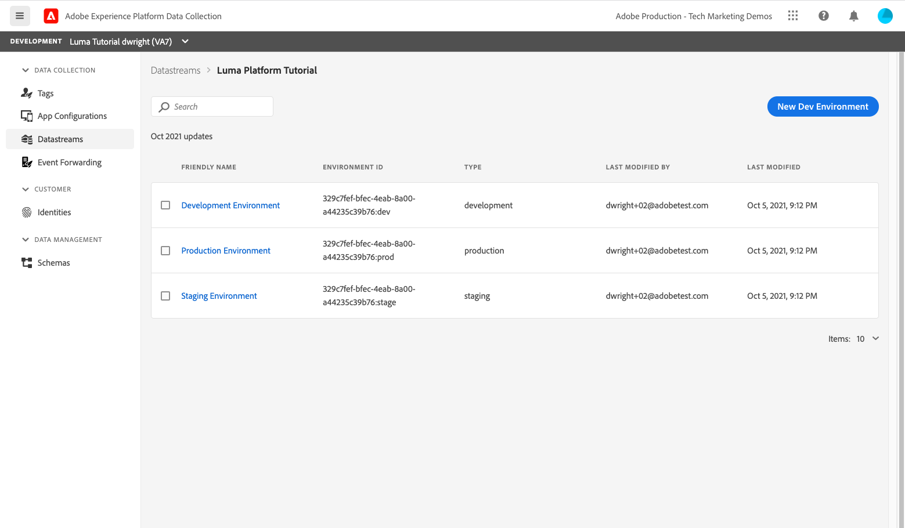
Los tres entornos contienen los detalles de Platform que acaba de introducir. Sin embargo, estos detalles se pueden configurar de forma diferente para cada entorno. Por ejemplo, puede hacer que cada entorno envíe datos a un entorno limitado de Platform diferente. En este tutorial, no realizaremos ninguna personalización adicional de nuestro conjunto de datos.

## Instalación de la extensión del SDK web

### Añadir una propiedad

En primer lugar, se debe crear una propiedad de etiqueta (anteriormente, una propiedad de etiqueta ). Una propiedad es un contenedor para todos los elementos JavaScript, las reglas y otras funciones necesarias para recopilar detalles de una página web y enviarlos a varias ubicaciones.

Para crear una propiedad:

1. Ir a **[!UICONTROL Propiedades]** en el panel de navegación izquierdo
1. Seleccione el botón **[!UICONTROL Nueva propiedad]**
   
1. Como el **[!UICONTROL Nombre]**, introduzca `Luma Platform Tutorial` (añada su nombre al final, si varias personas de su compañía realizan este tutorial)
1. Como el **[!UICONTROL Domains]**, introduzca `enablementadobe.com` (explicado más tarde)
1. Seleccione **[!UICONTROL Guardar]**
   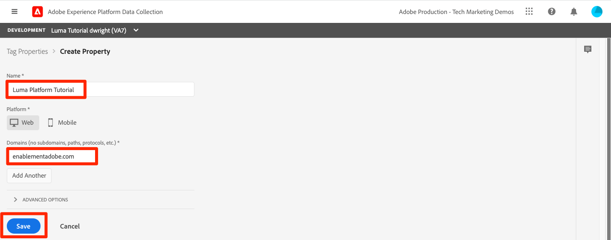

<!--
After saving the property, you might see an error message like the one below. If so, this is because you don't actually have access to the property you just created. To fix this, we need to go to the Admin Console to give yourself access:
    

To give yourself access to the property:

1. In a separate browser tab, log into the [Admin Console](https://adminconsole.adobe.com/)
1. Go to **[!UICONTROL Products]** from the top navigation
1. Select **[!UICONTROL Adobe Experience Platform Launch]** on the left navigation
1. Go to your `Luma Tutorial Launch` product profile
1. Go to the **[!UICONTROL Permissions]** tab
1. On the **[!UICONTROL Properties]** row, select **[!UICONTROL Edit]**
    
1. Select the "+" icon to move your `Luma Platform Tutorial` property to the right-hand side and select the **[!UICONTROL Save]** button to update the permissions
   
    

Now switch back to your browser tab with the Data Collection interface still open. Reload the page and the `Luma Platform Tutorial` property should display in the list. Select to open the property:

-->

## Añadir la extensión del SDK web

Ahora que tiene una propiedad, puede agregar el SDK web con una extensión. Una extensión es un paquete de código que amplía la interfaz y la funcionalidad de recopilación de datos. Para añadir la extensión:

1. Abra la propiedad de etiquetas
1. Ir a **[!UICONTROL Extensiones]** en el panel de navegación izquierdo
1. Vaya a la **[!UICONTROL Catálogo]** pestaña
1. Hay muchas extensiones disponibles para las etiquetas. Filtre el catálogo con el término `Web SDK`
1. En el **[!UICONTROL SDK web de Adobe Experience Platform]** extensión, seleccione la **[!UICONTROL Instalar]** botón
   
1. Hay varias configuraciones disponibles para la extensión del SDK web, pero solo dos que vamos a configurar para este tutorial. Actualice el **[!UICONTROL Dominio de Edge]** hasta `data.enablementadobe.com`. Esta configuración le permite establecer cookies de origen con la implementación del SDK web, lo que se recomienda. Más adelante en esta lección, asignará un sitio web en la `enablementadobe.com` a su propiedad de etiquetas. El CNAME para `enablementadobe.com` el dominio ya se ha configurado para que `data.enablementadobe.com` reenviará a los servidores de Adobe. Al implementar el SDK web en su propio sitio web, deberá crear un CNAME para sus propios fines de recopilación de datos, por ejemplo, `data.YOUR_DOMAIN.com`
1. Desde el **[!UICONTROL Datastream]** , seleccione su `Luma Platform Tutorial` secuencia de datos.
1. No dude en consultar las demás opciones de configuración (pero no las cambie). y luego seleccione **[!UICONTROL Guardar]**
   <!--is edge domain required for first party? when will it break?-->
   <!--any other fields that should be highlighted-->
   

## Creación de una regla para enviar datos

Ahora crearemos una regla para enviar datos a Platform. Una regla es una combinación de eventos, condiciones y acciones que indican a las etiquetas que realicen alguna acción. Para crear una regla:

1. Ir a **[!UICONTROL Reglas]** en el panel de navegación izquierdo
1. Seleccione el **[!UICONTROL Crear nueva regla]** botón
   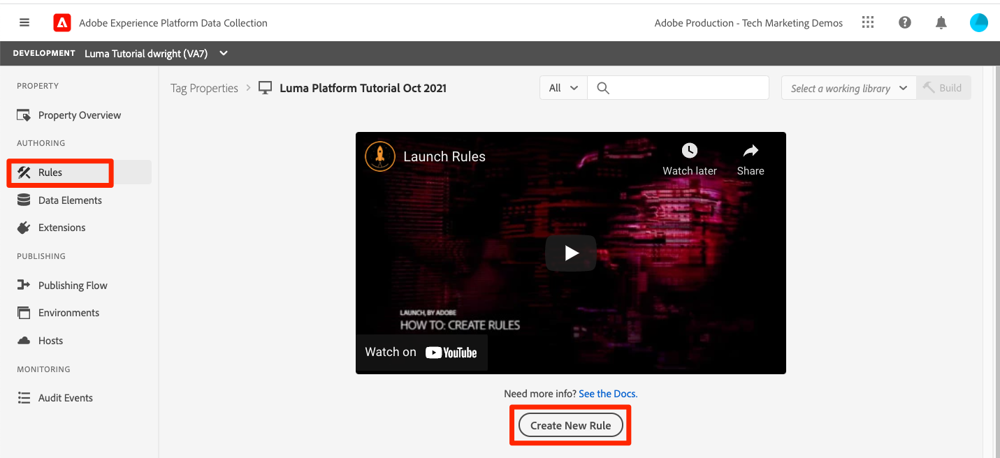
1. Asigne un nombre a la regla `All Pages - Library Loaded`.
1. En **[!UICONTROL Eventos]**, seleccione la **[!UICONTROL Añadir]** botón
   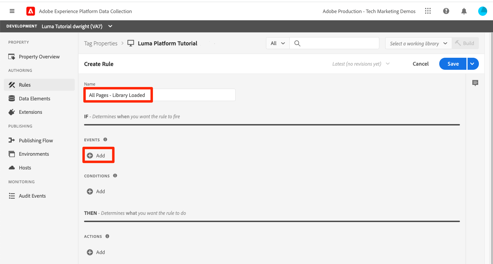
1. Utilice el **[!UICONTROL Núcleo]** **[!UICONTROL Extensión]** y seleccione **[!UICONTROL Library Loaded (Page Top)]** como el **[!UICONTROL Tipo de evento]**. Esta configuración significa que la regla se activa cada vez que la biblioteca de Launch se carga en una página.
1. Seleccionar **[!UICONTROL Conservar cambios]** para volver a la pantalla de regla principal
   
1. Salir **[!UICONTROL Condiciones]** vacío, ya que queremos que esta regla se active en todas las páginas, según el nombre que le dimos
1. En **[!UICONTROL Acciones]**, seleccione la **[!UICONTROL Añadir]** botón
1. Utilice el **[!UICONTROL SDK web de Adobe Experience Platform]** **[!UICONTROL Extensión]** y seleccione **[!UICONTROL Enviar evento]** como el **[!UICONTROL Tipo de acción]**
1. A la derecha, seleccione **[!UICONTROL web.webpagedetails.pageViews]** desde el **[!UICONTROL Tipo]** desplegable. Este es uno de los campos XDM de nuestra `Luma Web Events Schema`
1. Seleccionar **[!UICONTROL Conservar cambios]** para volver a la pantalla de regla principal
   
1. Seleccionar **[!UICONTROL Guardar]** para guardar la regla\
   

## Publicación de la regla en una biblioteca

A continuación, publicaremos la regla en nuestro entorno de desarrollo para que podamos verificar que funcione.

<!--
There are a few quick steps we must take in the **[!UICONTROL Publishing]** section of Launch.

### Create a host

Launch libraries can be hosted on Adobe's Content Delivery Network (CDN) or on your own servers. In this tutorial, we will use Adobe's CDN since it is faster to set up:

1. Go to **[!UICONTROL Hosts]** in the left navigation
1. Select the **[!UICONTROL Create New Host]** button
       
1. For the **[!UICONTROL Name]**, enter `Adobe CDN`
1. For the **[!UICONTROL Type]**, select **[!UICONTROL Managed by Adobe]**
1. Select the **[!UICONTROL Save]** button to complete the setup of the host
       

### Create an environment

Environments allow you to have different versions of a library in different publishing environments to accommodate your publishing workflow. For example, the fully tested version of your library can be published to a Production environment, while new changes are being created in a Development environment. You can also use different hosts for each environment. To create an environment:

1. Go to **[!UICONTROL Environments]** in the left navigation
1. Select the **[!UICONTROL Create New Environment]** button
     
1. Under **[!UICONTROL Development]** select **[!UICONTROL Select]**   
     
1. For the **[!UICONTROL Name]**, enter `Development`
1. For the **[!UICONTROL Select Host]** dropdown, select `Adobe CDN`
1. Select the **[!UICONTROL Save]** button to complete the setup of the environment
    
1. You will see a modal with URL and other implementation details of this library. These are critical for a real Launch implementation, but we don't need to worry about them for this tutorial. Select the **[!UICONTROL Close]** button to exit the modal.

### Create and publish the library

Now let's bundle the contents of our property&mdash;currently an extension and a rule&mdash;into a library. 
-->

Para crear una biblioteca:

1. Ir a **[!UICONTROL Flujo de publicación]** en el panel de navegación izquierdo
1. Seleccionar **[!UICONTROL Añadir biblioteca]**
   
1. Para el **[!UICONTROL Nombre]**, introduzca `Luma Platform Tutorial`
1. Para el **[!UICONTROL Entorno]**, seleccione `Development`
1. Seleccione el **[!UICONTROL Añadir todos los recursos modificados]** botón. (Además de la [!UICONTROL SDK web de Adobe Experience Platform] y la extensión de `All Pages - Library Loaded` regla, también verá el [!UICONTROL Núcleo] se ha añadido una extensión que contiene el JavaScript base requerido por todas las propiedades web de Launch).
1. Seleccione el **[!UICONTROL Guardar y generar para desarrollo]** botón
   

La biblioteca puede tardar unos minutos en crearse y, cuando se completa, muestra un punto verde a la izquierda del nombre de la biblioteca:

Como puede ver en el [!UICONTROL Flujo de publicación] En la pantalla de, hay mucho más en el proceso de publicación que está fuera del ámbito de este tutorial. Solo vamos a usar una sola biblioteca en nuestro entorno de desarrollo.

## Validar los datos de la solicitud

### Añadir Adobe Experience Platform Debugger

Experience Platform Debugger es una extensión disponible para los navegadores Chrome y Firefox que permite ver la tecnología de Adobe implementada en las páginas web. Descargue la versión para su navegador preferido:

* [Extensión de Firefox](https://addons.mozilla.org/es/firefox/addon/adobe-experience-platform-dbg/)
* [Extensión de Chrome](https://chrome.google.com/webstore/detail/adobe-experience-platform/bfnnokhpnncpkdmbokanobigaccjkpob)

Si nunca antes ha utilizado Debugger (y este es diferente del antiguo Adobe Experience Cloud Debugger), puede que desee ver este vídeo de información general de cinco minutos:

>[!VIDEO](https://video.tv.adobe.com/v/32156?quality=12&learn=on)

### Abra el sitio web de Luma.

Para este tutorial, utilizamos una versión alojada públicamente del sitio web de demostración de Luma. Vamos a abrirlo y marcarlo como favorito:

1. En una nueva pestaña del explorador, abra el [Sitio web de Luma](https://luma.enablementadobe.com/content/luma/us/en.html).
1. Marcar la página para usarla en el resto del tutorial.

Este sitio web alojado es la razón por la que utilizamos `enablementadobe.com` en el [!UICONTROL Domains] del campo de configuración inicial de la propiedad de etiquetas y por qué se ha utilizado `data.enablementadobe.com` como dominio de origen en el [!UICONTROL SDK web de Adobe Experience Platform] extensión. ¡Mira, tenía un plan!

### Utilice Experience Platform Debugger para asignarlo a la propiedad de etiquetas

Experience Platform Debugger tiene una característica interesante que le permite reemplazar una propiedad de etiqueta existente por otra diferente. Esto resulta útil para la validación y nos permite omitir muchos pasos de implementación en este tutorial.

1. Asegúrese de tener el sitio de Luma abierto y seleccionar el icono de extensión de Experience Platform Debugger.
1. Debugger se abrirá y mostrará algunos detalles de la implementación codificada, que no están relacionados con este tutorial (puede que tenga que volver a cargar el sitio de Luma después de abrir Debugger).
1. Confirme que Debugger es &quot;**[!UICONTROL Conectado a Luma]**&quot; como se muestra a continuación y, a continuación, seleccione el &quot;**[!UICONTROL bloquear]**&quot; para bloquear Debugger en el sitio de Luma.
1. Seleccione el **[!UICONTROL Iniciar sesión]** en la parte superior derecha para autenticarse.
1. Ahora, vaya a **[!UICONTROL Launch]** en el panel de navegación izquierdo
1. Seleccione la pestaña Configuración
1. A la derecha de donde muestra el **[!UICONTROL Códigos incrustados de página]**, abra el **[!UICONTROL Acciones]** y seleccione. **[!UICONTROL Reemplazar]**
   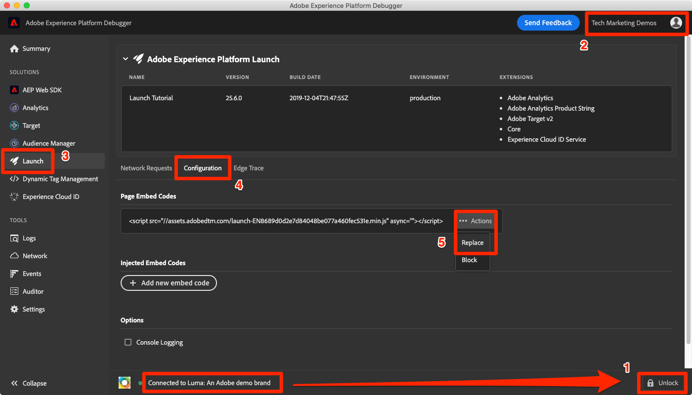
1. Dado que se ha autenticado, Debugger extraerá las propiedades y entornos de Launch disponibles. Seleccione su `Luma Platform Tutorial` propiedad
1. Seleccione su `Development` entorno
1. Seleccione el **[!UICONTROL Aplicar]** botón
   
1. El sitio web de Luma se volverá a cargar _con la propiedad de etiquetas_. ¡Ayuda, me han hackeado! Sólo bromeaba.
   
1. Ir a **[!UICONTROL Resumen]** en el panel de navegación izquierdo, para ver los detalles de su [!UICONTROL Launch] propiedad
   
1. Ahora, vaya a **[!UICONTROL SDK web de AEP]** en el panel de navegación izquierdo para ver la **[!UICONTROL Solicitudes de red]**
1. Abra el **[!UICONTROL eventos]** reñir

   
1. Observe cómo podemos ver el `web.webpagedetails.pageView` tipo de evento especificado en nuestra [!UICONTROL Enviar evento] acción y otras variables listas para usar que se ajustan a la variable `AEP Web SDK ExperienceEvent Mixin` formato
   
1. Estos tipos de detalles de solicitud también están visibles en las herramientas para desarrolladores web del explorador **Red** pestaña. Ábrala y vuelva a cargar la página. Filtrar por llamadas con `interact` para localizar la llamada, selecciónela y, a continuación, busque en **Encabezados** pestaña, **Solicitar carga útil** área.
   
1. Vaya a la **Respuesta** y observe cómo se incluye el valor de ECID en la respuesta. Copie este valor tal como lo utilizará para validar la información de perfil en el siguiente ejercicio.
   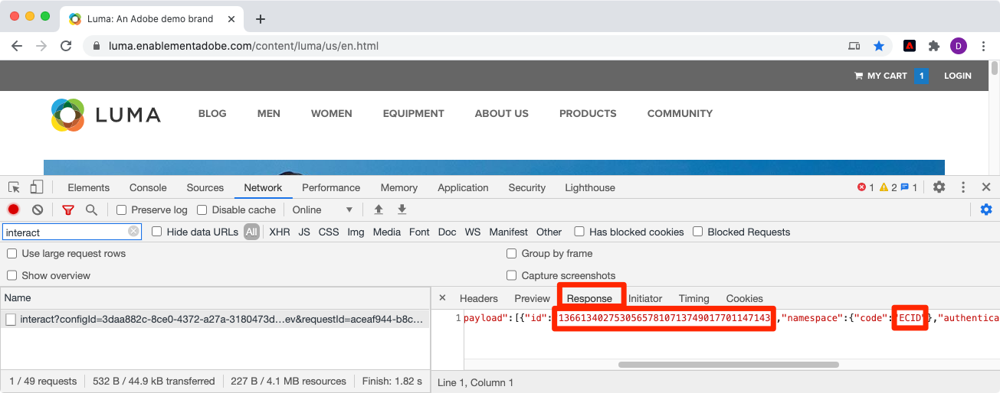

## Validación de los datos en Experience Platform

Puede validar que los datos están llegando a Platform consultando los lotes de datos que llegan a `Luma Web Events Dataset`. (Lo sé, se llama ingesta de datos de streaming, pero ahora estoy diciendo que llega en lotes! Se transmite en tiempo real al perfil de, por lo que puede utilizarse para la segmentación y activación en tiempo real, pero se envía en lotes cada 15 minutos al lago de datos).

Para validar los datos:

1. En la interfaz de usuario de Platform, vaya a **[!UICONTROL Conjuntos de datos]** en el panel de navegación izquierdo
1. Abra el `Luma Web Events Dataset` y confirme que ha llegado un lote. Recuerde que se envían cada 15 minutos, por lo que es posible que tenga que esperar a que aparezca el lote.
1. Seleccione el **[!UICONTROL Previsualizar conjunto de datos]** botón
   
1. En el modal de vista previa, observe cómo puede seleccionar diferentes campos del esquema a la izquierda para previsualizar esos puntos de datos específicos:
   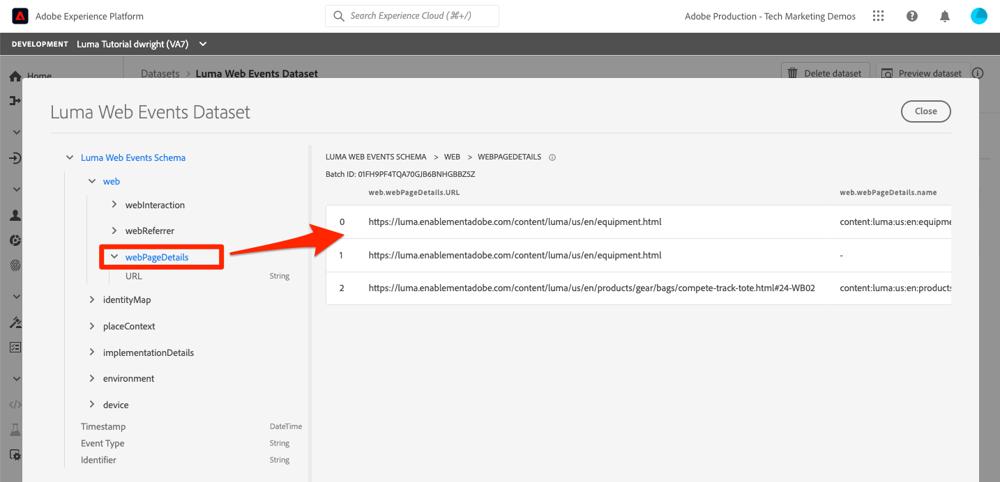

También puede confirmar que se muestra el nuevo perfil:

1. En la interfaz de usuario de Platform, vaya a **[!UICONTROL Perfiles]** en el panel de navegación izquierdo
1. Seleccione el **[!UICONTROL ECID]** y busque su valor ECID (cópielo de la respuesta). El perfil tendrá su propio ID, independiente del ECID.
1. Seleccione el **[!UICONTROL ID de perfil]** para abrir el perfil
   
1. Seleccione el **[!UICONTROL Eventos]** para ver las páginas que ha visto
   \
   <!---->

## Añadir datos personalizados al evento

### Creación de un elemento de datos para el nombre de página

1. En la interfaz de etiquetas de recopilación de datos, en la esquina superior derecha de su `Luma Platform Tutorial` , abra la propiedad **[!UICONTROL Seleccionar una biblioteca de trabajo]** y seleccione su `Luma Platform Tutorial` biblioteca. Esta configuración facilita la publicación de actualizaciones adicionales en la biblioteca.
1. Ahora, vaya a **[!UICONTROL Elementos de datos]** en el panel de navegación izquierdo
1. Seleccione el **[!UICONTROL Crear nuevo elemento de datos]** botón

   
1. Como el **[!UICONTROL Nombre]**, introduzca `Page Name`
1. Como el **[!UICONTROL Tipo de elemento de datos]**, seleccione `JavaScript Variable`
1. Como el **[!UICONTROL Nombre de variable JavaScript]**, introduzca `digitalData.page.pageInfo.pageName`
1. Para ayudar a estandarizar el formato de los valores, marque las casillas de **[!UICONTROL Forzar valor de minúsculas]** y **[!UICONTROL Limpiar texto]**
1. Asegúrese de que `Luma Platform Tutorial` está seleccionado como la biblioteca de trabajo
1. Seleccionar **[!UICONTROL Guardar en biblioteca]**
   

### Asigne el nombre de página al elemento de datos del objeto XDM

Ahora asignaremos el nombre de página al SDK web.

>[!IMPORTANT]
>
>Para completar esta tarea, debemos asegurarnos de que el usuario tenga acceso primero a la zona protegida de producción. Si aún no tiene acceso a la zona protegida de producción desde un perfil de producto diferente, abra rápidamente el `Luma Tutorial Platform` perfil y agregar el elemento de permiso **[!UICONTROL Zonas protegidas]** > **[!UICONTROL Prod]**. Después, haga una SHIFT-Reload en la página Elementos de datos para borrar la caché
>

En el **[!UICONTROL Elementos de datos]** página:

1. Creación de un nuevo elemento de datos
1. Como el **[!UICONTROL Nombre]**, introduzca `XDM Object`
1. Como el **[!UICONTROL Extensión]**, seleccione `Adobe Experience Platform Web SDK`
1. Como el **[!UICONTROL Tipo de elemento de datos]**, seleccione `XDM object`
1. Como el **[!UICONTROL Sandbox]**, seleccione su `Luma Tutorial` espacio aislado
1. Como el **[!UICONTROL Esquema]**, seleccione su `Luma Web Events Schema`
1. Seleccione el `web.webPageDetails.name` campo
1. Como el **[!UICONTROL Valor]**, seleccione el icono para abrir el modal de selección de elementos de datos y elija su `Page Name` elemento de datos
1. Seleccionar **[!UICONTROL Guardar en biblioteca]**
   

Este mismo proceso se utiliza para asignar datos personalizados adicionales del sitio web a campos XDM.

### Añadir los datos XDM a la acción Enviar evento

Ahora que los datos están asignados a campos XDM, puede incluirlos en la acción Enviar evento:

1. Vaya a la **[!UICONTROL Reglas]** pantalla
1. Abra su `All Pages - Library Loaded` regla
1. Abra el `Adobe Experience Platform Web SDK - Send Event` acción
1. Como el **[!UICONTROL Datos XDM]**, seleccione el icono para abrir el modal de selección de elementos de datos y elija su `XDM Object` elemento de datos
1. Seleccione el **[!UICONTROL Conservar cambios]** botón
   
1. Ahora, ya que has tenido `Luma Platform Tutorial` seleccionado como su biblioteca de trabajo para los últimos ejercicios, los cambios recientes se han guardado directamente en la biblioteca. En lugar de tener que publicar los cambios a través de la pantalla Flujo de publicación, puede abrir el menú desplegable en el botón azul y seleccionar **[!UICONTROL Guardar en biblioteca y crear]**
   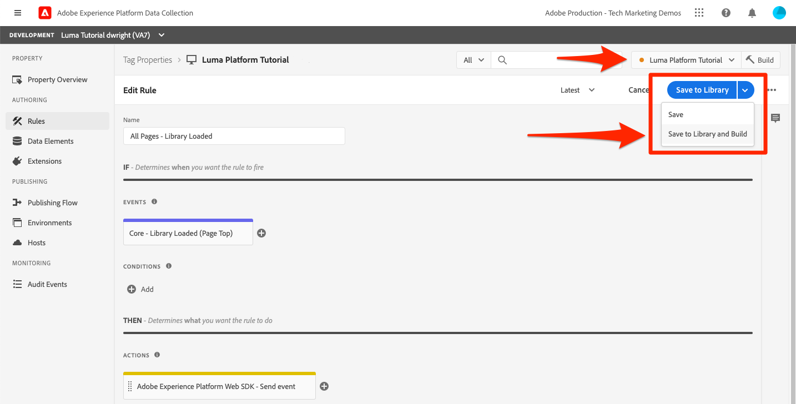

Esto comienza a crear una nueva biblioteca de etiquetas con los tres cambios que acaba de realizar.

### Validación de los datos XDM

Ahora debería poder volver a cargar la página principal de Luma, mientras está asignada a la propiedad de etiqueta mediante el depurador, como ha aprendido anteriormente, y ver que el campo de nombre de página se rellena en la solicitud.
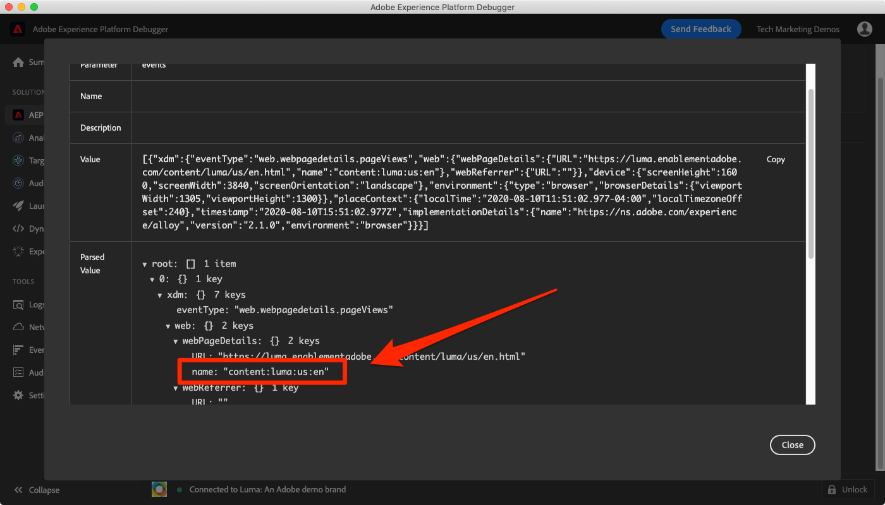

También puede validar los datos de nombre de página recibidos en Platform mediante la vista previa del conjunto de datos y el perfil.

## Envío de identidades adicionales

La implementación del SDK web ahora envía eventos con el ID de Experience Cloud (ECID) como identificador principal. El SDK web genera automáticamente el ECID, que es único por dispositivo y explorador. Un solo cliente puede tener varios ECID en función del dispositivo y el explorador que utilice. Entonces, ¿cómo podemos obtener una vista unificada de este cliente y vincular su actividad en línea a nuestros datos de CRM, lealtad y compras sin conexión? Lo hacemos recopilando identidades adicionales durante su sesión y vinculando de manera determinista su perfil a través de la vinculación de identidad.

Si lo recuerda, mencioné que utilizaríamos los ID de ECID y CRM como identidades para nuestros datos web en el [Asignar identidades](map-identities.md) lección. Vamos a recopilar el ID de CRM con el SDK web.

### Añadir elemento de datos para el ID de CRM

Primero almacenamos el ID de CRM en un elemento de datos:

1. En la interfaz de etiquetas, añada un elemento de datos denominado `CRM Id`
1. Como el **[!UICONTROL Tipo de elemento de datos]**, seleccione **[!UICONTROL Variable JavaScript]**
1. Como el **[!UICONTROL Nombre de variable JavaScript]**, introduzca `digitalData.user.0.profile.0.attributes.username`
1. Seleccione el **[!UICONTROL Guardar en biblioteca]** botón (`Luma Platform Tutorial` debe seguir siendo su biblioteca de trabajo)
   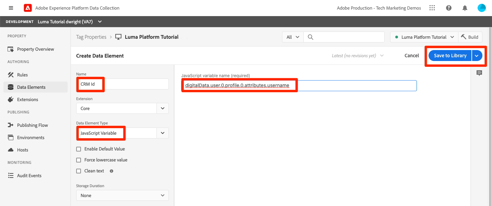

### Añadir el ID de CRM al elemento de datos del mapa de identidad

Ahora que hemos capturado el valor de ID de CRM, debemos asociarlo con un tipo de elemento de datos especial denominado [!UICONTROL Mapa de identidad] elemento de datos:

1. Añada un elemento de datos denominado `Identities`
1. Como el **[!UICONTROL Extensión]**, seleccione **[!UICONTROL SDK web de Adobe Experience Platform]**
1. Como el **[!UICONTROL Tipo de elemento de datos]**, seleccione **[!UICONTROL Mapa de identidad]**
1. Como el **[!UICONTROL Área de nombres]**, introduzca `Luma CRM Id`, que es el [!UICONTROL namespace] hemos creado en una lección anterior

   >[!WARNING]
   >
   >La extensión SDK para web de Adobe Experience Platform versión 2.2 permite seleccionar Área de nombres de una lista desplegable rellenada previamente con los valores reales de la cuenta de Platform. Desafortunadamente, esta función aún no tiene en cuenta la zona protegida y, por lo tanto, la variable `Luma CRM Id` es posible que el valor no aparezca en la lista desplegable. Esto puede impedir que complete este ejercicio. Publicaremos una solución una vez confirmada.

1. Como el **[!UICONTROL ID]**, seleccione el icono para abrir el modal de selección de elementos de datos y elija su `CRM Id` elemento de datos
1. Como el **[!UICONTROL Estado autenticado]**, seleccione **[!UICONTROL Autenticado]**
1. Salir **[!UICONTROL Principal]** _desenfrenado_. Dado que el ID de CRM no está presente para la mayoría de los visitantes del sitio web de Luma, _no desea anular el ECID como identificador principal_. Sería un caso de uso poco frecuente utilizar cualquier cosa que no sea el ECID como identificador principal. Por lo general, no menciono la configuración predeterminada en estas instrucciones, pero llamo a esta para ayudarle a evitar dolores de cabeza más adelante en su propia implementación.
1. Seleccione el **[!UICONTROL Guardar en biblioteca]** botón (`Luma Platform Tutorial` debe seguir siendo su biblioteca de trabajo)
   

>[!NOTE]
>
>Puede pasar varios identificadores usando la variable [!UICONTROL Mapa de identidad] tipo de datos.

### Añadir el elemento de datos del mapa de identidad al objeto XDM

Hay un elemento de datos más que debemos actualizar: el elemento de datos del objeto XDM. Puede parecer extraño tener que actualizar tres elementos de datos separados para pasar esta identidad, pero este proceso está diseñado para escalar para varias identidades. No te preocupes, ¡ya casi terminamos esta lección!

1. Abra el elemento de datos Objeto XDM
1. Abra el campo XDM de IdentityMap
1. Como el **[!UICONTROL Elemento de datos]**, seleccione el icono para abrir el modal de selección de elementos de datos y elija su `Identities` elemento de datos
1. Ahora, ya que has tenido `Luma Platform Tutorial` seleccionado como su biblioteca de trabajo para los últimos ejercicios, los cambios recientes se han guardado directamente en la biblioteca. En lugar de tener que publicar los cambios a través de la pantalla Flujo de publicación, puede abrir el menú desplegable en el botón azul y seleccionar **[!UICONTROL Guardar en biblioteca y crear]**
   

### Validación de la identidad

Para validar que el SDK web ahora envía el ID de CRM:

1. Abra el [Sitio web de Luma](https://luma.enablementadobe.com/content/luma/us/en.html)
1. Asígnelo a la propiedad de etiquetas mediante Debugger, según las instrucciones anteriores
1. Seleccione el **Iniciar sesión** en la parte superior derecha del sitio web de Luma
1. Inicie sesión con las credenciales `test@adobe.com`/`test`
1. Una vez autenticada, inspeccione la llamada del SDK web de Experience Platform en Debugger (**[!UICONTROL SDK web de Adobe Experience Platform]** > **[!UICONTROL Solicitudes de red]** > **[!UICONTROL eventos]** de la solicitud más reciente) y debería ver el `lumaCrmId`:
   
1. Busque el perfil de usuario utilizando el área de nombres y el valor de ECID de nuevo. En el perfil, verá el ID de CRM y también el ID de fidelidad y los detalles del perfil, como el nombre y el número de teléfono. Todas las identidades y los datos se han unido en un único perfil de cliente en tiempo real.
   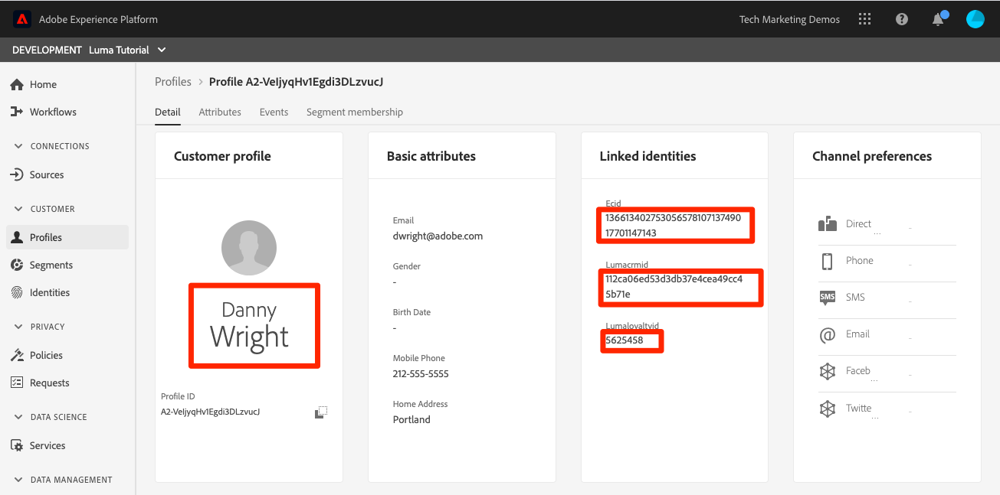

## Recursos adicionales

* [Implementación de Adobe Experience Cloud con SDK web](/help/tutorial-web-sdk/overview.md)
* [Documentación de ingesta de streaming](https://experienceleague.adobe.com/docs/experience-platform/ingestion/streaming/overview.html?lang=es)
* [Referencia de API de ingesta de streaming](https://www.adobe.io/experience-platform-apis/references/data-ingestion/#tag/Streaming-Ingestion)

¡Buen trabajo! Se trataba de mucha información sobre el SDK web y Launch. Hay mucho más involucrado en una implementación completa, pero estos son los conceptos básicos para ayudarle a empezar y ver los resultados en Platform.

>[!NOTE]
>
>Ahora que ha terminado la lección Ingesta de flujo continuo, puede eliminar la [!UICONTROL Prod] zona protegida de su `Luma Tutorial Platform` perfil de producto

Ingenieros de datos, si lo desea, puede pasar directamente al [lección ejecutar consultas](run-queries.md).

Arquitectos de datos, puede pasar a [políticas de combinación](create-merge-policies.md)!
