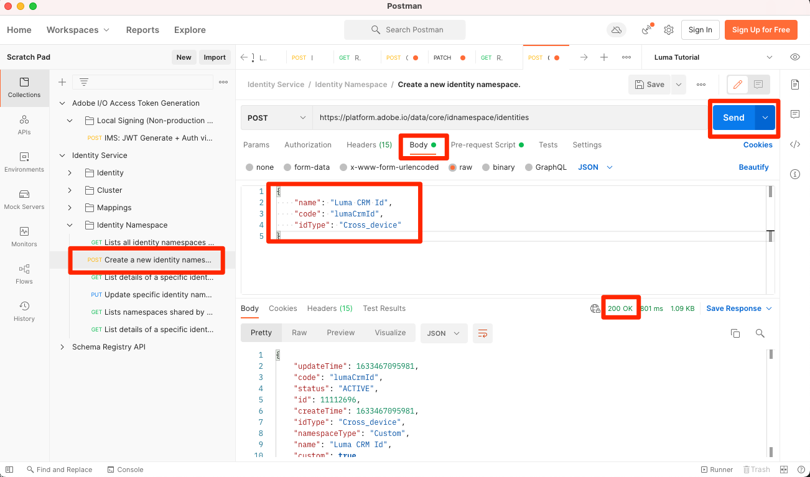

# Asignación de identidades

<!-- 30 min-->

En esta lección, crearemos áreas de nombres de identidad y agregaremos campos de identidad a nuestros esquemas. Después de hacerlo, también podremos completar las relaciones de esquema de la lección anterior.

El servicio de identidad de Adobe Experience Platform le ayuda a obtener una mejor vista de sus clientes y sus comportamientos al unir identidades entre dispositivos y sistemas, lo que le permite ofrecer experiencias digitales personales e impactantes en tiempo real. Los campos de identidad y los espacios de nombres son el pegamento que une diferentes fuentes de datos para crear el perfil de cliente en tiempo real de 360 grados.

**Arquitectos de datos** deberá asignar identidades fuera de este tutorial.

Antes de comenzar los ejercicios, vea este breve vídeo para obtener más información sobre la identidad en Adobe Experience Platform:
>[!VIDEO](https://video.tv.adobe.com/v/27841?quality=12&learn=on)

>[!NOTE]
>
>Los campos de identidad solo son obligatorios si crea perfiles de cliente en tiempo real. No son necesarios si solo está ingiriendo datos en el lago de datos.

<!--explain identity maps-->
<!--explain the strategy behind the identity selection, how these identities will join all the data together-->

## Permisos necesarios

En el [Configuración de permisos](configure-permissions.md) , configure todos los controles de acceso necesarios para completar esta lección.

<!--
* Permission items **[!UICONTROL Identity Management]** > **[!UICONTROL View Identity Namespaces]** and **[!UICONTROL Manage Identity Namespaces]**
* Permission item **[!UICONTROL Data Modeling]** > **[!UICONTROL View Schemas]** and **[!UICONTROL Manage Schemas]**
* Permission item **[!UICONTROL Sandboxes]** > `Luma Tutorial`
* User-role access to the `Luma Tutorial Platform` product profile
* Developer-role access to the `Luma Tutorial Platform` product profile (for API)
-->

## Crear área de nombres de identidad

En este ejercicio, crearemos áreas de nombres de identidad para los campos de identidad personalizados de Luma, `loyaltyId`, `crmId`y `productSku`. Las áreas de nombres de identidad desempeñan un papel fundamental en la creación de perfiles de clientes en tiempo real, ya que dos valores coincidentes en el mismo espacio de nombres permiten que dos fuentes de datos formen un gráfico de identidad.


### Creación de espacios de nombres en la interfaz de usuario

Empecemos creando un espacio de nombres para el esquema de lealtad de Luma:

1. En la interfaz de usuario de Platform, vaya a **[!UICONTROL Identidades]** en la navegación izquierda
1. Verá que hay varias áreas de nombres de identidad predeterminadas disponibles. Seleccione el **[!UICONTROL Crear área de nombres de identidad]** botón
1. Proporcione detalles como los siguientes

   | Campo | Valor |
   |---------------|-----------|
   | Nombre para mostrar | Id De Lealtad De Luma |
   | Símbolo de identidad | lumaLoyaltyId |
   | Tipo |  multidispositivo |

1. Seleccione **[!UICONTROL Crear]**

   

Ahora, configure otro espacio de nombres para el esquema del catálogo de productos de Luma con los siguientes detalles:

| Campo | Valor |
|---------------|-----------|
| Nombre para mostrar | SKU de producto de Luma |
| Símbolo de identidad | lumaProductSKU |
| Tipo | Identificador de no personas |


## Crear un área de nombres de identidad mediante API

Crearemos nuestro espacio de nombres CRM mediante API.

>[!NOTE]
>
>Si prefiere omitir los ejercicios de API, no dude en crear el espacio de nombres de CRM a través del método de interfaz de usuario que utilizó con los siguientes detalles:
>
> 1. Como **[!UICONTROL Nombre para mostrar]**, use `Luma CRM Id`
> 1. Como **[!UICONTROL Símbolo de identidad]**, use `lumaCrmId`
> 1. Como **[!UICONTROL Tipo]**, utilice dispositivos cruzados


Vamos a crear el área de nombres de identidad `Luma CRM Id`:

1. Descargar [Servicio de identidad.postman_collection.json](https://raw.githubusercontent.com/adobe/experience-platform-postman-samples/master/apis/experience-platform/Identity%20Service.postman_collection.json) a su `Luma Tutorial Assets` carpeta
1. Importar la colección en [!DNL Postman]
1. Si no ha realizado una solicitud en las últimas 24 horas, es probable que los tokens de autorización hayan caducado. Abra la solicitud **[!DNL Adobe I/O Access Token Generation > Local Signing (Non-production use-only) > IMS: JWT Generate + Auth via User Token]** y seleccione **Enviar** para solicitar nuevos tokens de acceso y JWT.
1. Seleccione la solicitud **[!UICONTROL Servicio de identidad] > [!UICONTROL Área de nombres de identidad] > [!UICONTROL Crear un nuevo área de nombres de identidad].**
1. Pegue lo siguiente como [!DNL Body] de la solicitud:

   ```json
   {
       "name": "Luma CRM Id",
       "code": "lumaCrmId",
       "idType": "Cross_device"
   }
   ```

1. Pulse el botón **Enviar** y debe obtener un **200 OK** Respuesta:

   

Si vuelve a la interfaz de usuario, debería ver las tres nuevas áreas de nombres personalizadas:


## Etiquetado de campos de identidad en esquemas

Ahora que tenemos áreas de nombres, el siguiente paso es actualizar nuestros esquemas para etiquetar nuestros campos de identidad.


### Etiquetado de campos XDM para identidad principal

Cada esquema utilizado con el perfil del cliente en tiempo real es necesario para tener especificada una identidad principal. Y cada registro ingerido debe tener un valor para ese campo.

Añadamos una identidad principal al `Luma Loyalty Schema`:

1. Abra el `Luma Loyalty Schema`
1. Seleccione el `Luma Identity profile field group`
1. Seleccione el `loyaltyId` field
1. Marque la **[!UICONTROL Identidad]** box
1. Marque la **[!UICONTROL Identidad principal]** también
1. Seleccione el `Luma Loyalty Id` espacio de nombres de **[!UICONTROL Espacios de nombres de identidad]** lista desplegable
1. Select **[!UICONTROL Aplicar]**
1. Seleccione **[!UICONTROL Guardar]**

   

Repita el proceso para algunos de los demás esquemas:

1. En el `Luma CRM Schema`, etiquete la etiqueta `crmId` como identidad principal utilizando la variable `Luma CRM Id` namespace
1. En el `Luma Offline Purchase Events Schema`, etiquete la etiqueta `loyaltyId` como identidad principal utilizando la variable `Luma Loyalty Id` namespace
1. En el `Luma Product Catalog Schema`, etiquete la etiqueta `productSku` como identidad principal utilizando la variable `Luma Product SKU` namespace

>[!NOTE]
>
>Los datos recopilados con el SDK web son una excepción a la práctica habitual de etiquetar campos de identidad en el esquema . El SDK web utiliza el mapa de identidad para etiquetar identidades *en el lado de la implementación* y por lo tanto, determinaremos las identidades para la variable `Luma Web Events Schema` cuando implementamos el SDK web en el sitio web de Luma. En esa lección posterior, recopilaremos el ID de visitante de Experience Cloud (ECID) como el id principal y crmId como un id secundario.

Con nuestra selección de identidades primarias, es claro ver cómo `Luma CRM Schema` puede conectarse a la `Luma Offline Purchase Events Schema` ya que ambos utilizan `loyaltyId` como identificador. Pero, ¿cómo podemos conectar nuestras compras sin conexión con el comportamiento en línea? ¿Cómo podemos clasificar los productos comprados con nuestro catálogo de productos? Se utilizarán campos de identidad y relaciones de esquema adicionales.

<!--use a visual-->

### Etiquetado de campos XDM para identidad secundaria

Se pueden agregar varios campos de identidad a un esquema. Las identidades no primarias suelen denominarse identidades secundarias. Para conectar las compras sin conexión con el comportamiento en línea, agregaremos crmId como identificador secundario a nuestra `Luma Loyalty Schema` y más tarde en nuestros datos de eventos web. Actualicemos el `Luma Loyalty Schema`:

1. Abra el `Luma Loyalty Schema`
1. Seleccione `Luma Identity Profile Field group`
1. Select `crmId` field
1. Marque la **[!UICONTROL Identidad]** box
1. Seleccione el `Luma CRM Id` espacio de nombres de **[!UICONTROL Espacios de nombres de identidad]** lista desplegable
1. Select **[!UICONTROL Aplicar]** y, a continuación, seleccione **[!UICONTROL Guardar]** para guardar los cambios

   

## Completar las relaciones de esquema

Ahora que tenemos nuestros campos de identidad etiquetados, podemos completar la configuración de las relaciones de esquema entre el catálogo de productos de Luma y los esquemas de eventos:

1. Abra el `Luma Offline Purchase Events Schema`
1. Select **[!UICONTROL Detalles del comercio]** grupo de campos
1. Select **[!UICONTROL productListItems]** > **[!UICONTROL SKU]** field
1. Marque la **[!UICONTROL Relación]** box
1. Select `Luma Product Catalog Schema` como el **[!UICONTROL Esquema de referencia]**
1. `Luma Product SKU` debe rellenarse automáticamente como **[!UICONTROL Área de nombres de identidad de referencia]**
1. Select **[!UICONTROL Aplicar]**
1. Seleccione **[!UICONTROL Guardar]**

   

Repita este proceso para crear una relación entre las `Luma Web Events Schema` y `Luma Product Catalog Schema`.

Tenga en cuenta que después de definir la relación, se indica en las dos **[!UICONTROL Composición]** y **[!UICONTROL Estructura]** del editor de esquemas.


<!--need to verify that the relationship schema works-->

## Recursos adicionales

* Documentación del [Servicio de identidad](https://experienceleague.adobe.com/docs/experience-platform/sandbox/home.html?lang=es)
* [API del servicio de identidad](https://www.adobe.io/experience-platform-apis/references/identity-service/)

Ahora que nuestras identidades están establecidas, podemos [crear nuestros conjuntos de datos](create-datasets.md)!
