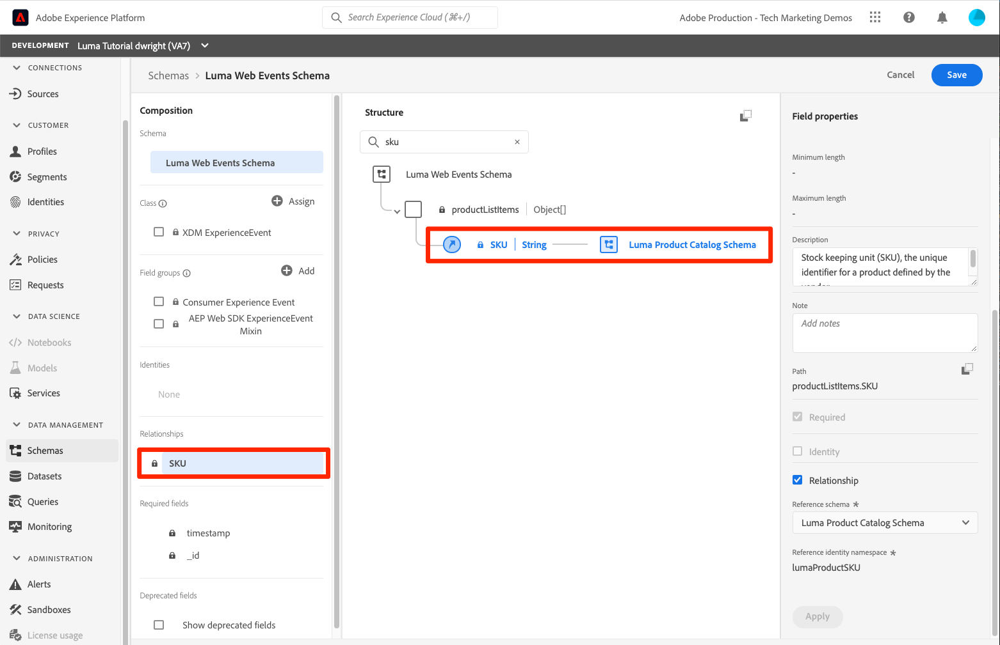

# Asignación de identidades

<!-- 30 min-->

En esta lección, crearemos espacios de nombres de identidad y agregaremos campos de identidad a nuestros esquemas. Después de hacerlo, también podremos completar las relaciones esquema de la lección anterior.

Adobe Experience Platform servicio de identidad le ayuda a obtener una mejor vista de sus clientes y sus comportamientos al unir identidades entre dispositivos y sistemas, lo que le permite ofrecer experiencias digitales impactantes y personales en tiempo real. Los campos de identidad y los espacios de nombres son el pegamento que une diferentes orígenes de datos para versión el perfil del cliente en tiempo real de 360 grados.

**Los arquitectos** de datos deberán asignar identidades fuera de este tutorial.

Antes de comenzar los ejercicios, vea este breve vídeo para obtener más información sobre la identidad en Adobe Experience Platform:
>[!VIDEO](https://video.tv.adobe.com/v/3422777?learn=on&enablevpops&captions=spa)

>[!NOTE]
>
>Los campos de identidad solo son necesarios si crea perfiles de clientes en tiempo real. No son necesarios si solo está introduciendo datos en el lago de datos.

<!--explain identity maps-->
<!--explain the strategy behind the identity selection, how these identities will join all the data together-->

## Permisos necesarios

En la lección [Configurar permisos](configure-permissions.md), configuró todos los controles de acceso necesarios para completar esta lección.

<!--
* Permission items **[!UICONTROL Identity Management]** > **[!UICONTROL View Identity Namespaces]** and **[!UICONTROL Manage Identity Namespaces]**
* Permission item **[!UICONTROL Data Modeling]** > **[!UICONTROL View Schemas]** and **[!UICONTROL Manage Schemas]**
* Permission item **[!UICONTROL Sandboxes]** > `Luma Tutorial`
* User-role access to the `Luma Tutorial Platform` product profile
* Developer-role access to the `Luma Tutorial Platform` product profile (for API)
-->

## Espacio de nombres de identidad Crear

En este ejercicio, crearemos espacios de nombres de identidad para los campos de identidad personalizados de Luma, `loyaltyId`, `crmId`, y `productSku`. Las áreas de nombres de identidad desempeñan un papel esencial en la creación de perfiles de clientes en tiempo real, ya que dos valores coincidentes en la misma área de nombres permiten que dos fuentes de datos formen un gráfico de identidad.


### Crear Espacios de nombres en el IU

Vamos inicio creando un espacio de nombres para el esquema de lealtad de Luma:

1. En la interfaz de usuario Platform, vaya a **[!UICONTROL Identidades]** en el navegación izquierdo
1. Observará que hay varios espacios de nombres de identidad predeterminados disponibles. Seleccione el espacio **de nombres de** identidad Crear botón
1. Proporcione los siguientes detalles:

   | Campo | Valor |
   |---------------|-----------|
   | Nombre para mostrar | ID de fidelidad de Luma |
   | Símbolo de identidad | lumaLoyaltyId |
   | Tipo | Dispositivos cruzados |

1. Seleccione **[!UICONTROL Crear]**

   

Ahora configure otra área de nombres para el esquema del catálogo de productos de Luma con los siguientes detalles:

| Campo | Valor |
|---------------|-----------|
| Nombre para mostrar | unidad de almacén de productos Luma |
| Símbolo de identidad | lumaProductSKU |
| Tipo | Identificador de no personas |


## Crear espacio de nombres de identidad usando API

Crearemos nuestro espacio de nombres CRM a través de API.

>[!NOTE]
>
>Si prefiere omitir los ejercicios de API, siéntase gratuito de crear el espacio de nombres CRM a través del método de interfaz de usuario que utilizó con los siguientes detalles:
>
> 1. Como nombre **para** mostrar, use`Luma CRM Id`
> 1. Como símbolo **de** identidad, utilice`lumaCrmId`
> 1. Como tipo **, use Entre** dispositivos

Vamos a crear el espacio `Luma CRM Id`de nombres de identidad:

1. Descargar [servicio de identidad.postman_collection.json](https://raw.githubusercontent.com/adobe/experience-platform-postman-samples/master/apis/experience-platform/Identity%20Service.postman_collection.json) en la carpeta `Luma Tutorial Assets`
1. Importar la colección en [!DNL Postman]
1. Si no cuenta con un token de acceso, abra la solicitud **[!DNL OAuth: Request Access Token]** y seleccione **Enviar** para solicitar un nuevo token de acceso.
1. Seleccione la solicitud **[!UICONTROL Servicio de identidad] > [!UICONTROL Área de nombres de identidad] > [!UICONTROL Crear un nuevo área de nombres de identidad].**
1. Pegue lo siguiente como [!DNL Body] de la solicitud:

   ```json
   {
       "name": "Luma CRM Id",
       "code": "lumaCrmId",
       "idType": "Cross_device"
   }
   ```

1. Presione Enviar **&#x200B;**&#x200B;botón y obtendrá una **respuesta de 200 OK**:

   

Si vuelve a la interfaz de usuario, debería ver los tres nuevos espacios de nombres personalizados:


## Etiquetar campos de identidad en esquemas

Ahora que tenemos nuestros espacios de nombres, el siguiente paso es actualizar nuestros esquemas para etiquetar nuestros campos de identidad.


### Etiquetar campos XDM para identidad principal

Todas las esquema utilizadas con el perfil del cliente en tiempo real deben tener una identidad principal especificada. Y cada registro ingerido debe tener un valor para ese campo.

Agreguemos una identidad principal a `Luma Loyalty Schema`:

1. Abra el `Luma Loyalty Schema`
1. Seleccione el `Luma Identity profile field group`
1. Seleccione el `loyaltyId` campo
1. Marque la **[!UICONTROL casilla Identidad]**
1. Marque también la **[!UICONTROL casilla Identidad]** principal
1. Seleccione el espacio de nombres en el `Luma Loyalty Id` menú desplegable Espacios **de** nombres de identidad
1. Seleccione **[!UICONTROL Aplicar]**
1. Seleccione **[!UICONTROL Guardar]**

   

Repita el proceso para alguno de los demás esquemas:

1. En `Luma CRM Schema`, etiquete el campo `crmId` como la identidad principal mediante el área de nombres `Luma CRM Id`
1. En `Luma Offline Purchase Events Schema`, etiquete el campo `loyaltyId` como la identidad principal mediante el área de nombres `Luma Loyalty Id`
1. En `Luma Product Catalog Schema`, etiquete el campo `productSku` como la identidad principal mediante el área de nombres `Luma Product SKU`

>[!NOTE]
>
>Los datos recopilados con el SDK web constituyen una excepción a la práctica habitual de etiquetar campos de identidad en el esquema. El SDK web utiliza el mapa de identidad para etiquetar identidades *en el lado implementación y* , por lo tanto, determinaremos las identidades para el `Luma Web Events Schema` momento en que implementar el SDK web en el sitio web de Luma. En esa lección posterior, recopilaremos el ID de visitante de Experience Cloud (ECID) como ID principal y crmId como ID secundario.

Con nuestra selección de identidades primarias, es claro ver cómo `Luma Loyalty Schema` se puede conectar con el `Luma Offline Purchase Events Schema` ya que ambos usan loyaltyId como identificador. Pero, ¿cómo puede el CRM conectarse a los eventos de compra sin conexión? ¿Cómo podemos conectar nuestras compras sin conexión con en línea comportamiento? ¿Y cómo podemos clasificar los productos adquiridos con nuestro catálogo de productos? Utilizaremos campos de identidad adicionales y esquema relaciones.

<!--use a visual-->

### Etiquetar Campos XDM para identidad secundaria

Se pueden añadir varios campos de identidad a una esquema. Las identidades no primarias a menudo se denominan identidades secundarias. Para conectar sin conexión compras con en línea comportamiento, añadiremos el crmId como identificador secundario a nuestros datos de eventos web y posteriormente a los `Luma Loyalty Schema` nuestros. Actualicemos el `Luma Loyalty Schema`:

1. Abra el `Luma Loyalty Schema`
1. Escoger `Luma Identity Profile Field group`
1. Seleccionar `crmId` campo
1. Marque la **[!UICONTROL casilla Identidad]**
1. Seleccione el espacio de nombres en el `Luma CRM Id` menú desplegable Espacios **de** nombres de identidad
1. Seleccione **[!UICONTROL Aplicar]** y, a continuación, seleccione el **[!UICONTROL botón Guardar]** para guardar los cambios

   

## Todas las aplicaciones las relaciones esquema

Ahora que tenemos los campos de identidad etiquetados, podemos completar la configuración de las relaciones de esquema entre el catálogo de productos de Luma y los esquemas de eventos:

1. Abrir `Luma Offline Purchase Events Schema`
1. Seleccionar **[!UICONTROL detalles de Commerce]** grupo de campos
1. Seleccione el campo **[!UICONTROL productListItems]** > **[!UICONTROL SKU]**
1. Marque la casilla **[!UICONTROL Relación]**
1. Seleccione `Luma Product Catalog Schema` como **[!UICONTROL esquema de referencia]**
1. `Luma Product SKU` debe rellenarse automáticamente como el espacio de nombres de identidad de **[!UICONTROL referencia]**
1. Seleccione **[!UICONTROL Aplicar]**
1. Seleccione **[!UICONTROL Guardar]**

   

Repita este proceso para crear una relación entre el `Luma Web Events Schema` y el `Luma Product Catalog Schema`.

Tenga en cuenta que después de definir la relación, se indica en la **[!UICONTROL sección Composición]** y **[!UICONTROL Estructura]** del esquema editor.



<!--need to verify that the relationship schema works-->

## Recursos adicionales

* [Documentación del servicio de identidad](https://experienceleague.adobe.com/docs/experience-platform/identity/home.html?lang=es)
* [API del servicio de identidad](https://www.adobe.io/experience-platform-apis/references/identity-service/)

Ahora que nuestras identidades están en su lugar, ¡podemos [crear nuestros conjuntos de datos](create-datasets.md)!
