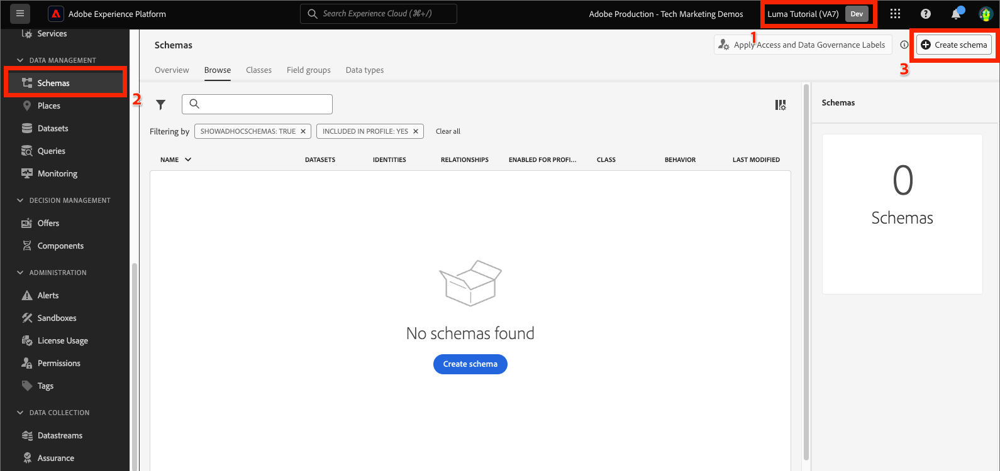
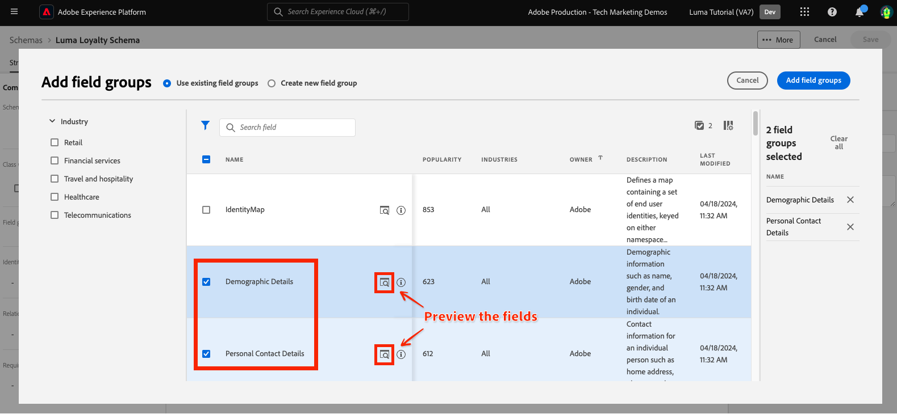
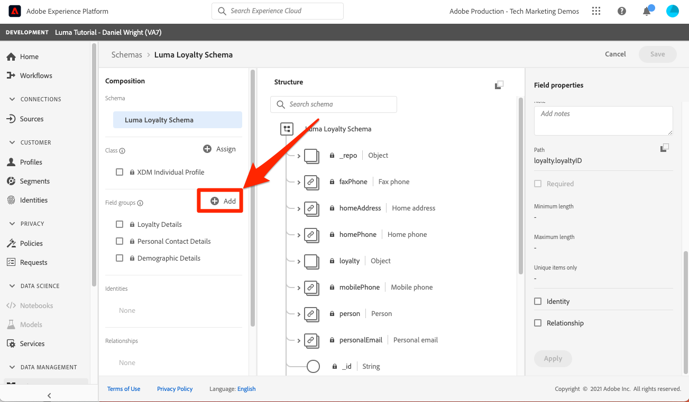
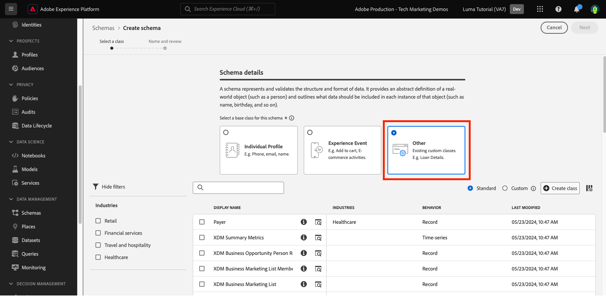
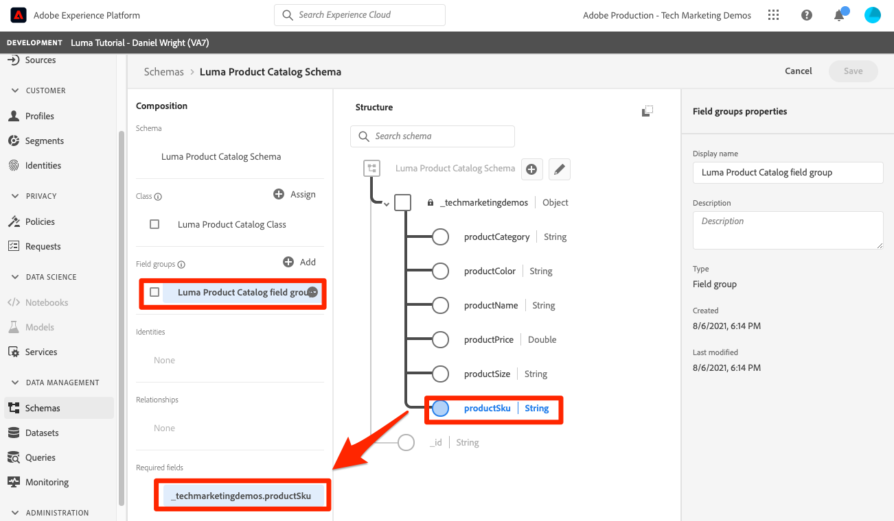

# Datos de modelo en esquemas

<!-- 60min -->
En esta lección, modelará los datos de Luma en esquemas. Esta es una de las lecciones más largas del tutorial, ¡así que toma un vaso de agua y abróchate!

La estandarización y la interoperabilidad son conceptos clave detrás de Adobe Experience Platform. El modelo de datos de experiencia (XDM) es un esfuerzo para estandarizar los datos de experiencia del cliente y definir esquemas para la administración de experiencias del cliente.

XDM es una especificación documentada públicamente y diseñada para mejorar la potencia de las experiencias digitales. Proporciona estructuras y definiciones comunes para cualquier aplicación que se utilice para comunicarse con los servicios de Platform. Al adherirse a los estándares XDM, todos los datos de experiencia del cliente se pueden incorporar en una representación común que puede ofrecer perspectivas de una manera más rápida e integrada. Puede obtener información valiosa de las acciones de los clientes, definir las audiencias de los clientes mediante segmentos y expresar los atributos del cliente con fines de personalización.

XDM es el marco de trabajo básico que permite a Adobe Experience Cloud, con tecnología de Experience Platform, enviar el mensaje correcto a la persona adecuada, en el canal correcto, en el momento exacto. La metodología en la que se basa Experience Platform. **Sistema XDM**, pone en funcionamiento esquemas del Modelo de datos de experiencia para que los utilicen los servicios de Platform.

<!--
This seems too lengthy. The video should suffice

Key terms:

* **Schema**: a representation of your data. A schema is comprised of a class and optional field groups and is used to create datasets. A schema includes behavioral attributes, timestamp, identity, attribute definitions, and relationships.
* **XDM Profile Class**: a common schema class used to represent record data
* **XDM ExperienceEvent Class**: a common schema class used to represent time-series data
* **Field group**: allows users to extend reusable fields that contain variables defining one or more attribute intended to be included in a schema or added to a class.
* **Standard Field group**: an open-source Field group built to conform to common industry standards, used to accelerate implementation and support repeatable services operating on the data
* **Data type**: a reusable object with properties in a hierarchical representation. These can be standard types or custom-defined defined types to describe your own data in your own way (for example, a collection of fields that you use to describe your products). Unlike Field groups, data types can be used in schemas regardless of the class.
* **Field**: a field is the lowest level element of a schema. Each field has a name for referencing and a type to identify the type of data that it contains. Field types can include, integer, number, string, Boolean and schema.
-->

**Arquitectos de datos** deberá crear esquemas fuera de este tutorial, pero **Ingenieros de datos** trabajará estrechamente con los esquemas creados por el arquitecto de datos.

Antes de comenzar los ejercicios, vea este breve vídeo para obtener más información sobre los esquemas y el modelo de datos de experiencia (XDM):
>[!VIDEO](https://video.tv.adobe.com/v/27105?quality=12&learn=on)

>[!TIP]
>
> Para profundizar en el modelado de datos en Experience Platform, recomendamos realizar el curso [Modelar los datos de la experiencia del cliente con XDM](https://experienceleague.adobe.com/?recommended=ExperiencePlatform-D-1-2021.1.xdm&amp;lang=es), disponible de forma gratuita en Experience League.

## Permisos necesarios

En el [Configuración de permisos](configure-permissions.md) Esta lección, ha configurado todos los controles de acceso necesarios para completar esta lección.

<!--, specifically:

* Permission items **[!UICONTROL Data Modeling]** > **[!UICONTROL View Schemas]** and **[!UICONTROL Manage Schemas]**
* Permission item **[!UICONTROL Sandboxes]** > `Luma Tutorial`
* User-role access to the `Luma Tutorial Platform` product profile
* Developer-role access to the `Luma Tutorial Platform` product profile (for API)-->


<!--
## Luma's goals
-->

## Crear esquema de fidelización mediante la IU

En este ejercicio, crearemos un esquema para los datos de fidelidad de Luma.

1. Vaya a la interfaz de usuario de Platform y asegúrese de que la zona protegida está seleccionada.
1. Ir a **[!UICONTROL Esquemas]** en el panel de navegación izquierdo
1. Seleccione el botón de **[!UICONTROL Crear esquema]** en la parte superior derecha
1. En el menú desplegable, seleccione **[!UICONTROL Perfil individual de XDM]**, ya que vamos a modelar atributos de un cliente individual (puntos, estado, etc.).
   

### Adición de grupos de campos estándar

A continuación, se le pedirá que añada grupos de campos al esquema. Todos los campos deben añadirse a los esquemas utilizando grupos. Puede elegir entre un gran conjunto de grupos de campos estándar del sector proporcionados por Adobe o crear los suyos propios. A medida que empiece a modelar sus propios datos en Experience Platform, es bueno familiarizarse con los grupos de campo estándar del sector que proporciona Adobe. Siempre que sea posible, se recomienda utilizarlos, ya que a veces alimentan servicios descendentes, como inteligencia artificial aplicada al cliente, Attribution AI y Adobe Analytics.

Al trabajar con sus propios datos, un paso importante será determinar cuáles de sus propios datos deben capturarse en Platform y cómo deben modelarse. Este gran tema se analiza con más detalle en el curso [Modelar los datos de la experiencia del cliente con XDM](https://experienceleague.adobe.com/?recommended=ExperiencePlatform-D-1-2021.1.xdm&amp;lang=es). En este tutorial, solo le guiaré a través de la implementación de algunos esquemas predeterminados.

Para agregar grupos de campos:

1. En el **[!UICONTROL Agregar grupos de campos]** modal, seleccione los siguientes grupos de campos:
   1. **[!UICONTROL Datos demográficos]** para datos básicos del cliente, como nombre y fecha de nacimiento
   1. **[!UICONTROL Datos personales de contacto]** para obtener información básica de contacto, como la dirección de correo electrónico y el número de teléfono
1. Puede obtener una vista previa de los campos contribuidos en el grupo de campos seleccionando el icono en el lado derecho de la fila.
   

1. Compruebe la **[!UICONTROL Industria]** > **[!UICONTROL Comercial]** para exponer los grupos de campos específicos del sector.
1. Seleccionar **[!UICONTROL Lealtad]** para añadir los campos del programa de fidelización.
1. Seleccionar **[!UICONTROL Agregar grupo de campos]** para agregar los tres grupos de campos al esquema.
   


Ahora dedique un tiempo a explorar el estado actual del esquema. Los grupos de campos han agregado campos estándar relacionados con una persona, sus detalles de contacto y el estado del programa de fidelización. Puede encontrar útiles estos dos grupos de campos al crear esquemas para los datos de su propia compañía. Seleccione una fila de grupo de campos específica o marque la casilla junto al nombre del grupo de campos para ver cómo cambia la visualización.

Para guardar el esquema:

1. Seleccione el nodo superior del esquema.
1. Entrar `Luma Loyalty Schema` como el **[!UICONTROL Nombre para mostrar]**.
1. Seleccione **[!UICONTROL Guardar]**.
   

>[!NOTE]
>
>Es aceptable si un grupo de campos agrega un campo para un punto de datos que no recopila. Por ejemplo, &quot;faxPhone&quot; puede ser un campo para el que Luma no recopila datos. Eso está bien. El hecho de que un campo se defina en el esquema no significa que haya datos para él *debe* ingerirse más adelante.

### Agregar un grupo de campos personalizados

Ahora vamos a crear un grupo de campos personalizados.

Mientras que el grupo de campo de fidelidad contenía un `loyaltyID` , Luma desea administrar todos sus identificadores del sistema en un solo grupo para garantizar la coherencia en sus esquemas.

Los grupos de campos deben crearse en el flujo de trabajo del esquema. Para crear el grupo de campos:

1. Seleccionar **[!UICONTROL Añadir]** en el **[!UICONTROL Grupos de campos de esquema]** encabezado
   
1. Seleccione **[!UICONTROL Crear nuevo grupo de campo]**
1. Uso `Luma Identity profile field group` como el **[!UICONTROL Nombre para mostrar]**
1. Uso `system identifiers for XDM Individual Profile class` como el **[!UICONTROL Descripción]**
1. Seleccione **[!UICONTROL Agregar grupos de campos]**
   

El nuevo grupo de campo vacío se agrega al esquema. El **[!UICONTROL +]** Los botones se pueden utilizar para añadir nuevos campos a cualquier ubicación de la jerarquía. En nuestro caso, queremos añadir campos en el nivel raíz:

1. Seleccione **[!UICONTROL +]** junto al nombre del esquema. Esto agrega un nuevo campo bajo el área de nombres de ID de inquilino para administrar los conflictos entre los campos personalizados y cualquier campo estándar.
1. En el **[!UICONTROL Propiedades del campo]** barra lateral para añadir los detalles del nuevo campo:
   1. **[!UICONTROL Nombre del campo]**: `systemIdentifier`
   1. **[!UICONTROL Nombre para mostrar]**: `System Identifier`
   1. **[!UICONTROL Tipo]**: **[!UICONTROL Objeto]**
   1. Seleccione **[!UICONTROL Aplicar]**

   

Ahora añada dos campos debajo de `systemIdentifier` objeto:

1. Primer campo
   1. **[!UICONTROL Nombre del campo]**: `loyaltyId`
   1. **[!UICONTROL Nombre para mostrar:]** `Loyalty Id`
   1. **[!UICONTROL Tipo]**: **[!UICONTROL Cadena]**
1. Segundo campo
   1. **[!UICONTROL Nombre del campo]**: `crmId`
   1. **[!UICONTROL Nombre para mostrar]**: `CRM Id`
   1. **[!UICONTROL Tipo]**: **[!UICONTROL Cadena]**

El nuevo grupo de campos debe tener este aspecto. Seleccione el **[!UICONTROL Guardar]** para guardar el esquema, pero déjelo abierto para el siguiente ejercicio.


## Creación de un tipo de datos

Grupos de campos, como el nuevo `Luma Identity profile field group`, se puede reutilizar en otros esquemas, lo que permite aplicar definiciones de datos estándar en varios sistemas. Pero solo pueden ser reutilizados _en esquemas que comparten una clase_, en este caso la clase Perfil individual XDM.

El tipo de datos es otra construcción de varios campos que se puede reutilizar en esquemas _en varias clases_. Vamos a convertir nuestro nuevo `systemIdentifier` en un tipo de datos:

Con el `Luma Loyalty Schema` aún abierto, seleccione la `systemIdentifier` objeto y seleccione  **[!UICONTROL Convertir a nuevo tipo de datos]**


Si usted **[!UICONTROL Cancelar]** fuera del esquema y navegue hasta el **[!UICONTROL Tipos de datos]** , verá el tipo de datos recién creado. Utilizaremos este tipo de datos más adelante en la lección.


## Crear esquema CRM mediante API

Ahora crearemos un esquema con la API.

>[!TIP]
>
> Si prefiere omitir el ejercicio de API, puede crear el siguiente esquema con el método de interfaz de usuario:
>
> 1. Utilice el [!UICONTROL Perfil individual de XDM] clase
> 1. Asígnele el nombre `Luma CRM Schema`
> 1. Utilice los siguientes grupos de campos: Detalles demográficos, detalles de contacto personal y grupo de campos del perfil de identidad de Luma

Primero creamos el esquema vacío:

1. Abrir [!DNL Postman]
1. Si no tiene un token de acceso, abra la solicitud **[!DNL OAuth: Request Access Token]** y seleccione **Enviar** para solicitar un nuevo token de acceso.
1. Abra las variables de entorno y cambie el valor de **CONTAINER_ID** de `global` hasta `tenant`. Recuerde que debe utilizar `tenant` siempre que desee interactuar con sus propios elementos personalizados en Platform, como crear un esquema.
1. Seleccione **Guardar**
   
1. Abrir la solicitud **[!DNL Schema Registry API > Schemas > Create a new custom schema.]**
1. Abra el **Cuerpo** y pegue el siguiente código y seleccione **Enviar** para realizar la llamada de API. Esta llamada crea un nuevo esquema con el mismo `XDM Individual Profile` clase base:

   ```json
   {
     "type": "object",
     "title": "Luma CRM Schema",
     "description": "Schema for CRM data of Luma Retail ",
     "allOf": [{
       "$ref": "https://ns.adobe.com/xdm/context/profile"
     }]
   }
   ```

   >[!NOTE]
   >
   >El área de nombres hace referencia a en este ejemplo de código y en los siguientes (por ejemplo, `https://ns.adobe.com/xdm/context/profile`), se puede obtener utilizando la lista llamadas de API con el **[!DNL CONTAINER_ID]** y acepte el encabezado establecido en los valores correctos. Algunos también son fácilmente accesibles desde la interfaz de usuario.

1. Usted debe conseguir una `201 Created` respuesta
1. Copiar `meta:altId` del cuerpo de respuesta. Lo utilizaremos más adelante en otro ejercicio.
   

1. El nuevo esquema debe ser visible en la interfaz de usuario, pero sin ningún grupo de campos
   

>[!NOTE]
>
> El `meta:altId` o el id de esquema también se puede obtener realizando la solicitud de API **[!DNL Schema Registry API > Schemas > Retrieve a list of schemas within the specified container.]** con el **[!UICONTROL CONTAINER_ID]** establezca en `tenant` y un encabezado Aceptar `application/vnd.adobe.xdm+json`.

>[!TIP]
>
> Problemas comunes con esta llamada y posibles correcciones:
>
> * Sin token de autenticación: ejecute el **OAuth: Solicitar token de acceso** solicitud para generar un nuevo token
> * `401: Not Authorized to PUT/POST/PATCH/DELETE for this path : /global/schemas/`: Actualice el **CONTAINER_ID** variable de entorno de `global` hasta `tenant`
> * `403: PALM Access Denied. POST access is denied for this resource from access control`: compruebe los permisos de usuario en el Admin Console

### Adición de grupos de campos estándar

Ahora es el momento de agregar los grupos de campos al esquema:

1. Entrada [!DNL Postman], Abra la solicitud **[!DNL Schema Registry API > Schemas > Update one or more attributes of a custom schema specified by ID.]**
1. En el **Parámetros** pestaña, pegue el `meta:altId` valor de la respuesta anterior como `SCHEMA_ID`
1. Abra la pestaña Cuerpo, pegue el siguiente código y seleccione **Enviar** para realizar la llamada de API. Esta llamada agrega los grupos de campos estándar a la `Luma CRM Schema`:

   ```json
   [{
       "op": "add",
       "path": "/allOf/-",
       "value": {
         "$ref": "https://ns.adobe.com/xdm/context/profile-personal-details"
       }
     },
     {
       "op": "add",
       "path": "/allOf/-",
       "value": {
         "$ref": "https://ns.adobe.com/xdm/context/profile-person-details"
       }
     }
   ]
   ```

1. Debe obtener un estado 200 OK para la respuesta y los grupos de campos deben ser visibles como parte del esquema en la interfaz de usuario

   


### Agregar grupo de campos personalizados

Ahora vamos a añadir nuestro `Luma Identity profile field group` al esquema. En primer lugar, necesitamos encontrar el ID de nuestro nuevo grupo de campos, utilizando una API de lista:

1. Abrir la solicitud **[!DNL Schema Registry API > Field groups > Retrieve a list of field groups within the specified container.]**
1. Seleccione el **Enviar** para recuperar una lista de todos los grupos de campos personalizados de la cuenta
1. Coja el `$id` valor del `Luma Identity profile field group` (el suyo será diferente del valor de esta captura de pantalla)
   
1. Abrir la solicitud **[!DNL Schema Registry API > Schemas > Update one or more attributes of a custom schema specified by ID.]** de nuevo
1. El **Parámetros** La pestaña debe tener el valor `$id` de su esquema
1. Abra el **Cuerpo** y pegue el siguiente código, reemplazando el `$ref` valor con el `$id` por su cuenta `Luma Identity profile field group`:

   ```json
   [{
     "op": "add",
     "path": "/allOf/-",
     "value": {
       "$ref": "REPLACE_WITH_YOUR_OWN_FIELD_GROUP_ID"
     }
   }]
   ```

1. Seleccionar **Enviar**
   

Compruebe que el grupo de campos se ha agregado al esquema comprobando tanto la respuesta de la API como en la interfaz.

## Crear esquema de eventos de compra sin conexión

Ahora vamos a crear un esquema basado en el **[!UICONTROL ExperienceEvent de XDM]** para los datos de compra sin conexión de Luma. Dado que ahora se está familiarizando con la interfaz de usuario del editor de esquemas, reduciré el número de capturas de pantalla en las instrucciones:

1. Cree un esquema con **[!UICONTROL ExperienceEvent de XDM]** clase
1. Añadir el grupo de campos estándar **[!UICONTROL Detalles de comercio]** para recopilar detalles de pedidos comunes. Dedique unos minutos a explorar los objetos que hay dentro.
1. Buscar por `Luma Identity profile field group`. ¡No está disponible! Recuerde que los grupos de campos están vinculados a una clase y, como estamos utilizando una clase diferente para este esquema, no podemos utilizarla. Necesitamos añadir un nuevo grupo de campos para la clase XDM ExperienceEvent que contenga los campos de identidad. Nuestro tipo de datos lo hará muy fácil.
1. Seleccione el **[!UICONTROL Crear nuevo grupo de campos]** botón de opción
1. Introduzca el **[!UICONTROL Nombre para mostrar]** as `Luma Identity ExperienceEvent field group` y seleccione la **[!UICONTROL Adición de grupos de campos]** botón
1. Asegúrese de que la **[!UICONTROL +]** botones aparecen en en la **[!UICONTROL Estructura]** para que pueda añadir nuevos campos
1. Entrada **[!UICONTROL Estructura]** , seleccione **[!UICONTROL +]** en el nivel superior del esquema
1. Como el **[!UICONTROL Nombre de campo]**, introduzca `systemIdentifier`
1. Como el **[!UICONTROL Nombre para mostrar]**, introduzca `System Identifier`
1. Como el **[!UICONTROL Tipo]**, seleccione **Identificador del sistema** que es el tipo de datos personalizados que creó anteriormente
1. Seleccione el **[!UICONTROL Aplicar]** botón
1. Asignar un nombre al esquema `Luma Offline Purchase Events Schema`
1. Seleccione el botón **[!UICONTROL Guardar]**

Observe cómo el tipo de datos agregó todos los campos.


Además, seleccione **[!UICONTROL ExperienceEvent de XDM]** en el **[!UICONTROL Clase]** encabezado e inspeccione algunos de los campos aportados por esta clase. Tenga en cuenta que los campos _id y timestamp son obligatorios al utilizar la clase XDM ExperienceEvent; estos campos deben rellenarse para cada registro que introduzca al utilizar este esquema:


## Crear esquema de eventos web

Ahora vamos a crear un esquema más para los datos del sitio web de Luma. En este punto, debería ser un experto en la creación de esquemas. Cree el siguiente esquema con estas propiedades

| Propiedad | Valor |
|---------------|-----------------|
| Clase | ExperienceEvent de XDM |
| Grupo de campos | Mezcla de ExperienceEvent del SDK web de AEP |
| Grupo de campos | Evento de experiencia del consumidor |
| Nombre del esquema | Esquema de eventos web de Luma |

Seleccione el **[!UICONTROL Evento de experiencia del consumidor]** grupo de campos. Este grupo de campos contiene los objetos commerce y productListItems que también estaban en [!UICONTROL Detalles de comercio]. De hecho [!UICONTROL Evento de experiencia del consumidor] es una combinación de otros grupos de campos estándar que también están disponibles por separado. [!UICONTROL Mezcla de ExperienceEvent del SDK web de AEP] el grupo de campos también contiene otros grupos de campos, incluidos algunos de los mismos en [!UICONTROL Evento de experiencia del consumidor]. Afortunadamente, se mezclan sin problemas.

Observe que no se ha agregado la variable `Luma Identity ExperienceEvent field group` a este esquema. Esto se debe a que el SDK web tiene una forma diferente de recopilar identidades. Si selecciona la opción **[!UICONTROL ExperienceEvent de XDM]** clase en la **[!UICONTROL Composición]** del editor de esquemas, verá que uno de los campos que agrega de forma predeterminada se llama **[!UICONTROL IdentityMap]**. [!DNL IdentityMap] es utilizado por varias aplicaciones de Adobe para vincularse a Platform. Verá cómo se envían las identidades a Platform a través de identityMap en la lección de ingesta de transmisión.


## Crear esquema de catálogo de productos

Mediante el uso de  [!UICONTROL Detalles de comercio] y [!UICONTROL Evento de experiencia del consumidor] grupos de campos, Luma informa de algunos detalles de los eventos relacionados con el producto a través del tipo de datos estándar productListItems. Pero también tienen campos de detalles de producto adicionales que les gustaría enviar a Platform. En lugar de capturar todos estos campos en sus sistemas de punto de venta y comercio electrónico, Luma preferiría ingerirlos directamente desde su sistema de catálogo de productos. Una &quot;relación de esquema&quot; permite definir una relación entre dos esquemas para los fines de clasificación o búsquedas. Luma utilizará una relación para clasificar los detalles del producto. Comenzaremos el proceso ahora y lo completaremos al final de la siguiente lección.

>[!NOTE]
>
>Si es cliente existente de Analytics o Target, la clasificación de entidades con relaciones de esquema es análoga a las clasificaciones de SAINT o a la carga del catálogo de productos para Recommendations

En primer lugar, se debe crear un esquema para el catálogo de productos de Luma utilizando una clase personalizada:

1. Seleccione el **[!UICONTROL Crear esquema]** y seleccione el botón **[!UICONTROL Examinar]** del menú desplegable.
   
1. Seleccione el **[!UICONTROL Crear nueva clase]** botón de opción
1. Asígnele el nombre `Luma Product Catalog Class`
1. Deje el **[!UICONTROL Comportamiento]** as **[!UICONTROL Registro]**
1. Seleccione el **[!UICONTROL Asignar clase]** botón
   
1. Crear un nuevo [!UICONTROL grupo de campos] llamado `Luma Product Catalog field group` con los campos siguientes:
   1. productName: Nombre del producto: String
   1. productCategory: Categoría del producto: Cadena
   1. productColor: Product Color: String
   1. productSKU: Product SKU: String | Requerido
   1. productSize: Tamaño del producto: Cadena
   1. productPrice: Precio del producto: Doble
1. Asignar un nombre al esquema `Luma Product Catalog Schema` (asegúrese de actualizar el campo correcto y no actualizar el nombre de clase)
1. **[!UICONTROL Guardar]** el esquema

El nuevo esquema debería tener un aspecto similar al siguiente. Observe cómo las variables `productSku` El campo aparece en la [!UICONTROL Campos obligatorios] sección:


El siguiente paso es definir la relación entre los dos esquemas de ExperienceEvent y `Luma Product Catalog Schema`Sin embargo, hay algunos pasos adicionales que debemos tomar en la siguiente lección antes de que podamos hacerlo.


## Recursos adicionales

* [Documentación del sistema del Modelo de datos de experiencia (XDM)](https://experienceleague.adobe.com/docs/experience-platform/xdm/home.html?lang=es)
* [API de Registro de esquemas](https://www.adobe.io/experience-platform-apis/references/schema-registry/)


Ahora que tiene sus esquemas, puede [asignar identidades](map-identities.md)!
