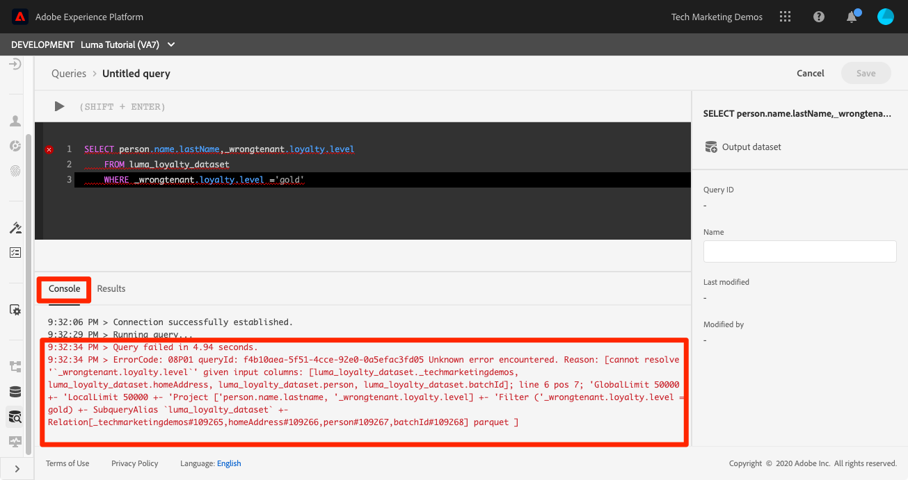

# Ejecutar consultas

<!-- 15 min-->
En esta lección, aprenderá a configurar, escribir y ejecutar consultas para validar los datos que ha introducido.

El servicio de consulta de Adobe Experience Platform le ayuda a comprender sus datos al permitirle utilizar SQL estándar para consultar los datos en Platform. Con el servicio de consulta, puede unirse a cualquier conjunto de datos en el lago de datos y capturar los resultados de la consulta como un nuevo conjunto de datos para su uso en sistemas de informes, aprendizaje automático o para su incorporación al perfil del cliente en tiempo real.

**Arquitectos de datos** y **Ingenieros de datos** necesitará utilizar el servicio de consulta fuera de este tutorial.

Antes de comenzar los ejercicios, vea este breve vídeo para obtener más información sobre el servicio de consulta:
>[!VIDEO](https://video.tv.adobe.com/v/29795?quality=12&learn=on)

## Permisos necesarios

En el [Configuración de permisos](configure-permissions.md) , configure todos los controles de acceso necesarios para completar esta lección.

<!-- Settings > **[!UICONTROL Services]** > **[!UICONTROL Query Service]**
* Permission items Data Management > **[!UICONTROL View Datasets]** and  **[!UICONTROL Manage Datasets]**
* Permission item Sandboxes > `Luma Tutorial`
* User-role access to the `Luma Tutorial Platform` product profile
-->

## Consultas simples

Empecemos con algunas consultas simples:

1. En la interfaz de usuario de Platform, vaya a **Consultas** en la navegación izquierda
1. Seleccione el **Crear consulta** en la parte superior derecha para abrir un cuadro de texto para ejecutar y ejecutar consultas
1. Introduzca la siguiente consulta en el editor y pulse Mayús+Intro o Mayús+Retorno para ejecutar la consulta.

   ```
   SHOW TABLES
   ```

1. Muestra la lista de tablas disponibles

   


1. Ahora pruebe esta consulta, reemplazando `_techmarketingdemos` con su propio espacio de nombres de inquilino, que, si recuerda, es visible en sus esquemas.

   ```
   SELECT person.name.lastName,loyalty.tier
   FROM luma_loyalty_dataset
   WHERE loyalty.tier ='gold'
   ```

   

1. Si hay algún error, los mensajes detallados aparecerán en la variable **[!UICONTROL Consola]** como se muestra a continuación
   

1. Con la consulta correcta, **[!UICONTROL Nombre]** it `Luma Gold Level Customers`
1. Seleccione el botón **[!UICONTROL Guardar]**
   


<!--SELECT COUNT(DISTINCT (_techmarketingdemos.systemIdentifier.loyaltyId)) FROM luma_loyalty_dataset 


SELECT _techmarketingdemos.systemIdentifier.loyaltyId, COUNT(_techmarketingdemos.systemIdentifier.loyaltyId)
FROM luma_loyalty_dataset 
GROUP BY _techmarketingdemos.systemIdentifier.loyaltyId
HAVING COUNT(_techmarketingdemos.systemIdentifier.loyaltyId) > 1;-->

## Ejercicios adicionales

Se agregarán ejercicios adicionales del servicio de consulta al tutorial en una fecha posterior.
<!--
## Join Datasets

In this exercise, we will join two datasets `Luma Loyalty Dataset` and `Luma Offline Purchase` to get list of gold customers who have spend over $500 dollars in one purchase.

1. Create a new query
1. Copy and paste following query in query editor and execute, again replacing `_techmarketingdemos` with your own tenant namespace
    
    ```
    SELECT DISTINCT lopd.commerce.order.purchaseID as PurchaseId ,
        lld.person.name.firstName as LastName ,
        lld.person.name.lastName as LastName ,
        lopd.personalEmail.address as email,
        lopd.commerce.order.priceTotal as Total

    FROM luma_loyalty_dataset lld
    JOIN luma_offline_purchase_event_dataset lopd
    ON lopd._techmarketingdemos.systemIdentifier.loyaltyId = lld._techmarketingdemos.systemIdentifier.loyaltyId

    WHERE lld._techmarketingdemos.loyalty.level ='gold' AND lopd.commerce.order.priceTotal >500;
    ```

1. You should get list of Gold Customers who have spend over $500 in single purchase.

## Output datasets

1. Select on Output Dataset button
1. Provide name and description to the dataset
1. Save.
1. Go to **Datasets** under **Data Management** to find new dataset created.

-->
<!--Add content for Adobe Defined Functions-->

## Recursos adicionales

* [Documentación del servicio de consultas](https://experienceleague.adobe.com/docs/experience-platform/query/home.html?lang=es)
* [Referencia de la API del servicio de consulta](https://www.adobe.io/experience-platform-apis/references/query-service/)

Y ahora para la última lección práctica, [creación de segmentos](build-segments.md)!
