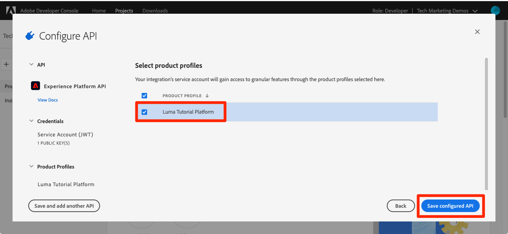

# Configure Developer Console y [!DNL Postman]

<!--30min-->

En esta lección, debe configurar un proyecto en la consola de Adobe Developer y descargar [!DNL Postman] colecciones para que pueda empezar a usar las API de Platform.

Para completar los ejercicios de API en este tutorial, [descargue la aplicación de Postman para su sistema operativo.](https://www.postman.com/downloads/) Aunque no es necesario para utilizar las API de Experience Platform, Postman facilita los flujos de trabajo de la API y Adobe Experience Platform proporciona decenas de colecciones de Postman para ayudarle a ejecutar llamadas de API y aprender a funcionar. El resto de este tutorial asume algunos conocimientos prácticos de Postman. Para obtener ayuda, consulte la [Documentación de Postman](https://learning.postman.com/).

Platform es la API creada primero. Aunque también existen opciones de interfaz para todas las tareas principales, es posible que desee utilizar la API de plataforma en algún momento. Por ejemplo, para ingerir datos, mueva elementos entre entornos limitados, automatice tareas rutinarias o utilice nuevas funciones de Platform antes de crear la interfaz de usuario.

**Arquitectos de datos** y **Ingenieros de datos** puede que necesite utilizar la API de plataforma fuera de este tutorial.

## Permisos necesarios

En el [Configuración de permisos](configure-permissions.md) , configure todos los controles de acceso necesarios para completar esta lección.

<!--
* Permission item Sandboxes > `Luma Tutorial`
* Developer-role access to the `Luma Tutorial Platform` product profile
-->

## Configuración de la consola de Adobe Developer

Adobe Developer Console es el destino de desarrollador para acceder a las API y los SDK de Adobe, escuchar eventos casi en tiempo real, ejecutar funciones en tiempo de ejecución o crear complementos o aplicaciones de App Builder. La usará para acceder a la API de Experience Platform. Para obtener más información, consulte la [Documentación de la consola de Adobe Developer](https://www.adobe.io/apis/experienceplatform/console/docs.html)

1. Cree una carpeta en el equipo local con el nombre `Luma Tutorial Assets` para archivos utilizados en el tutorial.

1. Abra el [Consola de Adobe Developer](https://console.adobe.io)

1. Inicie sesión y confirme que se encuentra en la organización correcta

1. Select **[!UICONTROL Crear nuevo proyecto]** en [!UICONTROL Inicio rápido] para abrir el Navegador.

   

1. En el proyecto recién creado, seleccione la opción **[!UICONTROL Agregar a proyecto]** y, a continuación, seleccione **[!UICONTROL API]**

   

1. Filtre la lista seleccionando **[!UICONTROL Adobe Experience Platform]**

1. En la lista de API disponibles, seleccione **[!UICONTROL API de Experience Platform]** y seleccione **[!UICONTROL Siguiente]**.

   

1. Para la autenticación de sistemas externos como [!DNL Postman], se requiere un par de claves pública y privada. Para generar un nuevo par de claves, seleccione **[!UICONTROL Opción 1]**  y presione la tecla **[!UICONTROL Generar par de teclas]** botón

   

1. Una vez que las claves estén listas, es posible que se le pida que las descargue en su equipo local. Guarde las claves empaquetadas en `config.zip` a la carpeta `Luma Tutorial Assets`. Los necesitaremos en el próximo ejercicio.

1. Una vez generada la clave, la clave pública se agregará automáticamente al proyecto como se muestra en la captura de pantalla. Seleccione el **[!UICONTROL Siguiente]** botón.

   

1. Seleccione el `Luma Tutorial Platform` perfil de producto y seleccione el **[!UICONTROL Guardar API configurada]** botón

   

1. Ahora se ha creado el proyecto de Developer Console.

1. En el **[!UICONTROL Pruébelo]** de la página, seleccione **[!UICONTROL Descargar para Postman]** y, a continuación, seleccione **[!UICONTROL Cuenta de servicio (JWT)]** para descargar el [!DNL Postman] archivo json de entorno. Guarde el `service.postman_environment.json` en su `Luma Tutorial Assets` carpeta.

   

   >[!NOTE]
   >
   >Los administradores del sistema de su organización pueden ver el proyecto como una &quot;credencial de API&quot; en el perfil del producto en el Admin Console
   >
   >

Puede que haya notado que al proyecto se le asignó un número, por ejemplo, &quot;Proyecto 12&quot;:

1. Seleccione el número de proyecto en la ruta
1. Seleccione el **[!UICONTROL Editar proyecto]** botón
1. Cambie el **[!UICONTROL Título del proyecto]** a `Luma Tutorial API Project` (añada su nombre al final, si varias personas de su empresa están tomando este tutorial)
1. Seleccione el botón **[!UICONTROL Guardar]**

   

## Configuración de Postman

>[!CAUTION]
>
>La interfaz de Postman se actualiza regularmente. Las capturas de pantalla de este tutorial se tomaron con Postman v9.0.5 para Mac, pero las opciones de la interfaz pueden haber cambiado.

1. Descargar e instalar [[!DNL Postman]](https://www.postman.com/downloads/)
1. Apertura [!DNL Postman] e importe el archivo de entorno json descargado, `service.postman_environment.json`
   
1. En [!DNL Postman], seleccione el entorno en la lista desplegable

   
1. Seleccione el **ojo** para ver las variables de entorno:

   

### Actualizar el nombre del entorno

Dado que el nombre exportado del entorno desde Developer Console se genera aleatoriamente, asígnele un nombre más descriptivo para que no confunda los entornos más adelante cuando empiece a trabajar en la implementación real de Platform:

1. Con la pantalla de variables de entorno aún abierta, seleccione **Editar** en la parte superior derecha
1. Actualice el **Nombre del entorno** a `Luma Tutorial`
1. Leave **Administrar entornos** abrir modal en modo de edición, ya que lo editaremos más adelante en el siguiente paso

   

### Adición de la clave privada

Ahora es el momento de agregar el valor PRIVATE_KEY al entorno de Postman.

1. Extraiga el `config.zip` que se generó en el ejercicio anterior al crear el proyecto de Developer Console. Este zip contiene dos archivos:
   * `private.key`
   * `certificate_pub.crt`
1. Abra el `private.key` en un editor de texto y copie el contenido.
1. En Postman, en la **Administrar entornos** > **Editar** modal que sigue abierto desde el último ejercicio, pegue los valores copiados delante de **PRIVATE_KEY** en el **Valor inicial** y **Valor actual** columnas.
1. Seleccione **Guardar**

   

### Añadir el JWT y los tokens de acceso

Adobe proporciona un completo conjunto de [!DNL Postman] colecciones para ayudarle a explorar la API de Experience Platform. Estas colecciones se encuentran en la [Adobe Experience Platform Postman muestra el repositorio de GitHub](https://github.com/adobe/experience-platform-postman-samples). Debe marcar este repositorio, ya que lo usará varias veces a lo largo de este tutorial y más tarde, al implementar Experience Platform para su propia empresa.

La primera colección funciona con las API del servicio Identity Management de Adobe (IMS). Es una forma cómoda de rellenar JWT_TOKEN y ACCESS_TOKEN desde Postman *destinados a usos distintos de la producción* como completar este tutorial en el simulador de pruebas. Alternativamente, el token de JWT se puede generar en la consola de Adobe Developer. Sin embargo, dado que caduca con regularidad, el uso de esta colección le permite actualizarla sin necesidad de volver a visitar la consola de Adobe Developer mientras completa este tutorial.

>[!WARNING]
>
>Como se indica en la [LÉAME de las API del servicio Identity Management de Adobe](https://github.com/adobe/experience-platform-postman-samples/tree/master/apis/ims), los métodos de generación mencionados son adecuados para usos que no sean de producción. La firma local carga una biblioteca JavaScript desde un host de terceros, y la firma remota envía la clave privada a un servicio web administrado por un Adobe. Aunque Adobe no almacena esta clave privada, las claves de producción nunca deben compartirse con nadie.

Para generar los tokens:

1. Descargue el [Colección de generación de tokens de acceso de Developer Console](https://raw.githubusercontent.com/adobe/experience-platform-postman-samples/master/apis/ims/Identity%20Management%20Service.postman_collection.json) a su `Luma Tutorial Assets` carpeta
1. Importar la colección en [!DNL Postman]
1. Seleccione la solicitud **IMS: Generación + autenticación de JWT mediante token de usuario** y seleccione **Enviar**

   
1. La variable **JWT_TOKEN** y **ACCESS_TOKEN** rellenado automático en las variables de entorno de [!DNL Postman].

   

### Agregar el nombre del espacio aislado y el ID del inquilino

La variable `SANDBOX_NAME` y `TENANT_ID` y `CONTAINER_ID` no se incluyen en la exportación de la consola de Adobe Developer, por lo que se añaden manualmente:

1. En [!DNL Postman], abra el **Variables de entorno**
1. Seleccione el **Editar** vínculo a la derecha del nombre del entorno
1. En el **Añadir nuevo campo de variable**, introduzca `SANDBOX_NAME`
1. En ambos campos de valor, introduzca `luma-tutorial`, el nombre que le dimos a nuestro simulador de pruebas en la lección anterior. Si ha utilizado un nombre diferente para el entorno limitado, por ejemplo, luma-tutorial-ignatiusjreilly, asegúrese de utilizar ese valor.
1. En el **Añadir nuevo campo de variable**, introduzca `TENANT_ID`
1. Cambie al explorador web y busque el ID de inquilino de su empresa. Para ello, vaya a la interfaz de Experience Platform y extraiga la parte de la URL *después del signo @*. Por ejemplo, mi id de inquilino es `techmarketingdemos` pero el suyo es diferente:

   

1. Copie este valor y vuelva a la [!DNL Postman] Pantalla Administrar entornos
1. Pegar el ID de inquilino en ambos campos de valor
1. En el **Añadir nuevo campo de variable**, introduzca `CONTAINER_ID`
1. Entrar `global` en ambos campos de valor

   >[!NOTE]
   >
   >`CONTAINER_ID` es un campo cuyo valor cambiamos varias veces durante el tutorial. When `global` se utiliza, la API interactúa con los elementos proporcionados por el Adobe en su cuenta de Platform. When `tenant` , la API interactúa con sus propios elementos personalizados.

1. Seleccione **Guardar**

   

## Realizar una llamada de API de plataforma

Ahora hagamos una llamada a la API de Platform para confirmar que hemos configurado todo correctamente.

Abra el [Experience Platform [!DNL Postman] colecciones en GitHub](https://github.com/adobe/experience-platform-postman-samples/tree/master/apis/experience-platform). Hay muchas colecciones en esta página para varias API de plataforma. Recomiendo encarecidamente que lo marque como marcador.

Ahora, hagamos nuestra primera llamada de API:

1. Descargue el [Recopilación de la API del Registro de esquemas](https://raw.githubusercontent.com/adobe/experience-platform-postman-samples/master/apis/experience-platform/Schema%20Registry%20API.postman_collection.json) a su `Luma Tutorial Assets` carpeta
1. Importarlo en [!DNL Postman]
1. Apertura **API del Registro de Esquemas > Clases > Clases de lista**
1. Observe el **Parámetros** y **Encabezados** y observe cómo incluyen algunas de las variables de entorno que ingresamos anteriormente.
1. Tenga en cuenta que **Encabezados > Campo Accept value** está configurado como `application/vnd.adobe.xed-id+json`. Las API del Registro de esquemas requieren una de estas [Aceptar valores de encabezado especificados](https://experienceleague.adobe.com/docs/experience-platform/xdm/api/getting-started.html?lang=en#accept) que proporcionan diferentes formatos en la respuesta.
1. Select **Enviar** para realizar su primera llamada de API de Platform!

Espero que tengas éxito `200 OK` que contiene una lista de las clases XDM estándar disponibles en el simulador de pruebas, como se muestra a continuación.

Si la llamada no se ha realizado correctamente, dedique un momento a la depuración utilizando los detalles de respuesta de error de la llamada de API y revise los pasos anteriores. Si se queda atascado, solicite ayuda en el [Foro de la comunidad](https://experienceleaguecommunities.adobe.com/t5/adobe-experience-platform/ct-p/adobe-experience-platform-community?profile.language=es) o use el enlace en el lado derecho de esta página para &quot;Registrar un problema&quot;.

Con los permisos de Platform, el simulador de pruebas y [!DNL Postman] configurado, está listo para [datos de modelo en esquemas](model-data-in-schemas.md)!
