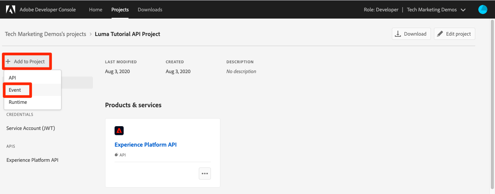

# Suscripción a eventos de ingesta de datos

<!--25min-->

En esta lección, se suscribirá a los eventos de ingesta de datos configurando un enlace web con la consola de Adobe Developer y una herramienta de desarrollo de weblinks en línea. Estos eventos se utilizan para supervisar el estado de los trabajos de inserción de datos en las lecciones siguientes.

**Ingenieros de datos** querrá suscribirse a eventos de ingesta de datos fuera de este tutorial.
**Arquitectos de datos** _puede omitir esta lección_ y vaya a [lección de ingesta por lotes](ingest-batch-data.md).

## Permisos necesarios

En el [Configuración de permisos](configure-permissions.md) Para completar esta lección, debe configurar todos los controles de acceso necesarios:

<!--* Developer-role access to the `Luma Tutorial Platform` product profile (for API)
-->

>[!IMPORTANT]
>
> Estas notificaciones activadas por los eventos de ingesta de datos se aplicarán a _todos los entornos limitados_, no solo su `Luma Tutorial`. También puede ver notificaciones procedentes de otros eventos de consumo de datos en su cuenta.

## Configuración de un enlace web

En este ejercicio, crearemos un enlace web usando una herramienta en línea llamada weblock.site (siéntase libre de sustituir cualquier otra herramienta de desarrollo de weblock que prefiera usar):

1. En otra pestaña del explorador, abra el sitio web. [https://webhook.site/](https://webhook.site/)
1. Se le asigna una dirección URL única, que debe marcar, ya que regresa más adelante en las lecciones de ingesta de datos:

   
1. Seleccione el **Editar** en la barra de navegación superior
1. Como cuerpo de respuesta, introduzca `$request.query.challenge$`. Las notificaciones de eventos de Adobe I/O que configuramos más adelante en esta lección envían un desafío al vínculo web y requieren que se incluya en el cuerpo de respuesta.
1. Seleccione el botón **Guardar**

   

## Configuración

1. En otra pestaña del explorador, abra la [Consola de Adobe Developer](https://console.adobe.io/)
1. Abra su `Luma Tutorial API Project`
1. Seleccione el **[!UICONTROL Agregar a proyecto]** y, a continuación, seleccione **[!UICONTROL Evento]**

   
1. Filtre la lista seleccionando **[!UICONTROL Experience Platform]**
1. Select **[!UICONTROL Notificaciones de la plataforma]**
1. Seleccione el **[!UICONTROL Siguiente]** botón
   
1. Seleccionar todos los eventos
1. Seleccione el **[!UICONTROL Siguiente]** botón
   
1. En la siguiente pantalla para configurar credenciales, seleccione la opción **[!UICONTROL Siguiente]** botón again
   
1. Como **[!UICONTROL Nombre de registro de evento]**, introduzca `Platform notifications`
1. Desplácese hacia abajo y seleccione para abrir el **[!UICONTROL Weblock]** sección
1. Como **[!UICONTROL URL de enlace web]**, pegue el valor de la variable **Su dirección URL única** campo de weblock.site
1. Seleccione el **[!UICONTROL Guardar eventos configurados]** botón
   
1. Espere a que la configuración se guarde y debería ver que `Platform notifications` está activo con los detalles del vínculo web y no hay mensajes de error
   
1. Vuelva a la pestaña weblock.site y debería ver la primera solicitud al weblink, resultante de la validación de la configuración de Developer Console:
   

Por ahora, aprenderá más sobre estas notificaciones en las siguientes lecciones al ingerir datos.

## Recursos adicionales

* [Sitio web.sitio](https://webhook.site/)
* [Documentación de notificaciones de ingesta de datos](https://experienceleague.adobe.com/docs/experience-platform/ingestion/quality/subscribe-events.html)
* [Introducción a la documentación de Eventos de Adobe I/O](https://www.adobe.io/apis/experienceplatform/events/docs.html)

Ok, finalmente comencemos [ingesta de datos](ingest-batch-data.md)!
