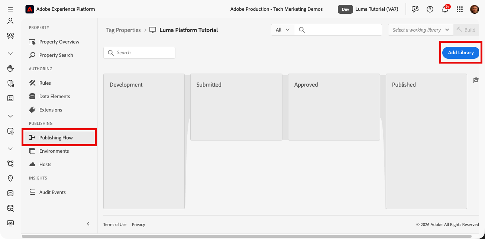
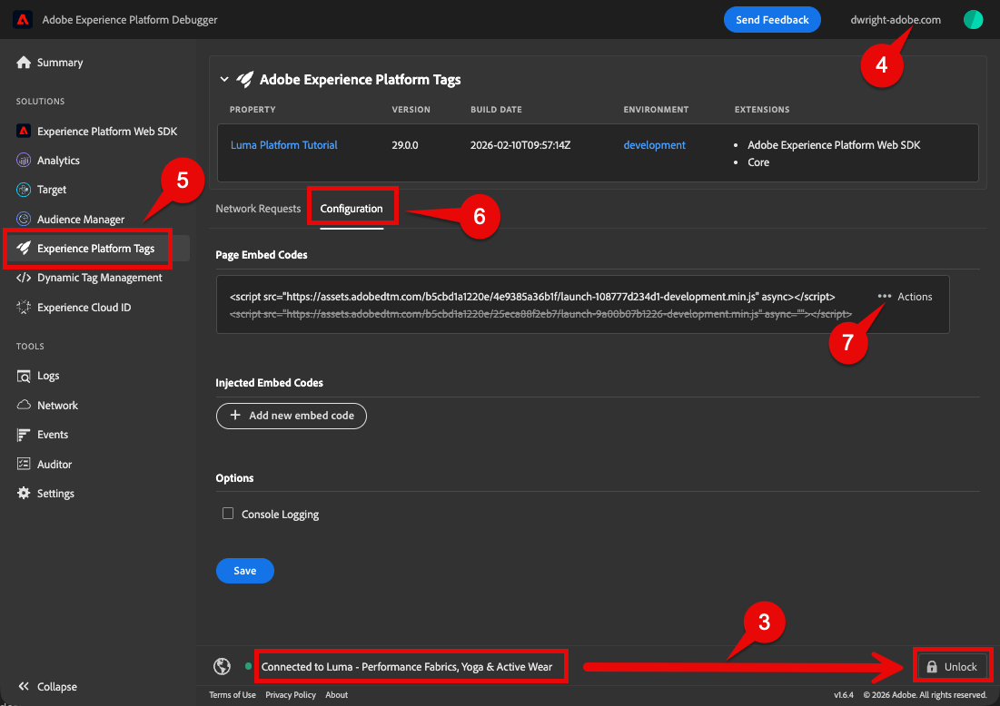
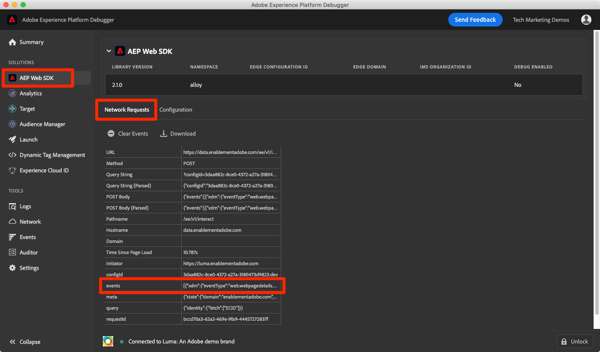
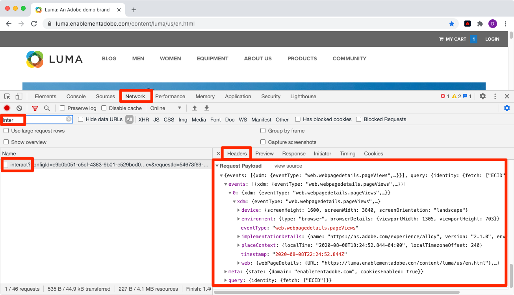
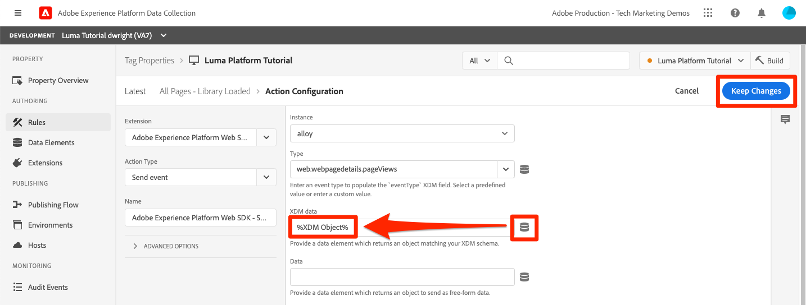

# Ingesta de datos de flujo

<!--1hr-->

En esta lección, debe transmitir los datos mediante Adobe Experience Platform Web SDK.

>[!WARNING]
>
> Se espera que el sitio web de Luma utilizado en este tutorial se sustituya durante la semana del 16 de febrero de 2026. Es posible que el trabajo realizado como parte de este tutorial no sea aplicable al nuevo sitio web.

Existen dos tareas principales de recopilación de datos:

* Implemente Web SDK en el sitio web de Luma para transmitir eventos de clientes a Experience Platform Edge Network.

* Configure una secuencia de datos para indicar a Edge Network que reenvíe los datos a nuestro `Luma Web Events Dataset` en Experience Platform.

**Los ingenieros de datos** deberán ingerir datos de flujo continuo fuera de este tutorial. Aunque los desarrolladores web suelen implementar Web SDK en un sitio web, es importante saber cómo funciona el proceso. Aunque no sea un desarrollador web, debería poder completar esta implementación básica.

Antes de comenzar los ejercicios, vea estos dos vídeos cortos para obtener más información sobre la ingesta de datos de flujo continuo y Web SDK:

>[!VIDEO](https://video.tv.adobe.com/v/28425?learn=on&enablevpops)

>[!VIDEO](https://video.tv.adobe.com/v/34141?learn=on&enablevpops)

>[!NOTE]
>
>Aunque este tutorial se centra en la ingesta de transmisión desde sitios web con Web SDK, también puede transmitir datos mediante [Mobile SDK](https://experienceleague.adobe.com/en/docs/platform-learn/implement-mobile-sdk/overview), [Edge Network Server API](https://experienceleague.adobe.com/en/docs/platform-learn/data-collection/server-api/overview) y [HTTP API](https://experienceleague.adobe.com/en/docs/experience-platform/sources/connectors/streaming/http).

## Permisos necesarios

En la lección [Configurar permisos](configure-permissions.md), configuró todos los controles de acceso necesarios para completar esta lección.

## Configuración de la secuencia de datos

Primero configuraremos la secuencia de datos. Una secuencia de datos indica a Experience Platform Edge Network a dónde enviar los datos después de recibirlos desde la llamada de Web SDK. Por ejemplo, ¿desea enviar los datos a Experience Platform, Adobe Analytics o Adobe Target?

Para crear su [!UICONTROL secuencia de datos]:

1. Asegúrese de que sigue en la zona protegida ` Luma Tutorial`
1. Seleccione **[!UICONTROL Datastreams]** en el panel de navegación izquierdo
1. Seleccione el botón **[!UICONTROL Nueva secuencia de datos]** en la esquina superior derecha

   

1. Para **[!UICONTROL Name]**, escriba `Luma Platform Tutorial` (agregue su nombre al final, si varias personas de su compañía realizan este tutorial)
1. Seleccione el botón **[!UICONTROL Guardar]**

   

Una vez que los datos llegan a Edge, [!UICONTROL Datastream] los reenvía a los [!UICONTROL servicios] configurados. Para enviar datos a Experience Platform:

1. Seleccionar **[!UICONTROL Agregar servicio]**
   

1. Seleccionar `Adobe Experience Platform`
1. Seleccione su `Luma Web Events Dataset`
1. Seleccionar **[!UICONTROL Guardar]**

   

Aunque hay una opción de conjunto de datos de perfil en la configuración del conjunto de datos, no debe utilizarse para enviar datos de perfil individuales XDM normales a Platform. Esta configuración solo debe utilizarse para enviar detalles de consentimiento, token push y región de actividad de usuario.

Las casillas de verificación de [!UICONTROL Offer Decisioning], [!UICONTROL Segmentación de Edge], [!UICONTROL Destinos de Personalization] y [!UICONTROL Adobe Journey Optimizer] le permiten activar datos en Edge, pero no se utilizan en este tutorial.

## Implementación de Web SDK

### Añadir una propiedad

En primer lugar, se debe crear una propiedad de etiqueta (anteriormente, una propiedad de etiqueta ). Una propiedad es un contenedor para todas las JavaScript, reglas y otras funciones necesarias para recopilar detalles de una página web y enviarlos a varias ubicaciones.

Para crear una propiedad:

1. Vaya a **[!UICONTROL Etiquetas]** en el panel de navegación izquierdo
1. Seleccionar **[!UICONTROL nueva propiedad]**
   
1. Como **[!UICONTROL Nombre]**, escriba `Luma Platform Tutorial` (agregue su nombre al final, si varias personas de su compañía realizan este tutorial)
1. Como **[!UICONTROL Dominios]**, escriba `enablementadobe.com` (explicado más tarde)
1. Seleccionar **[!UICONTROL Guardar]**
   

### Añadir extensiones a la propiedad

Ahora que tiene una propiedad, puede agregar Web SDK con una extensión. Una extensión es un paquete de código que agrega funcionalidad a la propiedad de etiquetas y a la implementación. Para añadir la extensión:

1. Abra la propiedad de etiquetas
1. Vaya a **[!UICONTROL Extensiones]** en el panel de navegación izquierdo
1. Vaya a la ficha **[!UICONTROL Catálogo]**
1. Hay muchas extensiones disponibles para las etiquetas. Filtrar el catálogo con el término `Web SDK`
1. Seleccione la extensión **[!UICONTROL Adobe Experience Platform Web SDK]** para abrir el panel lateral
1. Seleccione el botón **[!UICONTROL Instalar]**
   
1. Hay varias configuraciones disponibles para la extensión Web SDK, pero solo dos que vamos a configurar para este tutorial. Actualizar el **[!UICONTROL dominio de Edge]** a `data.enablementadobe.com`. Esta configuración le permite establecer cookies de origen con la implementación de Web SDK, lo que se recomienda. Al implementar Web SDK en su propio sitio web, le recomendamos que cree un CNAME para sus propios fines de recopilación de datos, por ejemplo, `data.YOUR_DOMAIN.com`
1. En la sección **[!UICONTROL Datastreams]**, para el entorno de producción, seleccione su zona protegida `Luma Tutorial` y su secuencia de datos `Luma Platform Tutorial`.
1. No dude en consultar las otras opciones de configuración (pero no las cambie) y, a continuación, seleccione **[!UICONTROL Guardar]**
   

En la pantalla Catálogo de extensiones, instale la extensión de capa de datos del cliente de Adobe. Esta extensión nos ayudará a leer la capa de datos del sitio web de Luma:

No se necesitan configuraciones en la extensión, por lo que solo debe guardarla en la biblioteca.

## Creación de una regla para enviar datos

Ahora crearemos una regla para enviar datos a Platform. Una regla es una combinación de eventos, condiciones y acciones que indican a las etiquetas que realicen alguna acción. Para crear una regla:

1. Vaya a **[!UICONTROL Reglas]**
1. Seleccione el botón **[!UICONTROL Crear nueva regla]**
   
1. Asigne un nombre a la regla `adobeDataLayer event`.
1. En **[!UICONTROL Eventos]**, seleccione el botón **[!UICONTROL Agregar]**
   
1. Use la **[!UICONTROL capa de datos del cliente de Adobe]** **[!UICONTROL extensión]** y seleccione **[!UICONTROL datos insertados]** como **[!UICONTROL tipo de evento]**.
1. Seleccione **[!UICONTROL Escuchar]**. **[!UICONTROL Todos los eventos]**.
1. Seleccione **[!UICONTROL Conservar cambios]** para volver a la pantalla de regla principal
   
1. En **[!UICONTROL Acciones]**, seleccione el botón **[!UICONTROL Agregar]**
1. Use **[!UICONTROL Adobe Experience Platform Web SDK]** **[!UICONTROL Extensión]** y seleccione **[!UICONTROL Enviar evento]** como **[!UICONTROL Tipo de acción]**
1. A la derecha, seleccione **[!UICONTROL Vistas de página de detalles de páginas web]** en la lista desplegable **[!UICONTROL Tipo]**. Esto rellena el campo eventType de nuestro `Luma Web Events Schema`
1. Seleccione **[!UICONTROL Conservar cambios]** para volver a la pantalla de regla principal
   
1. Seleccione **[!UICONTROL Guardar]** para guardar la regla\
   

## Publicación de la regla en una biblioteca

A continuación, publicaremos la regla en nuestro entorno de desarrollo para que podamos verificar que funcione.

Para crear una biblioteca:

1. Vaya a **[!UICONTROL Flujo de publicación]** en el panel de navegación izquierdo
1. Seleccionar **[!UICONTROL Agregar biblioteca]**
   
1. Para **[!UICONTROL Name]**, escriba `Luma Platform Tutorial`
1. Para el **[!UICONTROL entorno]**, seleccione `Development`
1. Seleccione el botón **[!UICONTROL Agregar todos los recursos modificados]**. (Además de la extensión [!UICONTROL Adobe Experience Platform Web SDK] y la regla `adobeDataLayer event`, también verá agregada la extensión [!UICONTROL Core] que contiene la JavaScript base requerida por todas las propiedades web de etiquetas).
1. Seleccione el botón **[!UICONTROL Guardar y generar para desarrollo]**
   

La biblioteca puede tardar unos minutos en crearse y, cuando se completa, muestra un punto verde a la izquierda del nombre de la biblioteca:

Como puede ver en la pantalla [!UICONTROL Flujo de publicación], hay mucho más en el proceso de publicación que está fuera del ámbito de este tutorial. Solo vamos a usar una sola biblioteca en nuestro entorno de desarrollo.

## Validar los datos de la solicitud

### Añadir Adobe Experience Platform Debugger

Experience Platform Debugger es una extensión disponible para Chrome que le ayuda a ver la tecnología de Adobe implementada en las páginas web. Descargue la versión para su navegador preferido:

* [Extensión de Chrome](https://chrome.google.com/webstore/detail/adobe-experience-platform/bfnnokhpnncpkdmbokanobigaccjkpob)

Si nunca ha utilizado Debugger, es posible que desee ver este vídeo de información general de cinco minutos:

>[!VIDEO](https://video.tv.adobe.com/v/32156?learn=on&enablevpops)

### Abra el sitio web de Luma.

Para este tutorial, utilizamos una versión alojada públicamente del sitio web de demostración de Luma. Vamos a abrirlo y marcarlo como favorito:

1. En una nueva pestaña del explorador, abra el [sitio web de Luma](https://newluma.enablementadobe.com).
1. Marcar la página para usarla en el resto del tutorial.

Este sitio web hospedado es la razón por la que usamos `enablementadobe.com` en el campo [!UICONTROL Dominios] de nuestra configuración inicial de propiedad de etiquetas y por la que usamos `data.enablementadobe.com` como nuestro dominio de origen en la extensión [!UICONTROL Adobe Experience Platform Web SDK]. ¡Mira, tenía un plan!

### Utilice Experience Platform Debugger para asignarlo a la propiedad de etiquetas

Experience Platform Debugger tiene una característica interesante que le permite reemplazar una propiedad de etiqueta existente por otra diferente. Esto resulta útil para la validación y nos permite omitir muchos pasos de implementación en este tutorial.

1. Asegúrese de tener el sitio de Luma abierto y seleccionar el icono de extensión de Experience Platform Debugger.
1. Debugger se abrirá y mostrará algunos detalles de la implementación codificada, que no están relacionados con este tutorial (puede que tenga que volver a cargar el sitio de Luma después de abrir Debugger).
1. Confirme que Debugger está &quot;**[!UICONTROL conectado a Luma]**&quot; como se muestra a continuación y, a continuación, seleccione el icono &quot;**[!UICONTROL bloquear]**&quot; para bloquear Debugger en el sitio de Luma.
1. Seleccione el botón **[!UICONTROL Iniciar sesión]** en la parte superior derecha para autenticarse.
1. Ahora ve a **[!UICONTROL Etiquetas Experience Platform]** en el panel de navegación izquierdo
1. Seleccione la pestaña Configuración
1. A la derecha de donde muestra los **[!UICONTROL códigos incrustados de página]**, abra el menú desplegable **[!UICONTROL Acciones]** y seleccione **[!UICONTROL Reemplazar]**
   
1. Dado que se ha autenticado, Debugger va a extraer las propiedades y entornos de etiquetas disponibles. Seleccione su propiedad de `Luma Platform Tutorial`
1. Seleccione su entorno `Development`
1. Seleccione el botón **[!UICONTROL Aplicar]**
   
1. El sitio web de Luma volverá a cargar _con su propiedad de etiquetas_.
   
1. Vaya a **[!UICONTROL Resumen]** en el panel de navegación izquierdo para ver los detalles de su propiedad de [!UICONTROL etiqueta]
   
1. Ahora ve a **[!UICONTROL Experience Platform Web SDK]** en el panel de navegación izquierdo para ver las **[!UICONTROL solicitudes de red]**
1. Seleccione la fila **[!UICONTROL events]**

   

1. Observe cómo podemos ver el tipo de evento `web.webpagedetails.pageView` especificado en nuestra acción [!UICONTROL Enviar evento]
   

1. Los detalles de la solicitud también están visibles en la ficha **Red** de las herramientas para desarrolladores web del explorador. Ábrala y vuelva a cargar la página. Filtre las llamadas con `interact` para localizar la llamada, selecciónela y, a continuación, busque en la ficha **Encabezados**, área **Solicitar carga útil**.
   
1. Vaya a la pestaña **Response** y observe cómo se incluye el valor ECID en la respuesta. Copie este valor tal como lo utilizará para validar la información de perfil en el siguiente ejercicio.
   

## Validación de los datos en Experience Platform

Puede validar que los datos están aterrizando en Platform mirando los lotes de datos que llegan en `Luma Web Events Dataset`. (Lo sé, se llama ingesta de datos de streaming, pero ahora estoy diciendo que llega en lotes! Se transmite en tiempo real al perfil de, por lo que puede utilizarse para la segmentación y activación en tiempo real, pero se envía en lotes cada 15 minutos al lago de datos).

Para validar los datos:

1. En la interfaz de usuario de Platform, vaya a **[!UICONTROL Conjuntos de datos]** en el panel de navegación izquierdo
1. Abra `Luma Web Events Dataset` y confirme que ha llegado un lote. Recuerde que se envían cada 15 minutos, por lo que es posible que tenga que esperar a que aparezca el lote.
1. Seleccione el botón **[!UICONTROL Vista previa del conjunto de datos]**
   
1. En el modal de vista previa, observe cómo puede seleccionar diferentes campos del esquema a la izquierda para previsualizar esos puntos de datos específicos:
   

También puede confirmar que se muestra el nuevo perfil:

1. En la interfaz de usuario de Platform, vaya a **[!UICONTROL Perfiles]** en el panel de navegación izquierdo
1. Seleccione el área de nombres **[!UICONTROL ECID]** y busque su valor ECID (cópielo de la respuesta. El perfil tendrá su propio ID, independiente del ECID.
1. Seleccione **[!UICONTROL ID de perfil]** para abrir el perfil
   
1. Seleccione la ficha **[!UICONTROL Eventos]** para ver las páginas que ha visto
   \
   <!---->

## Añadir datos personalizados al evento

Web SDK rellena muchos campos XDM automáticamente, pero es inevitable que necesite personalizar la implementación para recopilar campos adicionales de su sitio web. Esto se involucra mucho, pero aquí hay algunos ejemplos simples.

### Creación de un elemento de datos para almacenar datos XDM

1. Vuelva a la propiedad de etiquetas `Luma Platform Tutorial`
1. Abra el menú desplegable **[!UICONTROL Seleccionar una biblioteca en funcionamiento]** y seleccione su biblioteca `Luma Platform Tutorial`. Esta configuración facilita la publicación de actualizaciones adicionales en la biblioteca.
1. Ahora ve a **[!UICONTROL Elementos de datos]** en el panel de navegación izquierdo
1. Seleccione el botón **[!UICONTROL Crear nuevo elemento de datos]**

   

En la página **[!UICONTROL Elementos de datos]**:

1. Como **[!UICONTROL Nombre]**, escriba `XDM data`
1. Como la **[!UICONTROL extensión]**, seleccione `Adobe Experience Platform Web SDK`
1. Como **[!UICONTROL Tipo de elemento de datos]**, seleccione `Variable`
1. Como **[!UICONTROL zona protegida]**, seleccione su `Luma Tutorial` zona protegida
1. Como **[!UICONTROL esquema]**, seleccione su `Luma Web Events Schema`
1. Asegúrese de que `Luma Platform Tutorial` esté seleccionado como la biblioteca de trabajo
1. Seleccionar **[!UICONTROL Guardar en biblioteca]**
   

### Creación de un elemento de datos para el nombre de página

1. Creación de un nuevo elemento de datos
1. Como **[!UICONTROL Nombre]**, escriba `Page Name`
1. Como **[!UICONTROL Tipo de elemento de datos]**, seleccione `JavaScript Variable`
1. Como **[!UICONTROL nombre de variable de JavaScript]**, escriba `adobeDataLayer.0.page.name`
1. Para ayudar a estandarizar el formato de los valores, marque las casillas de **[!UICONTROL Forzar valor en minúsculas]** y **[!UICONTROL Limpiar texto]**
1. Seleccionar **[!UICONTROL Guardar en biblioteca]**
   

### Añadir los datos XDM a la acción Enviar evento

Ahora que los datos están asignados a campos XDM, puede incluirlos en la acción Enviar evento:

1. Ir a la pantalla **[!UICONTROL Reglas]**
1. Abrir la regla `adobeDataLayer event`
1. Abrir la acción `Adobe Experience Platform Web SDK - Send Event`
1. Como **[!UICONTROL XDM]**, seleccione el icono para abrir el modal de selección de elementos de datos y elija el elemento de datos `XDM data`
1. Seleccionar **[!UICONTROL Conservar cambios]**
   

1. Añada una nueva acción a la regla
1. Seleccione la `Adobe Experience Platform Web SDK` **[!UICONTROL extensión]**
1. Seleccionar `Update Variable` **[!UICONTROL tipo de acción]**
1. Rellene el elemento de datos `Page Name` como `web.webPageDetails.name`
1. Seleccionar **[!UICONTROL Conservar cambios]**
   

1. Reorganizar las [!UICONTROL acciones] para que [!UICONTROL Actualizar variable] se active antes de [!UICONTROL Enviar evento]
1. Ahora, desde que ha seleccionado `Luma Platform Tutorial` como su biblioteca de trabajo en los últimos ejercicios, los cambios recientes se han estado guardando directamente en la biblioteca. En lugar de tener que publicar los cambios a través de la pantalla Flujo de publicación, solo tiene que abrir el menú desplegable y seleccionar **[!UICONTROL Guardar en biblioteca y crear]**
   

Esto comienza a crear una nueva biblioteca de etiquetas con los tres cambios que acaba de realizar.

### Validación de los datos XDM

Ahora debería poder volver a cargar la página principal de Luma, mientras está asignada a la propiedad de etiqueta mediante el depurador, como ha aprendido anteriormente, y ver que el campo de nombre de página se rellena en la solicitud.

También puede validar los datos de nombre de página recibidos en Platform mediante la vista previa del conjunto de datos y el perfil.

## Envío de identidades adicionales

La implementación de Web SDK ahora envía eventos con el Experience Cloud ID (ECID) como identificador principal. Web SDK genera automáticamente el ECID, que es único por dispositivo y explorador. Un solo cliente puede tener varios ECID en función del dispositivo y el explorador que utilice. Entonces, ¿cómo podemos obtener una vista unificada de este cliente y vincular su actividad en línea a nuestros datos de CRM, lealtad y compras sin conexión? Lo hacemos recopilando identidades adicionales durante su sesión y permitiendo que el servicio de identidad las vincule de manera determinista.

Si lo recuerda, mencioné que usaríamos los ID de ECID y CRM como identidades para nuestros datos web en la lección [Identidades de mapa](map-identities.md). Recopilemos, por tanto, el ID de CRM con el SDK web.

### Añadir elemento de datos para el ID de CRM

Primero almacenamos el ID de CRM en un elemento de datos:

1. En la interfaz de etiquetas, agregue un elemento de datos denominado `CRM Id`
1. Como **[!UICONTROL Tipo de elemento de datos]**, seleccione **[!UICONTROL Variable de JavaScript]**
1. Como **[!UICONTROL nombre de variable de JavaScript]**, escriba `adobeDataLayer.0.user.id`
1. Seleccione el botón **[!UICONTROL Guardar en biblioteca]** (`Luma Platform Tutorial` debe seguir siendo su biblioteca de trabajo)
   

### Añadir el ID de CRM al elemento de datos del mapa de identidad

Ahora que hemos capturado el valor de ID de CRM, debemos asociarlo con un tipo de elemento de datos especial denominado [!UICONTROL mapa de identidad] elemento de datos:

1. Agregar un elemento de datos denominado `Identity Map`
1. Como la **[!UICONTROL extensión]**, seleccione **[!UICONTROL Adobe Experience Platform Web SDK]**
1. Como **[!UICONTROL Tipo de elemento de datos]**, seleccione **[!UICONTROL Mapa de identidad]**
1. Como **[!UICONTROL espacio de nombres]**, seleccione o escriba `Luma CRM Id`, que es el [!UICONTROL espacio de nombres] que hemos creado en una lección anterior.

1. Como **[!UICONTROL ID]**, seleccione el icono para abrir el modal de selección de elementos de datos y elija el elemento de datos `CRM Id`
1. Como **[!UICONTROL estado autenticado]**, seleccione **[!UICONTROL Autenticado]**
1. Seleccionar **[!UICONTROL principal]**

   >[!TIP]
   >
   > Adobe recomienda enviar identidades que representen a una persona, como `Luma CRM Id`, como la identidad [!UICONTROL principal].
   >
   > Si el mapa de identidad contiene el identificador de persona (por ejemplo, `Luma CRM Id`), entonces el identificador de persona se convierte en la identidad [!UICONTROL principal]. De lo contrario, `ECID` se convierte en la identidad [!UICONTROL principal].

1. Seleccione el botón **[!UICONTROL Guardar en biblioteca]** (`Luma Platform Tutorial` debe seguir siendo su biblioteca de trabajo)
   

>[!NOTE]
>
>Puede pasar varios identificadores usando el tipo de datos [!UICONTROL mapa de identidad].

### Añadir el elemento de datos del mapa de identidad a la variable XDM

Ahora debemos actualizar la acción Variable XDM en la regla para incluir el mapa de identidad. No te preocupes, ¡ya casi terminamos esta lección!

1. Abrir la regla `adobeDataLayer event`
1. Abrir la acción `Update variable`
1. Seleccione el elemento de datos `Identity Map` en el campo XDM `identityMap`.
1. Seleccionar **[!UICONTROL Conservar cambios]**
   
1. Ya que ha seleccionado `Luma Platform Tutorial` como su biblioteca de trabajo en los últimos ejercicios, seleccione **[!UICONTROL Guardar en biblioteca y crear]**

   

<!--U1770721295408-->

### Validación de la identidad

Para validar que Web SDK está enviando ahora el ID de CRM:

1. Abrir el [sitio web de Luma](https://luma.enablementadobe.com/content/luma/us/en.html)
1. Asígnelo a la propiedad de etiquetas mediante Debugger, según las instrucciones anteriores
1. Seleccione el vínculo **Iniciar sesión** en la parte superior derecha del sitio web de Luma
1. Iniciar sesión con las credenciales `test@test.com`/`test`
1. Una vez autenticada, inspeccione la llamada de Experience Platform Web SDK en Debugger (**[!UICONTROL Adobe Experience Platform Web SDK]** > **[!UICONTROL Solicitudes de red]** > **[!UICONTROL eventos]** de la solicitud más reciente) y debería ver `lumaCrmId`:
   
1. Busque el perfil de usuario utilizando el área de nombres y el valor de ECID de nuevo. En el perfil, verá el ID de CRM y también el ID de fidelidad y los detalles del perfil, como el nombre y el número de teléfono. Todas las identidades y los datos se han unido en un único perfil de cliente en tiempo real.
   

## Recursos adicionales

* [Implementación de Adobe Experience Cloud con SDK web](/help/tutorial-web-sdk/overview.md)
* [Documentación de ingesta de transmisión](https://experienceleague.adobe.com/docs/experience-platform/ingestion/streaming/overview.html?lang=es)
* [Referencia de API de ingesta de transmisión](https://developer.adobe.com/experience-platform-apis/references/streaming-ingestion/)

¡Buen trabajo! Esa era mucha información sobre Web SDK y las etiquetas. Hay mucho más involucrado en una implementación completa, pero estos son los conceptos básicos para ayudarle a empezar y ver los resultados en Platform.

>[!NOTE]
>
>Ahora que ha terminado la lección Ingesta de transmisión, puede eliminar la zona protegida [!UICONTROL Prod] de su perfil de producto `Luma Tutorial Platform`

Ingenieros de datos, si lo desea, puede pasar a la [lección Ejecutar consultas](run-queries.md).

¡Arquitectos de datos, pueden pasar a [políticas de combinación](create-merge-policies.md)!
