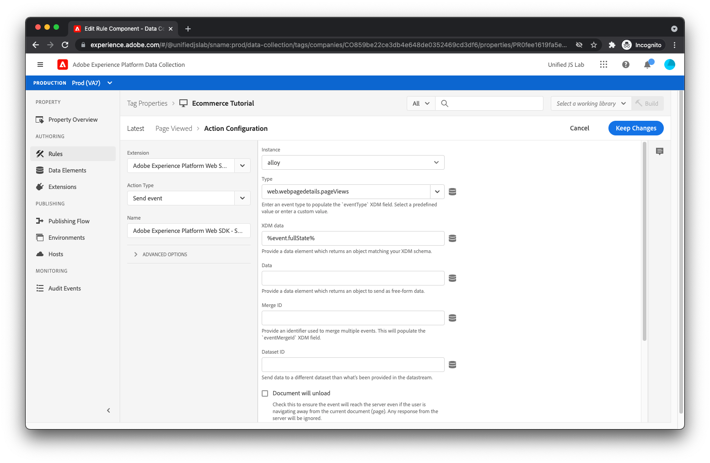

# Creación de reglas para el seguimiento de vistas de página y eventos de comercio

Para realizar un seguimiento de que el usuario ha visto la página del producto, cree una regla en Adobe Experience Platform [!DNL Tags].

1. Haga clic en **[!UICONTROL Reglas]** en la navegación del lado izquierdo, haga clic en **[!UICONTROL Crear nueva regla]**.

1. Para el nombre de regla, introduzca **_Página vista_**.

## Añadir un evento

1. Haga clic en el **[!UICONTROL Agregar]** botón debajo de [!UICONTROL Eventos]. Ahora se muestra en la vista de evento. Para la variable [!UICONTROL Extensión] campo, seleccione **[!UICONTROL Capa de datos del cliente de Adobe]**. Para la variable [!UICONTROL Tipo de evento] campo, seleccione **[!UICONTROL Datos introducidos]**.
1. Porque solo desea que esta regla se active cuando `pageViewed` se inserta en la capa de datos, seleccione **[!UICONTROL Evento específico]** under [!UICONTROL Escuchar] y tipo **_pageViewed_** en el [!UICONTROL Evento o clave para registrarse] campo de texto.
1. Haga clic en **[!UICONTROL Mantener cambios]**.
   

## Añada una acción

Ahora que ha vuelto a la vista de reglas:

1. Haga clic en el botón **[!UICONTROL Añadir]** en [!UICONTROL Acciones]. Ahora debería estar en la vista de acciones. Para la variable [!UICONTROL Extensión] campo, seleccione **[!UICONTROL SDK web de Adobe Experience Platform]**. Para la variable [!UICONTROL Tipo de acción] campo, seleccione **[!UICONTROL Enviar evento]**. Esta acción le permite enviar un evento de experiencia a Adobe Experience Platform Edge Network.
1. En medio de la pantalla, busque la [!UICONTROL Tipo] y seleccione **`web.webpagedetails.pageViews`**. Este es uno de los tipos canónicos de eventos de experiencias que Adobe Experience Platform proporciona de forma predeterminada. Representa una vista de página.
1. Para la variable [!UICONTROL Datos XDM] , introduzca **`%event.fullState%`**. Esto indica que el estado calculado (también conocido como estado completo) de la capa de datos, que se captura en el momento en que se activó la regla. Esto debe enviarse como parte del evento de experiencia.
1. Haga clic en el **[!UICONTROL Conservar cambios]** botón.
   

Si los datos introducidos en la capa de datos desde el sitio web no se ajustan al esquema XDM o si solo desea enviar una parte del estado calculado de la capa de datos, utilice la variable [!UICONTROL Objeto XDM] tipo de elemento de datos (proporcionado por la extensión web SDK de Adobe Experience Platform) para crear un objeto apropiado que coincida con su esquema.

## Guarde la regla

1. Guarde la regla haciendo clic en **[!UICONTROL Guardar]**.
   

## Repita el proceso

Repita el proceso descrito anteriormente para crear reglas para cuando se vea un producto, se abra un carro de compras y se agregue un producto al carro de compras. Las únicas diferencias entre las reglas son el nombre de la regla, el valor introducido en la variable [!UICONTROL Evento o clave para registrarse] en el campo [!UICONTROL Datos introducidos] y el [!UICONTROL Tipo] en el campo [!UICONTROL Enviar evento] acción. Estos son los valores de cada regla:

Regla visualizada del producto:

* **Nombre de la regla**: _Producto visto_
* **Evento o clave para registrarse** en [!UICONTROL Datos introducidos] evento: `productViewed`
* **Tipo** en [!UICONTROL Enviar evento] acción: `commerce.productViews`

Regla de apertura del carro de compras:

* **Nombre de la regla**: _Apertura del carro de compras_
* **Evento o clave para registrarse** en [!UICONTROL Datos introducidos] evento: `cartOpened`
* **Tipo** en [!UICONTROL Enviar evento] acción: `commerce.productListOpens`

Producto agregado a la regla del carro de compras:

* **Nombre de la regla**: _Producto agregado al carro de compras_
* **Evento o clave para registrarse** en [!UICONTROL Datos introducidos] evento: `productAddedToCart`
* **Tipo** en [!UICONTROL Enviar evento] acción: `commerce.productListAdds`

A continuación, administramos el seguimiento de clics en la variable [!UICONTROL Descargar la aplicación] vínculo.

[Siguiente: ](create-a-data-element-and-rule-for-tracking-app-downloads.md)

>[!NOTE]
>
>Gracias por invertir su tiempo en obtener información sobre la recopilación de datos. Si tiene alguna pregunta, desea compartir comentarios generales o tiene sugerencias sobre contenido futuro, compártalas en este [Experience League de debate de la comunidad](https://experienceleaguecommunities.adobe.com/t5/adobe-experience-platform-launch/tutorial-discussion-use-adobe-experience-platform-data/m-p/543877)
