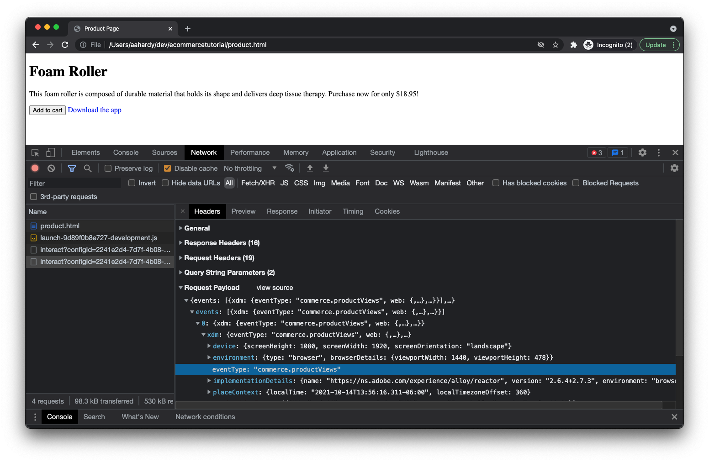

# Probar la implementación

Ahora que ha configurado su página web y ha implementado su biblioteca de etiquetas de Adobe Experience Platform, es hora de probar la implementación.

1. Abra la página del producto en el explorador. Para ello, haga clic en _Archivo_ then _Abrir archivo..._ en el explorador o puede alojar la página en un servidor web e introducir la dirección URL adecuada.

Después de cargar la página, debería ver algo así:

No es bonito, pero hace el trabajo.

## Inspect de los eventos de vista de página y vista de producto

1. Abra las herramientas para desarrolladores en el explorador y haga clic en el panel de red. Actualice la página.
En este punto, debería ver cuatro solicitudes:
* product.html : su página web.
* launch-##############-development.js: su biblioteca de Launch.
* interactuar: el evento de vista de página que se envía al servidor.
* interactuar: el evento de vista de producto que se envía al servidor.
Inspect la carga útil de cada solicitud:
1. Para la primera `interact` , debería poder ver la carga útil que se envía con un `eventType` de `web.webpagedetails.pageViews`.
   
1. Para el segundo `interact` , debería poder ver la carga útil que se envía con un `eventType` de `commerce.productViews`.
   
1. Revise el resto de los datos que se están enviando, incluida la información del producto.

## Inspect abre el carro de compras y agrega eventos al carro de compras

1. A continuación, haga clic en **_Agregar al carro_**botón.

Debería ver dos solicitudes adicionales, la primera con una `eventType` de `commerce.productListOpens` (para abrir un nuevo carro de compras) y el segundo, con un `eventType` de `commerce.productListAdds` (para agregar el producto al carro de compras).

## Evento de clic en el vínculo de la aplicación de descarga de Inspect

En función del explorador, al hacer clic en un vínculo que le desplace desde la página actual, es posible que se borre el panel de red. Como desea inspeccionar la solicitud de red para el evento de clic en vínculo que se produce justo antes de salir de la página, debe configurar el explorador para conservar los registros de red en todas las páginas.

1. Preservar los registros de red marcando una **_Mantener registro_** casilla de verificación en el panel de red (Chrome, Safari, Edge) o haga clic en un icono de engranaje y marque una **_Registros de persistencia_** en el menú mostrado (Firefox).
1. Haga clic en el **_Descargar la aplicación_** vínculo. Debería ver uno más `interact` la solicitud se muestra en el panel de red.
1. Busque la solicitud con un `eventType` de `web.webinteraction.linkClicks`y revise los detalles sobre el vínculo en el que se hizo clic.

## Compruebe que los datos llegan al conjunto de datos de Adobe Experience Platform

Ahora que se están enviando solicitudes, compruebe si los datos están llegando de forma segura al conjunto de datos de Adobe Experience Platform que ha creado.

1. Vaya a la **[!UICONTROL Conjuntos de datos]** dentro de Adobe Experience Platform.
1. Seleccione el [conjunto de datos](configure-the-server/create-a-dataset.md) que ha creado para este tutorial.
Es posible que tenga que esperar unos minutos, pero pronto debería ver indicaciones de datos que se están procesando e insertando en su conjunto de datos. También debe ver si el procesamiento se ha realizado correctamente o no. Si ha fallado, verá por qué ha fallado. Normalmente se producen errores porque los datos que envía no coinciden con el esquema y debe ajustar los datos o el esquema en consecuencia.
   

## Usar la extensión de Adobe Experience Platform Debugger

Para obtener información buena sobre cómo se comporta su implementación tanto en el explorador como en los servidores de Adobe, consulte la extensión del explorador de Adobe Experience Platform Debugger .

[Extensión de Adobe Experience Platform Debugger para Chrome](https://chrome.google.com/webstore/detail/adobe-experience-platform/bfnnokhpnncpkdmbokanobigaccjkpob)

[Extensión de Adobe Experience Platform Debugger para Firefox](https://addons.mozilla.org/es/firefox/addon/adobe-experience-platform-dbg/)

[Siguiente: ](summary.md)

>[!NOTE]
>
>Gracias por invertir su tiempo en obtener información sobre la recopilación de datos. Si tiene alguna pregunta, desea compartir comentarios generales o tiene sugerencias sobre contenido futuro, compártalas en este [Experience League de debate de la comunidad](https://experienceleaguecommunities.adobe.com/t5/adobe-experience-platform-launch/tutorial-discussion-use-adobe-experience-platform-data/m-p/543877)