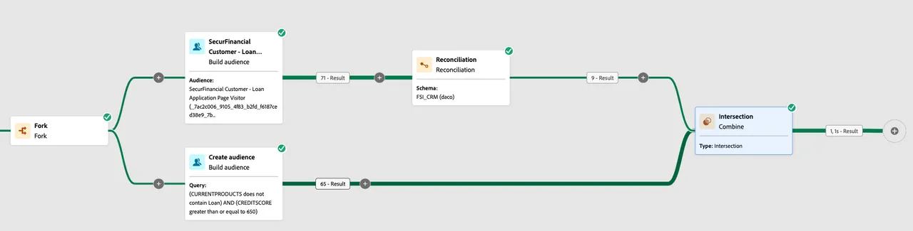

# Composición de público federado

La composición de audiencias federada permite enriquecer audiencias existentes en Adobe Experience Platform (AEP) utilizando datos de audiencia compuestos que se han federado desde Enterprise Data Warehouse. Estos datos no se mantendrán en los perfiles de clientes de Adobe Experience Platform.

## Formas de enriquecer una composición de audiencia federada

Existen dos métodos principales para enriquecer una Composición de audiencia federada.

### &#x200B;1. Leer una audiencia de AEP en una composición federada

En este primer ejemplo, utilizaremos la audiencia **Visitante de página de solicitud de préstamo de SecurFinancial** almacenada en el servicio de perfil de AEP para iniciar nuestra composición federada. Enriqueceremos la audiencia utilizando datos federados en Snowflake para determinar la aprobación previa en función de la puntuación crediticia y la actividad del préstamo.

1. **Asigne la audiencia de AEP** al destino de composición de audiencias federada.
2. **Cree su composición** con la audiencia asignada como audiencia de lectura.
3. **Reconcilie las identidades** de la audiencia de lectura para unirse a los datos federados.

### &#x200B;2. Enriquecimiento de la regla de audiencia de Experience Platform con una audiencia federada

En el segundo ejemplo, se utiliza la audiencia federada que se consulta con la puntuación crediticia y la actividad de préstamo para enriquecer la audiencia de comportamiento de los visitantes de la página web de la solicitud de préstamo.

Al evaluar esta audiencia en Edge, podemos redireccionar instantáneamente los visitantes de la página de solicitud de préstamo aprobada previamente con ofertas personalizadas en el sitio.

1. **Guardar e iniciar** su composición de audiencia federada. Una vez ejecutada la composición, la audiencia federada aparecerá en el portal de audiencias.
2. **Genere una regla de audiencia** usando atributos de perfil y eventos de experiencia del servicio de perfil, incorporando su audiencia federada.

¡Vamos a terminar esto con un [resumen de aprendizajes y aprendizajes finales](conclusion.md)!
