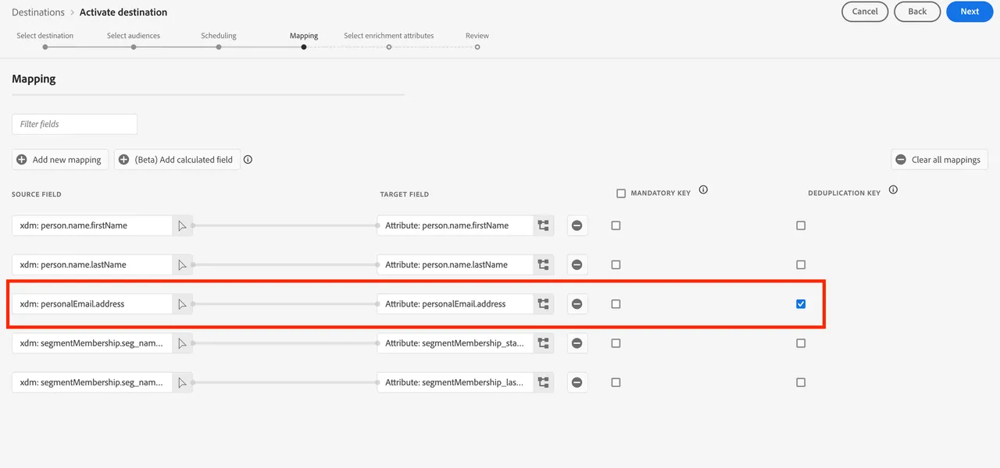

# Asignar una audiencia federada a S3 para aprovechar los atributos de audiencia para el enriquecimiento

En este ejercicio, aprenderá a aprovechar los atributos de audiencia en su almacén de datos para enriquecer la experiencia de su audiencia en flujos de trabajo de activación descendentes mediante destinos de RTCDP. Para SecurFinancial, estos atributos federados se pueden utilizar para mejorar la experiencia de personalización sin conexión de la audiencia del cliente. En este ejemplo, asignaremos la audiencia federada a un destino preconfigurado de Amazon S3.

## Pasos

1. Vaya al portal **Destinos**.

2. Haga clic en el botón de **3 menú de puntos** junto al destino preconfigurado de Amazon S3 y, a continuación, haga clic en **Activar audiencias**.

   

3. Seleccione el **destino S3** y haga clic en **Siguiente**.

   

4. Seleccione la audiencia **Clientes financieros seguros - Sin préstamos, buen crédito**.

   

5. En la sección **Programación**, deje todas las configuraciones predeterminadas y haga clic en **Siguiente**.

6. En el paso **Asignación**, asegúrese de que `xdm: personalEmail.address` esté incluido y seleccionado como **Clave de anulación de duplicación**. Luego haz clic en **Siguiente**:

   

7. En el siguiente paso de asignación, puede seleccionar atributos de enriquecimiento basados en asignaciones de campos de audiencia en la composición de audiencia federada. Haga clic en el icono **lápiz (editar)** para ver los atributos preseleccionados.

   

   

8. Revise su asignación de audiencia y pulse **Finalizar**.

Estamos listos para pasar a [crear un recorrido](build-journey-federated-audience.md).
