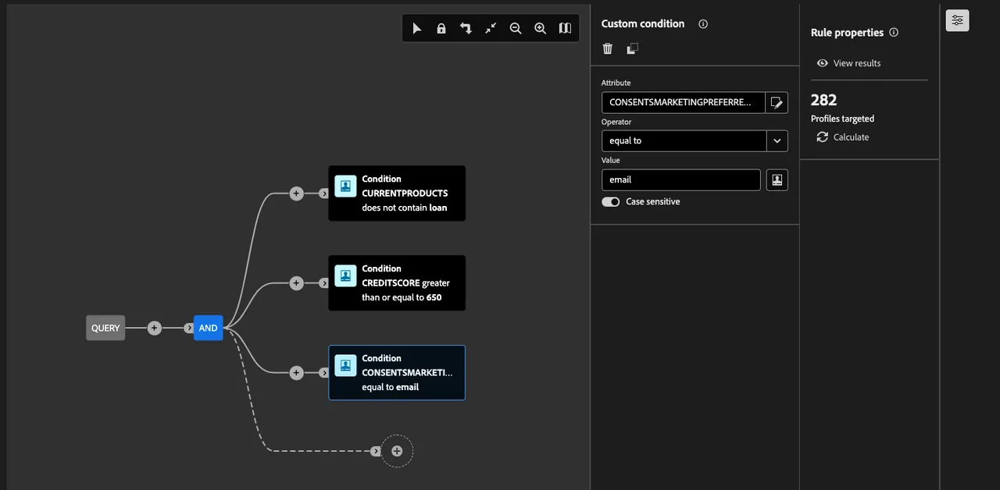

# Crear una audiencia federada

A continuación, le guiaremos a través de la creación de una audiencia desde el almacén de datos de Snowflake mediante Federated Audience Composition. La audiencia está compuesta por clientes de SecurFinancial que tienen una puntuación crediticia de 650 o más y que actualmente no tienen un préstamo en su cartera de SecurFinancial.

## Pasos

1. En el portal **Cliente > Audiencias**, haga clic en la ficha **Composiciones federadas**.
2. Haga clic en **Crear composición**.

   

3. Etiquete la composición. En nuestro ejemplo: `SecurFinancial Customers - No Loans, Good Credit`. Haga clic en **Crear**.

4. Haga clic en el botón **+** del lienzo y seleccione **Generar audiencia**. Aparecerá el carril derecho.

5. Haga clic en **Seleccionar un esquema**, seleccione el esquema apropiado y, a continuación, haga clic en **Confirmar**.

6. Haga clic en **Continuar**. En la ventana del generador de consultas, haga clic en el botón **+** y luego en **Condición personalizada**. Escriba las condiciones. Nuestro ejemplo utiliza:

   `CURRENTPRODUCTS does not contain loan`
   `AND`
   `CREDITSCORE greater than or equal to 650`
   `AND`
   `CONSENTSMARKETINGPREFERRED equal to email`

   *La última condición garantiza que los datos de preferencias de marketing se usen para segmentar a los clientes que han elegido el correo electrónico como canal de comunicación preferido*.

   **Nota:** El campo de valor distingue entre mayúsculas y minúsculas.

   

7. Haga clic en el siguiente botón **+** y luego haga clic en **Guardar audiencia**. Etiquete este paso. En nuestro ejemplo, lo etiquetaremos como `SecurFinancial Customers - No Loans, Good Credit`.

8. Añada las asignaciones de audiencia correspondientes. En este ejemplo:

   - **Campo de audiencia de Source:** CORREO ELECTRÓNICO
   - **Campo de audiencia de Source:** CURRENTPRODUCTS
   - **Campo de audiencia de Source:** NOMBRE

9. Seleccione la identidad y el área de nombres principales que se utilizarán para los perfiles. Estas son las identidades y campos utilizados para nuestros datos:

   - **Campo de identidad principal:** Correo electrónico
   - **Área de nombres de identidad:** Correo electrónico

10. Haga clic en **Guardar** y, a continuación, haga clic en **Iniciar** para ejecutar la consulta de la composición.

>[**RESUMEN**]
>
> En este ejemplo, la información de producto y crédito se utilizó para crear nuestra audiencia a través del acceso directo a los datos empresariales de Snowflake, sin hacer una copia de ella en Adobe Experience Platform. Una vez que el sistema externo procesa la consulta, solo se transfieren los valores relevantes de correo electrónico, productos actuales y nombre a la definición de audiencia para la activación descendente. Esto se aplica a todos los destinos compatibles con RTCDP.

Para obtener más información sobre la composición de audiencias, visita [Experience League](https://experienceleague.adobe.com/es/docs/federated-audience-composition/using/compositions/create-composition/create-composition){target="_blank"}.

Ahora que se ha creado nuestra audiencia federada, [la asignaremos a una cuenta S3](map-federated-audience-to-s3.md).
