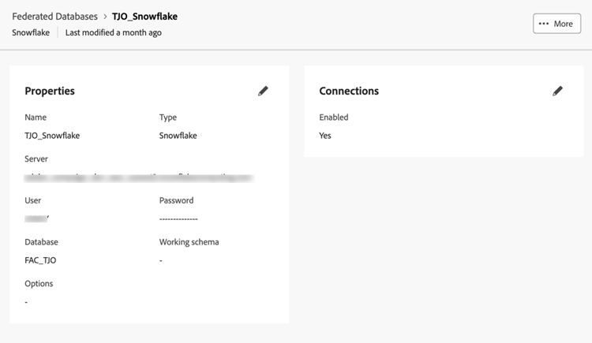

# Conexión del Data Warehouse

Empezamos por configurar una conexión entre Adobe Experience Platform y su Enterprise Data Warehouse. Utilizamos esquemas y modelos de datos basados en la forma en que los datos se encuentran en Data Warehouse para admitir la creación de consultas.

Para demostrarlo, conectamos a una cuenta de Snowflake. La Composición de audiencias federada admite una lista cada vez más extensa de conexiones de Data Warehouse. Ver la [lista actualizada de integraciones](https://experienceleague.adobe.com/es/docs/federated-audience-composition/using/start/access-prerequisites){target="_blank"}.

## Pasos

1. Vaya a la sección **DATOS FEDERADOS** en el carril izquierdo.
2. En el vínculo **Bases de datos federadas**, haga clic en el botón **Agregar base de datos federada**.
3. Agregue un nombre y seleccione **Snowflake**.
4. Rellene los detalles, haga clic en el botón **Probar conexión** y, a continuación, en el botón **Implementar funciones**.

   

   

   

## Crear un esquema

Para crear esquemas en Composición de audiencia federada, siga estos pasos:

### Pasos

1. En la sección **DATOS FEDERADOS**, haga clic en **Modelos**.
2. Examine la pestaña **Esquema** y haga clic en el botón **Crear esquema**.
3. Seleccione la base de datos de origen en la lista y haga clic en la ficha **Agregar tablas**.
4. Elija las tablas del origen federado. En nuestro ejemplo:
   - FSI_CRM
   - FSI_CRM_CONSENT_PREFERENCE

   

   

Después de seleccionar las tablas, revise las columnas de cada tabla y seleccione la clave principal. Para admitir el caso empresarial, se ha seleccionado **EMAIL** como clave principal en ambas tablas.

## Crear un modelo de datos

Los modelos de datos permiten crear un vínculo entre tablas. El vínculo se puede crear entre tablas de la misma base de datos, como tablas de Snowflake, o entre tablas de diferentes bases de datos, como un vínculo entre una tabla de Snowflake y una tabla de Amazon Redshift.

### Pasos

1. En la sección **DATOS FEDERADOS**, haga clic en **Modelos** y, a continuación, haga clic en **Modelo de datos**.
2. Haga clic en el botón **Crear modelo de datos**.
3. Proporcione un nombre para el modelo de datos.
4. Haga clic en **Agregar esquemas** y seleccione los nuevos esquemas de datos federados. En este ejemplo, seleccionamos los esquemas **FSI_CRM** y **FSI_CRM_CONSENT_PREFERENCE**.
5. Crea un vínculo entre estas tablas haciendo clic en **Crear vínculos**.

Al crear un vínculo, elija la cardinalidad aplicable:

- **1-N**: una incidencia de la tabla de origen puede tener varias incidencias correspondientes de la tabla de destino, pero una incidencia de la tabla de destino puede tener como máximo una incidencia correspondiente de la tabla de origen.
- **N-1**: una incidencia de la tabla de destino puede tener varias incidencias correspondientes de la tabla de origen, pero una incidencia de la tabla de origen puede tener como máximo una incidencia correspondiente de la tabla de destino.
- **1-1**: una incidencia de la tabla de origen puede tener como máximo una incidencia correspondiente de la tabla de destino.

A continuación se muestra una vista previa del vínculo creado en función de los pasos anteriores. El vínculo habilita una unión entre CRM y tablas de consentimiento, utilizando la clave principal de **EMAIL** para realizar una unión.

Ahora, estamos listos para [crear y audiencia](create-a-federated-audience.md).
