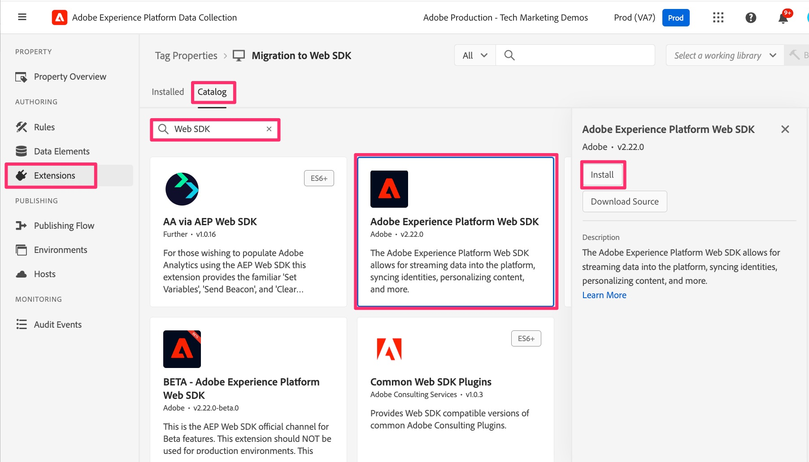
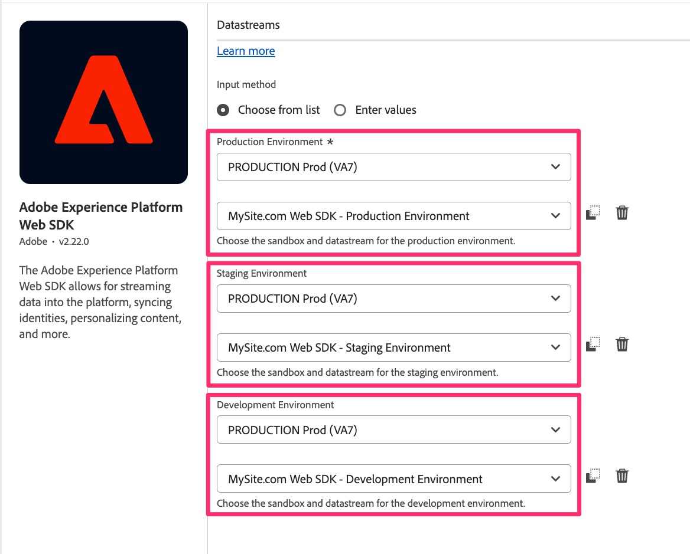

# Añadir y configurar la extensión de Web SDK

Obtenga información sobre cómo añadir y configurar la extensión Web SDK en la propiedad Tags para ofrecerle la funcionalidad que necesita en más lecciones para completar la migración.
Siga estos pasos para agregar y configurar la extensión:

1. Vaya a Recopilación de datos del Experience Platform. Esto se puede lograr de una de las dos maneras siguientes:
   1. Vaya a la [interfaz de Adobe Experience Platform](https://platform.adobe.com/) y, a continuación, seleccione **[!UICONTROL Etiquetas]** cerca de la parte inferior de la navegación izquierda.

      
   1. Si no tiene acceso a Platform, puede utilizar el conmutador de aplicaciones (9 puntos) en la parte superior derecha de la ventana y seleccionar Recopilación de datos (después de haber iniciado sesión en Experience.Adobe.com).

      
1. Busque y seleccione la propiedad de etiquetas que está migrando a Web SDK.
1. En el panel de navegación izquierdo de la propiedad de etiquetas, seleccione **[!UICONTROL Extensiones]**.
1. Seleccione **[!UICONTROL Catálogo]** cerca de la parte superior para ver una lista de todas las extensiones disponibles.
1. Busque y seleccione la extensión **[!UICONTROL Adobe Experience Platform Web SDK]** y, a continuación, haga clic en **[!UICONTROL Instalar]** a la derecha.

   {style="border:1px solid lightslategray"}

1. Aparecerán los ajustes de configuración de la extensión. Busque la sección Flujos de datos y establezca el simulador de pruebas de Experience Platform que desee utilizar para esta migración (listas desplegables &quot;Entorno&quot; para los tres entornos). Si solamente está migrando Adobe Analytics y no enviará datos a Adobe Experience Platform, elija la zona protegida **Production**. Si va a enviar estos datos de análisis de comportamiento al Experience Platform para usarlos en las aplicaciones de allí, elija el simulador de pruebas que desee utilizar para ello. Probablemente, al principio querrá seleccionar una zona protegida de desarrollo hasta que haya terminado la migración y haya terminado de agregar o probar el servicio de Platform.
1. Lo que es más importante, conecte el código y la configuración aquí en Etiquetas a Edge seleccionando los flujos de datos que creó en el paso anterior para los entornos de Producción, Ensayo y Desarrollo.

   {style="border:1px solid lightslategray"}

1. Desplácese hacia abajo y observe que la configuración de **Identidad** está seleccionada de forma predeterminada. Deje estas casillas de verificación seleccionadas, ya que ayudan a identificar correctamente a los visitantes del sitio al migrar a Web SDK. Encontrará más información en la documentación, vinculada a continuación.

1. Seleccione **[!UICONTROL Guardar]**.

>[!NOTE]
>
>La propiedad Tags ahora tiene una instalación y configuración básicas de la extensión de Web SDK. Utilizaremos partes de la extensión web de SDK a medida que creamos o modifiquemos elementos de datos y reglas durante este tutorial de migración, pero no cambiaremos más elementos de configuración de la extensión en el tutorial. Los elementos de configuración adicionales se pueden y deben utilizar para casos de uso adicionales. Para obtener documentación detallada sobre estas configuraciones, consulte [Configurar la extensión de etiquetas Web SDK](https://experienceleague.adobe.com/en/docs/experience-platform/tags/extensions/client/web-sdk/web-sdk-extension-configuration).
