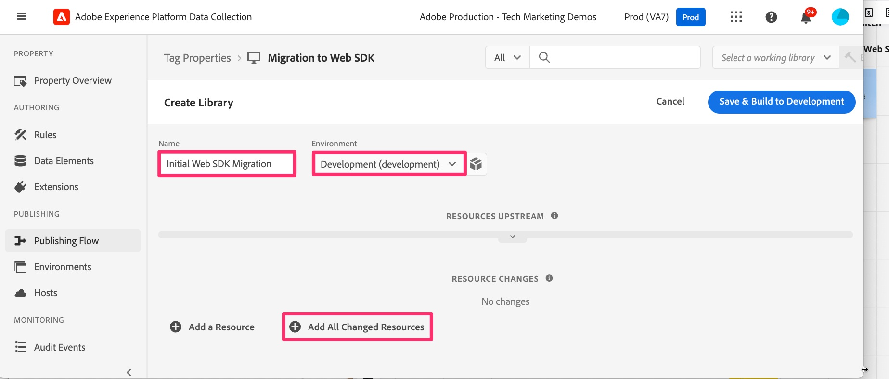

# Generar los cambios de implementación en la biblioteca de desarrollo

Obtenga información sobre cómo generar cualquier cambio realizado en la biblioteca de desarrollo en la propiedad de etiquetas para poder probar los resultados en el sitio web de desarrollo.

A medida que avanza en este tutorial, o cada vez que realiza cambios en la implementación, debe crearlos o publicarlos para verlos en los sitios de desarrollo, ensayo o producción. Estoy seguro de que ya lo ha hecho anteriormente, ya que se trata de un documento de migración y no de un primer documento de implementación. En realidad, querrá hacerlo con bastante frecuencia, ya que realiza cada función y desea probarla y asegurarse de que funciona correctamente, enviando los datos adecuados a Analytics.

Por lo tanto, habrá algunos recordatorios en este tutorial para crear o publicar los cambios. Si es necesario, coloque un marcador en esta página y no dude en crear en su biblioteca de desarrollo. Puedes hacerlo en cualquier momento.

Así que vamos a construir lo que hemos hecho hasta ahora. Por cierto, a veces podemos intercambiar &quot;compilar&quot; y &quot;publicar&quot; en este tutorial. Lo más importante es saber si está &quot;generando&quot; una biblioteca de desarrollo o ensayo, o si está &quot;publicando&quot; en la biblioteca y el entorno de producción, independientemente de la palabra que utilicemos.

## Generar cambios de migración al desarrollo en etiquetas de Experience Platform

1. En la propiedad en etiquetas de Experience Platform, seleccione **Flujo de publicación** en el panel de navegación izquierdo y, a continuación, agregue una nueva biblioteca.

   

1. Asigne a la biblioteca el nombre que desee, por ejemplo **Migración inicial de Web SDK**.
1. Seleccione el entorno **Development**.
1. Seleccione **Agregar todos los recursos modificados** para agregar todos los elementos en los que ha estado trabajando.

   

1. Guardar y generar en desarrollo

   

1. Cuando finalice la compilación, podrá ver si la compilación se realizó correctamente. Pase el ratón sobre el punto verde a la izquierda de la nueva biblioteca en el flujo de publicación y, de hecho, si es verde, habrá finalizado correctamente y le dirá lo contrario.

   

### Seleccionar una biblioteca de trabajo

Este es un buen método abreviado para avanzar por las ediciones en etiquetas. En lugar de pasar por todo el flujo de publicación cada vez que realiza un cambio, puede elegir una biblioteca de trabajo y guardar y crear con solo hacer clic en un botón. ¡Hazlo! Me lo agradecerás más tarde.

1. Desde prácticamente cualquier lugar de la interfaz de usuario de etiquetas, haga clic en Seleccionar una biblioteca de trabajo en la parte superior derecha de la interfaz de usuario y elija la que desee. Para este tutorial, elija Migración inicial de Web SDK.

   

