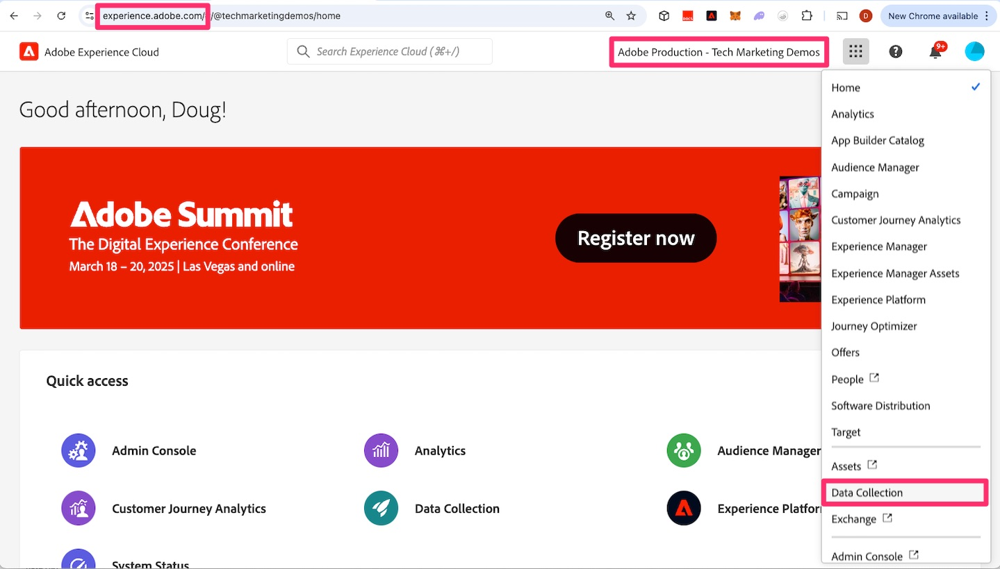

# Creación y configuración de una secuencia de datos

Obtenga información sobre cómo crear y configurar un nuevo conjunto de datos para que los datos del sitio web se puedan enrutar a Adobe Analytics.

En esta lección, aprenderá a crear y configurar el sistema para que los datos fluyan desde el sitio web a Adobe Edge y luego se enruten desde allí a Adobe Analytics.

## Crear un nuevo flujo de datos de desarrollo

1. Abra la interfaz de recopilación de datos de Adobe.
   1. Vaya en el explorador a https://experience.adobe.com
   1. Asegúrese de que la organización correcta esté seleccionada en la parte superior de la página (por ejemplo, Producción de Adobe - Demostraciones de marketing técnico en la imagen siguiente)
   1. Haga clic en los &quot;nueve puntos&quot;, también conocidos como el conmutador de aplicaciones, y seleccione **Recopilación de datos**

      

1. Vaya a **[!UICONTROL Datastreams]** en el panel de navegación izquierdo
1. Seleccionar **[!UICONTROL Nueva secuencia de datos]**
1. Escriba el **[!UICONTROL Nombre]** deseado e incluya un indicador de que se utilizará para el entorno de desarrollo de Web SDK. Por ejemplo, podría ponerle el nombre del sitio, como se muestra a continuación. Tome nota de él, ya que se hace referencia a este nombre más adelante al configurar la extensión Web SDK en la propiedad de etiquetas. Escriba una descripción si lo desea.

   >[!NOTE]
   >
   >Solo necesita seleccionar un esquema si usa la característica [Preparación de datos para la recopilación de datos](https://experienceleague.adobe.com/en/docs/platform-learn/data-collection/edge-network/data-prep), lo que no se hará en este tutorial. Para obtener más información, visite el vínculo.

1. Seleccionar **[!UICONTROL Guardar]**

   

1. Una vez guardado el conjunto de datos, aparecerá una nueva pantalla que le informará de que aún no ha configurado ningún servicio. En otras palabras, sus datos llegarán a los servidores de Edge, pero no se enviarán a ninguna aplicación hasta que añadamos un servicio. Ahora configuraremos la secuencia de datos para enviar los datos a Adobe Analytics. Haga clic en **[!UICONTROL Agregar servicio]**.
   
1. En el menú desplegable del servicio, seleccione **[!UICONTROL Adobe Analytics]**.
1. En el campo ID del grupo de informes, introduzca el ID (no el título, sino el ID del grupo de informes) del grupo de informes de validación que creó en la actividad [Crear un grupo de informes de validación](create-a-validation-report-suite.md). Haga clic en **[!UICONTROL Guardar]**.

## Flujos de datos de ensayo y producción

Ahora querrá **volver a pasar por los mismos pasos** dos veces más: una vez para el entorno de ensayo y otra para el entorno de producción. A continuación se muestran un par de notas a medida que configura estos dos flujos de datos adicionales.

### El conjunto de datos provisional

* Al asignar un nombre al conjunto de datos (y al añadir la descripción), puede/debe tener el mismo nombre con la diferencia de añadir &quot;ensayo&quot; en lugar de &quot;desarrollo&quot;.
* Agregue el servicio Adobe Analytics, como lo hizo anteriormente, y establezca el grupo de informes en el mismo grupo de informes de desarrollo.
* Si desea un entorno más limpio para ver los números de ensayo en los informes de Adobe Analytics, puede crear un nuevo grupo de informes solo para ensayo y, a continuación, asegurarse de que señala a ese grupo de informes en el servicio de Analytics de este conjunto de datos.

### Flujo de datos de producción

* Al nombrar la secuencia de datos (y al añadir la descripción), puede/debe tener el mismo nombre con la diferencia de añadir &quot;producción&quot; en lugar de &quot;desarrollo&quot;.
* Al elegir el grupo de informes al que asignar los datos, en lugar de elegir el grupo de informes de desarrollo o incluso un nuevo grupo de informes, puede asignar esta secuencia de datos a su grupo de informes de producción **actual** que alimenta la implementación de AppMeasurement. De este modo, una vez que haya completado la migración, la haya probado y esté satisfecho con los números, puede eliminar el código de AppMeasurement antiguo, enviar las bibliotecas de etiquetas a producción y alimentar los nuevos datos de producción en el mismo grupo de informes de producción, de modo que tenga continuidad entre las implementaciones antiguas y nuevas.
