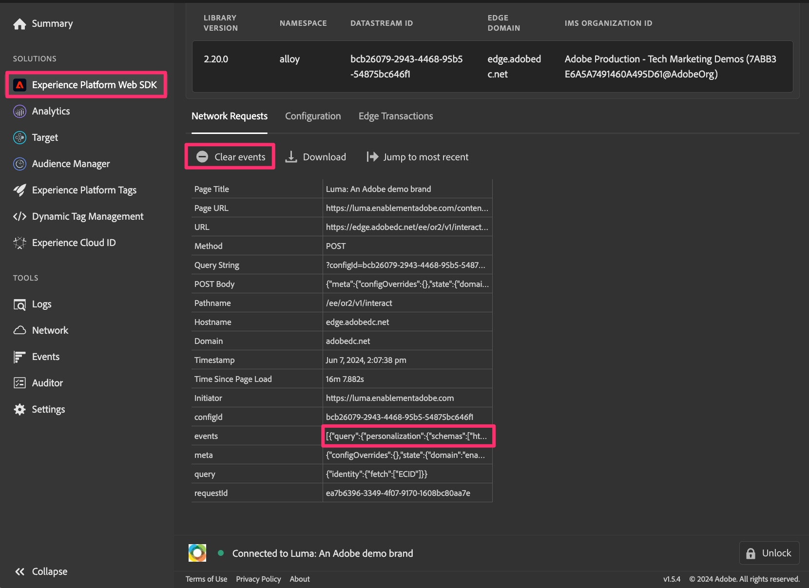

# Depuración y validación de la migración a Web SDK

En este ejercicio, aprenderá a depurar y validar los datos a medida que migre a Web SDK. Queremos alentar dos actividades de validación diferentes que puedan ayudarle a asegurarse de que todo fluye correctamente:

1. **La actividad de validación #1** está ejecutando el Adobe Experience Platform Debugger, que es una extensión del explorador, y le permite comprobar que los datos se están enviando correctamente a Analytics. Se recomienda realizar esta actividad con frecuencia, a medida que realiza cambios en la propiedad de etiquetas y publica los cambios en una biblioteca de desarrollo.
1. **La actividad de validación #2** va a entrar en Adobe Analytics, configurando uno o más proyectos para recibir datos de Web SDK (a través del grupo de informes de migración recién creado) y comprobando que los datos están entrando correctamente en los informes al hacer clic en el sitio, etc.

## El Adobe Experience Platform Debugger

Este depurador es una extensión del explorador y está disponible en la tienda Chrome. Hay un [tutorial en vídeo](https://experienceleague.adobe.com/en/docs/platform-learn/data-collection/debugger/overview) que explica cómo descargar y utilizar Debugger, y se recomienda que primero lo revise para conocer el uso básico.

Una vez que tenga el depurador en funcionamiento, puede utilizarlo para asegurarse de que los datos fluyen desde el sitio y a través del Edge Network correctamente. Este tutorial se mantendrá con un uso bastante básico, pero utilice el depurador a su capacidad total para comprobar los datos.

**Suposición (siempre peligrosa, pero esperamos que esté bien en este caso):** Dado que estamos migrando la propiedad de etiquetas a Web SDK en este ejemplo, no necesitamos colocar un nuevo código incrustado en el sitio. Ya habrá estado ahí. Sin embargo, si decide que desea aplicar un enfoque más &quot;lift and shift&quot; a una propiedad de etiquetas completamente nueva, tendrá nuevos códigos incrustados que colocar en los entornos de desarrollo, ensayo y producción. Por lo tanto, en el caso de este tutorial, siempre y cuando tengamos la extensión Web SDK instalada y configurada con reglas que envíen datos en, obtendremos los datos que se muestren en el depurador.

### Ver datos de Web SDK en Debugger

Ahora que ha migrado la regla de página predeterminada (o si ha migrado alguna regla) y la ha publicado en una biblioteca del entorno de desarrollo, debería poder ejecutar el sitio y ver los datos que fluyen a Debugger.

Pasos para ver los datos:

1. Abra el entorno de desarrollo del sitio en el explorador
1. Abra Debugger haciendo clic en la extensión del explorador en la bandeja de extensiones, en la parte superior de la ventana del explorador

   

   >[!TIP]
   >
   >En la esquina inferior derecha del depurador hay un icono &quot;Bloquear&quot; y una etiqueta, y a la izquierda puede ver qué página está depurando. En el sitio, haga clic en el icono de bloqueo para bloquear Debugger en la ventana del sitio. De lo contrario, si tuviera que hacer clic en una pestaña o ventana del explorador diferente, el depurador respondería a ese sitio. Durante la depuración del sitio, es más fácil asegurarse de que el depurador siempre le proporcione información para el sitio.

1. Asegúrese de que se encuentra en la página **Resumen** de Debugger (icono &quot;Inicio&quot; en la parte superior izquierda). **Actualice el sitio** en la ventana del explorador. Si el depurador selecciona el código incrustado en el sitio y no ha eliminado el código de Analytics (según este tutorial), verá indicaciones de que había código para Adobe Experience Platform Web SDK y Adobe Analytics, así como para Adobe Experience Platform Tags. Otros estarán atenuados.

   

1. Para ver los datos agregados mediante Web SDK, haga clic en el vínculo **Experience Platform Web SDK** en el carril izquierdo
1. Haga clic en **Borrar eventos** para eliminar cualquier visita que se haya producido
1. Actualice el sitio de nuevo y vuelva al depurador
1. A continuación, haga clic en el campo de datos al lado de **events** en la tabla

   

1. En el campo Valor, expanda hacia abajo hasta 0, data, __adobe y analytics
1. Debería ver las variables que configuró en las reglas que se activan en esa página, incluida la regla de carga de página predeterminada y también cualquier regla especial.

   

1. Realice estos pasos siempre que haya cambiado algo en la propiedad de etiquetas y haya publicado los cambios en desarrollo, para poder ver el efecto de los cambios realizados en la implementación de Analytics.

## Validación de datos en Analysis Workspace

La esencia de esta recomendación es tomar los datos de análisis actuales que llegan desde la implementación de etiquetas con la extensión de Adobe Analytics y compararlos con los mismos informes que ahora rellenará Web SDK.
Es posible que haya varias formas de configurar estas comparaciones, pero voy a darles dos ejemplos de cómo hacerlo.

### Opción 1: Comparar los datos mediante dos paneles en un solo proyecto

1. Cree un nuevo proyecto en Analysis Workspace y añada dos paneles
1. Configure el grupo de informes del panel 1 con el grupo de informes de producción de Adobe Analytics actual
1. Configure el grupo de informes del panel 2 con el nuevo grupo de informes de desarrollo de Web SDK
1. Coloque el mismo informe en ambos paneles, con un período de tiempo en el calendario en el que los datos fluían a Analytics mediante ambas extensiones
1. Comparar los datos

Podría tener este aspecto (teniendo en cuenta que no hay datos en estos grupos de informes de demostración vacíos):

Como puede ver, el informe es el mismo en ambos paneles y el calendario también es el mismo. La diferencia está en el grupo de informes, como se indica en los pasos anteriores.
**Ventaja de esta opción:** Puede ir uno a uno con informes o dimensiones y probar exactamente lo que desea probar, a medida que realiza cambios en la implementación.

### Opción 2: Comparar los datos mediante dos proyectos

1. Abra un proyecto existente que utilice los datos actuales de la extensión de Adobe Analytics
1. Realice un &quot;Guardar como&quot; para crear una copia de ese proyecto y asignarle un nombre similar a &quot;Proyecto de validación de migración a Web SDK&quot;
1. Cambie el grupo de informes del proyecto copiado para que apunte a su grupo de informes de desarrollo de Web SDK
1. Abra cada proyecto en una ventana diferente y cambie su tamaño para que pueda verlos uno junto al otro en el monitor
1. Comparar los datos

Esto se parecerá mucho a la imagen anterior, excepto que cada panel está en su propio proyecto y en una ventana diferente.
**Ventaja de esta opción:** En este caso no tiene que agregar ni volver a configurar todos los informes, pero podrá ver el aspecto que tendrán los informes actuales con la nueva extensión de Web SDK con una configuración mínima.

Es posible que quiera hacer ambas cosas, que también es otra gran opción.

>[!IMPORTANT]
>
>Ahora que ha completado la validación de la regla de carga de página predeterminada, puede continuar en el tutorial. Sin embargo, le rogamos que realice pruebas y validaciones con frecuencia, probablemente al menos cada vez que cambie una regla o realice otros cambios significativos. Recuerde que si encuentra un problema a medida que avanza, será más feliz si solo tiene que comprobar UNA cosa en lugar de probar varios cambios que ha realizado desde la última validación.

¡Feliz validación!
