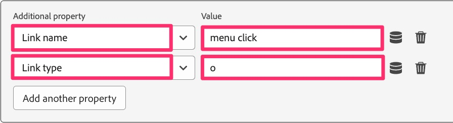

# Migración de reglas de vínculos personalizados

En este ejercicio, aprenderá a migrar las reglas que envían visitas de vínculos personalizados (a diferencia de las vistas de página).

## Información general

Cuando envía una visita de vínculo personalizado mediante la extensión de Analytics o el código de AppMeasurement, al configurar la acción **Enviar señalización**, también elige si va a enviar una visita de vista de página o una visita de vínculo personalizado y, si elige una visita de vínculo personalizado, le pedirá el **Nombre del vínculo** y el **Tipo de vínculo** para esa visita. Si no envía ningún otro dato de variable aparte del nombre y tipo del vínculo, no necesita tener una acción adicional que establezca variables (props, eVars y eventos).
Por este motivo, al migrar reglas que son reglas de vínculos personalizados, tendrá **uno de los dos** escenarios siguientes en las reglas:

1. La regla existente contendrá una acción **Adobe Analytics - Set Variables** que establece props, eVars, eventos, etc., y luego contiene una acción **Adobe Analytics - Send Beacon** que establece la visita en una visita de vínculo personalizado (también conocido como visita s.tl()), establece el nombre y tipo del vínculo y envía los datos.
   1. En este caso, es probable que también contenga una acción final llamada **Adobe Analytics - Clear Variables**, para &quot;poner a cero&quot; el valor de las variables después de que los datos se hayan enviado a los servidores de Adobe.
1. La regla existente solo contendrá la acción **Adobe Analytics - Send Beacon** que establece la visita en una visita de vínculo personalizado, establece el nombre y el tipo del vínculo y envía los datos.

### Un cambio importante

Esto es importante porque migra la implementación de Adobe Analytics a Web SDK por estos motivos:
La configuración del nombre y el tipo del vínculo, que es necesario para que la visita sea una visita de vínculo personalizado, NO está en la acción &quot;Enviar equivalente de señalización&quot; (evento de envío). En su lugar, esa configuración del nombre y el tipo del vínculo se encuentran en la acción &quot;Establecer variables-equivalente&quot; (Actualizar variable).
El resultado de esto es que, independientemente de si tiene el escenario 1 o el escenario 2 anterior, deberá terminar con una acción Actualizar variable y también con una acción Enviar evento.

A continuación se muestra una representación visual de esta diferencia en las implementaciones.

## Pasos de migración

Abra la regla de vínculo personalizado e identifique si se parece al escenario 1 o al escenario 2 de arriba.
**Si la regla se parece al escenario 1:**

1. Abra la acción Establecer variables y anote todas las variables (props, eVars, eventos, etc.) que se establecen en esa acción (por ejemplo, en la imagen anterior, event10 se está configurando).
1. Abra la acción Send Beacon y compruebe que está configurada para enviar una visita s.tl(). Anote los valores Tipo de vínculo y Nombre del vínculo.
1. En la sección Acciones de la regla de vínculo personalizado, haga clic en el icono de signo más para agregar otra regla.

   

1. Configurar la acción
   1. Definir la **extensión** en Adobe Experience Platform Web SDK
   1. Establecer **Tipo de acción** en la variable de actualización
   1. Seleccione el objeto **Analytics**
   1. Establezca las props, eVars y eventos desde la acción Establecer variables de Analytics (en este ejemplo, event10)

      

   1. En la misma regla, desplácese hacia abajo hasta el campo desplegable **Propiedad adicional** y agregue el campo **Nombre del vínculo**, configurándolo con el valor que haya extraído de la regla Enviar señalización. En la siguiente imagen, el ejemplo está configurando el nombre con el valor de cadena &quot;clic en menú&quot;.
   1. Agregue también el campo **Tipo de vínculo** de la misma lista desplegable y agregue &quot;o&quot; como valor (suponiendo que el tipo de vínculo en la acción Enviar señalización fuera &quot;Vínculo personalizado&quot;). Esto enviará el tipo de vínculo &quot;otro&quot;, que equivale a un vínculo personalizado. Si el tipo de vínculo era de descarga, elija &quot;d&quot; para el valor en este nuevo campo de tipo de vínculo y si el tipo de vínculo era de salida, elija &quot;e&quot; para el valor en este nuevo campo de tipo de vínculo.

      

1. Debajo de Propiedades adicionales, verá una casilla de verificación denominada **Borrar valor existente**. Si la regla existente tiene una **acción Adobe Analytics - Clear Variables** (como se muestra en el paso 3), simplemente marque esta casilla y no tendrá que agregar una acción Clear Variables para Web SDK.

   

1. Añada otra acción haciendo clic en el icono de signo +.
1. Configure la acción Enviar evento
   1. Definir la **extensión** en Adobe Experience Platform Web SDK
   1. Definir el evento **Tipo de acción** en Enviado
   1. Haga clic en el icono del elemento de datos y seleccione el elemento de datos **Variable de datos de vista de página**

   

1. **Conservar cambios**, **Guardar en biblioteca** y puede **crear** la biblioteca desde esa misma página, ya que ya hemos establecido una biblioteca de trabajo.

## Extraer una conclusión importante sobre la migración

* En esta lección, ha aprendido a migrar las reglas de vínculos personalizados.
* En el ejercicio [Migrar la regla de carga de página predeterminada](migrate-your-default-page-load-rule.md), ha aprendido a migrar las reglas que establecen variables y también envían una señalización de Analytics.
* En la lección [Migrar reglas de página adicionales](migrate-additional-page-rules.md), ha aprendido a migrar las reglas que establecen variables pero no envían una señalización a Adobe Analytics.

Como puede imaginar, se pueden utilizar los mismos métodos en muchas reglas diferentes para migrar la extensión de Analytics a Web SDK.
En la mayoría de los casos, simplemente **está actualizando las acciones** en las reglas. No está cambiando el evento ni las condiciones en las que se activa. Solo está cambiando lo que está sucediendo en la sección de acciones cuando se activan las reglas.
La mayoría, si no todas, de sus reglas caerán en estas categorías. Si tiene una regla que no, considere el mismo paradigma para migrar la acción y no el que activó la regla.
