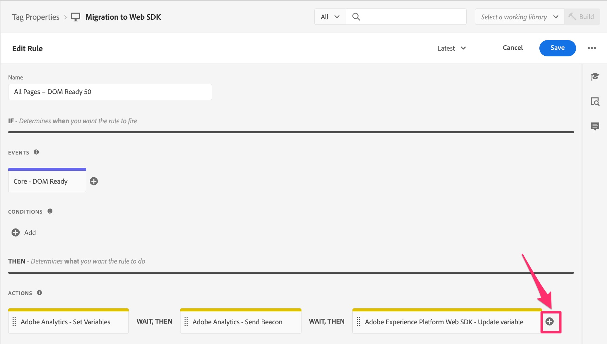

# Migración de la regla de carga de página predeterminada

En este ejercicio, aprenderá a migrar una regla de carga de página predeterminada en Adobe Experience Cloud Tags desde la extensión de Analytics a la extensión de Web SDK.

## Información general

Vamos a retroceder un poco. Es probable que tenga una regla en Etiquetas que se active en todas las páginas: una que establezca una o más variables predeterminadas y luego active una señalización o una visita en Adobe Analytics. Actualmente, esta regla utiliza &quot;acciones&quot; en la extensión de Adobe Analytics para hacer estas cosas. A medida que migramos nuestra implementación a Web SDK, necesitamos poder eliminar cualquier referencia (como las acciones) a la extensión de Analytics y reemplazarla con acciones que pertenezcan a Web SDK. En los pasos siguientes, supondremos lo anterior; es decir, que tiene una regla de carga de página predeterminada que establece variables y envía una señalización de seguimiento a Analytics.

## Migración de la acción Establecer variables

En esta actividad, crearemos una acción de Web SDK equivalente a la acción **Set Variables** en la extensión de Adobe Analytics.

1. En la IU de recopilación de datos y en su propiedad, vaya a la pantalla **[!UICONTROL Reglas]** seleccionándola en el panel de navegación izquierdo.
1. Seleccione la regla que es la **regla de carga predeterminada de Analytics**. Si no sabe qué regla es la regla de carga predeterminada, hable con alguien que tenga conocimientos de las reglas y de lo que contienen. De nuevo, estamos buscando una regla que se ejecute en todas las páginas, establezca algunas variables predeterminadas (por ejemplo, nombre de página) y luego envíe una señalización a Analytics. Vamos a realizar cambios en esta regla. El mío se llama &quot;All Pages - DOM Ready 50&quot;, pero el tuyo podría llamarse cualquier cosa.

   

1. Para migrar las acciones actuales de la extensión de Analytics a la extensión de Web SDK, necesitamos saber qué variables se están configurando. Por lo tanto, haga clic en la acción **Adobe Analytics - Set Variables** para que pueda ver qué variables se están configurando (por ejemplo: PageName, props, eVars, eventos, etc.).

   
   1. Observe qué variables se establecen en esa regla
      

1. En la parte superior de la página, cambie el botón de opción a **Proporcionar JSON** y se le mostrará una vista de código de las variables configuradas. Esta vista de código y la vista de interfaz de usuario son intercambiables y, cuando configure cualquier valor en una interfaz de usuario, también se actualizará en la otra interfaz de usuario.

   

1. Copie estos datos en el portapapeles o guárdelos en un archivo para utilizarlo de inmediato, ya que en los pasos siguientes pegará ese código en una nueva acción de Web SDK.
1. Cancele la acción Establecer variables de Analytics para volver a estar en la regla.

   >[!IMPORTANT]
   >
   >Tiene opciones en este paso, entre ellas las siguientes:
   >1. En lugar de agregar una acción nueva, solo tiene que modificar las acciones existentes, que al guardarlas cortarían inmediatamente cualquier dato en el nuevo grupo de informes de Web SDK y ya no se mostrarían en el grupo de informes de Analytics actual.
   >1. Puede crear una nueva acción para enviar los datos a Analytics mediante la SDK web y, por ahora, dejar la acción de Analytics en su lugar. Esto le dará la oportunidad de comparar los datos del nuevo grupo de informes de Web SDK con los del grupo de informes de Analytics actual. **Este es el que haremos en este tutorial.** Tenga en cuenta que este método DARÁ como resultado visitas dobles mientras compara los datos, lo que también resultará en un costo para las llamadas al servidor adicionales, hasta que elimine las acciones de la extensión antigua de Analytics. Obviamente, no querrá mantener las acciones de la extensión de Analytics allí para siempre, sino solo el tiempo suficiente para validar que los datos fluyen correctamente al grupo de informes de la nueva extensión de Web SDK.

1. Haga clic en el botón **más** para agregar una nueva acción de Web SDK.

   

1. Seleccione **Adobe Experience Platform Web SDK** de la lista desplegable Extensión.
1. Seleccione **Actualizar variable** de la lista desplegable Tipo de acción.
1. En el panel derecho, seleccione el objeto **Analytics** dentro del objeto de datos
1. Asegúrese también de que el elemento de datos que aparece en la parte superior del panel derecho sea realmente el nuevo elemento de datos de tipo variable.

   

1. Ahora cambie el botón de opción a **Proporcione JSON o elemento de datos** y pegue el código que copió en el paso anterior de Establecer variables en esta ventana de código. Recuerde que lo que se muestra en el tutorial solo son ejemplos. Está copiando y pegando sus propias variables.

   
Esta herramienta de copia JSON se ha creado especialmente para facilitar la migración y estoy seguro de que puede ver lo fácil que es esto en lugar de tener que tomar notas detalladas de la acción antigua y aplicarlas a la nueva.

1. Puede, en cualquier momento, cambiar el botón de opción hacia atrás y hacia adelante para ver los valores en la versión de código (que se muestra arriba) o en la versión de la interfaz de usuario de ver los atributos. Seleccione el botón de opción **Proporcionar atributos individuales** para ver los atributos rellenados.

   
   

1. Cuando vea que las variables están configuradas correctamente, haga clic en **Conservar cambios/Guardar.**

## Migrar la acción Enviar señalización

En esta actividad, crearemos un Web SDK equivalente a la acción &quot;Enviar señalización&quot; de Analytics, llamada **Enviar evento**.

1. Vuelva a la regla de página predeterminada en la que estaba.
1. En la sección de acciones, haga clic en el botón **más** para agregar otra acción. Esta será nuestra acción **Enviar evento**.

   

1. Para configurar la acción, seleccione **Adobe Experience Platform Web SDK** en la lista desplegable Extensión.
1. Seleccione **Enviar evento** del tipo de acción.
1. En el panel derecho, seleccione el icono de elemento de datos junto al objeto **Data**.

   

1. Seleccione la variable de datos Vista de página (o como haya llamado a su nuevo elemento de datos de tipo &quot;datos&quot;) y, a continuación, haga clic en el botón **Seleccionar**.

   

1. Haga clic en **Conservar cambios/Guardar**.
1. Ahora debería ver las cuatro acciones (dos antiguas y dos nuevas) en la regla

   

## ¿Debería eliminar las acciones de la extensión de Analytics?

Gran pregunta. La respuesta reside en si desea validar o no las nuevas acciones antes de deshacerse de las antiguas. Como he mencionado anteriormente, si deja las acciones de Analytics y Web SDK que envían datos (Enviar señalización y Enviar evento), como hemos elegido hacer en este tutorial, tendrá los mismos datos en dos grupos de informes (a saber, el grupo de informes de producción de la extensión de Analytics y el nuevo grupo de informes de validación de la extensión de Web SDK). Esto resulta en la duplicación de las llamadas al servidor en Analytics y conlleva un coste. Sin embargo, así es como muchos clientes eligen hacerlo, de modo que puedan validar los nuevos datos antes de cerrar los datos antiguos. Tendremos un ejercicio al final de este tutorial que muestra cómo limpiar los elementos antiguos una vez que esté satisfecho con la validación, pero si desea hacerlo ahora para guardar las llamadas al servidor y no preocuparse por la validación, no dude en saltar al final del tutorial o, de lo contrario, elimine las acciones de la extensión de Analytics de las reglas a medida que avanza.
