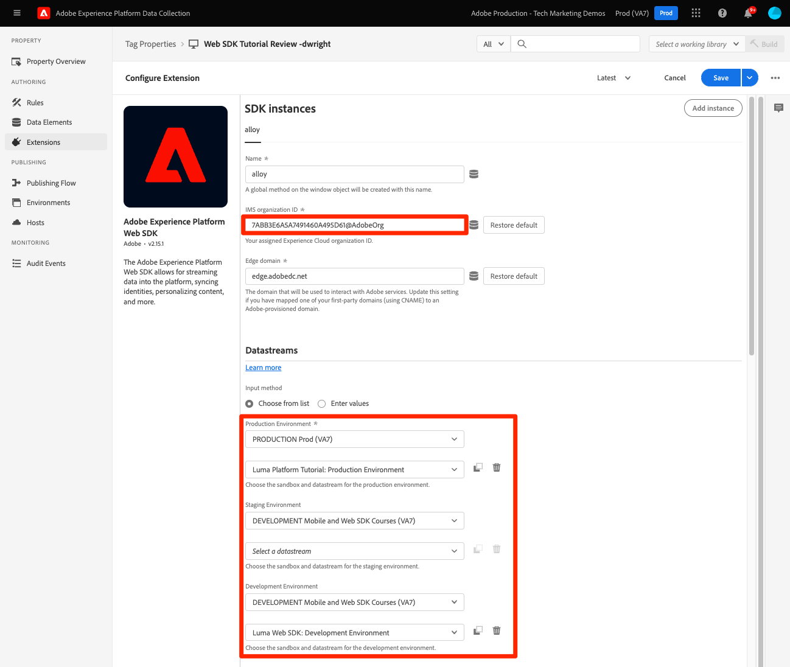

# Reemplace la biblioteca at.js de con el SDK web de Platform

Obtenga información sobre cómo reemplazar la implementación de Adobe Target en la página para migrar de at.js al SDK web de Platform. Un reemplazo básico consiste en los siguientes pasos:

* Revise la configuración de administración de Target y tome nota de su ID de organización de IMS
* Reemplace la biblioteca at.js de con el SDK web de Platform
* Actualizar el fragmento preocultado para implementaciones de biblioteca sincrónicas
* Configuración del SDK web de Platform

>[!NOTE]
>
>Los ejemplos proporcionados tienen fines ilustrativos y la implementación real de Target puede variar. Si la implementación de Target existente usa el administrador de etiquetas de recopilación de datos de Adobe, también puede consultar el [tutorial de implementación de Target del SDK web de Platform](https://experienceleague.adobe.com/docs/platform-learn/implement-web-sdk/applications-setup/setup-target.html?lang=es) para obtener más información.


## Revisar configuración de administración de Target

El primer paso para migrar Target al SDK web de Platform es revisar la configuración en la sección **[!UICONTROL Administración]** de la interfaz de Target.

### [!UICONTROL Implementación]

#### [!UICONTROL Detalles de la cuenta]

* **[!UICONTROL ID de organización de IMS]**: tome nota de este valor, ya que es necesario para configurar el SDK web de Platform.
* **[!UICONTROL Toma de decisiones en el dispositivo]**: el SDK web de Platform no admite esta característica. Esta configuración se puede deshabilitar después de migrar y si ya no utiliza at.js en ninguno de sus sitios web o si tiene casos de uso del lado del servidor para la toma de decisiones en el dispositivo.

#### [!UICONTROL Métodos de implementación]

Todas las configuraciones editables en la sección **[!UICONTROL Métodos de implementación]** se aplican solo a at.js. Esta configuración se utiliza para generar una biblioteca at.js personalizada para su implementación. Revise esta configuración para comprobar si tiene algún código personalizado o si está configurando cookies de origen y de terceros para casos de uso entre dominios.

La configuración de **[!UICONTROL Duración del perfil]** solo la puede cambiar el Servicio de atención al cliente de Adobe. La duración del perfil del visitante de Target no se ve afectada por el método de implementación. Tanto at.js como el SDK web de Platform utilizan la misma duración de perfil del visitante.

#### [!UICONTROL Privacidad]

* **[!UICONTROL Direcciones IP de visitantes ofuscados]**: esta configuración afecta las capacidades de targeting geográfico. Tanto at.js como el SDK web de Platform utilizan la misma configuración de ofuscación de IP del back-end para fines de targeting geográfico.

### [!UICONTROL Entornos]

El SDK web de Platform utiliza una configuración de secuencia de datos que le permite definir explícitamente un [!UICONTROL ID de entorno] para secuencias de datos de desarrollo, ensayo y producción independientes. El caso de uso principal de esta configuración es para implementaciones de aplicaciones móviles en las que no existen URL para distinguir fácilmente los entornos. La configuración es opcional, pero se puede utilizar para garantizar que todas las solicitudes estén correctamente asociadas al entorno especificado. Esto difiere de una implementación de at.js en la que debe asignar entornos de Target según los dominios y las reglas del grupo de hosts.

>[!NOTE]
>
>Si no se especifica un ID de entorno en la configuración de la secuencia de datos, Target utilizará la asignación de dominio a entorno especificada en la sección **Hosts**.

Para obtener más información, consulte la guía [configuración de secuencia de datos](https://experienceleague.adobe.com/docs/experience-platform/edge/datastreams/configure.html?lang=es#target) y la documentación de [Hosts](https://experienceleague.adobe.com/docs/target/using/administer/hosts.html?lang=es) de Target.

## Implementación del SDK web de Platform

La funcionalidad de Target la proporcionan at.js y el SDK web de Platform. Si ambas bibliotecas se utilizan al mismo tiempo, pueden producirse problemas de procesamiento y seguimiento. Para migrar correctamente al SDK web de Platform, el primer paso es eliminar at.js y reemplazarlo por el SDK web de Platform (alloy.js).

Supongamos que tenemos una implementación de Target simple con at.js:

* Una capa de datos cerca de la parte superior de la página proporciona información para Target y otras aplicaciones
* Una o más bibliotecas de ayuda de terceros cuyas capacidades pueden utilizarse en actividades de Target (por ejemplo, jQuery).
* Un fragmento preocultado para mitigar el parpadeo
* La biblioteca at.js de Target se carga asincrónicamente con la configuración predeterminada para solicitar y procesar automáticamente actividades:

+++ de ejemplo de at.js en una página de HTML

```HTML
<!doctype html>
<html>
<head>
  <title>Example page</title>
  <!--Data Layer to enable rich data collection and targeting-->
  <script>
    var digitalData = { 
      // Data layer information goes here
    };
  </script>
  <!--Third party libraries that may be used by Target offers and modifications-->
  <script src="https://ajax.googleapis.com/ajax/libs/jquery/3.6.1/jquery.min.js"></script>
  <!--prehiding snippet for Target with asynchronous deployment-->
  <script>
    ;(function(win, doc, style, timeout) {
      var STYLE_ID = 'at-body-style';

      function getParent() {
        return doc.getElementsByTagName('head')[0];
      }

      function addStyle(parent, id, def) {
        if (!parent) {
          return;
        }
        var style = doc.createElement('style');
        style.id = id;
        style.innerHTML = def;
        parent.appendChild(style);
      }

      function removeStyle(parent, id) {
        if (!parent) {
          return;
        }
        var style = doc.getElementById(id);
        if (!style) {
          return;
        }
        parent.removeChild(style);
      }
      addStyle(getParent(), STYLE_ID, style);
      setTimeout(function() {
        removeStyle(getParent(), STYLE_ID);
      }, timeout);
    }(window, document, "body {opacity: 0 !important}", 3000));
  </script>
  <!--Target at.js library loaded asynchonously-->
  <script src="/libraries/at.js" async></script>
</head>
<body>
  <h1 id="title">Home Page</h1><br><br>
  <p id="bodyText">Navigation</p><br><br>
  <a id="home" class="navigationLink" href="#">Home</a><br>
  <a id="pageA" class="navigationLink" href="#">Page A</a><br>
  <a id="pageB" class="navigationLink" href="#">Page B</a><br>
  <a id="pageC" class="navigationLink" href="#">Page C</a><br>
  <div>Homepage Hero Banner Content</div>
</body>
</html>
```

+++

Para actualizar Target para utilizar el SDK web de Platform, primero elimine at.js:

```HTML
<!--Target at.js library loaded asynchonously-->
<script src="/libraries/at.js" async></script>
```

Y reemplace con la biblioteca JavaScript de alloy o el código incrustado de etiquetas y la extensión SDK para web de Adobe Experience Platform:

>[!BEGINTABS]

>[!TAB JavaScript]

```HTML
<!--Platform Web SDK base code-->
<script>
  !function(n,o){o.forEach(function(o){n[o]||((n.__alloyNS=n.__alloyNS||
  []).push(o),n[o]=function(){var u=arguments;return new Promise(
  function(i,l){n[o].q.push([i,l,u])})},n[o].q=[])})}
  (window,["alloy"]);
</script>
<!--Platform Web SDK loaded asynchonously. Change the src to use the latest supported version.-->
<script src="https://cdn1.adoberesources.net/alloy/2.13.1/alloy.min.js" async></script>
```

>[!TAB Etiquetas]

```HTML
<!--Tags Header Embed Code: REPLACE WITH THE INSTALL CODE FROM YOUR OWN ENVIRONMENT-->
<script src="//assets.adobedtm.com/launch-EN93497c30fdf0424eb678d5f4ffac66dc.min.js" async></script>
```

En la propiedad tag, agregue la extensión SDK para web de Adobe Experience Platform:

{zoomable="yes"}


>[!ENDTABS]

La versión independiente creada previamente requiere un &quot;código base&quot; añadido directamente a la página, lo que crea una función global denominada alloy. Utilice esta función para interactuar con el SDK. Si desea asignar otro nombre a la función global, cambie el nombre de `alloy`.

Consulte la documentación de [Instalación del SDK web de Platform](https://experienceleague.adobe.com/docs/experience-platform/edge/fundamentals/installing-the-sdk.html?lang=es) para obtener más información y opciones de implementación.


## Actualizar el método de preocultación de contenido

La implementación del SDK web de Platform puede requerir un fragmento de ocultamiento previo en función de si la biblioteca se carga de forma asíncrona o sincrónica.

### Implementación asincrónica

Al igual que con at.js, si la biblioteca del SDK web de Platform se carga asincrónicamente, la página puede finalizar el renderizado antes de que Target haya realizado un intercambio de contenido. Este comportamiento puede llevar a lo que se conoce como &quot;parpadeo&quot;, en el que el contenido predeterminado aparece brevemente antes de ser reemplazado por el contenido personalizado especificado por Target. Si desea evitar este parpadeo, Adobe recomienda agregar un fragmento preocultado especial inmediatamente antes de la referencia de script del SDK web de Platform asincrónico o del código incrustado de etiquetas.

Si su implementación es asíncrona, como en los ejemplos anteriores, sustituya el fragmento preocultado de at.js por la versión siguiente compatible con el SDK web de Platform:

```HTML
<!--Prehiding snippet for Target with asynchronous Web SDK deployment-->
<script>
  !function(e,a,n,t){var i=e.head;if(i){
  if (a) return;
  var o=e.createElement("style");
  o.id="alloy-prehiding",o.innerText=n,i.appendChild(o),setTimeout(function(){o.parentNode&&o.parentNode.removeChild(o)},t)}}
  (document, document.location.href.indexOf("mboxEdit") !== -1, "body { opacity: 0 !important }", 3000);
</script>
```

El fragmento preocultado crea una etiqueta de estilo en el encabezado de la página con la definición CSS de su elección. Esta etiqueta de estilo se elimina cuando se recibe una respuesta de Target o se alcanza el tiempo de espera.

El comportamiento de preocultación se controla mediante dos configuraciones al final del fragmento.

* `body { opacity: 0 !important }` especifica la definición de CSS que se utilizará para la preocultación hasta que se cargue Target. De forma predeterminada, toda la página está oculta. Puede actualizar esta definición a los selectores que desea ocultar previamente junto con cómo desea ocultarlos. Puede incluir varias definiciones, ya que este valor es simplemente lo que se inserta en la etiqueta de estilo de preocultación. Si tiene un elemento contenedor fácil de identificar que incluya el contenido debajo de su navegación, puede utilizar este ajuste para limitar la preocultación a ese elemento contenedor.

* `3000` especifica el tiempo de espera en milisegundos para la preocultación. Si no se recibe una respuesta de Target antes del tiempo de espera, se elimina la etiqueta de estilo de ocultamiento previo. No es habitual alcanzar este tiempo de espera.

>[!IMPORTANT]
>
>Asegúrese de utilizar el fragmento correcto para el SDK web de Platform, ya que utiliza un ID de estilo diferente de `alloy-prehiding`. Si se utiliza el fragmento de preocultación para at.js, es posible que no funcione correctamente.

### Implementación sincrónica

Adobe recomienda implementar el SDK web de Platform de forma asíncrona para obtener el mejor rendimiento general de la página. Sin embargo, si la biblioteca alloy.js o el código incrustado de etiquetas se cargan sincrónicamente, no se requiere el fragmento de preocultación. En su lugar, el estilo de preocultación se especifica en la configuración del SDK web de Platform.

El estilo de preocultación para implementaciones sincrónicas se puede configurar usando la opción [`prehidingStyle`](https://experienceleague.adobe.com/docs/experience-platform/edge/fundamentals/configuring-the-sdk.html?lang=es#prehidingStyle). La configuración del SDK web de Platform se explica en la siguiente sección.

Para obtener más información sobre cómo el SDK web de Platform puede administrar el parpadeo, puede consultar la sección de guías: [administración del parpadeo para experiencias personalizadas](https://experienceleague.adobe.com/docs/experience-platform/edge/personalization/manage-flicker.html?lang=es)

## Configuración del SDK web de Platform

El SDK web de Platform debe configurarse en cada carga de página. El siguiente ejemplo supone que todo el sitio se está actualizando al SDK web de Platform en una sola implementación:

>[!BEGINTABS]

>[!TAB JavaScript]

El comando `configure` siempre debe ser el primer comando del SDK llamado. `edgeConfigId` es el [!UICONTROL ID de secuencia de datos]

```JavaScript
alloy("configure", {
  "edgeConfigId": "ebebf826-a01f-4458-8cec-ef61de241c93",
  "orgId":"ADB3LETTERSANDNUMBERS@AdobeOrg"
});
```

>[!TAB Etiquetas]

En las implementaciones de etiquetas, muchos campos se rellenan automáticamente o se pueden seleccionar desde los menús desplegables. Tenga en cuenta que se pueden seleccionar diferentes entornos limitados [!UICONTROL sandboxes] y [!UICONTROL flujos de datos] de la plataforma para cada entorno. La secuencia de datos cambiará según el estado de la biblioteca de etiquetas en el proceso de publicación.

{zoomable="yes"}
>[!ENDTABS]

Si planea migrar de at.js al SDK web de Platform página por página, se requieren las siguientes opciones de configuración:


>[!BEGINTABS]

>[!TAB JavaScript]

```JavaScript
alloy("configure", {
  "edgeConfigId": "ebebf826-a01f-4458-8cec-ef61de241c93",
  "orgId":"ADB3LETTERSANDNUMBERS@AdobeOrg",
  "targetMigrationEnabled":true,
  "idMigrationEnabled":true
});
```

>[!TAB Etiquetas]

{zoomable="yes"}

>[!ENDTABS]

A continuación se describen las opciones de configuración relevantes relacionadas con Target:

| Opción | Descripción | Valor de ejemplo |
| --- | --- | --- |
| `edgeConfigId` | ID del conjunto de datos | `ebebf826-a01f-4458-8cec-ef61de241c93` |
| `orgId` | Adobe Experience Cloud organization ID | `ADB3LETTERSANDNUMBERS@AdobeOrg` |
| `targetMigrationEnabled` | Utilice esta opción para permitir que el SDK web lea y escriba las cookies de mbox y mboxEdgeCluster heredadas que utiliza at.js. Esto le ayuda a mantener el perfil del visitante mientras se desplaza de una página que utiliza el SDK web a una página que utiliza la biblioteca at.js y viceversa. | `true` |
| `idMigrationEnabled` | Si el valor es True, el SDK lee y establece cookies AMCV antiguas. Esta opción ayuda a realizar la transición al uso del SDK web de Platform mientras que algunas partes del sitio aún pueden utilizar Visitor.js. | `true` |
| `thirdPartyCookiesEnabled` | Habilita la configuración de cookies de terceros de Adobe. El SDK puede mantener el ID de visitante en un contexto de terceros para permitir que se utilice el mismo ID de visitante en todos los sitios. Utilice esta opción si tiene varios sitios; sin embargo, a veces esta opción no se desea por motivos de privacidad. | `true` |
| `prehidingStyle` | Se utiliza para crear una definición de estilo CSS que oculta las áreas de contenido de la página web mientras se carga contenido personalizado desde el servidor. Esto solo se utiliza con implementaciones sincrónicas del SDK. | `body { opacity: 0 !important }` |

Para obtener una lista completa de opciones, consulte la guía [configuración del SDK web de Platform](https://experienceleague.adobe.com/docs/experience-platform/edge/fundamentals/configuring-the-sdk.html?lang=es).

## Ejemplo de implementación

Una vez que el SDK web de Platform esté correctamente configurado, la página de ejemplo tendría este aspecto.

>[!BEGINTABS]

>[!TAB JavaScript]

```HTML
<!doctype html>
<html>
<head>
  <title>Example page</title>
  <!--Data Layer to enable rich data collection and targeting-->
  <script>
    var digitalData = { 
      // Data layer information goes here
    };
  </script>

  <!--Third party libraries that may be used by Target offers and modifications-->
  <script src="https://ajax.googleapis.com/ajax/libs/jquery/3.6.1/jquery.min.js"></script>

  <!--Prehiding snippet for Target with asynchronous Web SDK deployment-->
  <script>
    !function(e,a,n,t){var i=e.head;if(i){
    if (a) return;
    var o=e.createElement("style");
    o.id="alloy-prehiding",o.innerText=n,i.appendChild(o),setTimeout(function(){o.parentNode&&o.parentNode.removeChild(o)},t)}}
    (document, document.location.href.indexOf("mboxEdit") !== -1, ".body { opacity: 0 !important }", 3000);
  </script>

  <!--Platform Web SDK base code-->
  <script>
    !function(n,o){o.forEach(function(o){n[o]||((n.__alloyNS=n.__alloyNS||
    []).push(o),n[o]=function(){var u=arguments;return new Promise(
    function(i,l){n[o].q.push([i,l,u])})},n[o].q=[])})}
    (window,["alloy"]);
  </script>

  <!--Platform Web SDK loaded asynchonously. Change the src to use the latest supported version.-->
  <script src="https://cdn1.adoberesources.net/alloy/2.13.1/alloy.min.js" async></script>
  
  <!--Configure Platform Web SDK-->
  <script>
    alloy("configure", {
      "edgeConfigId": "ebebf826-a01f-4458-8cec-ef61de241c93",
      "orgId":"ADB3LETTERSANDNUMBERS@AdobeOrg"
    });
  </script>
</head>
<body>
  <h1 id="title">Home Page</h1><br><br>
  <p id="bodyText">Navigation</p><br><br>
  <a id="home" class="navigationLink" href="#">Home</a><br>
  <a id="pageA" class="navigationLink" href="#">Page A</a><br>
  <a id="pageB" class="navigationLink" href="#">Page B</a><br>
  <a id="pageC" class="navigationLink" href="#">Page C</a><br>
  <div id="homepage-hero">Homepage Hero Banner Content</div>
</body>
</html>
```

>[!TAB Etiquetas]

Código de página:

```HTML
<!doctype html>
<html>
<head>
  <title>Example page</title>
  <!--Data Layer to enable rich data collection and targeting-->
  <script>
    var digitalData = { 
      // Data layer information goes here
    };
  </script>

  <!--Third party libraries that may be used by Target offers and modifications-->
  <script src="https://ajax.googleapis.com/ajax/libs/jquery/3.6.1/jquery.min.js"></script>

  <!--Prehiding snippet for Target with asynchronous Web SDK deployment-->
  <script>
    !function(e,a,n,t){var i=e.head;if(i){
    if (a) return;
    var o=e.createElement("style");
    o.id="alloy-prehiding",o.innerText=n,i.appendChild(o),setTimeout(function(){o.parentNode&&o.parentNode.removeChild(o)},t)}}
    (document, document.location.href.indexOf("mboxEdit") !== -1, ".body { opacity: 0 !important }", 3000);
  </script>

    <!--Tags Header Embed Code: REPLACE WITH THE INSTALL CODE FROM YOUR OWN ENVIRONMENT-->
    <script src="//assets.adobedtm.com/launch-EN93497c30fdf0424eb678d5f4ffac66dc.min.js" async></script>
</head>
<body>
  <h1 id="title">Home Page</h1><br><br>
  <p id="bodyText">Navigation</p><br><br>
  <a id="home" class="navigationLink" href="#">Home</a><br>
  <a id="pageA" class="navigationLink" href="#">Page A</a><br>
  <a id="pageB" class="navigationLink" href="#">Page B</a><br>
  <a id="pageC" class="navigationLink" href="#">Page C</a><br>
  <div id="homepage-hero">Homepage Hero Banner Content</div>
</body>
</html>
```

En las etiquetas, agregue la extensión SDK para web de Adobe Experience Platform:

{zoomable="yes"}

Y añada las configuraciones deseadas:
{zoomable="yes"}


>[!ENDTABS]


Es importante tener en cuenta que simplemente incluir y configurar la biblioteca del SDK web de Platform como se muestra arriba no ejecuta ninguna llamada de red a la red de Adobe Edge.

A continuación, aprenda a [solicitar y aplicar actividades basadas en VEC](render-vec-activities.md) a la página.

>[!NOTE]
>
>Nos comprometemos a ayudarle a tener éxito con su migración de Target de at.js al SDK web. Si encuentra obstáculos con la migración o cree que falta información esencial en esta guía, comuníquenoslo publicando en [esta discusión de la comunidad](https://experienceleaguecommunities.adobe.com/t5/adobe-experience-platform-data/tutorial-discussion-migrate-target-from-at-js-to-web-sdk/m-p/575587?profile.language=es#M463).
