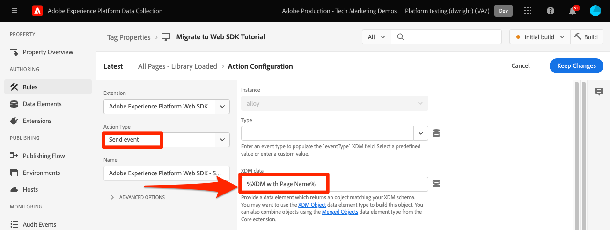

# Envío de parámetros a Target mediante el SDK web de Platform

Las implementaciones de Target difieren entre sitios web debido a la arquitectura del sitio, los requisitos comerciales y las características utilizadas. La mayoría de las implementaciones de Target incluyen pasar varios parámetros para información contextual, audiencias y recomendaciones de contenido.

Usemos una página sencilla de detalles del producto y una página de confirmación de pedido para demostrar las diferencias entre las bibliotecas al pasar parámetros a Target.

Supongamos que las dos páginas de ejemplo siguientes utilizan at.js:

+++at.js en una página de detalles del producto:

```HTML
<!doctype html>
<html>
<head>
  <title>Product Details - Men's Shirt</title>
  <!--Target parameters -->
  <script>
    targetPageParams = function() {
      return {
        // Property token
        "at_property": "5a0fd9bb-67de-4b5a-0fd7-9cc09f50a58d",
        // Mbox parameters
        "pageName": "product detail",
        // Profile parameters
        "profile.gender": "male",
        "user.categoryId": "clothing",
        // Entity parameters for Target Recomendations
        "entity.id": "SKU-00001-LARGE",
        "entity.categoryId": "clothing,shirts",
        "entity.customEntity": "some value",
        "cartIds": "SKU-00002,SKU-00003",
        "excludedIds": "SKU-00001-SMALL",
        // Customer ID for cross-device profile synching and Customer Attributes
        "mbox3rdPartyId": "TT8675309",
      };
    };
  </script>
  <!--Target at.js library loaded asynchonously-->
  <script src="/libraries/at.js" async></script>
</head>
<body>
  <h1 id="title">Men's Large Shirt</h1>
  <p>SKU: SKU-00001-LARGE</p>
</body>
</html>
```

+++


+++at.js en una página de confirmación de pedido:

```HTML
<!doctype html>
<html>
<head>
  <title>Order Confirmation</title>-->
  <!--Target parameters -->
  <script>
    targetPageParams = function() {
      return {
        // Property token
        "at_property": "5a0fd9bb-67de-4b5a-0fd7-9cc09f50a58d",
        // Order confirmation parameters
        "orderId": "ABC123",
        "productPurchasedId": "SKU-00002,SKU-00003",
        "orderTotal": 1337.89,
        // Customer ID for cross-device profile synching and Customer Attributes
        "mbox3rdPartyId": "TT8675309",
      };
    };
  </script>
  <!--Target at.js library loaded asynchonously-->
  <script src="/libraries/at.js" async></script>
</head>
<body>
  <h1 id="title">Order Confirmation</h1>
  <p>Thank you for your order</p>
</body>
</html>
```

+++


## Resumen de asignación de parámetros

Los parámetros de Target para estas páginas se envían de forma diferente mediante el SDK web de Platform. Existen varias formas de pasar parámetros a Target mediante at.js:

- Se establece con la función `targetPageParams()` para el evento de carga de página (utilizado en los ejemplos de esta página)
- Se estableció con la función `targetPageParamsAll()` para todas las solicitudes de Target en la página
- Enviar parámetros directamente con la función `getOffer()` para una sola ubicación
- Envíe parámetros directamente con la función `getOffers()` para una o más ubicaciones


El SDK web de Platform proporciona una forma única y coherente de enviar datos sin necesidad de funciones adicionales. Todos los parámetros deben pasarse en la carga útil con el comando `sendEvent` y caer en dos categorías:

- Asignado automáticamente desde el objeto `xdm`
- Pasado manualmente con el objeto `data.__adobe.target`

La siguiente tabla describe cómo se reasignarán los parámetros de ejemplo mediante el SDK web de Platform:

| Ejemplo de parámetro at.js | Opción SDK web de Platform | Notas |
| --- | --- | --- |
| `at_property` | N/A | Los tokens de propiedad están configurados en [datastream](https://experienceleague.adobe.com/docs/experience-platform/edge/datastreams/configure.html?lang=es#target) y no se pueden establecer en la llamada a `sendEvent`. |
| `pageName` | `xdm.web.webPageDetails.name` | Todos los parámetros de mbox de Target deben pasarse como parte del objeto `xdm` y ajustarse a un esquema mediante la clase XDM ExperienceEvent. Los parámetros de mbox no se pueden pasar como parte del objeto `data`. |
| `profile.gender` | `data.__adobe.target.profile.gender` | Todos los parámetros de perfil de Target deben pasarse como parte del objeto `data` y tener el prefijo `profile.` para que se asignen correctamente. |
| `user.categoryId` | `data.__adobe.target.user.categoryId` | Parámetro reservado utilizado para la característica de afinidad de categoría de Target, que debe pasarse como parte del objeto `data`. |
| `entity.id` | `data.__adobe.target.entity.id` <br>O<br> `xdm.productListItems[0].SKU` | Los ID de entidad se utilizan para los contadores de comportamiento de Target Recommendations. Estos identificadores de entidad se pueden pasar como parte del objeto `data` o asignarse automáticamente a partir del primer elemento de la matriz `xdm.productListItems` si su implementación utiliza ese grupo de campos. |
| `entity.categoryId` | `data.__adobe.target.entity.categoryId` | Los identificadores de categoría de entidad se pueden pasar como parte del objeto `data`. |
| `entity.customEntity` | `data.__adobe.target.entity.customEntity` | Los parámetros de entidad personalizados se utilizan para actualizar el catálogo de productos de Recommendations. Estos parámetros personalizados deben pasarse como parte del objeto `data`. |
| `cartIds` | `data.__adobe.target.cartIds` | Se utiliza para los algoritmos de recomendaciones de Target basados en el carro de compras. |
| `excludedIds` | `data.__adobe.target.excludedIds` | Se utiliza para evitar que se devuelvan ID de entidad específicos en un diseño de recomendaciones. |
| `mbox3rdPartyId` | Establecer en el objeto `xdm.identityMap` | Se utiliza para sincronizar perfiles de Target entre dispositivos y Atributos del cliente. El área de nombres que se va a usar para el ID de cliente debe especificarse en la configuración de [Target del conjunto de datos](https://experienceleague.adobe.com/docs/experience-platform/edge/personalization/adobe-target/using-mbox-3rdpartyid.html?lang=es). |
| `orderId` | `xdm.commerce.order.purchaseID` | Se utiliza para identificar un pedido único para el seguimiento de conversión de Target. |
| `orderTotal` | `xdm.commerce.order.priceTotal` | Se utiliza para rastrear los totales de pedidos de los objetivos de optimización y conversión de Target. |
| `productPurchasedId` | `data.__adobe.target.productPurchasedId` <br>O<br> `xdm.productListItems[0-n].SKU` | Se utiliza para los algoritmos de seguimiento de conversión de Target y de recomendaciones. Consulte la sección [parámetros de entidad](#entity-parameters) más abajo para obtener detalles. |
| `mboxPageValue` | `data.__adobe.target.mboxPageValue` | Se usa para la meta de actividad [puntuación personalizada](https://experienceleague.adobe.com/docs/target/using/activities/success-metrics/capture-score.html?lang=es). |

{style="table-layout:auto"}

## Parámetros personalizados

Los parámetros de mbox personalizados se deben pasar como datos XDM con el comando `sendEvent`. Es importante asegurarse de que el esquema XDM incluya todos los campos necesarios para la implementación de Target.

Ejemplo de at.js con `targetPageParams()`:

```JavaScript
targetPageParams = function() {
  return {
    "pageName": "product detail"
  };
};
```

Ejemplos de JavaScript del SDK web de Platform usando el comando `sendEvent`:

>[!BEGINTABS]

>[!TAB JavaScript]

```JavaScript
alloy("sendEvent", {
  "xdm": {
    "web": {
      "webPageDetails": {
        // Other attributes included according to xdm schema
        "name": "product detail"
      }
    }
  }
});
```

>[!TAB Etiquetas]

En las etiquetas, utilice primero un elemento de datos [!UICONTROL XDM object] para asignarlo al campo XDM:

{zoomable="yes"}

E incluya su [!UICONTROL objeto XDM] en su [!UICONTROL evento Send] [!UICONTROL acción] (se pueden [combinar ](https://experienceleague.adobe.com/docs/experience-platform/tags/extensions/client/core/overview.html?lang=es#merged-objects) varios [!UICONTROL objetos XDM]):

{zoomable="yes"}

>[!ENDTABS]


>[!NOTE]
>
>Como los parámetros de mbox personalizados forman parte del objeto `xdm`, debe actualizar las audiencias, actividades o scripts de perfil que hagan referencia a estos parámetros de mbox con sus nuevos nombres. Consulte la página [Actualizar audiencias de Target y scripts de perfil para la compatibilidad con el SDK web de Platform](update-audiences.md) de este tutorial para obtener más información.


## Parámetros de perfil

Los parámetros de perfil de destino deben pasarse bajo el objeto `data.__adobe.target` en la carga del comando `sendEvent` del SDK web de Platform.

De forma similar a at.js, todos los parámetros de perfil deben tener el prefijo `profile.` para que el valor se almacene correctamente como un atributo de perfil de Target persistente. El parámetro `user.categoryId` reservado para la capacidad Afinidad de categoría de Target lleva el prefijo `user.`.

Ejemplo de at.js con `targetPageParams()`:

```JavaScript
targetPageParams = function() {
  return {
    "profile.gender": "male",
    "user.categoryId": "clothing"
  };
};
```

Ejemplos del SDK web de Platform que usan el comando `sendEvent`:

>[!BEGINTABS]

>[!TAB JavaScript]

```JavaScript
alloy("sendEvent", {
  "data": {
    "__adobe": {
      "target": {
        "profile.gender": "male",
        "user.categoryId": "clothing"
      }
    }
  }
});
```

>[!TAB Etiquetas]

En las etiquetas, cree primero un elemento de datos para definir el objeto `data.__adobe.target`:

{zoomable="yes"}

E incluya su objeto de datos en su [!UICONTROL evento de envío] [!UICONTROL acción] (se pueden [!UICONTROL combinar] varios [objetos](https://experienceleague.adobe.com/docs/experience-platform/tags/extensions/client/core/overview.html?lang=es#merged-objects)):

{zoomable="yes"}

>[!ENDTABS]

## Parámetros de entidad

Los parámetros de entidad se utilizan para pasar datos de comportamiento e información de catálogo suplementaria para Target Recommendations. Todos los [parámetros de entidad](https://experienceleague.adobe.com/docs/target/using/recommendations/entities/entity-attributes.html?lang=es) admitidos por at.js también son compatibles con el SDK web de Platform. De forma similar a los parámetros de perfil, todos los parámetros de entidad deben pasarse bajo el objeto `data.__adobe.target` en la carga del comando `sendEvent` del SDK web de Platform.

Los parámetros de entidad para un elemento específico deben tener el prefijo `entity.` para que la captura de datos sea correcta. Los parámetros reservados `cartIds` y `excludedIds` para los algoritmos de Recommendations no deben tener un prefijo y el valor de cada uno debe contener una lista separada por comas de los identificadores de entidad.

Ejemplo de at.js con `targetPageParams()`:

```JavaScript
targetPageParams = function() {
  return {
    "entity.id": "SKU-00001-LARGE",
    "entity.categoryId": "clothing,shirts",
    "entity.customEntity": "some value",
    "cartIds": "SKU-00002,SKU-00003",
    "excludedIds": "SKU-00001-SMALL"
  };
};
```

Ejemplos del SDK web de Platform que usan el comando `sendEvent`:

>[!BEGINTABS]

>[!TAB JavaScript]

```JavaScript
alloy("sendEvent", {
  "data": {
    "__adobe": {
      "target": {
        "entity.id": "SKU-00001-LARGE",
        "entity.categoryId": "clothing,shirts",
        "entity.customEntity": "some value",
        "cartIds": "SKU-00002,SKU-00003",
        "excludedIds": "SKU-00001-SMALL"
      }
    }
  }
});
```

>[!TAB Etiquetas]

En las etiquetas, cree primero un elemento de datos para definir el objeto `data.__adobe.target`:

{zoomable="yes"}

E incluya su objeto de datos en su [!UICONTROL evento de envío] [!UICONTROL acción] (se pueden [!UICONTROL combinar] varios [objetos](https://experienceleague.adobe.com/docs/experience-platform/tags/extensions/client/core/overview.html?lang=es#merged-objects)):

{zoomable="yes"}

>[!ENDTABS]

>[!NOTE]
>
>Si se utiliza el grupo de campos `commerce` y la matriz `productListItems` se incluye en la carga útil XDM, el primer valor `SKU` de esta matriz se asigna a `entity.id` con el fin de incrementar una vista de producto.


## Parámetros de compra

Los parámetros de compra se pasan en una página de confirmación de pedido después de un pedido correcto y se utilizan para los objetivos de conversión y optimización de Target. Con una implementación del SDK web de Platform, estos parámetros y se asignan automáticamente a partir de los datos XDM pasados como parte del grupo de campos `commerce`.

Ejemplo de at.js con `targetPageParams()`:

```JavaScript
targetPageParams = function() {
  return {
    "orderId": "ABC123",
    "productPurchasedId": "SKU-00002,SKU-00003"
    "orderTotal": 1337.89
  };
};
```

La información de compra se pasa a Target cuando el grupo de campos `commerce` tiene `purchases.value` establecido en `1`. El id. de pedido y el total del pedido se asignan automáticamente desde el objeto `order`. Si la matriz `productListItems` está presente, los valores `SKU` se utilizan para `productPurchasedId`.

Ejemplo del SDK web de Platform con `sendEvent`:

>[!BEGINTABS]

>[!TAB JavaScript]

```JavaScript
alloy("sendEvent", {
  "xdm": {
    "commerce": {
      "order": {
        "purchaseID": "ABC123",
        "priceTotal": 1337.89
      },
      "purchases": {
        "value": 1
      }
    },
    "productListItems": [{
      "SKU": "SKU-00002"
    }, {
      "SKU": "SKU-00003"
    }],
      "_experience": {
          "decisioning": {
              "propositions": [{
                  "scope": "<your_mbox>"
              }],
              "propositionEventType": {
                  "display": 1
              }
          }
      }
  }
});
```

>[!TAB Etiquetas]

En las etiquetas, utilice primero un elemento de datos [!UICONTROL XDM object] para asignarlo a los campos XDM necesarios (consulte el ejemplo de JavaScript) y al ámbito personalizado opcional:

{zoomable="yes"}

E incluya su [!UICONTROL objeto XDM] en su [!UICONTROL evento Send] [!UICONTROL acción] (se pueden [combinar ](https://experienceleague.adobe.com/docs/experience-platform/tags/extensions/client/core/overview.html?lang=es#merged-objects) varios [!UICONTROL objetos XDM]):

{zoomable="yes"}

>[!ENDTABS]

>[!IMPORTANT]
>
> `_experience.decisioning.propositionEventType` debe establecerse con `display: 1` para que la llamada se use para incrementar una métrica de Target.

>[!NOTE]
>
> Si desea utilizar un nombre de mbox/ubicación personalizado en la definición de métrica de Target, por ejemplo `orderConfirmPage`, rellene la matriz `_experience.decisioning.propositions` con un ámbito personalizado como en el ejemplo anterior.

>[!NOTE]
>
>El valor `productPurchasedId` también se puede pasar como una lista separada por comas de identificadores de entidad bajo el objeto `data`.


## ID del cliente (mbox3rdPartyId)

Target permite la sincronización de perfiles entre dispositivos y sistemas mediante un único ID de cliente. Con at.js, se puede establecer como `mbox3rdPartyId` en la solicitud de Target o como el primer ID de cliente enviado al servicio de ID de Experience Cloud. A diferencia de at.js, una implementación del SDK web de Platform le permite especificar qué ID de cliente utilizar como `mbox3rdPartyId` si hay varios. Por ejemplo, si su empresa tiene un ID de cliente global e ID de cliente independientes para diferentes líneas de negocio, puede configurar qué ID de Target debe utilizar.

Siga algunos pasos para configurar la sincronización de ID en los casos de uso de atributos de cliente y entre dispositivos:

1. Crear un **[!UICONTROL área de nombres de identidad]** para el ID de cliente en la pantalla de recopilación de datos o plataforma de **[!UICONTROL Identidades]**
1. Asegúrese de que el **[!UICONTROL alias]** de los Atributos del cliente coincida con el **[!UICONTROL símbolo de identidad]** de su área de nombres
1. Especifique el **[!UICONTROL símbolo de identidad]** como **[!UICONTROL área de nombres de ID de terceros de destino]** en la configuración de destino de la secuencia de datos
1. Ejecutar un comando `sendEvent` mediante el grupo de campos `identityMap`

Ejemplo de at.js con `targetPageParams()`:

```JavaScript
targetPageParams = function() {
  return {
    "mbox3rdPartyId": "TT8675309"
  };
};
```

Ejemplos del SDK web de Platform que usan el comando `sendEvent`:

>[!BEGINTABS]

>[!TAB JavaScript]

```JavaScript
alloy("sendEvent", {
  "xdm": {
    "identityMap": {
      "GLOBAL_CUSTOMER_ID": [{
        "id": "TT8675309",
        "authenticatedState": "authenticated",
        "primary": true
      }]
    }
  }
});
```

>[!TAB Etiquetas]

El valor [!UICONTROL ID], [!UICONTROL estado autenticado] y [!UICONTROL espacio de nombres] se capturaron en un elemento de datos de [!UICONTROL mapa de identidad]:
{zoomable="yes"}

A continuación, se utiliza el elemento de datos [!UICONTROL Identity Map] para establecer el campo [!UICONTROL identityMap] en el elemento de datos [!UICONTROL XDM object]:
{zoomable="yes"}

El [!UICONTROL objeto XDM] se incluye entonces en la acción [!UICONTROL Enviar evento] de una regla:

{zoomable="yes"}

En el servicio Adobe Target de su secuencia de datos, asegúrese de establecer el [!UICONTROL espacio de nombres de ID de terceros de Target] en el mismo espacio de nombres utilizado en el elemento de datos [!UICONTROL mapa de identidad]:
{zoomable="yes"}

>[!ENDTABS]

>[!NOTE]
>
> El Adobe recomienda enviar áreas de nombres que representen a una persona, como identidades autenticadas, como la identidad principal.


## Ejemplo de SDK web de Platform

Ahora que comprende cómo se asignan los distintos parámetros de Target mediante el SDK web de Platform, nuestras dos páginas de ejemplo podrían migrarse de at.js al SDK web de Platform, como se muestra a continuación. Las páginas de ejemplo incluyen lo siguiente:

- Fragmento preocultado de Target para una implementación de biblioteca asincrónica
- El código base del SDK web de Platform
- La biblioteca JavaScript del SDK web de Platform
- Un comando `configure` para inicializar la biblioteca
- Un comando `sendEvent` para enviar datos y solicitar que se represente el contenido de Target

+++SDK web en una página de detalles del producto:

```HTML
<!doctype html>
<html>
<head>
  <title>Product Details - Men's Shirt</title>

  <!--Prehiding snippet for Target with asynchronous Web SDK deployment-->
  <script>
    !function(e,a,n,t){var i=e.head;if(i){
    if (a) return;
    var o=e.createElement("style");
    o.id="alloy-prehiding",o.innerText=n,i.appendChild(o),setTimeout(function(){o.parentNode&&o.parentNode.removeChild(o)},t)}}
    (document, document.location.href.indexOf("mboxEdit") !== -1, ".body { opacity: 0 !important }", 3000);
  </script>

  <!--Platform Web SDK base code-->
  <script>
    !function(n,o){o.forEach(function(o){n[o]||((n.__alloyNS=n.__alloyNS||
    []).push(o),n[o]=function(){var u=arguments;return new Promise(
    function(i,l){n[o].q.push([i,l,u])})},n[o].q=[])})}
    (window,["alloy"]);
  </script>

  <!--Platform Web SDK loaded asynchonously. Change the src to use the latest supported version.-->
  <script src="https://cdn1.adoberesources.net/alloy/2.6.4/alloy.min.js" async></script>

  <!--Configure Platform Web SDK and send event-->
  <script>
    alloy("configure", {
      "edgeConfigId": "ebebf826-a01f-4458-8cec-ef61de241c93",
      "orgId":"ADB3LETTERSANDNUMBERS@AdobeOrg"
    });
    alloy("sendEvent", {
      "renderDecisions": true,
      "xdm": {
        "identityMap": {
          "GLOBAL_CUSTOMER_ID": [{
            "id": "TT8675309",
            "authenticatedState": "authenticated",
            "primary": true
          }]
        },
        "web": {
          "webPageDetails": {
            // Other attributes included according to XDM schema
            "pageName": "product detail"
          }
        }
      },
      "data": {
        "__adobe": {
          "target": {
            "profile.gender": "male",
            "user.categoryId": "clothing",
            "entity.id": "SKU-00001-LARGE",
            "entity.categoryId": "clothing,shirts",
            "entity.customEntity": "some value",
            "cartIds": "SKU-00002,SKU-00003",
            "excludedIds": "SKU-00001-SMALL"
          }
        }
      }
    });
  </script>
</head>
<body>
  <h1 id="title">Men's Large Shirt</h1>
  <p>SKU: SKU-00001-LARGE</p>
</body>
</html>
```

+++

+++SDK web en una página de confirmación de pedido:

```HTML
<!doctype html>
<html>
<head>
  <title>Order Confirmation</title>


  <!--Prehiding snippet for Target with asynchronous Web SDK deployment-->

  <script>
    !function(e,a,n,t){var i=e.head;if(i){
    if (a) return;
    var o=e.createElement("style");
    o.id="alloy-prehiding",o.innerText=n,i.appendChild(o),setTimeout(function(){o.parentNode&&o.parentNode.removeChild(o)},t)}}
    (document, document.location.href.indexOf("mboxEdit") !== -1, ".body { opacity: 0 !important }", 3000);
  </script>

  <!--Platform Web SDK base code-->

  <script>
    !function(n,o){o.forEach(function(o){n[o]||((n.__alloyNS=n.__alloyNS||
    []).push(o),n[o]=function(){var u=arguments;return new Promise(
    function(i,l){n[o].q.push([i,l,u])})},n[o].q=[])})}
    (window,["alloy"]);
  </script>
  <!--Platform Web SDK loaded asynchonously. Change the src to use the latest supported version.-->
  <script src="https://cdn1.adoberesources.net/alloy/2.6.4/alloy.min.js" async></script>

  <!--Configure Platform Web SDK and send event-->
  <script>
    alloy("configure", {
      "edgeConfigId": "ebebf826-a01f-4458-8cec-ef61de241c93",
      "orgId":"ADB3LETTERSANDNUMBERS@AdobeOrg"
    });
    alloy("sendEvent", {
      "xdm": {
        "identityMap": {
          "GLOBAL_CUSTOMER_ID": [{
            "id": "TT8675309",
            "authenticatedState": "authenticated",
            "primary": true
          }]
        },
        "commerce": {
          "order": {
            "purchaseID": "ABC123",
            "priceTotal": 1337.89
          },
          "purchases": {
            "value": 1
          }
        },
        "productListItems": [{
          "SKU": "SKU-00002"
        }, {
          "SKU": "SKU-00003"
        }],
        "_experience": {
            "decisioning": {
                "propositions": [{
                    "scope": "<your_mbox>"
                }],
                "propositionEventType": {
                    "display": 1
                }
            }
        }
      }
    });
  </script>
</head>
<body>
  <h1 id="title">Order Confirmation</h1>
  <p>Thank you for your order</p>
</body>
</html>
```

+++

A continuación, aprenda a [rastrear eventos de conversión de Target](track-events.md) con el SDK web de Platform.

>[!NOTE]
>
>Nos comprometemos a ayudarle a tener éxito con su migración de Target de at.js al SDK web. Si encuentra obstáculos con la migración o cree que falta información esencial en esta guía, comuníquenoslo publicando en [esta discusión de la comunidad](https://experienceleaguecommunities.adobe.com/t5/adobe-experience-platform-data/tutorial-discussion-migrate-target-from-at-js-to-web-sdk/m-p/575587?profile.language=es#M463).
