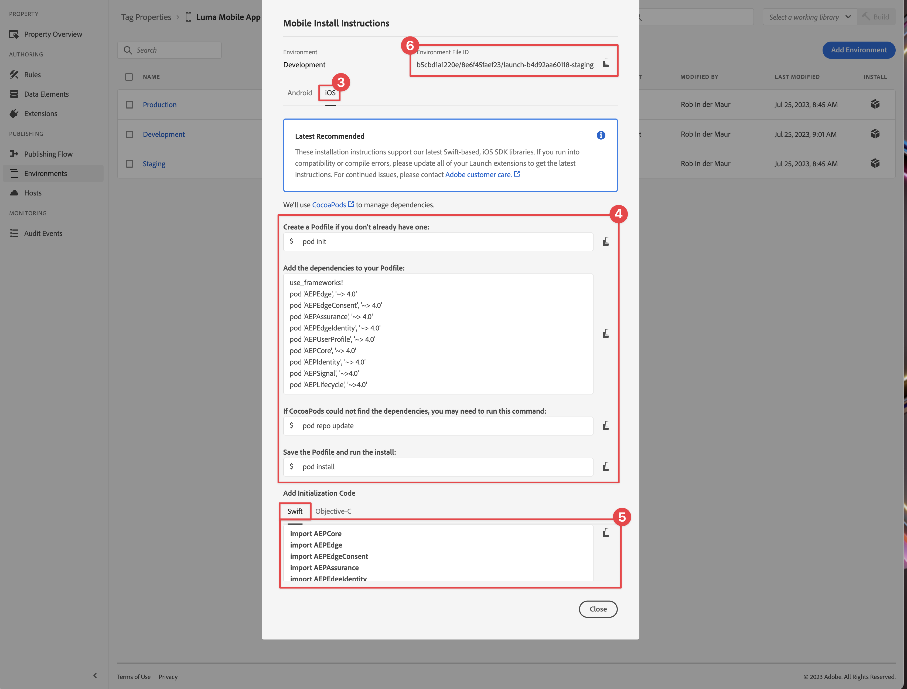

# Configuración de una propiedad de etiqueta

Obtenga información sobre cómo configurar una propiedad de etiqueta en la [!UICONTROL Recopilación de datos] interfaz.

Las etiquetas de Adobe Experience Platform son la próxima generación de funcionalidades de administración de etiquetas de Adobe. Las etiquetas ofrecen a los clientes una alternativa sencilla para implementar y gestionar las etiquetas de análisis, marketing y publicidad necesarias para potenciar las importantes experiencias del cliente. Más información sobre [Etiquetas](https://experienceleague.adobe.com/docs/experience-platform/tags/home.html?lang=es) en la documentación del producto.

## Requisitos previos

Para completar la lección, debe tener permiso para crear una propiedad de etiqueta. También es útil tener una comprensión básica de las etiquetas.

>[!NOTE]
>
> El platform launch (lado del cliente) ahora es [Etiquetas](https://experienceleague.adobe.com/docs/experience-platform/tags/home.html?lang=es)

## Objetivos de aprendizaje

En esta lección, deberá hacer lo siguiente:

* Instale y configure las extensiones de etiquetas móviles de.
* Genere las instrucciones de instalación del SDK.

## Configuración inicial

1. Cree una nueva propiedad de etiqueta móvil en la interfaz de recopilación de datos:
   1. Seleccionar **[!UICONTROL Etiquetas]** en el panel de navegación izquierdo.
   1. Seleccione **[!UICONTROL Nueva propiedad]**
      .
   1. Para el **[!UICONTROL Nombre]**, introduzca `Luma Mobile App Tutorial`.
   1. Para el **[!UICONTROL Plataforma]**, seleccione **[!UICONTROL Móvil]**.
   1. Seleccione **[!UICONTROL Guardar]**.

      

      >[!NOTE]
      >
      > La configuración de consentimiento predeterminada para las implementaciones de SDK móvil basadas en Edge, como la que está haciendo en esta lección, proviene del [!UICONTROL Extensión de consentimiento] y no el [!UICONTROL Privacidad] en la configuración de la propiedad etiqueta. Puede añadir y configurar la extensión de consentimiento más adelante en esta lección. Para obtener más información, consulte [la documentación](https://developer.adobe.com/client-sdks/documentation/privacy-and-gdpr/).

1. Abra la nueva propiedad.
1. Crear una biblioteca:

   1. Ir a **[!UICONTROL Flujo de publicación]** en el panel de navegación izquierdo.
   1. Seleccionar **[!UICONTROL Añadir biblioteca]**.

      

   1. Para el **[!UICONTROL Nombre]**, introduzca `Initial Build`.
   1. Para el **[!UICONTROL Entorno]**, seleccione **[!UICONTROL Desarrollo (desarrollo)]**.
   1. Seleccionar   **[!UICONTROL Añadir todos los recursos modificados]**.
   1. Seleccionar **[!UICONTROL Guardar y generar en desarrollo]**.

      

   1. Finalmente, seleccione **[!UICONTROL Compilación inicial]** como su biblioteca de trabajo desde el **[!UICONTROL Seleccionar una biblioteca de trabajo]** menú.
      
1. Compruebe las extensiones:

   1. Asegúrese de que **[!UICONTROL Compilación inicial]** está seleccionada como biblioteca predeterminada.

   1. Seleccione **[!UICONTROL Extensiones]** en el carril izquierdo.

   1. Seleccione el **[!UICONTROL Instalado]** pestaña.

      El [!UICONTROL Mobile Core] y [!UICONTROL Perfil] Las extensiones de deben preinstalarse.

      

## Configuración de extensión

1. Asegúrese de que está en **[!UICONTROL Extensiones]** dentro de la propiedad de su aplicación móvil.

1. Seleccionar **[!UICONTROL Catálogo]**.

   

1. Utilice el  **[!UICONTROL Buscar]** campo el buscar el **Identidad** extensión.

   1. Buscar por `Identity`.

   2. Seleccione el **[!UICONTROL Identidad]** extensión.

   3. Seleccionar **[!UICONTROL Instalar]**.

      

   Esta extensión no requiere ninguna configuración adicional.

1. Utilice el  **[!UICONTROL Buscar]** para buscar e instalar el **AEP Assurance** extensión.

   Esta extensión no requiere ninguna configuración adicional.

1. Utilice el  **[!UICONTROL Buscar]** para buscar e instalar el **Consentimiento** extensión. En la pantalla de configuración:

   1. Seleccionar **[!UICONTROL Pendiente]**. En este tutorial, puede administrar el consentimiento más detalladamente en la aplicación. Obtenga más información acerca de la extensión de consentimiento en [la documentación](https://developer.adobe.com/client-sdks/documentation/consent-for-edge-network/).
   1. Seleccionar **[!UICONTROL Guardar en biblioteca]**.

      

1. Utilice el  **[!UICONTROL Buscar]** para buscar e instalar el **Adobe Experience Platform Edge Network** extensión.

   1. Entrada **[!UICONTROL Datastreams]** seleccione el **[!UICONTROL Datastream]** que creó en la [paso anterior](create-datastream.md) para cada uno de los entornos, por ejemplo **[!UICONTROL Aplicación móvil de Luma]**.

   1. Especifique el **[!UICONTROL Dominio de red perimetral]** dentro **[!UICONTROL Configuración del dominio]**. El dominio de red perimetral es el nombre de su organización, seguido de `data.adobedc.net`, por ejemplo `techmarketingdemos.data.adobedc.net`.

   1. Desde el **[!UICONTROL Guardar en biblioteca]** menú, seleccione **[!UICONTROL Guardar en biblioteca y crear]**.

      

La biblioteca se crea para las nuevas extensiones y configuraciones. Una compilación correcta se indica mediante una ● en el **[!UICONTROL Compilación inicial]** botón.

## Generar instrucciones de instalación del SDK

1. Seleccionar **[!UICONTROL Entornos]** desde el carril izquierdo.

1. Seleccione el **[!UICONTROL Desarrollo]** icono de instalación  .

   

1. En el **[!UICONTROL Instrucciones de instalación de Mobile]** , seleccione la **[!UICONTROL iOS]** pestaña.

1. Puede copiar  Siga las instrucciones para configurar el proyecto mediante CocoaPods. Los CocoaPods se utilizan para administrar las versiones y descargas del SDK. Para obtener más información, consulte la [Documentación de Cocoapods](https://cocoapods.org/). Si utiliza Android como plataforma de desarrollo, Gradle es la herramienta para administrar la versión, las descargas y las dependencias del SDK. Para obtener más información, consulte la [Documentación de Gradle](https://gradle.org/)

   Las instrucciones de instalación le proporcionan un buen punto de partida para la implementación. Puede encontrar información adicional [aquí](https://developer.adobe.com/client-sdks/documentation/getting-started/get-the-sdk/).

   >[!INFO]
   >
   >Para el resto de este tutorial, **no** utilice las instrucciones CocoaPods, pero en su lugar utilice una configuración nativa basada en Swift Package Manager (SPM).
   >

1. Seleccione el **[!UICONTROL Swift]** pestaña siguiente **[!UICONTROL Añadir código de inicialización]**. Este bloque de código muestra cómo importar los SDK necesarios y registrar las extensiones en el inicio. Esto se tratará en más detalles en [Instalación de SDK](install-sdks.md).

1. Copiar  el **[!UICONTROL Identificador de archivo de entorno]** y guárdelo en un lugar en el que lo necesite más tarde. Este ID único apunta a su entorno de desarrollo de. Cada entorno (producción, ensayo y desarrollo) tiene su propio valor de ID único.

   

>[!NOTE]
>
>Las instrucciones de instalación deben considerarse un punto de partida y no una documentación definitiva. Las últimas versiones del SDK y ejemplos de código se encuentran en el [documentación](https://developer.adobe.com/client-sdks/documentation/).

## Arquitectura de etiquetas móviles

Si está familiarizado con la versión web de las etiquetas, anteriormente Launch, es importante comprender las diferencias en móvil.

* En la web, se procesa una propiedad de etiqueta en JavaScript que luego (normalmente) se aloja en la nube. Se hace referencia a ese archivo JavaScript directamente en el sitio web.

* En una propiedad de etiqueta móvil, las reglas y configuraciones se representan en archivos JSON alojados en la nube. La extensión principal de Mobile descarga y lee los archivos JSON en la aplicación móvil. Las extensiones son SDK independientes que funcionan juntos. Si agrega una extensión a la propiedad de etiquetas, también debe actualizar la aplicación. Si cambia una configuración de extensión o crea una regla, esos cambios se reflejarán en la aplicación una vez que publique la biblioteca de etiquetas actualizada. Esa flexibilidad le permite modificar la configuración (como el ID del grupo de informes de Adobe Analytics) o incluso cambiar el comportamiento de la aplicación (mediante elementos de datos y reglas, como verá en lecciones posteriores) sin tener que cambiar el código en la aplicación y tener que volver a enviar la aplicación a la tienda de aplicaciones.

>[!SUCCESS]
>
>Ahora tiene una propiedad de etiqueta móvil para usar en el resto de este tutorial. Gracias por dedicar su tiempo a conocer el SDK móvil de Adobe Experience Platform. Si tiene preguntas, desea compartir comentarios generales o tiene sugerencias sobre contenido futuro, compártalas en este [Entrada de discusión de la comunidad Experience League](https://experienceleaguecommunities.adobe.com/t5/adobe-experience-platform-launch/tutorial-discussion-implement-adobe-experience-cloud-in-mobile/td-p/443796)

Siguiente: **[Instalación de SDK](install-sdks.md)**
