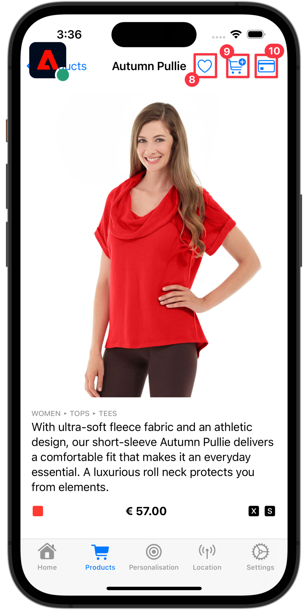

# Perfil

Obtenga información sobre cómo recopilar datos de perfil en una aplicación móvil.

Puede utilizar la extensión de perfil para almacenar atributos sobre el usuario en el cliente. Esta información se puede utilizar posteriormente para dirigir y personalizar mensajes durante escenarios en línea o sin conexión, sin tener que conectarse a un servidor para obtener un rendimiento óptimo. La extensión de perfil administra el perfil de operación del lado del cliente (CSOP), proporciona una forma de reaccionar a las API, actualiza los atributos del perfil de usuario y comparte los atributos del perfil de usuario con el resto del sistema como un evento generado.

Otras extensiones utilizan los datos del perfil para realizar acciones relacionadas con el perfil. Un ejemplo es la extensión del motor de reglas, que consume los datos del perfil y ejecuta reglas basadas en los datos del perfil. Obtenga más información acerca de [Extensión de perfil](https://developer.adobe.com/client-sdks/documentation/profile/) en la documentación de

>[!IMPORTANT]
>
>La funcionalidad de perfil que se describe en esta lección es independiente de la funcionalidad de perfil del cliente en tiempo real de las aplicaciones basadas en Adobe Experience Platform y en Platform.


## Requisitos previos

* La aplicación se ha creado y ejecutado correctamente con los SDK instalados y configurados.
* Se ha importado el SDK de perfil.

  ```swift
  import AEPUserProfile
  ```

## Objetivos de aprendizaje

En esta lección, deberá hacer lo siguiente:

* Establecer o actualizar atributos de usuario.
* Recuperar atributos de usuario.


## Establecer y actualizar atributos de usuario

Sería útil que la segmentación o personalización en la aplicación supiera rápidamente si un usuario ha realizado una compra en el pasado o recientemente. Vamos a configurarlo en la aplicación de Luma.

1. Vaya a **[!UICONTROL Luma]** > **[!UICONTROL Luma]** > **[!UICONTROL Utils]** >  **[!UICONTROL MobileSDK]** en el navegador del proyecto Xcode y busque la variable `func updateUserAttribute(attributeName: String, attributeValue: String)` función. Añada el siguiente código:

   ```swift
   // Create a profile map, add attributes to the map and update profile using the map
   var profileMap = [String: Any]()
   profileMap[attributeName] = attributeValue
   UserProfile.updateUserAttributes(attributeDict: profileMap)
   ```

   Este código:

   1. Establece un diccionario vacío denominado `profileMap`.

   1. Agrega un elemento al diccionario mediante `attributeName` (por ejemplo, `isPaidUser`), y `attributeValue` (por ejemplo, `yes`).

   1. Utiliza el `profileMap` como valor del diccionario de `attributeDict` parámetro del [`UserProfile.updateUserAttributes`](https://developer.adobe.com/client-sdks/documentation/profile/api-reference/#updateuserattributes) Llamada de API.

1. Vaya a **[!UICONTROL Luma]** > **[!UICONTROL Luma]** > **[!UICONTROL Vistas]** > **[!UICONTROL Productos]** > **[!UICONTROL ProductView]** en el navegador del proyecto Xcode y busque la llamada a `updateUserAttributes` (en el código de las compras)  botón). Añada el siguiente código:

   ```swift
   // Update attributes
   MobileSDK.shared.updateUserAttributes(attributeName: "isPaidUser", attributeValue: "yes")
   ```


## Obtener atributos de usuario

Una vez que haya actualizado el atributo de un usuario, estará disponible para otros SDK de Adobe, pero también puede recuperar atributos explícitamente para permitir que la aplicación se comporte como desee.

1. Vaya a **[!UICONTROL Luma]** > **[!UICONTROL Luma]** > **[!UICONTROL Vistas]** > **[!UICONTROL General]** > **[!UICONTROL HomeView]** en el navegador del proyecto Xcode y busque la variable `.onAppear` modificador. Añada el siguiente código:

   ```swift
   // Get attributes
   UserProfile.getUserAttributes(attributeNames: ["isPaidUser"]) { attributes, error in
       if attributes?["isPaidUser"] as! String == "yes" {
           showBadgeForUser = true
       }
       else {
           showBadgeForUser = false
       }
   }
   ```

   Este código:

   1. Llama al [`UserProfile.getUserAttributes`](https://developer.adobe.com/client-sdks/documentation/profile/api-reference/#getuserattributes) API con el `iPaidUser` nombre del atributo como elemento único en el `attributeNames` matriz.
   1. Entonces comprueba el valor del `isPaidUser` atributo y cuándo `yes`, coloca un distintivo en la  en la barra de herramientas de la parte superior derecha.

Se puede encontrar documentación adicional [aquí](https://developer.adobe.com/client-sdks/documentation/profile/api-reference/#getuserattributes).

## Validar con Assurance

1. Revise la [instrucciones de configuración](assurance.md) sección.
1. Instale la aplicación.
1. Inicie la aplicación mediante la URL generada por Assurance.
1. Ejecute la aplicación para iniciar sesión e interactuar con un producto.

   1. Mueva el icono Garantía a la izquierda.
   1. Seleccionar **[!UICONTROL Inicio]** en la barra de pestañas.
   1. Para abrir la hoja Inicio de sesión, seleccione  botón.

      

   1. Para insertar un correo electrónico y un ID de cliente aleatorios, seleccione la  botón .
   1. Seleccionar **[!UICONTROL Iniciar sesión]**.

      

   1. Seleccionar **[!UICONTROL Productos]** en la barra de pestañas.
   1. Seleccione un producto.
   1. Seleccionar .
   1. Seleccionar .
   1. Seleccionar .

      

   1. Volver atrás a **[!UICONTROL Inicio]** pantalla. Debería ver una insignia añadida .

      


1. En la interfaz de usuario de Assurance, debería ver un **[!UICONTROL UserProfileUpdate]** y **[!UICONTROL getUserAttributes]** eventos con el actualizado `profileMap` valor.
   

>[!SUCCESS]
>
>Ahora ha configurado la aplicación para actualizar los atributos de los perfiles de la red perimetral y (cuando está configurada) con Adobe Experience Platform.<br/>Gracias por dedicar su tiempo a conocer el SDK móvil de Adobe Experience Platform. Si tiene preguntas, desea compartir comentarios generales o tiene sugerencias sobre contenido futuro, compártalas en este [Entrada de discusión de la comunidad Experience League](https://experienceleaguecommunities.adobe.com/t5/adobe-experience-platform-launch/tutorial-discussion-implement-adobe-experience-cloud-in-mobile/td-p/443796).

Siguiente: **[Uso de servicios de geolocalización](places.md)**
