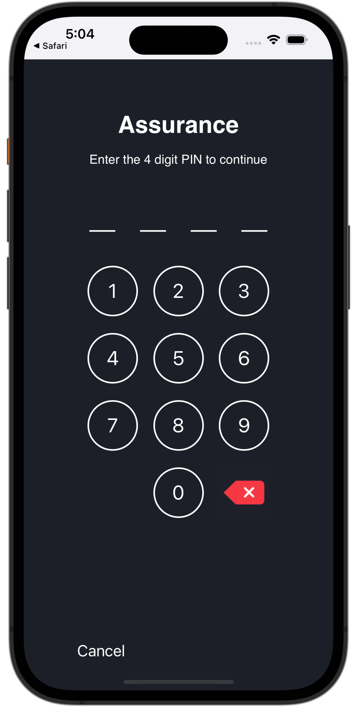

# Configurar Assurance

Obtenga información sobre cómo configurar Adobe Experience Platform Assurance en una aplicación móvil.

Assurance, anteriormente conocido como Project Griffon, está diseñado para ayudarle a inspeccionar, probar, simular y validar la forma en que recopila datos o sirve experiencias en su aplicación móvil.

Assurance le ayuda a inspeccionar los eventos de SDK sin procesar generados por el SDK para móviles de Adobe Experience Platform. Todos los eventos recopilados por el SDK están disponibles para su inspección. Los eventos del SDK se cargan en una vista de lista, ordenados por tiempo. Cada evento tiene una vista detallada que proporciona más detalles. También se proporcionan vistas adicionales para examinar la configuración del SDK, los elementos de datos, los estados compartidos y las versiones de extensión del SDK. Obtenga más información acerca de [Assurance](https://experienceleague.adobe.com/docs/experience-platform/assurance/home.html) en la documentación del producto.


## Requisitos previos

* La aplicación se ha configurado y instalado correctamente con los SDK.

## Objetivos de aprendizaje

En esta lección, deberá hacer lo siguiente:

* Confirme que su organización tiene acceso a (y solicítelo si no lo tiene).
* Configure la dirección URL base.
* Añada el código específico de iOS requerido.
* Conexión a una sesión.

## Confirmar acceso

Confirme que su organización tiene acceso a Assurance. Usted, como usuario, debe añadirse al perfil de Adobe Experience Platform. Consulte [Acceso de usuario](https://experienceleague.adobe.com/docs/experience-platform/assurance/user-access.html?lang=en) en la Guía de Assurance para obtener más información.

## Implementación

Además de la [Instalación del SDK](install-sdks.md)Sin embargo, como ha completado la lección anterior, iOS también requiere la siguiente adición para iniciar la sesión de Assurance para su aplicación.

1. Vaya a **[!DNL Luma]** > **[!DNL Luma]** > **[!UICONTROL SceneDelegate]** en el navegador de proyectos de Xcode.

1. Añada el siguiente código a `func scene(_ scene: UIScene, openURLContexts URLContexts: Set<UIOpenURLContext>`:

   ```swift
   // Called when the app in background is opened with a deep link.
   if let deepLinkURL = URLContexts.first?.url {
       // Start the Assurance session
       Assurance.startSession(url: deepLinkURL)
   }
   ```

   Este código inicia una sesión de garantía cuando la aplicación se encuentra en segundo plano y se abre mediante un vínculo profundo.

Puede encontrar más información [aquí](https://developer.adobe.com/client-sdks/documentation/platform-assurance-sdk/api-reference/){target="_blank"}.

<!-- not initially required

## Signing

Signing the application is only required for the [Create and send push notifications](journey-optimizer-push.md) and the [Create and send in-app messages](journey-optimizer-inapp.md) lessons in this tutorial. These lessons require an Apple provisioning profile which **requires a paid Apple developer account**.

To update the signing for the lessons that require that you sign the application:

1. Open the project in Xcode.
1. Select **[!DNL Luma]** in the Project navigator.
1. Select the **[!DNL Luma]** target.
1. Select the **Signing & Capabilities** tab.
1. Configure **[!UICONTROL Automatic manage signing]**, **[!UICONTROL Team]**, and **[!UICONTROL Bundle Identifier]**, or use your specific Apple development provisioning details. 
 
   >[!IMPORTANT]
   >
   >Ensure you use a _unique_ bundle identifier and replace the `com.adobe.luma.tutorial.swiftui` bundle identifier, as each bundle identifier needs to be unique. Typically, you use a reverse-DNS format for bundle ID strings, like `com.organization.brand.uniqueidentifier`. The Finished version of this tutorial, for example, uses `com.adobe.luma.tutorial.swiftui`.


    {zoomable="yes"}

-->

## Configuración de una dirección URL base

1. Vaya al proyecto en Xcode.
1. Seleccionar **[!DNL Luma]** en el navegador del proyecto.
1. Seleccione el **[!DNL Luma]** objetivo.
1. Seleccione el **Información** pestaña.
1. Para añadir una URL base, desplácese hacia abajo hasta **Tipos de URL** y seleccione la **+** botón.
1. Establecer **Identificador** Vaya al Identificador de paquete de su elección y defina una **Esquemas de URL** de su elección.

   

   >[!IMPORTANT]
   >
   >Asegúrese de utilizar un _único_ identificador de paquete y reemplace el `com.adobe.luma.tutorial.swiftui` identificador de paquete, ya que cada identificador de paquete debe ser único. Normalmente, se utiliza un formato DNS inverso para cadenas de ID de paquete, como `com.organization.brand.uniqueidentifier`.<br/>Del mismo modo, utilice un esquema de URL único y reemplace el ya proporcionado `lumatutorialswiftui` con su esquema de URL único.

Para obtener más información sobre los esquemas de URL en iOS, consulte [Documentación de Apple](https://developer.apple.com/documentation/xcode/defining-a-custom-url-scheme-for-your-app){target="_blank"}.

Assurance funciona abriendo una dirección URL, ya sea mediante explorador o código QR. Esa URL comienza con la URL base que abre la aplicación y contiene parámetros adicionales. Estos parámetros únicos se utilizan para conectar la sesión.


## Conexión a una sesión

En Xcode:

1. Cree o reconstruya y ejecute la aplicación en el simulador o en un dispositivo físico desde Xcode, utilizando .

   >[!TIP]
   >
   >De forma opcional, es posible que desee &quot;limpiar&quot; la compilación, especialmente cuando vea resultados inesperados. Para ello, seleccione **[!UICONTROL Limpiar carpeta de compilación...]** desde el Xcode **[!UICONTROL Product]** menú.


1. En el **[!UICONTROL Permitir que &quot;Aplicación de Luma&quot; use su ubicación]** diálogo, seleccione **[!UICONTROL Permitir mientras se utiliza la aplicación]**.

   

1. En el **[!UICONTROL &quot;Aplicación de Luma&quot; desea enviarle notificaciones]** diálogo, seleccione **[!UICONTROL Permitir]**.

   

1. Seleccionar **[!UICONTROL Continuar...]** para permitir que la aplicación rastree su actividad.

   

1. En el **[!UICONTROL Permitir que &quot;Aplicación de Luma&quot; rastree su actividad en las aplicaciones y sitios web de otras empresas]** diálogo, seleccione **[!UICONTROL Permitir]**.

   


En su explorador:

1. Vaya a la IU de recopilación de datos.
1. Seleccionar **[!UICONTROL Assurance]** desde el carril izquierdo.
1. Seleccionar **[!UICONTROL Crear sesión]**.
1. Seleccionar **[!UICONTROL Inicio]**.
1. Proporcione un **[!UICONTROL Nombre de sesión]** como `Luma Mobile App Session` y el **[!UICONTROL URL básica]**, que son los esquemas de URL introducidos en Xcode, seguidos de `://` Por ejemplo: `lumatutorialswiftui://`
1. Seleccione **[!UICONTROL Siguiente]**.
   
1. En el **[!UICONTROL Crear nueva sesión]** diálogo modal:

   Si utiliza un dispositivo físico:

   * Seleccionar **[!UICONTROL Escanear código QR]**. Para abrir la aplicación, utilice la cámara del dispositivo físico para escanear el código QR y pulse el vínculo.

     

   Si utiliza un simulador:

   1. Seleccionar **[!UICONTROL Copiar vínculo]**.
   1. Copie el vínculo profundo mediante   y utilice el vínculo profundo para abrir la aplicación con Safari en el simulador.
      

1. Cuando se carga la aplicación, aparece un cuadro de diálogo modal en el que se le solicita que introduzca el PIN que se muestra en el paso 7.

   

   Introduzca el PIN y seleccione **[!UICONTROL Connect]**.


1. Si la conexión se ha realizado correctamente, verá lo siguiente:
   * Un icono de Assurance flotando en la parte superior de la aplicación.

     

   * Actualizaciones del Experience Cloud que llegan a través de la interfaz de usuario de Assurance, y muestran:

      1. Eventos de experiencia procedentes de la aplicación.
      1. Detalles de un evento seleccionado.
      1. El dispositivo y la cronología.

         

Si tiene algún problema, consulte la [técnico](https://developer.adobe.com/client-sdks/documentation/platform-assurance-sdk/){target="_blank"} and [general documentation](https://experienceleague.adobe.com/docs/experience-platform/assurance/home.html){target="_blank"}.


## Verificar extensiones

Para comprobar si su aplicación utiliza las extensiones más actualizadas:

1. Seleccionar **[!UICONTROL Configurar]**.

1. Seleccionar  para  **[!UICONTROL Versiones de extensión]**.

1. Seleccione **[!UICONTROL Guardar]**.

   

1. Seleccionar  **[!UICONTROL Versiones de extensión]** para ver una descripción general de las últimas extensiones disponibles y de las extensiones utilizadas en su versión de la aplicación.

   

1. Para actualizar las versiones de la extensión (por ejemplo, **[!UICONTROL Mensajes]** y **[!UICONTROL Optimización]**) seleccione el paquete (extensión) de **[!UICONTROL Dependencias del paquete]** (por ejemplo, **[!UICONTROL AEPMessaging]**) y en el menú contextual, seleccione **[!UICONTROL Actualizar paquete]**. Xcode actualizará las dependencias del paquete.


>[!NOTE]
>
>Una vez que haya actualizado las extensiones (paquetes) en Xcode, cierre y elimine la sesión actual y repita todos los pasos de [Conexión a una sesión](#connecting-to-a-session) y [Verificar extensiones](#verify-extensions) para garantizar que Assurance informa correctamente de las extensiones correctas en una nueva sesión de Assurance.


>[!SUCCESS]
>
>Ahora ha configurado la aplicación para que utilice Assurance durante el resto del tutorial.
>
>Gracias por dedicar su tiempo a conocer el SDK móvil de Adobe Experience Platform. Si tiene preguntas, desea compartir comentarios generales o tiene sugerencias sobre contenido futuro, compártalas en este [Entrada de discusión de la comunidad Experience League](https://experienceleaguecommunities.adobe.com/t5/adobe-experience-platform-data/tutorial-discussion-implement-adobe-experience-cloud-in-mobile/td-p/443796)


Siguiente: **[Implementación del consentimiento](consent.md)**
